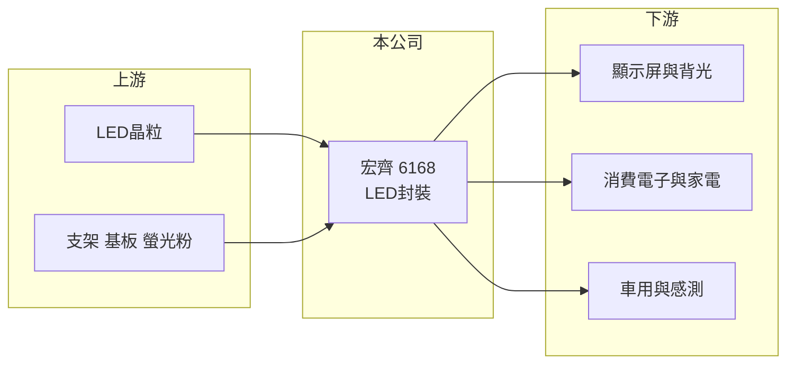

# 6168 宏齊

> 上市｜[[產業索引-光電業|光電業]]｜上市（櫃）日期 2003/08/25

# 第一章：企業模式與商業藍圖

> [!info] 撰寫說明
> 精簡版，由 Claude 依公開資料整理，架構比照 [[2330台積電]]，資料截至 2026-10-07。來源：nstock 公司資料頁、winvest 營收快訊。營收比重未查得。#待校對

宏齊是台灣中型 LED 封裝廠，本章說明其業務定位。

- **核心業務：** 公司從事發光二極體封裝的研發、設計、製造與測試，是典型的 [[LED封裝]] 廠，把 [[LED晶粒]] 做成可焊接使用的元件。
- **營收結構：** 本次未查到產品別營收比重；依業界資料推估產品涵蓋 SMD LED、顯示屏用 LED 與紅外線等感測元件。
- **營運據點：** 生產據點分布本次未查證。
- **長期方向：** 往 [[Mini LED]] 顯示、車用與感測等附加價值較高的應用移動，降低一般照明與指示燈的價格壓力（推估）。

# 第二章：護城河深度與競爭優勢

LED 封裝已高度成熟，宏齊的競爭力主要來自利基產品與客戶認證。

- **競爭優勢：** 上市 23 年，具備多樣封裝製程與客戶認證，可承接少量多樣的利基訂單（推估）。
- **主要對手：** [[2393億光]]、[[3031佰鴻]]、[[6226光鼎]]、[[6164華興]]，以及木林森等中國大廠。
- **觀察重點：** 2026 年營收年增約 9%，股價已明顯高於一年均價，需觀察獲利能否跟上營收成長。

# 第三章：財務體質與盈利規模

資料日期：2026-10-07，以下數字是撰寫當時的快照；最新月營收、毛利率、累計 EPS 由自動排程寫在本筆記的屬性欄位（月營收、毛利率、累計EPS 等）。#待校對

宏齊營收約 20 億元，獲利微薄，2026 年第二季開始改善。

- **營收規模：** 2025 年全年營收 20.71 億元；2026 年 1 至 8 月累計 15.06 億元，年增 9.29%；8 月單月 2.21 億元，年增 18.52%。
- **獲利：** 2025 年 EPS 0.05 元；2026 年上半年 EPS 0.17 元，其中第二季 0.15 元，第二季 [[毛利率]] 24.47%，[[營業利益率]] 1.2%，淨利率 5.8%。
- **財務特色：** 淨利率高於營業利益率，代表第二季有業外收益挹注；近五年平均現金股利 0.7 元。

# 第四章：總體風險與地緣政治

宏齊的風險來自 LED 產業價格競爭與本業獲利率偏低。

- **產業週期：** LED 需求跟隨消費電子、顯示屏與車用景氣，庫存調整時訂單波動大。
- **營運風險：** 營業利益率僅約 1%，營收或毛利稍有變動就可能轉為本業虧損。
- **其他風險：** 中國 LED 廠產能過剩造成的價格壓力，以及匯率與貴金屬等原物料價格變動。

# 專有名詞解析

## 半導體

- **[[LED封裝]]**：把 LED 晶粒固定在支架或基板上並封上螢光膠與透鏡，做成可焊接使用的元件。
- **[[LED晶粒]]**：在藍寶石或其他基板上長出發光層後切割而成的發光晶片，是 LED 元件的核心。

## 產業

- **[[Mini LED]]**：晶粒尺寸約 100 至 200 微米的 LED，用在高階背光與小間距顯示屏。

# 核心供應鏈

- 上游：LED 晶粒廠 [[3714富采]]、支架與封裝材料供應商
- 下游／客戶：顯示屏、消費電子、家電與車用模組廠（推估）
- 同業：[[2393億光]]、[[3031佰鴻]]、[[6226光鼎]]、[[6164華興]]

## 最新新聞
<!-- news:start -->
<!-- news:end -->

## 相關連結
- [公開資訊觀測站](https://mopsov.twse.com.tw/mops/web/t05st03?step=1&firstin=1&co_id=6168)
- [Goodinfo](https://goodinfo.tw/tw/StockDetail.asp?STOCK_ID=6168)
- [Yahoo 股市](https://tw.stock.yahoo.com/quote/6168)
- [鉅亨網新聞](https://www.cnyes.com/twstock/6168/news)
