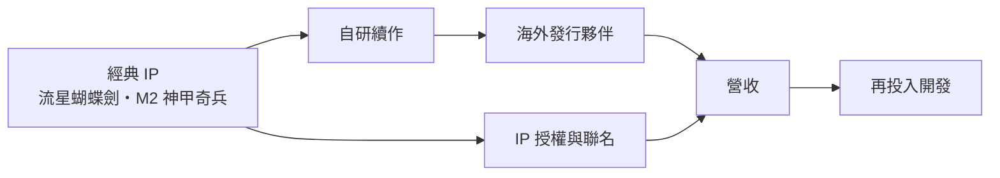
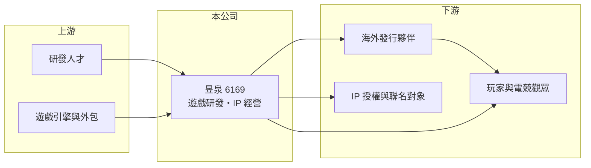

# 6169 昱泉

> 上櫃｜[[產業索引-文化創意業|文化創意業]]｜上市（櫃）日期 2002/03/22

# 第一章：企業模式與商業藍圖

> [!info] 撰寫說明
> 精簡版，由 Claude 依公開資料整理，架構比照 [[2330台積電]] 的四章研究，資料截至 2026-10-08。來源：富果 2025 年 12 月 19 日法說會摘要、Goodinfo 年度經營績效頁、櫃買中心開放資料（2026 年第二季綜合損益與資產負債、基本資料、每月營收、本益比殖利率）、數位時代與財經媒體標題；法說會摘要為 AI 整理，數字待對照公司簡報。公開資料有限，資產組成與營收結構未查得。#待校對

昱泉國際（股票代號：6169，以下簡稱昱泉）是台灣早期的遊戲研發公司，以武俠動作遊戲《流星蝴蝶劍》聞名。本章說明它目前以自有 IP 重新開發與授權為主的經營模式，以及營收極小化後的處境。

## 一、核心定位：擁有經典 IP 的遊戲研發商

依櫃買中心資料，昱泉成立於 1989 年，2002 年 3 月上櫃，董事長為洪英超，實收資本額約 2.34 億元。依富果整理的 2025 年 12 月法說會摘要，公司長期深耕遊戲研發與 IP 經營，擁有 20 年以上的國際合作經驗。

昱泉目前的營運模式可以概括為「開發、發行、授權」三位一體：以自有[[遊戲IP]]開發新作，搭配海外發行合作，並把 IP 授權給其他廠商使用。依 2026 年 8 月的月營收公告，營收變動「主係遊戲授權收入增減所致」，顯示[[遊戲授權]]是目前的主要收入來源。

## 二、四大經營主軸

依法說會摘要，公司的經營方向分為四項：

* **自研遊戲：** 以經典 IP 開發續作，包括《M2 神甲奇兵》與《流星蝴蝶劍》系列，並尋求海外發行。
* **IP 經營：** 透過共同開發、多元授權與品牌聯動，擴大 IP 的應用範圍。
* **電競發展：** 以《特攻聯盟》為核心，先從台灣市場出發，再逐步拓展國際。
* **策略投資：** 引進有潛力的產品與合作夥伴，並關注 AI 等新技術。

## 三、資本轉化邏輯

遊戲研發的特性是先投入、後回收。依法說會摘要，2025 年前三季營收約 2,600 萬元，但投入遊戲開發費用約 2,000 萬元，整體呈現虧損。依櫃買中心資料，2026 年第二季底總資產約 4.70 億元，其中流動資產只有約 0.56 億元，非流動資產約 4.14 億元，占總資產近九成，組成未查得；負債約 2.68 億元，其中非流動負債約 2.39 億元。

## 四、企業長期藍圖

昱泉的營收在 2019 年仍有約 1.82 億元，2021 年後降到每年 0.04 億至 0.28 億元，等於本業規模已大幅縮小。公司的長期目標是讓自研遊戲陸續上市、活化經典 IP，以此帶來穩定營收。由於遊戲開發週期長、成敗不確定，這個目標能否實現，需要觀察新作的實際上市時程與市場反應。

# 第二章：護城河深度與競爭優勢

在長期價值投資中，「護城河」指企業抵禦競爭、維持超額利潤的保護機制。本章評估昱泉的 IP 資產與研發能力在今日遊戲市場的價值。

## 一、昱泉的競爭條件

* **1. 經典 IP：** 《流星蝴蝶劍》在華語玩家中有一定知名度，經典 IP 可以降低新作的行銷成本，也能授權給其他廠商開發手機遊戲或聯名商品。
* **2. 國際合作經驗：** 法說會強調公司有 20 年以上的國際合作經驗，有助於尋找海外發行夥伴。
* **3. 研發經驗：** 長期從事動作遊戲研發，累積了技術與人才。

但經典 IP 的價值會隨時間遞減，若長期沒有成功的新作，IP 的知名度只會停留在老玩家之間。目前營收規模極小，看不到能維持超額利潤的護城河。

## 二、主要競爭對手格局

| 對手 | 定位 | 對昱泉的威脅 |
|---|---|---|
| [[6111光聚晶電]]（大宇資訊） | 擁有《仙劍奇俠傳》等武俠 IP | 在華語武俠 IP 授權上競爭 |
| [[3546宇峻]] | 台灣遊戲研發商 | 定位相近 |
| 中國大型遊戲公司 | 武俠與動作遊戲研發資源龐大 | 主導華語武俠遊戲市場 |
| 電競遊戲大廠 | 全球主流電競遊戲 | 新電競遊戲很難取得玩家基礎 |

## 三、優勢轉化：哪些守得住、哪些守不住

* **守得住：** IP 的授權價值，可以在不投入大量資金的情況下產生收入。
* **守不住：** 自研遊戲的營收規模。2025 年營收約 0.28 億元，營業利益率約 -239%，研發投入遠高於收入。
* **觀察重點：** 新作上市時程、授權收入的穩定度，以及負債增加的原因與資金用途。

# 第三章：財務體質與盈利規模

資料日期：2026-10-08，表格是撰寫當時的快照；最新月營收、毛利率、累計 EPS 由自動排程寫在本筆記的屬性欄位（月營收、毛利率、累計EPS 等）。#待校對

財務報表是檢驗護城河是否真實存在的最終標準。昱泉的數字顯示本業營收已經非常小，獲利主要受研發投入與業外收益影響。

## 一、多年度經營績效

| 年度 | 營收（新台幣） | [[毛利率]] | [[營業利益率]] | EPS（元） | [[ROE]] |
|---|---|---|---|---|---|
| 2019 | 1.82 億 | 49.9% | -27% | -1.32 | -13.3% |
| 2020 | 1.18 億 | 39.7% | -27.8% | -1.19 | -14.4% |
| 2021 | 0.11 億 | 80.8% | -191% | 0.13 | 1.22% |
| 2022 | 0.04 億 | 21.9% | -672% | 0.24 | 1.71% |
| 2023 | 0.19 億 | 14.7% | -172% | -0.69 | -4.94% |
| 2024 | 0.24 億 | 26.3% | -179% | -1.22 | -9.3% |
| 2025 | 0.28 億 | 49.4% | -239% | -2.43 | -21.5% |
| 2026 上半年 | 約 25 萬元 | 不適用 | 不適用 | -1.40 | 不適用（半年） |

資料來源：2019 至 2025 年為 Goodinfo 年度經營績效，2026 上半年為櫃買中心開放資料。2026 年上半年營收極小，三率失去比較意義。

* **營收崩落：** 2020 至 2021 年營收由約 1.18 億元降到約 0.11 億元，原因未查得（推估與既有產品結束營運有關）。
* **業外撐住獲利的年份：** 2021 與 2022 年營業利益率大幅為負，但 EPS 為正，代表當年有業外收益。
* **長期指標：** 2021 至 2025 年平均 ROE 約 -6.6%（推算）；2020 至 2025 年營收年複合成長率約 -25%（推算）。

## 二、資產負債與股利

依法說會摘要，2025 年第三季底總資產約 4.24 億元、負債約 1.78 億元、權益約 2.45 億元；依櫃買中心資料，2026 年第二季底總資產約 4.70 億元、負債約 2.68 億元、權益約 2.02 億元，保留盈餘約 -0.24 億元。三季之間負債增加約 0.9 億元、權益減少約 0.43 億元，代表虧損持續侵蝕淨值，資金需求轉由負債支應（推估）。最近一次現金股利為 0 元（櫃買中心資料）。

## 三、[[ROIC]] 與 [[WACC]]

**ROIC 推算：** 2025 年營業虧損約 0.67 億元（0.28 億元 × -239%），2026 年上半年營業虧損約 0.37 億元。投入資本以權益約 2.02 億元，加上假設非流動負債中約 2.3 億元為有息負債（推估，細項未查得），合計約 4.3 億元，2025 年 ROIC 約 -12% 至 -16%（推算，視是否以稅後計）。

**WACC 推算：** 假設台灣 10 年期公債殖利率 1.75%、市場風險溢酬 6%、β 取遊戲同業常見值 1.0（假設），權益成本約 7.75%；負債成本假設 2.5%，稅後約 2.0%，以權益約 47%、負債約 53% 計算，WACC 約 4.7%（推算）。

**結論：** 昱泉的 ROIC 長期為負，遠低於 WACC，本業持續消耗資本。在新作成功上市並帶來穩定營收前，公司無法為股東創造價值。

# 第四章：總體風險與地緣政治

任何企業都無法脫離宏觀環境獨立存在。本章分析昱泉長期必須面對的產業、營運與財務風險。

## 一、產業結構

* **遊戲研發的高風險：** 法說會也指出，遊戲開發週期長、成本高，市場成敗受許多不確定因素影響。
* **武俠題材競爭：** 中國遊戲公司在武俠與動作遊戲投入龐大資源，台灣中小研發商的作品不易突圍。
* **電競生態：** 電競市場由少數全球大作主導，新遊戲要建立電競生態需要長期大量投入。

## 二、營運與財務風險

* **營收過小：** 目前營收不足以支付營運費用，持續虧損使淨值下降，每股參考淨值約 8.64 元，低於面額。
* **負債上升：** 負債在三季之間增加約 0.9 億元，若新作延遲，財務壓力會擴大。
* **資產組成不明：** 非流動資產占總資產近九成，組成未查得，投資人應從年報確認其內容與評價風險。

## 三、其他風險

* **海外發行：** 自研遊戲依賴海外發行夥伴，合作條件與市場法規變動會影響收入。
* **兩岸與法規：** 華語遊戲市場的主要規模在中國大陸，版號審批與兩岸關係限制了台灣遊戲進入當地市場。

# 專有名詞解析

## 金融

- **[[ROIC]]**：投入資本報酬率，稅後營業利益除以股東權益與有息負債的合計，衡量本業對所有資金提供者的報酬。
- **[[WACC]]**：加權平均資金成本，依股東權益與負債的比重加權計算的資金成本，ROIC 高於它才代表創造價值。

## 產業

- **[[遊戲IP]]**：遊戲的智慧財產，包括角色、世界觀與名稱，可改編成續作、手機遊戲或授權給其他廠商使用。
- **[[遊戲授權]]**：遊戲開發商把遊戲內容授權給其他營運商或平台使用，收取授權金或依營收分潤。

# 核心供應鏈

## 1. 上游
- 研發人才、遊戲引擎與美術外包

## 2. 本公司
- 昱泉：《流星蝴蝶劍》《M2 神甲奇兵》等自有 IP 研發，《特攻聯盟》電競

## 3. 下游
- 海外發行夥伴、IP 授權與聯名對象（實際合作對象未查得）
- 玩家與電競觀眾

## 4. 同業
- [[6111光聚晶電]]（大宇資訊）、[[3546宇峻]]

## 最新新聞
<!-- news:start -->
<!-- news:end -->

## 相關連結
- [公開資訊觀測站](https://mopsov.twse.com.tw/mops/web/t05st03?step=1&firstin=1&co_id=6169)
- [Goodinfo](https://goodinfo.tw/tw/StockDetail.asp?STOCK_ID=6169)
- [Yahoo 股市](https://tw.stock.yahoo.com/quote/6169)
- [鉅亨網新聞](https://www.cnyes.com/twstock/6169/news)
