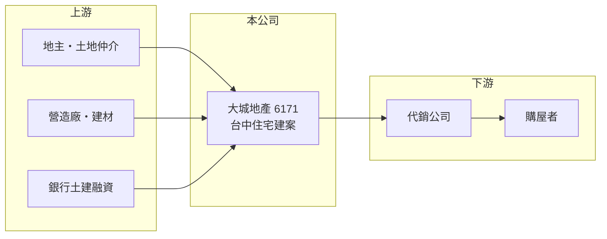

# 6171 大城地產

> 上櫃｜[[產業索引-建材營造業|建材營造業]]｜上市（櫃）日期 2002/04/22

# 第一章：企業模式與商業藍圖

> [!info] 撰寫說明
> 精簡版，由 Claude 依公開資料整理，架構比照 [[2330台積電]]，資料截至 2026-10-08。來源：櫃買中心開放資料快照（基本資料、2026 年第二季資產負債與損益、每月營收）、MoneyDJ 理財網財務比率年表（2021 至 2025 年）與個股基本資料（2025 年營收比重、歷年股利）、Yahoo 股市與聯合新聞網報導標題。公開資料有限，個別建案名稱、銷售金額與土地庫存未查得；年度營收由 2025 年每股營業額與歷年成長率回推，屬推算。#待校對

大城地產成立於 1995 年 8 月，2002 年 4 月在櫃買中心上櫃，是以台中為主要市場的建設公司，屬於「大城營建機構」。它的規模不大，但近五年毛利率持續提高，每年都有獲利。

- **核心業務：** 大城地產購地、規劃興建住宅建案並對外銷售。建案以[[預售屋]]方式先銷售，等[[建案交屋]]才認列營收，因此營收會在交屋年度集中、空窗年度驟減。
- **營收結構：** 依 MoneyDJ 的分類，2025 年營建占 99.96%、租賃占 0.04%，幾乎全部來自房地銷售。
- **營運據點：** 公司登記於台中市西屯區台灣大道，2026 年的媒體報導提到北屯區有三個建案同步推出，推案以台中市區為主（依公司地址與報導標題推估）。
- **長期方向：** 2024 與 2025 年[[毛利率]]分別達 43.45% 與 46.7%，明顯高於 2021 至 2023 年的 26% 至 30%，代表較晚交屋的建案土地成本較低或售價較好。台中受惠於產業投資與人口移入，是近年台灣房市較活躍的區域之一，公司能否持續補充土地，將決定這樣的獲利水準能否延續。

# 第二章：護城河深度與競爭優勢

地方型建商的護城河來自在地經驗與土地取得時機，大城地產的優勢在於專注台中、規模小但獲利率高。

- **競爭優勢：** 長期深耕單一城市的建商，熟悉在地地段、地主關係與買方偏好，較能在土地取得與產品規劃上搶先。大城地產近兩年營業利益率約 40%，在建設股中屬於高水準；公司董事長賴源釗曾在媒體專訪中強調做出差異化建案，代表公司以產品定位而非低價競爭。
- **主要對手：** 台中是全台建商最密集的城市之一，上市櫃同業包括 [[6219富旺]]、[[2536宏普]]（推估名單），以及大量未上市的地方建商。
- **觀察重點：** 觀察[[已售未入帳]]的金額與北屯等新案的銷售率，可以預估未來兩三年的入帳量；2026 年 1 至 8 月營收較前一年同期大減，正處於交屋空窗，下一批交屋時點是重要觀察點。

# 第三章：財務體質與盈利規模

資料日期：2026-10-08，表格是撰寫當時的快照；最新月營收、毛利率、累計 EPS 由自動排程寫在本筆記的屬性欄位（月營收、毛利率、累計EPS 等）。#待校對

大城地產的營收隨交屋時點起伏，但五年來每年都有獲利，近五年平均 ROE 超過 20%。

| 年度 | 營收（推算） | [[毛利率]] | [[營業利益率]] | EPS（元） | [[ROE]] |
|---|---|---|---|---|---|
| 2021 | 約 20.3 億 | 29.63% | 24.30% | 4.82 | 28.89% |
| 2022 | 約 19.4 億 | 26.83% | 21.92% | 3.46 | 20.06% |
| 2023 | 約 13.8 億 | 26.02% | 20.60% | 2.48 | 12.99% |
| 2024 | 約 18.2 億 | 43.45% | 39.28% | 5.73 | 26.12% |
| 2025 | 約 11.8 億 | 46.70% | 41.38% | 3.82 | 15.47% |

- **長期指標：** 近 5 年平均 ROE 約 20.7%（推算），在建設股中屬前段；營收年複合成長率因交屋時點不同，不具參考性。現金股利（MoneyDJ 列示 108 至 114 年度）依序為 0.30、1.00、1.50、1.00、1.50、2.50、2.00 元，每年配發且大致上升，2025 年度[[配息率]]約 52%。
- **[[ROIC]] 與 [[WACC]]：** 2025 年營業利益約 4.87 億元（營收約 11.76 億元 × 營業利益率 41.38%），稅後約 3.89 億元；投入資本以 2026 年第二季股東權益 23.7 億元加上總負債 22.9 億元的一半（約 11.4 億元，假設一半為有息負債）計，約 35.2 億元，ROIC 約 11.1%（推算）。WACC 約 6.0%（推算：無風險利率 1.75%、市場風險溢酬 6%、β 取建設股常見值 1.0，股東權益成本約 7.75%；稅前負債成本 3%、稅率 20%；負債權重約 33%）。ROIC 明顯高於 WACC，代表公司長期在創造價值。
- **營建業指標與財務特色：** 2026 年第二季底資產 46.6 億元中，流動資產（主要是土地與在建房地等存貨）約 46.5 億元，負債 22.9 億元全部為流動負債，負債比率約 49%，屬建設業中等偏低的槓桿。2026 年上半年營收僅 1.39 億元、EPS 0.36 元，反映交屋空窗。

# 第四章：總體風險與地緣政治

大城地產的風險與所有建設公司相同：房市景氣、政策與單一區域集中。

- **產業週期：** 房地產週期長，建案從推出到交屋需數年，推案時的房價與交屋時的市場可能完全不同；房市反轉時，餘屋去化變慢、毛利率也會下降。
- **營運風險：** 推案集中在台中（推估），區域房市降溫時缺乏分散；公司規模小，同時進行的建案數有限，交屋空窗會讓單年營收與獲利大幅下滑。營造成本與工期延誤也會壓縮毛利。
- **其他風險：** 央行[[信用管制]]、囤房稅與預售屋轉售限制等政策，會直接影響買方需求與建商融資；利率上升會同時提高建商的融資成本與買方的房貸負擔。

# 專有名詞解析

## 金融

- **[[信用管制]]**：央行限制購屋與建商貸款成數的政策，會影響房市成交與建商資金。
- **[[配息率]]**：現金股利占每股盈餘的比率，用來衡量公司把多少獲利發給股東。
- **[[ROIC]]**：投入資本報酬率，稅後營業利益除以股東權益加有息負債，衡量本業運用資本的效率。

## 產業

- **[[預售屋]]**：房屋在興建完成前就先銷售，買方分期繳款，建商可藉此降低資金與銷售風險。
- **[[建案交屋]]**：建商在房屋完工並交付買方時才認列營收，因此營建公司的營收常集中在交屋年度。
- **[[已售未入帳]]**：已經賣出、但尚未完工交屋而未認列營收的建案金額，是建商未來營收的主要能見度指標。

# 核心供應鏈

- 上游：地主與土地仲介、營造廠（含同集團營造，推估）、建材供應商與提供土建融資的銀行（名稱未查得）。
- 下游／客戶：代銷公司與購屋者。
- 同業：台中建商如 [[6219富旺]]、[[2536宏普]]（推估名單）。

## 最新新聞
<!-- news:start（自動產生，請勿手動編輯此範圍） -->
- 2026-10-07 📰 媒體 14:50｜營收速報 - 大城地產(6171)9月營收8.18億元年增率高達850.11％｜[鉅亨網](https://news.cnyes.com/news/id/6623632)

完整紀錄：[[6171大城地產 新聞]]
<!-- news:end -->

## 相關連結
- [公開資訊觀測站](https://mopsov.twse.com.tw/mops/web/t05st03?step=1&firstin=1&co_id=6171)
- [Goodinfo](https://goodinfo.tw/tw/StockDetail.asp?STOCK_ID=6171)
- [Yahoo 股市](https://tw.stock.yahoo.com/quote/6171)
- [鉅亨網新聞](https://www.cnyes.com/twstock/6171/news)
