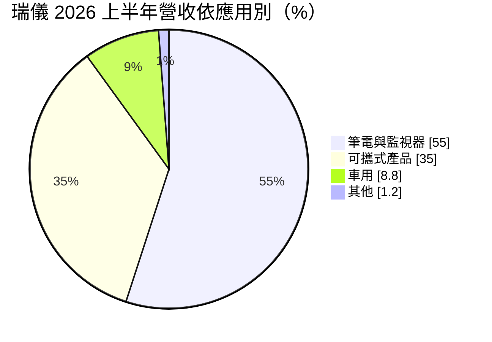
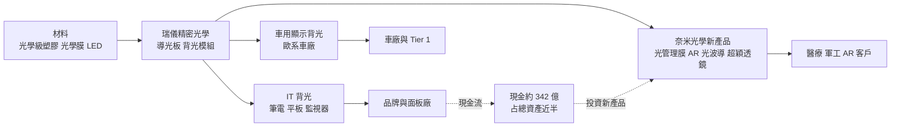
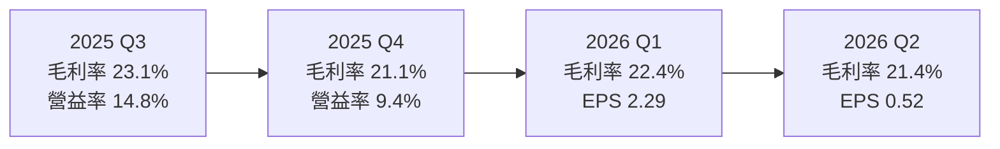
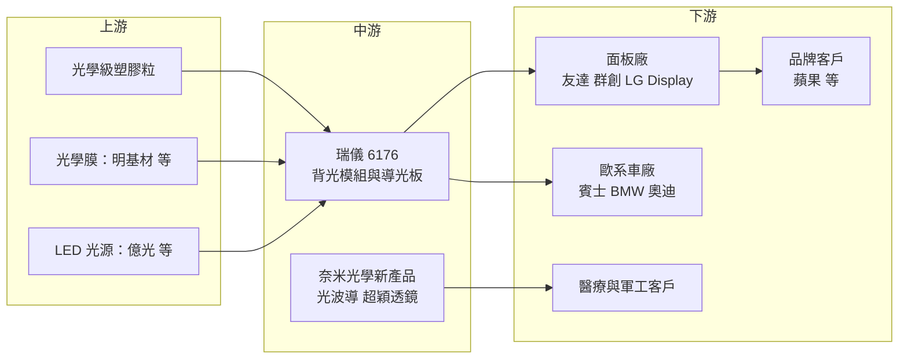

# 6176 瑞儀

> 上市｜[[產業索引-光電業|光電業]]｜上市（櫃）日期 2007/05/15

# 第一章：企業模式與商業藍圖

> [!info] 撰寫說明
> 本文由 Claude 依公開資料整理，架構比照 [[2330台積電]] 的四章研究，資料截至 2026-10-07。財務數字來源：富果研究（瑞儀 2025 年度與 2026 年第二季法說會摘要）、Poorstock（法說會整理）、經濟日報（2026 年第二季財報報導）、HiStock（季度利潤比率）；產業描述為整理性內容，尚未逐條比對原始文件。#待校對

在評估單一個股的長期投資價值時，首要步驟是拆解企業的底層獲利邏輯。本章針對瑞儀光電（股票代號：6176，以下簡稱瑞儀）的商業模式進行定性分析，說明全球背光模組龍頭如何在 [[OLED]] 取代 LCD 的長期壓力下，以車用與奈米光學新產品尋找第二條成長曲線。

## 一、核心定位：高階 IT 背光模組龍頭

瑞儀是全球主要的[[背光模組]]製造商，產品是 LCD 面板背後提供均勻光源的模組，包括[[導光板]]、光學膜與 LED 光源。瑞儀專注於高階筆電、平板與監視器的背光模組，長期主要客戶為 [[AAPL蘋果]] 供應鏈（依過往公開報導，客戶比重未查得，#待校對）。

瑞儀的定位有兩個特色：

* **高階、薄型化背光：** 高階筆電與平板要求極薄、高亮度與均勻度，背光模組的光學設計與精密射出能力門檻高，瑞儀在這個領域是主要供應商。
* **IT 產品高度集中：** 2025 年第四季 IT 背光模組占營收約 92%，獲利高度依賴筆電與平板的出貨與規格。

## 二、終端應用與產品板塊：筆電與監視器過半

2026 年上半年營收依應用別如下：

* **筆電與監視器（NB／MNT）：** 營收占 55%，上半年出貨年增 2%。AI PC 帶來新機會，依媒體報導，瑞儀已出貨 NVIDIA RTX Spark 相關 AI PC 的背光模組，因技術複雜度高而有較好的價格。
* **可攜式產品：** 平板等產品占 35%，上半年出貨年減 17%，是 OLED 轉換壓力最直接的一塊。
* **車用：** 占 8.8%，上半年出貨量由約 49.2 萬片增至約 181.4 萬片，年增 269%。2025 年車用營收年增 36%，供應歐系車廠如賓士、BMW、奧迪的多年期合約，呈現「量縮價增」的高單價產品趨勢。

## 三、資本轉化邏輯：精密光學製程轉向新產品

* **成熟業務養新業務：** 背光模組本業毛利率約兩成，現金充沛。公司把現金投入奈米光學新產品，2026 年第二季法說會提到資本投資超過 110 億元，加上研發費用增加，短期壓縮獲利。
* **財務體質：** 2026 年第二季現金及約當現金約 342.2 億元，約占總資產 49%。董事會並通過買回 1 萬張庫藏股。

## 四、企業長期藍圖：Radiant 2.0

瑞儀提出「Radiant 2.0」轉型，目標在 2028 年讓三項新產品貢獻 20% 至 25% 營收：

* **[[光管理膜]]：** 用於 OLED 顯示器，讓瑞儀在 OLED 取代 LCD 後仍能留在顯示供應鏈。
* **[[AR光波導]]：** 用於擴增實境眼鏡，歐系軍工客戶的訂單預計 2026 年底開始，美系軍用客戶洽談中。
* **[[Metalens]]：** 超穎透鏡用於 3D 感測與影像，眼球追蹤模組預計 2026 年第四季推出，客戶為歐美醫療業者。

另有前光導光板（Front Light Guide）產品，2025 年年增 38%，用於電子紙等反射式顯示器。

# 第二章：護城河深度與競爭優勢

在長期價值投資中，「護城河」指企業抵禦競爭、維持超額利潤的保護機制。本章分析瑞儀的護城河構成、主要競爭對手，以及 OLED 轉換對這條護城河的威脅。

## 一、瑞儀護城河的核心組成要素

瑞儀在高階背光模組有「窄護城河」，但這條護城河所在的市場正在縮小：

* **1. 精密光學設計與製程：** 高階筆電與平板的背光模組需要極薄導光板與複雜的光學微結構，良率與一致性門檻高，瑞儀長期是頂級品牌的主要供應商。
* **2. 與頂級客戶共同開發：** 新機種開發期就參與設計，客戶轉換供應商需重新驗證，轉換成本高。
* **3. 財務實力：** 現金約占總資產一半，能在本業萎縮前投資新技術，這是多數背光同業做不到的。

## 二、全球主要競爭對手格局

| 對手 | 定位 | 對瑞儀的威脅 |
|---|---|---|
| [[8215明基材]] | 台灣光學膜與偏光板 | 在光學膜部分重疊 |
| [[3593力銘]]、[[5243乙盛-KY]] | 台灣背光與機構件廠 | 在中低階背光模組競爭 |
| 中國背光模組廠 | 中低階 IT 與電視背光 | 價格競爭，搶非頂級品牌訂單 |
| 韓國與中國 OLED 面板廠 | OLED 不需背光 | 從根本上取代背光模組需求 |
| 光學與 AR 元件廠 | AR 光波導、超穎透鏡 | 新產品領域的技術競爭 |

## 三、優勢轉化：哪些市場守得住、哪些守不住

* **守得住：** 高階筆電與 AI PC 背光、車用高單價背光模組。這些產品仍以 LCD 為主，且技術門檻高。
* **守不住：** 平板與部分高階筆電轉向 OLED 後的背光需求。可攜式產品出貨已年減 17%，顯示這個趨勢正在發生。
* **觀察重點：** 新產品能否在 2028 年貢獻 20% 至 25% 營收、車用出貨能否延續高成長、OLED 在筆電滲透的速度，以及大量資本投資能否轉為獲利。

# 第三章：財務體質與盈利規模

資料日期：2026-10-07。數字取自法說會摘要與財經媒體，表格是撰寫當時的快照；最新月營收、毛利率、累計 EPS 由自動排程寫在本筆記的屬性欄位（月營收、毛利率、累計EPS 等）。#待校對

財務報表是檢驗護城河是否真實存在的最終標準。本章用三率、ROE、現金流與資本報酬，檢視瑞儀在轉型投資期間的獲利品質。

## 一、獲利能力的基石：三率

| 項目 | 2024 全年 | 2025 全年 | 2025 上半年 | 2026 Q1 | 2026 Q2 |
|---|---|---|---|---|---|
| 營收（新台幣） | 未查得 | 488 億 | 約 246 億（推算） | 約 120 億（推算） | 110.8 億 |
| [[毛利率]] | 未查得 | 約 21% | 21.0% | 22.4% | 21.4% |
| [[營業利益率]] | 未查得 | 未查得 | 12% | 12.0% | 8.1% |
| 稅後淨利 | 未查得 | 未查得 | 未查得 | 未查得 | 2.4 億 |
| EPS（元） | 15.63 | 9.40 | 4.12 | 2.29 | 0.52 |

* **[[毛利率]]：** 2026 年上半年 21.9%，創同期新高，顯示產品組合往高單價的車用與 AI PC 移動。
* **[[營業利益率]]：** 2026 年第二季降到 8.1%，主因營業費用年增約 30%，反映新產品研發與產能建置的投入。
* **[[淨利率]]與業外：** 第二季稅後淨利率僅約 2.2%，業外收支轉為淨支出約 2.22 億元，其中包含海外子公司達成重大里程碑而認列的約 4 億元併購相關支出。2025 年 EPS 由 2024 年的 15.63 元降至 9.4 元，公司說明匯率影響約每股 3.84 元、併購相關成本約每股 2 元。

## 二、[[ROE]]：資本效率

瑞儀過去在高峰期 ROE 可達兩成以上（推估，依 2024 年 EPS 15.63 元推算），2026 年獲利下滑加上大量現金，ROE 明顯下降（推估，具體數值未查得）。現金約占總資產一半，是 ROE 偏低的結構性原因。

## 三、資本支出與自由現金流

* **[[CapEx]]：** 2026 年第二季法說會提到資本投資超過 110 億元，主要用於奈米光學新產品產能，相對於過去的輕資本模式是明顯轉變。
* **[[自由現金流]]：** 背光本業現金流穩定，但新產品投資期間，自由現金流將低於過去水準（推估）。帳上約 342 億元現金提供充足緩衝。
* **股東回饋：** 董事會通過買回 1 萬張庫藏股。2025 年度現金股利金額未查得。

## 四、[[ROIC]] 與 [[WACC]]：價值創造利差

若扣除大量現金，背光本業的 ROIC 推估仍高於資金成本（推估，具體數值未查得）。關鍵在於新產品：超過 110 億元的資本投入若在 2028 年前無法形成規模營收，整體 ROIC 會被拉低。

# 第四章：總體風險與地緣政治

任何企業都無法脫離宏觀環境獨立存在。本章分析瑞儀未來必須面對的地緣政治、產業週期與營運風險。

## 一、地緣政治風險

* **生產據點與關稅：** 背光模組多在亞洲生產後供應組裝廠，美國關稅政策會影響客戶的組裝地點，進而影響瑞儀的出貨據點配置（生產據點明細未查得）。
* **軍工訂單：** AR 光波導切入歐美軍工客戶，涉及出口管制與國防採購規範，訂單時程受政策影響。

## 二、產業週期與市場結構風險

* **OLED 取代：** 這是瑞儀最大的結構性風險。OLED 自發光不需背光，平板與筆電轉向 OLED 的速度，直接決定背光本業的萎縮速度。
* **消費電子週期：** 筆電與平板換機週期影響出貨，具有[[長鞭效應]]。
* **匯率：** 營收以美元計價，2025 年新台幣升值對 EPS 的影響約每股 3.84 元，是獲利下滑的主因之一。

## 三、營運環境的隱性風險

* **客戶集中：** 背光本業依賴少數頂級客戶，單一客戶的規格決策會造成營收大幅波動。
* **併購與里程碑費用：** 海外子公司的併購對價與里程碑付款會持續影響業外損益。
* **新產品執行：** 光波導、超穎透鏡都是新技術，量產良率與客戶導入速度存在不確定性。

## 四、科技演進風險

* **顯示技術轉換：** 除 OLED 外，[[Mini LED]] 背光也在改變背光模組的結構，瑞儀需跟上新規格。
* **AR 市場不確定：** AR 眼鏡市場規模與普及時程仍不明確，光波導需求可能晚於預期。
* **超穎透鏡競爭：** Metalens 吸引半導體與光學大廠投入，瑞儀需證明以精密光學製程切入的成本與良率優勢。

# 專有名詞解析

## 金融

- **[[毛利率]]**：毛利除以營收，反映產品售價扣除直接生產成本後的獲利空間。
- **[[ROIC]]**：投入資本報酬率，衡量公司投入營運的資本能賺回多少報酬。

## 產業

- **[[背光模組]]**：LCD 面板背後提供均勻光源的模組，由 LED、導光板與光學膜組成。
- **[[導光板]]**：把側邊 LED 的光線均勻導向整個面板的光學板材，是背光模組的核心元件。
- **[[OLED]]**：有機發光二極體顯示器，每個像素自行發光、不需背光，是背光模組的替代技術。
- **[[Mini LED]]**：把大量小型 LED 作為 LCD 背光源並分區控光，提升對比與亮度。
- **[[光管理膜]]**：貼在 OLED 等顯示器上控制光線方向與效率的光學膜。
- **[[AR光波導]]**：AR 眼鏡中把影像光線導入眼睛的透明光學元件，讓使用者同時看到真實與虛擬畫面。
- **[[Metalens]]**：超穎透鏡，以奈米結構在平面上控制光線，可取代多片傳統鏡片，讓光學模組更薄。
- **[[長鞭效應]]**：終端需求的小幅變動沿供應鏈往上游傳遞時被逐級放大，造成上游庫存與訂單劇烈波動。

# 核心供應鏈

## 1. 上游：材料與光源
- 光學膜：[[8215明基材]]
- LED 光源：[[2393億光]]
- 光學級塑膠材料供應商

## 2. 中游：瑞儀本身
- 背光模組、導光板、前光導光板
- 新產品：光管理膜、AR 光波導、超穎透鏡

## 3. 下游：面板廠與品牌
- 面板廠：[[2409友達]]、[[3481群創]]、樂金顯示
- 品牌客戶：[[AAPL蘋果]]、[[NVDA輝達]]（AI PC 相關）
- 車廠：賓士、BMW、奧迪

## 4. 同業
- [[3593力銘]]、[[5243乙盛-KY]]、中國背光模組廠

## 最新新聞
<!-- news:start（自動產生，請勿手動編輯此範圍） -->
- 2026-10-08 🏛️ 重訊 16:31｜公告本公司召開法人說明會｜[觀測站](https://mops.twse.com.tw/mops/#/web/t05st01)

完整紀錄：[[6176瑞儀 新聞]]
<!-- news:end -->

## 相關連結
- [公開資訊觀測站](https://mopsov.twse.com.tw/mops/web/t05st03?step=1&firstin=1&co_id=6176)
- [Goodinfo](https://goodinfo.tw/tw/StockDetail.asp?STOCK_ID=6176)
- [Yahoo 股市](https://tw.stock.yahoo.com/quote/6176)
- [鉅亨網新聞](https://www.cnyes.com/twstock/6176/news)
