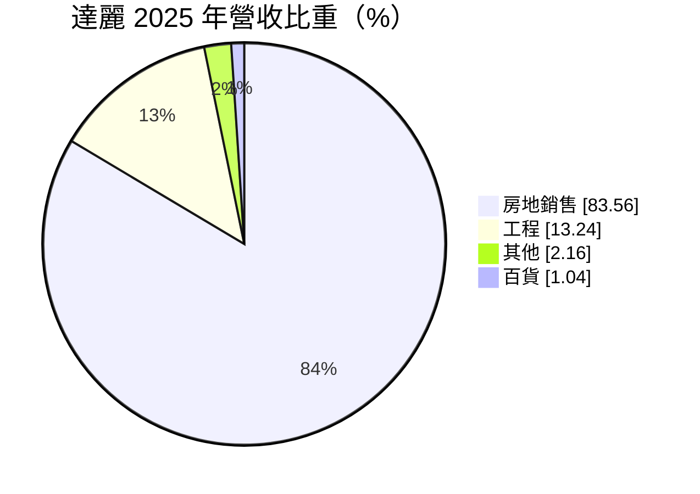
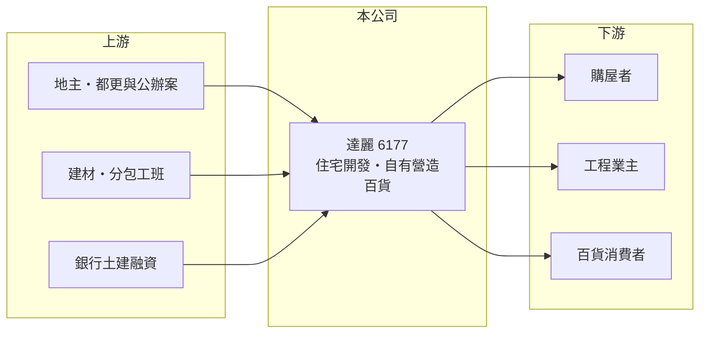

# 6177 達麗

> 上市｜[[產業索引-建材營造業|建材營造業]]｜上市（櫃）日期 2013/08/01

# 第一章：企業模式與商業藍圖

> [!info] 撰寫說明
> 精簡版，由 Claude 依公開資料整理，架構比照 [[2330台積電]]，資料截至 2026-10-08。來源：證交所開放資料快照（基本資料、2026 年第二季資產負債與損益、營益分析、2025 年度股利）、MoneyDJ 理財網財務比率年表（2021 至 2025 年）與個股基本資料（2025 年營收比重、歷年股利）、財經媒體報導標題。公開資料有限，個別建案名稱與土地庫存未查得；年度營收由 2025 年稅後淨利與歷年營收成長率回推，屬推算。#待校對

達麗建設事業成立於 1977 年 10 月，2013 年 8 月在證交所上市，是營收規模約百億元等級的建商，除了房地銷售，還有營造工程與少量百貨收入，形成從營造到開發的垂直整合結構。

- **核心業務：** 達麗購地、規劃興建住宅建案並銷售，同時承攬工程。建案以[[預售屋]]方式先銷售，等[[建案交屋]]才認列營收，因此營收與獲利集中在交屋年度。自有營造能力讓公司較能掌握工期與成本，不必完全依賴外部營造廠。
- **營收結構：** 依 MoneyDJ 的分類，2025 年房地銷售占 83.56%、工程占 13.24%、其他占 2.16%、百貨占 1.04%。房地銷售是絕對主力，工程與百貨則提供少量的經常性收入。
- **營運據點：** 公司登記於台北市中山區建國北路，推案以南台灣為主並擴及其他區域（推估，依媒體報導），具體建案名單本次未查得。
- **長期方向：** 達麗的營收在 2021 至 2025 年間介於約 85 億至 153 億元（推算），每年 EPS 都在 3 元以上；2026 年上半年單半年 EPS 已達 5.03 元，顯示新一波交屋已開始入帳。公司長期採用高槓桿擴張，負債比率在 74% 至 81%，以借貸支撐大量的土地與在建案。

# 第二章：護城河深度與競爭優勢

達麗的競爭優勢在於營造與開發的垂直整合，以及相對大的推案規模；但建設業本質上護城河仍淺，高槓桿也是雙面刃。

- **競爭優勢：** 自有營造部門讓達麗能控制施工品質、工期與營造成本，在營建成本上漲時比完全外包的建商更有彈性。較大的推案規模也讓公司在土地取得、建材採購與銀行融資上有議價優勢，2021 至 2025 年[[毛利率]]穩定在 25% 至 33%。
- **主要對手：** 南台灣與全台的上市櫃建商包括 [[2542興富發]]、[[2547日勝生]]、[[1436華友聯]]、[[1438三地開發]] 等（推估名單）。
- **觀察重點：** 觀察[[已售未入帳]]建案金額與未來兩三年的完工時程，以及大型[[都更]]或公辦開發案的進度。高負債結構下，利率與銀行對建商放款的態度是獲利能否延續的關鍵。

# 第三章：財務體質與盈利規模

資料日期：2026-10-08，表格是撰寫當時的快照；最新月營收、毛利率、累計 EPS 由自動排程寫在本筆記的屬性欄位（月營收、毛利率、累計EPS 等）。#待校對

達麗五年來每年都有獲利，ROE 在 16% 至 25% 之間，近五年平均超過 20%，在建設股中屬於高報酬的一群，但這部分來自高財務槓桿。

| 年度 | 營收（推算） | [[毛利率]] | [[營業利益率]] | EPS（元） | [[ROE]] |
|---|---|---|---|---|---|
| 2021 | 約 100.2 億 | 25.98% | 17.24% | 4.03 | 24.36% |
| 2022 | 約 85.4 億 | 27.57% | 17.03% | 3.09 | 16.34% |
| 2023 | 約 153.3 億 | 25.34% | 16.58% | 5.08 | 24.83% |
| 2024 | 約 122.4 億 | 32.75% | 22.32% | 5.01 | 22.01% |
| 2025 | 約 94.7 億 | 29.86% | 23.71% | 3.84 | 16.76% |

- **長期指標：** 近 5 年平均 ROE 約 20.9%（推算）。現金股利（MoneyDJ 列示 108 至 114 年度）依序為 2.00、0、3.00、1.00、3.00、3.50、3.00 元；依證交所資料，2025 年度稅後淨利約 17.98 億元，現金股利每股 3 元，[[配息率]]約 78%。公司章程規定股東紅利不低於當年度可分配盈餘的 60%。
- **[[ROIC]] 與 [[WACC]]：** 2025 年營業利益約 22.5 億元（營收約 94.7 億元 × 營業利益率 23.71%），稅後約 18.0 億元；投入資本以 2026 年第二季權益總額 122.9 億元加上總負債 344.7 億元的一半（約 172.3 億元，假設一半為有息負債）計，約 295.2 億元，ROIC 約 6.1%（推算）。WACC 約 4.6%（推算：無風險利率 1.75%、市場風險溢酬 6%、β 取建設股常見值 1.0，股東權益成本約 7.75%；稅前負債成本 3%、稅率 20%；負債權重約 58%）。ROIC 高於 WACC，代表公司在創造價值；不過高 ROE 有相當部分來自槓桿，若利率上升，利差會縮小。
- **營建業指標與財務特色：** 2026 年第二季底資產約 467.5 億元，其中流動資產（主要是土地與在建房地）約 420.2 億元，負債約 344.7 億元。2026 年上半年營收 83.1 億元、毛利率 42.89%、營業利益率 35.66%、EPS 5.03 元，正處於交屋高峰。

# 第四章：總體風險與地緣政治

達麗的風險來自房市週期、高財務槓桿與政策變化。

- **產業週期：** 房地產週期長，推案時的房價與交屋時的市場可能不同；達麗營收在 2023 年成長約 80%、2024 至 2025 年連續下滑，顯示交屋高低峰對業績影響很大。
- **營運風險：** 負債比率長期在 74% 以上，房市反轉時若銷售放緩，龐大的土地與在建案存貨需要持續支付利息，現金流壓力會快速上升。大型開發案的工期長、牽涉政府與地主協調，延宕的可能性也較高。
- **其他風險：** 央行[[信用管制]]限制建商土建融資與購屋貸款成數，直接影響高槓桿建商的資金調度；囤房稅與預售屋轉售限制會影響買方需求；營建缺工與原物料上漲則會壓縮自營營造的成本優勢。

# 專有名詞解析

## 金融

- **[[信用管制]]**：央行限制購屋與建商貸款成數的政策，會影響房市成交與建商資金。
- **[[ROIC]]**：投入資本報酬率，稅後營業利益除以股東權益加有息負債，衡量本業運用資本的效率。

## 產業

- **[[預售屋]]**：房屋在興建完成前就先銷售，買方分期繳款，建商可藉此降低資金與銷售風險。
- **[[建案交屋]]**：建商在房屋完工並交付買方時才認列營收，因此營建公司的營收常集中在交屋年度。
- **[[已售未入帳]]**：已經賣出、但尚未完工交屋而未認列營收的建案金額，是建商未來營收的主要能見度指標。
- **[[都更]]**：都市更新，由地主與建商合作把老舊建物改建，地主依權利價值分回房地或收益。

# 核心供應鏈

- 上游：地主與都更、公辦開發案的合作對象，建材與分包工班，提供土建融資的銀行（名稱未查得）。
- 下游／客戶：購屋者、工程承攬業主與百貨消費者。
- 同業：[[2542興富發]]、[[2547日勝生]]、[[1436華友聯]]、[[1438三地開發]]（推估名單）。

## 最新新聞
<!-- news:start（自動產生，請勿手動編輯此範圍） -->
- 2026-10-09 📰 媒體 20:20｜營收速報 - 達麗(6177)9月營收8.97億元年增率高達249.5％｜[鉅亨網](https://news.cnyes.com/news/id/6626923)

完整紀錄：[[6177達麗 新聞]]
<!-- news:end -->

## 相關連結
- [公開資訊觀測站](https://mopsov.twse.com.tw/mops/web/t05st03?step=1&firstin=1&co_id=6177)
- [Goodinfo](https://goodinfo.tw/tw/StockDetail.asp?STOCK_ID=6177)
- [Yahoo 股市](https://tw.stock.yahoo.com/quote/6177)
- [鉅亨網新聞](https://www.cnyes.com/twstock/6177/news)
