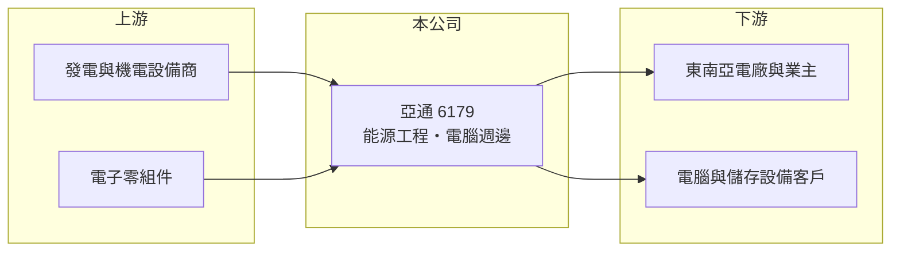

# 6179 亞通

> 上櫃｜[[產業索引-其他業|其他業]]｜上市（櫃）日期 2002/05/17

# 第一章：企業模式與商業藍圖

> [!info] 撰寫說明
> 精簡版，由 Claude 依公開資料整理，架構比照 [[2330台積電]]，資料截至 2026-10-07。來源：nstock 公司概況頁、winvest 營收快訊（搜尋結果標題）。業務別營收比重、主要工程案與客戶未查到。#待校對

亞通（亞通利大能源）從電腦週邊設備起家，近年以東南亞能源工程為主要動能，2026 年營收大幅成長。

- **核心業務：** 營業項目涵蓋電腦軟硬體與週邊設備、資料儲存設備與電子零組件，以及發電、[[汽電共生]]、能源技術服務、配管與疏濬等[[能源工程]]。
- **營收結構：** 業務別比重本次未查到；2026 年營收倍增與能源工程案的認列有關（推估）。
- **營運據點：** 在印尼、菲律賓設立分公司，經營能源相關工程。
- **長期方向：** 東南亞電力需求成長，公司以工程承攬切入當地發電與能源建設市場（推估）。

# 第二章：護城河深度與競爭優勢

亞通的優勢在於東南亞當地的工程經驗，但工程業務的毛利不高。

- **競爭優勢：** 已在印尼、菲律賓設點，熟悉當地法規與合作夥伴，有利承接後續工程（推估）。
- **主要對手：** 東南亞當地與國際的電力工程承包商，具體對手本次未查到。
- **觀察重點：** 工程案完工與認列節奏、2026 年下半年營收能否維持高檔，以及毛利率能否提升。

# 第三章：財務體質與盈利規模

資料日期：2026-10-07，以下數字是撰寫當時的快照；最新月營收、毛利率、累計 EPS 由自動排程寫在本筆記的屬性欄位（月營收、毛利率、累計EPS 等）。#待校對

亞通 2026 年前 8 月營收已超過 2025 年全年，第二季獲利明顯成長。

- **營收規模：** 2026 年 5 月營收 7.22 億元、6 月 11.02 億元、7 月 10.97 億元（年增 298.44%）、8 月 8.09 億元（年增 223.28%）；1 至 8 月累計約 57.21 億元，年增 131.4%。2025 年全年營收約 41.8 億元。
- **獲利：** 2026 年第二季 EPS 0.86 元，[[毛利率]] 14.97%、營益率 11.44%、淨利率 6.14%。
- **財務特色：** 資本額約 17.73 億元，近五年平均現金股利約 0.75 元；工程業務營收大但毛利率偏低。

# 第四章：總體風險與地緣政治

亞通的風險集中在海外工程的執行與收款。

- **產業週期：** 能源工程依賴少數大型案件，案件結束後若無新案接續，營收會快速回落。
- **營運風險：** 工程成本超支、工期延誤與[[完工百分比法]]認列的估計誤差，都會影響單季獲利。
- **其他風險：** 印尼、菲律賓的政治與法規變動、當地貨幣匯率，以及燃料與設備價格波動。

# 專有名詞解析

## 應用

- **[[汽電共生]]**：同時產生電力與熱能（蒸汽）的發電方式，提高燃料使用效率。

## 金融

- **[[完工百分比法]]**：依工程完成進度認列營收與成本的會計方法，估計失準會造成獲利調整。
- **[[毛利率]]**：營業毛利占營收的比率，反映產品售價扣除直接成本後的獲利空間。

## 產業

- **[[能源工程]]**：發電廠、能源設施與配管等工程的設計與施工承攬。

# 核心供應鏈

- 上游：發電機組、機電設備與電子零組件供應商（推估）
- 下游／客戶：印尼、菲律賓的電廠與能源業主，名稱未揭露
- 同業：東南亞電力工程承包商，名稱未查到

## 最新新聞
<!-- news:start -->
<!-- news:end -->

## 相關連結
- [公開資訊觀測站](https://mopsov.twse.com.tw/mops/web/t05st03?step=1&firstin=1&co_id=6179)
- [Goodinfo](https://goodinfo.tw/tw/StockDetail.asp?STOCK_ID=6179)
- [Yahoo 股市](https://tw.stock.yahoo.com/quote/6179)
- [鉅亨網新聞](https://www.cnyes.com/twstock/6179/news)
