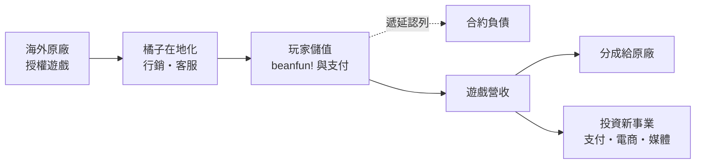
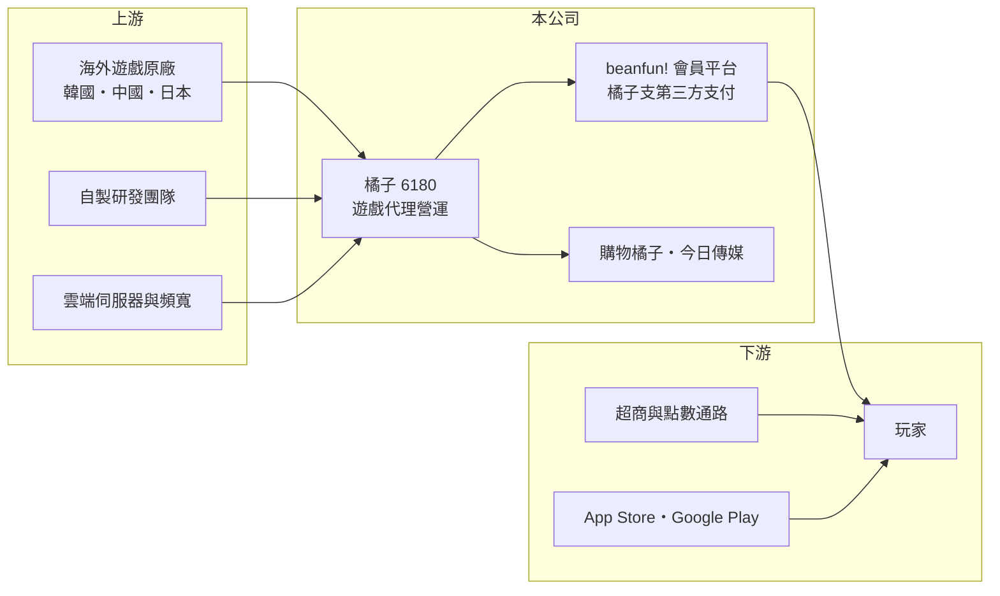

# 6180 橘子

> 上櫃｜[[產業索引-文化創意業|文化創意業]]｜上市（櫃）日期 2002/05/21

# 第一章：企業模式與商業藍圖

> [!info] 撰寫說明
> 精簡版，由 Claude 依公開資料整理，架構比照 [[2330台積電]] 的四章研究，資料截至 2026-10-08。來源：Goodinfo 基本資料（含重要子公司）與年度經營績效頁、櫃買中心開放資料（2026 年第二季綜合損益與資產負債、基本資料、每月營收、本益比殖利率）、財經媒體標題。各事業營收比重未查得，代理遊戲與平台描述為整理性內容。#待校對

遊戲橘子數位科技（股票代號：6180，以下簡稱橘子）是台灣歷史最久、規模最大的線上遊戲營運商之一。本章說明它如何從代理韓國遊戲起家，再延伸出會員平台、支付與電商等數位事業。

## 一、核心定位：代理營運起家的數位娛樂集團

依 Goodinfo 基本資料，橘子成立於 1995 年，2002 年 5 月上櫃，董事長兼總經理為創辦人劉柏園，資本額約 17.55 億元。公司以在台灣代理營運韓國的線上遊戲《天堂》系列打開市場，之後陸續代理《楓之谷》等作品，形成「取得海外遊戲的台灣代理權，自行負責在地化、行銷、客服與金流」的核心模式。

[[遊戲代理]]的經濟邏輯是：營運商不必承擔開發一款遊戲的龐大成本與失敗風險，而是挑選在海外已經成功的作品，支付授權金與營收分成給原廠，再用自身的在地行銷與會員基礎變現。代價是毛利要和原廠分享，而且代理權到期時有被收回或轉給競爭對手的風險。

## 二、事業板塊

公司未在本次查得的資料中揭露事業別比重（未查得），依 Goodinfo 子公司資料與公開資訊整理：

* **遊戲營運：** 核心事業，涵蓋線上遊戲與手機遊戲的代理營運，也有部分自製遊戲。營收集中在少數長壽作品，[[遊戲IP]]多屬海外原廠所有。
* **會員平台與支付：** 以 beanfun! 會員平台串連遊戲帳號，並經營第三方支付子公司橘子支行動支付（2020 年登錄）。支付與會員體系讓橘子掌握玩家的儲值與消費資料。
* **新事業：** 2026 年新登錄的重要子公司包括購物橘子（電子資訊供應服務）與今日傳媒（廣播及電視節目製作），顯示集團正把觸角延伸到電商與媒體。
* **海外據點：** 透過開曼群島控股公司持有北京遊戲橘子等海外子公司。

## 三、資本轉化邏輯

玩家儲值的點數在使用前屬於預收款，會計上列為[[合約負債]]，因此遊戲營運商的資產負債表上常有大量流動負債。依櫃買中心資料，2026 年第二季底橘子負債約 39.13 億元，其中流動負債約 38.27 億元，非流動負債只有約 0.86 億元，負債多半與營運相關而非借款（推估）。

## 四、企業長期藍圖

橘子的長期課題有兩個。第一，降低對單一代理遊戲的依賴，透過自製遊戲與更多代理作品分散風險。第二，把 beanfun!、支付與新設的電商、媒體子公司整合成生態系，讓遊戲會員的流量能在其他事業變現。過去十年橘子投入大量資源在非遊戲事業，這些投資能否轉為穩定獲利，是評估經營層資本配置能力的重點。

# 第二章：護城河深度與競爭優勢

在長期價值投資中，「護城河」指企業抵禦競爭、維持超額利潤的保護機制。本章分析橘子作為代理營運商的競爭優勢，以及代理模式本身的限制。

## 一、橘子護城河的核心組成要素

* **1. 長壽遊戲的玩家社群：** 經營超過二十年的遊戲累積了大量老玩家與公會關係，玩家投入的時間與虛擬資產形成轉換成本，讓這些遊戲能長期貢獻營收。
* **2. 會員與金流體系：** beanfun! 帳號與第三方支付讓橘子掌握玩家身分與儲值管道，降低對外部支付通路的依賴，也能把流量導入新遊戲與新事業。
* **3. 在地營運經驗：** 長期代理經驗讓橘子熟悉台灣玩家的喜好、行銷方式與客服需求，是海外原廠選擇在地夥伴時的重要考量。

但代理模式的護城河本質上是「借來的」：遊戲 IP 屬於原廠，代理合約到期時，原廠可能收回自營或轉給條件更好的對手。

## 二、主要競爭對手格局

| 對手 | 定位 | 對橘子的威脅 |
|---|---|---|
| [[5478智冠]]（遊戲新幹線） | 台灣遊戲代理與點數通路 | 爭取海外遊戲代理權與點數通路 |
| [[3086華義]]、[[7584樂意]] | 中小型遊戲代理營運商 | 在中型作品代理上競爭 |
| 海外原廠自營 | 韓國、中國遊戲公司直接在台營運 | 代理模式的最大威脅 |
| [[3293鈊象]] | 自製遊戲為主 | 在玩家時間與消費上競爭 |

## 三、優勢轉化：哪些守得住、哪些守不住

* **守得住：** 既有長壽遊戲的社群與會員金流體系。
* **守不住：** 獲利率。依 Goodinfo 資料，營業利益率從 2022 年的 15.4% 一路降到 2025 年的 -5.35%，毛利率也從 42.7% 降到 27.8%，代表遊戲本業的獲利能力明顯轉弱，而新事業仍在投入期。
* **觀察重點：** 第一，新代理作品能否取代老遊戲的營收；第二，非遊戲事業的虧損是否收斂；第三，代理合約的續約狀況。

# 第三章：財務體質與盈利規模

資料日期：2026-10-08，表格是撰寫當時的快照；最新月營收、毛利率、累計 EPS 由自動排程寫在本筆記的屬性欄位（月營收、毛利率、累計EPS 等）。#待校對

財務報表是檢驗護城河是否真實存在的最終標準。橘子的數字顯示，營收規模大致持平，但獲利能力在 2023 年後明顯下降。

## 一、多年度經營績效

| 年度 | 營收（新台幣） | [[毛利率]] | [[營業利益率]] | EPS（元） | [[ROE]] |
|---|---|---|---|---|---|
| 2019 | 96.8 億 | 42.3% | 13.0% | 5.10 | 16.5% |
| 2020 | 104 億 | 38.0% | 10.9% | 5.00 | 14.5% |
| 2021 | 114 億 | 41.8% | 15.2% | 6.30 | 17.8% |
| 2022 | 114 億 | 42.7% | 15.4% | 7.29 | 21.1% |
| 2023 | 97.9 億 | 38.8% | 6.53% | 3.28 | 9.28% |
| 2024 | 111 億 | 35.3% | 2.33% | 11.78 | 35.1% |
| 2025 | 88.7 億 | 27.8% | -5.35% | -1.53 | -5.18% |
| 2026 上半年 | 44.18 億 | 26.7% | -1.6% | -0.26 | 不適用（半年） |

資料來源：2019 至 2025 年為 Goodinfo 年度經營績效，2026 上半年為櫃買中心開放資料。

* **2024 年的特例：** 營業利益率只有 2.33%，EPS 卻高達 11.78 元，代表當年獲利主要來自業外收益（推估為處分投資等一次性收益，細節未查得），不能視為本業的獲利能力。
* **本業趨勢：** 2019 至 2022 年營業利益率維持 11% 至 15%，2023 年後逐年下滑並轉為虧損。
* **長期指標：** 2021 至 2025 年平均 ROE 約 15.6%（推算），但受 2024 年業外收益拉高；2020 至 2025 年營收年複合成長率約 -3.1%（推算）。

## 二、股利與現金流

依櫃買中心本益比殖利率資料，最近一次現金股利約每股 1.03 元，而 2025 年 EPS 為 -1.53 元，代表股利來自以前年度累積的盈餘。Goodinfo 統計歷年平均現金股利約 1.66 元（一般平均）。遊戲營運的資本支出不高，但新事業的投資需求較大，[[自由現金流]]狀況未查得。

## 三、[[ROIC]] 與 [[WACC]]

**ROIC 推算：** 2025 年營業虧損約 4.75 億元，ROIC 為負（推算）。若以 2021 至 2025 年平均營業利益約 7.82 億元計算，稅後約 6.26 億元；依櫃買中心資料，2026 年第二季底權益總計約 42.48 億元，假設有息負債約 5 億元（推估，負債多為營運性負債），投入資本約 47.5 億元，五年平均 ROIC 約 13.2%（推算）。

**WACC 推算：** 假設台灣 10 年期公債殖利率 1.75%、市場風險溢酬 6%、β 取遊戲同業常見值 1.0（假設），權益成本約 7.75%；負債成本稅後約 2.0%，以權益約 89%、負債約 11% 計算，WACC 約 7.1%（推算）。

**結論：** 以 2021 至 2022 年的獲利水準，橘子的 ROIC 明顯高於 WACC；但 2023 年起本業報酬快速下滑，2025 年已低於資金成本。公司能否恢復創造價值，取決於遊戲本業回穩與新事業止血。

# 第四章：總體風險與地緣政治

任何企業都無法脫離宏觀環境獨立存在。本章分析橘子長期必須面對的產業、營運與法規風險。

## 一、產業週期與結構

* **遊戲生命週期：** 每款遊戲都有生命週期，老遊戲營收會逐漸下滑，營運商必須持續推出新作補位，新作成敗難以預測。
* **手遊化與平台抽成：** 手機遊戲的儲值多經過 Apple 與 Google 應用程式商店，平台抽成約三成，壓縮營運商毛利；這也是自有支付體系的重要性所在。
* **中國遊戲的競爭：** 中國遊戲公司資源龐大，大量作品進入台灣市場，推高行銷成本。

## 二、營運風險

* **代理權集中：** 營收依賴少數海外原廠的授權作品，代理權變動對營收影響很大。
* **新事業投資：** 支付、電商與媒體事業需要長期投入，若無法達到規模，可能持續拖累獲利。

## 三、法規風險

* **支付與洗錢防制：** 第三方支付受金融監理規範，遊戲點數也可能被詐騙集團利用，法規趨嚴會提高合規成本。
* **機率型商品規範：** 台灣已要求遊戲揭露轉蛋等機率型商品的機率，未來若規範更嚴，可能影響營收模式。

# 專有名詞解析

## 金融

- **[[合約負債]]**：已向客戶收取但尚未交付產品的款項，建商的預售屋訂金即屬此類，可作為未來營收的領先指標。
- **[[ROIC]]**：投入資本報酬率，稅後營業利益除以股東權益與有息負債的合計，衡量本業對所有資金提供者的報酬。
- **[[WACC]]**：加權平均資金成本，依股東權益與負債的比重加權計算的資金成本，ROIC 高於它才代表創造價值。

## 產業

- **[[遊戲代理]]**：營運商取得海外遊戲在特定地區的營運權，負責在地化、行銷與客服，並與原廠分成營收。
- **[[遊戲IP]]**：遊戲的智慧財產，包括角色、世界觀與名稱，可改編成續作、手機遊戲或授權給其他廠商使用。

# 核心供應鏈

## 1. 上游
- 海外遊戲原廠（韓國、中國、日本等）
- 雲端與機房服務：[[2412中華電]]等電信業者

## 2. 本公司
- 遊戲橘子：遊戲代理營運、beanfun! 會員平台
- 子公司：橘子支行動支付、購物橘子、今日傳媒

## 3. 下游與通路
- 玩家、超商點數通路（[[2912統一超]]等）、Apple 與 Google 應用程式商店

## 4. 同業
- [[5478智冠]]、[[3086華義]]、[[7584樂意]]、[[3293鈊象]]

## 最新新聞
<!-- news:start（自動產生，請勿手動編輯此範圍） -->
- 2026-10-08 📰 媒體 17:24｜營收速報 - 橘子(6180)9月營收8.90億元年增率高達37.19％｜[鉅亨網](https://news.cnyes.com/news/id/6625032)

完整紀錄：[[6180橘子 新聞]]
<!-- news:end -->

## 相關連結
- [公開資訊觀測站](https://mopsov.twse.com.tw/mops/web/t05st03?step=1&firstin=1&co_id=6180)
- [Goodinfo](https://goodinfo.tw/tw/StockDetail.asp?STOCK_ID=6180)
- [Yahoo 股市](https://tw.stock.yahoo.com/quote/6180)
- [鉅亨網新聞](https://www.cnyes.com/twstock/6180/news)
