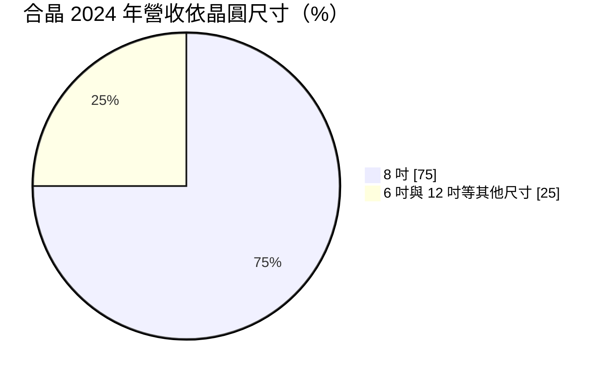
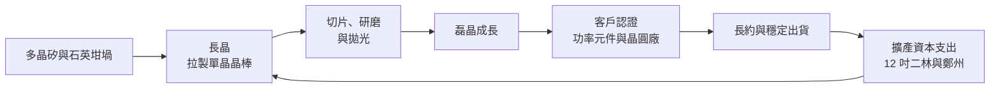
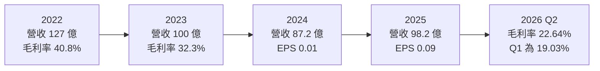
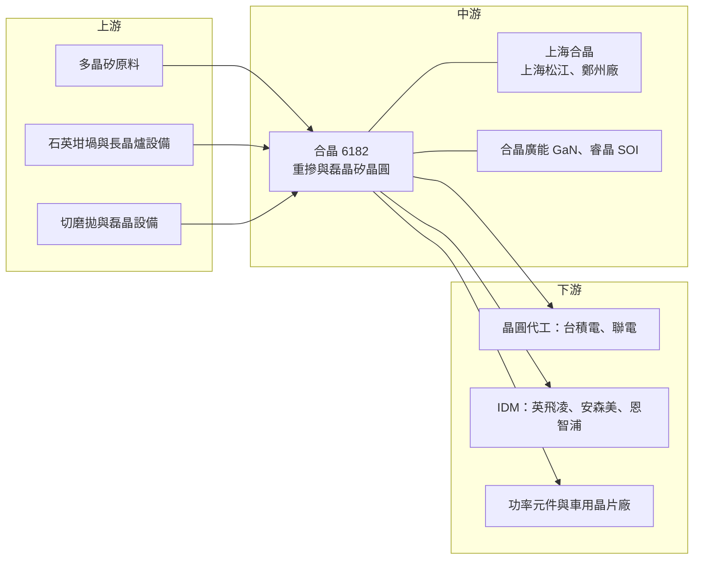

# 6182 合晶

> 上櫃｜[[產業索引-半導體業|半導體業]]｜上市（櫃）日期 2002/05/16

# 第一章：企業模式與商業藍圖

> [!info] 撰寫說明
> 本文由 Claude 依公開資料整理，架構比照 [[2330台積電]] 的四章研究，資料截至 2026-10-08。財務數字來源：Goodinfo 台灣股市資訊網年度經營績效、股利政策與基本資料頁、富邦 MoneyDJ 個股基本資料（2026 年第二季財務比率、β 值）、工商時報（2024 年 11 月、2026 年 3 月）、理財周刊（2026 年）、CMoney 研究報告（2020）、科技新報月營收報導；產業描述為整理性內容，尚未逐條比對原始文件。#待校對

在評估單一個股的長期投資價值時，首要步驟是拆解企業的底層獲利邏輯。本章針對合晶科技股份有限公司（股票代號：6182，以下簡稱合晶）的商業模式進行定性分析。合晶是全球前十大[[矽晶圓]]廠之一，但它和 [[6488環球晶]]、[[4063信越化學]] 這些大廠走的路線不同：合晶長年專注在功率元件與車用晶片使用的[[重摻矽晶圓]]，以 6 吋與 8 吋為主。2023 年以後，公司正投入鉅資轉型 12 吋，這個轉型的成敗將決定合晶未來十年的樣貌。

## 一、核心定位：專攻重摻與磊晶的矽晶圓廠

合晶成立於 1997 年 7 月，2002 年 5 月在櫃買中心掛牌，總部位於桃園龍潭，董事長為焦平海，總經理為張憲元，股本約 62.5 億元。公司的產品是半導體級拋光矽晶圓與[[磊晶]]矽晶圓，依富邦 MoneyDJ，2025 年半導體產品占營收 99.39%。

矽晶圓可以依摻雜濃度分為兩大類。邏輯與記憶體晶片使用的是輕摻矽晶圓，市場由信越、[[3436勝高]]、環球晶等大廠主導，規格以 12 吋為主；[[功率半導體]]（例如 [[MOSFET]]、二極體、[[IGBT]]）則需要電阻率很低的重摻矽晶圓，通常再長一層磊晶，以 6 吋、8 吋為主。合晶選擇專攻後者，避開與大廠在主流市場的正面競爭，並在車用與功率元件領域建立了自己的客戶群。依 2024 年工商時報報導，合晶 8 吋營收占比約 75%，磊晶營收占比約 51%。

合晶的生產據點橫跨台灣與中國：台灣有龍潭、楊梅廠，以及興建中的彰化二林 12 吋新廠；中國則透過子公司上海合晶經營上海松江與河南鄭州廠。上海合晶於 2024 年 2 月在上海證券交易所科創板掛牌，合晶在 2020 年時持股約 48.45%（CMoney 研究報告，最新持股比例未查得）。

## 二、終端應用與產品板塊

依 2024 年工商時報報導的營收結構：

* **6 吋與 8 吋重摻、磊晶矽晶圓（核心）：** 主要用於車用電子、工業控制與電源的功率元件，以及 CIS 影像感測器、[[電源管理IC]]與 [[MCU]]。客戶以 [[IDM]] 廠與晶圓代工廠為主，包括 [[2330台積電]]、[[2303聯電]]、英飛凌、安森美與恩智浦。
* **12 吋矽晶圓（轉型重點）：** 包括 12 吋重摻矽晶圓（已陸續通過主要客戶認證）與 12 吋先進製程用矽晶圓。功率元件廠逐步從 8 吋轉往 12 吋生產，合晶必須跟進，否則會失去未來的核心客戶。
* **化合物與特殊材料（長期布局）：** 子公司合晶廣能主攻 [[GaN]] 磊晶（AI 伺服器電源與車載充電器），睿晶科技主攻 [[SOI]]（微機電與[[矽光子]]）。公司規劃的化合物路線為 2024 至 2026 年以矽基氮化鎵為主、2026 至 2028 年以碳化矽基氮化鎵為主、2028 年後朝氧化鎵發展。另外開發 310mm × 310mm 方型晶圓，鎖定 [[CoPoS]] 與面板級先進封裝，2026 年已進入客戶驗證並有出貨。

## 三、資本轉化邏輯：重資產的長晶與加工

矽晶圓是典型的重資產產業：長晶爐、切磨拋設備與磊晶機台都需要大量資本，新廠從動工到量產需要數年，產品還要經過客戶長時間的認證。合晶的 12 吋擴產規模很大：台灣二林新廠規劃月產能 20 萬片 12 吋，主要服務國際客戶，2026 年 4 月 30 日產出首根 12 吋晶棒；鄭州二期由上海合晶主導，同樣規劃月產能 20 萬片，鎖定中國客戶。兩座新廠都以 2026 年量產為目標。

這種「台灣廠服務國際客戶、中國廠服務中國客戶」的雙軌架構，是合晶因應地緣政治的策略：國際客戶需要非中國產能，中國客戶則傾向採購本土供應鏈的產品。

為支應擴產，合晶 2026 年規劃辦理現金增資發行 2,000 萬股，上海合晶也決議私募上限約 3,992.75 萬股，資金用於 12 吋矽晶圓投資與補充營運資金（工商時報 2026 年 3 月）。

## 四、企業長期藍圖

合晶的長期目標是從「6 吋、8 吋重摻專家」轉型為「涵蓋 12 吋重摻、12 吋先進製程矽晶圓與化合物材料的完整材料供應商」。具體方向包括：建立 12 吋從長晶、晶圓到後段加工的全流程技術；推出重摻低阻與極低阻等客製化產品；以 GaN 磊晶與 SOI 切入 AI 伺服器電源與矽光子；以方型晶圓參與面板級先進封裝。若這些布局成功，合晶的產品組合將從成熟的功率元件材料，延伸到 AI 時代的高成長材料市場。

# 第二章：護城河深度與競爭優勢

本章分析合晶的護城河構成、全球主要競爭對手，以及這些優勢在矽晶圓週期與 12 吋轉型中能守住多少。

## 一、護城河的核心組成要素

合晶屬於「窄護城河」企業，其優勢集中在重摻矽晶圓這個利基：

* **1. 重摻長晶技術：** 重摻矽晶圓需要在長晶時加入高濃度的摻雜物，控制均勻度與缺陷的難度高於輕摻產品。合晶長年專注這個領域，累積的製程經驗是新進者需要時間才能追上的。
* **2. 客戶認證的轉換成本：** 矽晶圓是晶片製造的起點，客戶更換供應商需要重新驗證整條製程，車用功率元件更需要長時間的可靠度驗證。合晶與英飛凌、安森美等 IDM 大廠的長期合作，是不易被取代的資產。
* **3. 台灣與中國雙軌產能：** 同時擁有台灣與中國產能，使合晶能分別服務重視「非中國供應鏈」的國際客戶與重視「本土供應鏈」的中國客戶。

## 二、全球主要競爭對手格局

| 對手 | 定位 | 對合晶的威脅 |
|---|---|---|
| [[4063信越化學]]、[[3436勝高]] | 全球前兩大矽晶圓廠，主攻 12 吋輕摻 | 在 12 吋先進製程矽晶圓擁有壓倒性技術與規模 |
| [[6488環球晶]]、Siltronic、SK Siltron | 全球前五大矽晶圓廠 | 產品線完整，同樣供應功率元件用重摻晶圓 |
| [[3532台勝科]] | 台灣 8 吋與 12 吋矽晶圓廠 | 在台灣客戶的 12 吋市場競爭 |
| 中國矽晶圓廠（滬硅產業、立昂微等） | 政策扶植、積極擴產 | 搶中國客戶，並壓低 6 吋、8 吋價格 |
| [[3016嘉晶]] | 台灣磊晶代工廠 | 在功率元件磊晶片市場重疊 |

## 三、優勢轉化：守得住、守不住與觀察重點

* **守得住：** 6 吋、8 吋重摻與磊晶矽晶圓的車用與功率元件客戶。這些產品技術門檻較高，客戶驗證期長，合晶在 2026 年上半年完成 6 吋、8 吋約一成的價格調整，顯示仍有一定的定價能力。
* **守不住：** 12 吋先進製程用矽晶圓的主流市場。信越與勝高在這個市場的技術與規模遙遙領先，合晶短期內難以取得大量份額。
* **觀察重點：** 第一，12 吋重摻矽晶圓能否通過更多客戶認證並填滿二林新廠產能；第二，新廠折舊開始認列後，毛利率能否隨[[產能利用率]]提升而回升；第三，GaN、SOI 與方型晶圓能否從驗證走到具規模的營收。

# 第三章：財務體質與盈利規模

資料日期：2026-10-08。數字取自 Goodinfo 年度經營績效與股利政策頁、富邦 MoneyDJ 個股基本資料、理財周刊與工商時報報導，表格是撰寫當時的快照；最新月營收、毛利率、累計 EPS 由自動排程寫在本筆記的屬性欄位（月營收、毛利率、累計EPS 等）。#待校對

財務報表是檢驗護城河是否真實存在的最終標準。本章用七年的三率、[[ROE]]、股利與資本報酬，檢視合晶在矽晶圓週期與大規模擴產之間的獲利品質。

## 一、獲利能力的基石：三率

| 年度 | 營收（新台幣） | [[毛利率]] | [[營業利益率]] | EPS（元） | [[ROE]] |
|---|---|---|---|---|---|
| 2019 | 76.8 億 | 34.7% | 17.0% | 未查得 | 10.2% |
| 2020 | 74.2 億 | 27.1% | 9.89% | 1.02 | 5.31% |
| 2021 | 103 億 | 35.0% | 19.2% | 2.02 | 10.4% |
| 2022 | 127 億 | 40.8% | 26.3% | 4.00 | 17.0% |
| 2023 | 100 億 | 32.3% | 13.6% | 1.05 | 6.01% |
| 2024 | 87.2 億 | 24.2% | 2.73% | 0.01 | 1.34% |
| 2025 | 98.2 億 | 24.3% | 5.77% | 0.09 | 1.82% |

2016 至 2018 年數字未查得。

這張表呈現一個完整的矽晶圓週期。2021 至 2022 年全球晶片缺貨，功率元件與車用晶片需求暴增，合晶毛利率達到 40.8%、營業利益率 26.3%、EPS 4 元，是近年高峰。2023 年起客戶去化庫存，矽晶圓出貨與價格同步下滑，2024 年營業利益率只剩 2.73%，EPS 幾乎為零。

2025 年營收回升到 98.2 億元、年增約 12.7%，主要受 12 吋矽晶圓出貨增加帶動，但 EPS 只有 0.09 元。原因是 12 吋新產能開出後折舊先反映在成本上，而客戶認證與產能利用率需要時間爬升。2026 年第一季單季淨利僅約 210 萬元，第二季毛利率回升到 22.64%、單季 EPS 0.05 元，上半年 EPS 0.06 元（理財周刊）。2019 至 2025 年營收年複合成長率約 4.2%（推算）。

* **[[毛利率]]：** 由產能利用率、售價與折舊共同決定。2022 年的 40.8% 是供不應求下的高峰，2024 至 2026 年上半年約 19% 至 24%，反映景氣低谷與新廠折舊的雙重壓力。2026 年 6 吋、8 吋價格調漲約一成，效益預計在 2026 年下半年至 2027 年上半年陸續反映。
* **[[營業利益率]]：** 矽晶圓廠固定成本占比極高，營收與產能利用率變動會被放大到營業利益，屬於典型的[[營運槓桿]]產業。

## 二、[[ROE]]：資本效率

2021 至 2025 年平均 ROE 約 7.3%（推算），2019 至 2025 年平均約 7.4%（推算）。高峰的 2022 年達 17%，但 2024 至 2025 年降到 1% 至 2%。合晶的 ROE 長期偏低，除了景氣週期外，也因為公司持續增資與擴產，權益基數不斷擴大：2026 年第二季每股淨值約 27.20 元，以約 6.25 億股計算，歸屬母公司權益約 170 億元。Goodinfo 的 ROE 數字與歸屬母公司淨利的對應關係不完全一致，推估其計算口徑包含上海合晶等子公司的非控制權益，引用時需注意。

## 三、資本支出與自由現金流

合晶正處於大規模資本支出期，二林與鄭州兩座 12 吋新廠各規劃月產能 20 萬片，具體資本支出金額未查得。2026 年第二季負債比例約 33.96%（富邦 MoneyDJ），並以母公司現金增資與上海合晶私募補充資金。在新廠量產初期，[[自由現金流]]推估為負（推估），要等產能利用率提升、折舊攤提到一定程度後才可能轉正。

股利方面，依 Goodinfo，2017 至 2023 年度現金股利依序為 0.376、2.5、1.8、1.1、1.35、2.496、0.65 元，2016 年度與 2024、2025 年度未配息。以 EPS 計算，2021 至 2023 年配息率約為 67%、62%、62%（推算）。合晶在獲利年度配息率約六成，但在擴產期與獲利低谷會優先保留資金，2025 年度董事會決議不分派股利。這種做法符合重資產產業的資本配置邏輯，但也代表股東在轉型期間難以獲得現金回報。

## 四、[[ROIC]] 與 [[WACC]]：價值創造利差

**ROIC 推算：** 2025 年營業利益約 5.67 億元（98.2 億 × 5.77%），以 20% 稅率計算，稅後營業利益約 4.53 億元。投入資本以歸屬母公司權益約 170 億元，加上非控制權益與有息負債（未查得，推估合計約 50 億至 130 億元），約 220 億至 300 億元計算，ROIC 約 1.5% 至 2.1%（推算）。對照 2022 年，營業利益約 33.4 億元（127 億 × 26.3%），稅後約 26.7 億元，以淨利 21.6 億元與 ROE 17.0% 回推權益約 127 億元；若加計有息負債，ROIC 約 15% 至 21%（推算）。

**WACC 推算：** 權益成本以 CAPM 估計，假設台灣 10 年期公債殖利率 1.75%、市場風險溢酬 6%、β 取富邦 MoneyDJ 所列 1.57，權益成本約 11.2%。負債成本假設 2.5%，稅後約 2.0%；資本結構假設權益 75%、有息負債 25%（推估）。WACC 約 0.75 × 11.2% ＋ 0.25 × 2.0% ≈ 8.9%（推算）。

**結論：** 合晶在 2021 至 2022 年的景氣高峰，ROIC 明顯高於約 8.9% 的資金成本；2024 至 2025 年 ROIC 約 2%，遠低於 WACC，代表目前的投入資本尚未創造價值。這在大規模擴產期間並不意外，但也凸顯 12 吋轉型的風險：兩座新廠必須在未來數年內達到高產能利用率，並維持合理售價，ROIC 才可能回到 WACC 以上（推算）。如果矽晶圓景氣回升緩慢或 12 吋認證不順，新增的資本會長期拉低合晶的資本報酬。

# 第四章：總體風險與地緣政治

任何企業都無法脫離宏觀環境獨立存在。本章分析合晶未來必須面對的地緣政治、產業週期與營運風險。

## 一、地緣政治風險

* **中國產能的雙面刃：** 上海合晶在中國掛牌並經營上海與鄭州廠，能服務中國本土化需求，但也暴露在美國出口管制、兩岸政策與資金匯出限制之下。中國子公司的獲利與資金，未必能自由回流台灣母公司。
* **國際客戶的「非中國」要求：** 歐美 IDM 客戶要求供應鏈分散，二林新廠的定位就是回應這個需求。若地緣緊張升高，國際客戶可能進一步要求合晶提供台灣以外的產能。
* **中國同業擴產：** 中國政策扶植本土矽晶圓廠，在 6 吋、8 吋與 12 吋都積極擴產，長期可能壓低全球價格。

## 二、產業週期與市場結構風險

* **矽晶圓的長週期：** 矽晶圓位於供應鏈最上游，受[[長鞭效應]]影響最深。下游晶片廠庫存調整時，矽晶圓需求會劇烈收縮，2022 年至 2024 年毛利率從 40.8% 降到 24.2% 就是例子。
* **功率元件與車用景氣：** 合晶的核心客戶集中在功率元件與車用晶片，電動車與工業景氣放緩會直接反映在訂單上。
* **產能過剩風險：** 全球矽晶圓廠在 2022 年前後大舉擴產，若需求成長不如預期，新產能開出後可能造成供過於求。

## 三、營運環境的隱性風險

* **折舊壓力：** 兩座 12 吋新廠的折舊會在量產初期大幅增加成本，產能利用率爬升速度是未來幾年獲利的關鍵變數。
* **股權稀釋：** 母公司現金增資與子公司私募，會稀釋既有股東的權益；若新資本的報酬率低於資金成本，稀釋就是價值損失。
* **集團結構複雜：** 合晶、上海合晶、合晶廣能、睿晶科技等多家公司各有股東結構，投資人需要分辨合併報表中屬於合晶股東的部分。

## 四、科技或法規演進風險

功率元件正從矽材料轉向 [[SiC]] 與 GaN 等寬能隙材料。如果電動車與資料中心電源大量改用碳化矽與氮化鎵元件，傳統重摻矽晶圓的需求成長會放緩。合晶的因應是以 GaN 磊晶、SOI 與方型晶圓布局新材料，但這些業務仍在早期階段，與國際大廠相比規模很小。另一方面，AI 晶片的面積增加與先進封裝的發展，也為方型基板與高階矽晶圓帶來新需求。合晶能否在傳統重摻矽晶圓的現金流支撐下，順利完成材料轉型，是未來十年最重要的觀察點。

# 專有名詞解析

## 半導體

- **[[矽晶圓]]**：以高純度單晶矽切成的圓形薄片，是製造晶片的基本材料，主要尺寸有 6 吋、8 吋與 12 吋。
- **[[重摻矽晶圓]]**：在長晶時加入高濃度摻雜物、電阻率很低的矽晶圓，主要用於 MOSFET、二極體等功率元件。
- **[[磊晶]]**：在晶圓表面再長一層結構與電性可精準控制的單晶薄膜，是功率元件與化合物半導體的關鍵製程。
- **[[功率半導體]]**：負責電能轉換、開關與保護的半導體元件，例如二極體、MOSFET、IGBT，廣泛用於電源、汽車與工業設備。
- **[[MOSFET]]**：金氧半場效電晶體，用電壓控制電流開關的功率元件，是電源供應器、馬達驅動與電動車的關鍵零件。
- **[[IGBT]]**：絕緣閘雙極電晶體，適合高電壓大電流的功率開關，常用於電動車逆變器與工業馬達。
- **[[GaN]]**：氮化鎵，寬能隙半導體材料，切換速度快、體積小，常用於快充與資料中心電源。
- **[[SiC]]**：碳化矽，寬能隙半導體材料，耐高壓與高溫，用於電動車與太陽能逆變器的功率元件。
- **[[SOI]]**：絕緣層上覆矽晶圓，在矽層與基板之間夾一層絕緣層，可降低漏電，用於射頻、微機電與矽光子。
- **[[矽光子]]**：在矽晶片上製作光學元件，以光取代電傳輸資料，可降低 AI 資料中心的傳輸耗電。
- **[[CoPoS]]**：把 CoWoS 的中介層改成方形面板的先進封裝技術，可在同一片基板放入更多晶片、降低成本。
- **[[IDM]]**：垂直整合製造廠，從晶片設計、製造到封裝測試都自己完成的半導體公司。

## 金融

- **[[營運槓桿]]**：固定成本占比高時，營收小幅變動會造成營業利益大幅變動的現象。
- **[[產能利用率]]**：實際生產量占總產能的比例，矽晶圓廠的毛利率高度取決於此數字。
- **[[自由現金流]]**：營業活動現金流減去資本支出，代表企業可自由用於配息、還債或併購的現金。
- **[[長鞭效應]]**：終端需求的小幅變動，沿供應鏈往上游傳遞時被逐級放大，造成上游庫存與訂單劇烈波動。

# 核心供應鏈

## 1. 上游：原料與設備
- 多晶矽與石英坩堝供應商（未查得）
- 長晶、切磨拋與磊晶設備：[[AMAT應用材料]] 等（磊晶設備，合晶實際採購對象未查得）

## 2. 中游：合晶本身與子公司
- 上海合晶（2024 年 2 月科創板掛牌）：上海松江與鄭州廠，服務中國客戶
- 合晶廣能：GaN 磊晶
- 睿晶科技：SOI 晶圓

## 3. 下游：主要客戶
- 晶圓代工：[[2330台積電]]、[[2303聯電]]
- IDM：英飛凌、安森美、恩智浦

## 4. 同業與競爭者
- 台灣：[[6488環球晶]]、[[3532台勝科]]、[[3016嘉晶]]
- 國際：[[4063信越化學]]、[[3436勝高]]、Siltronic、SK Siltron、滬硅產業、立昂微

延伸閱讀：[[台積電供應鏈]]

## 最新新聞
<!-- news:start（自動產生，請勿手動編輯此範圍） -->
- 2026-10-06 📰 媒體 11:00｜矽晶圓重啟漲價循環，景氣全面復甦？環球晶、台勝科、合晶、嘉晶，受惠程度大不同！｜[鉅亨網](https://news.cnyes.com/news/id/6622551)

完整紀錄：[[6182合晶 新聞]]
<!-- news:end -->

## 相關連結
- [公開資訊觀測站](https://mopsov.twse.com.tw/mops/web/t05st03?step=1&firstin=1&co_id=6182)
- [Goodinfo](https://goodinfo.tw/tw/StockDetail.asp?STOCK_ID=6182)
- [Yahoo 股市](https://tw.stock.yahoo.com/quote/6182)
- [鉅亨網新聞](https://www.cnyes.com/twstock/6182/news)
