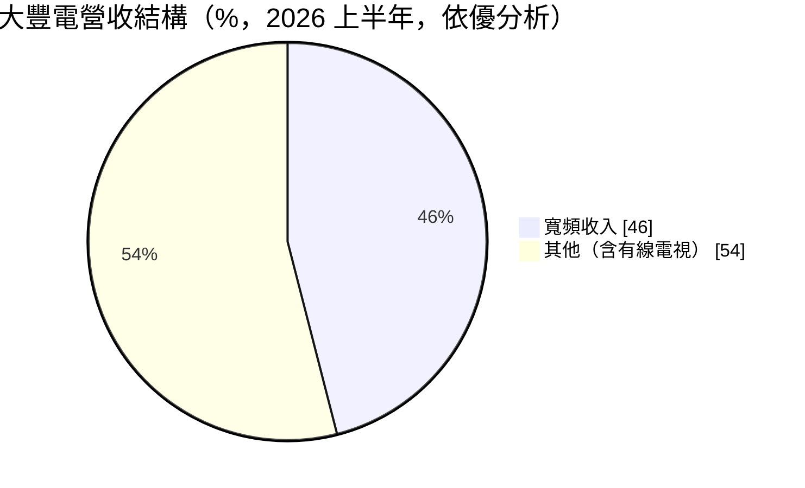
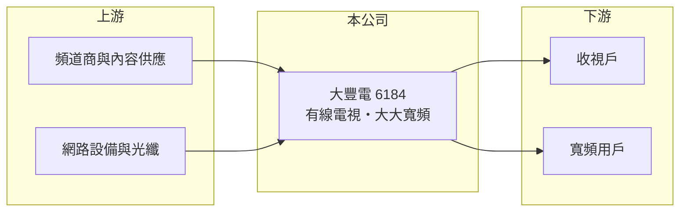

# 6184 大豐電

> 上市｜[[產業索引-其他業|其他業]]｜上市（櫃）日期 2005/02/15

# 第一章：企業模式與商業藍圖

> [!info] 撰寫說明
> 精簡版，由 Claude 依公開資料整理，架構比照 [[2330台積電]]，資料截至 2026-10-07。來源：優分析 2026 年上半年財報報導。視訊收入比重與經營區域未在來源中查到。#待校對

大豐電是有線電視系統業者，旗下大大寬頻是主要成長動能。

- **核心業務：** 大豐電經營[[有線電視]]系統，並透過子公司大大寬頻提供[[寬頻]]上網服務。
- **營收結構：** 依優分析報導，寬頻收入約占整體營收 46%，其餘主要為有線電視收視等收入（推估）。

- **營運據點：** 經營區域本次未查到；大大寬頻 2026 年上半年用戶數約 18.84 萬戶。
- **長期方向：** 大大寬頻規劃在 2026 年第三季遞件申請上市，寬頻業務將持續取代傳統收視成為主力。

# 第二章：護城河深度與競爭優勢

大豐電的護城河來自有線電視的區域經營權與既有網路。

- **競爭優勢：** 有線電視採分區經營，既有纜線網路建置成本高，新進者不易進入；毛利率超過五成。
- **主要對手：** 同業 [[6464台數科]]、凱擘、中嘉，以及中華電信 MOD 與各家行動網路業者。
- **觀察重點：** 大大寬頻上市進度與用戶數成長、有線電視收視戶流失速度。

# 第三章：財務體質與盈利規模

資料日期：2026-10-07，以下數字是撰寫當時的快照；最新月營收、毛利率、累計 EPS 由自動排程寫在本筆記的屬性欄位（月營收、毛利率、累計EPS 等）。#待校對

大豐電營收持平、獲利率高，但 2026 年上半年稅後純益較去年減少。

- **營收規模：** 2026 年上半年營收 10.97 億元，年增 1.76%；第二季營收 5.47 億元。
- **獲利：** 上半年[[毛利率]] 53.87%、營益率 30.17%，稅後純益 2.3 億元（年減 12.4%），EPS 1.51 元；第二季毛利率 53.56%、營益率 28.15%，EPS 0.79 元。
- **財務特色：** 收視費與寬頻月租屬經常性收入，現金流穩定（推估）。

# 第四章：總體風險與地緣政治

大豐電的風險主要是收視戶流失與寬頻競爭。

- **產業週期：** 有線電視受串流影音（[[OTT]]）衝擊，收視戶長期下滑；寬頻需求則持續成長。
- **營運風險：** 寬頻市場與電信業者價格競爭激烈，可能壓縮毛利；網路升級需要持續資本支出。
- **其他風險：** NCC 費率與經營區法規、頻道授權費上漲。

# 專有名詞解析

## 應用

- **[[有線電視]]**：透過纜線傳送電視頻道的付費收視服務，在台灣採分區經營。
- **[[寬頻]]**：高速網路上網服務，有線電視業者多以同軸電纜或光纖提供。

## 金融

- **[[毛利率]]**：營業毛利占營收的比率，反映產品售價扣除直接成本後的獲利空間。

## 產業

- **[[OTT]]**：透過網際網路直接提供影音或通訊服務的業者，例如串流平台與通訊軟體，會替代傳統電視與語音。

# 核心供應鏈

- 上游：頻道商、網路設備與光纖供應商（推估）
- 下游／客戶：經營區內的家庭收視戶與寬頻用戶
- 同業：[[6464台數科]]、凱擘、中嘉、中華電信 MOD

## 最新新聞
<!-- news:start -->
<!-- news:end -->

## 相關連結
- [公開資訊觀測站](https://mopsov.twse.com.tw/mops/web/t05st03?step=1&firstin=1&co_id=6184)
- [Goodinfo](https://goodinfo.tw/tw/StockDetail.asp?STOCK_ID=6184)
- [Yahoo 股市](https://tw.stock.yahoo.com/quote/6184)
- [鉅亨網新聞](https://www.cnyes.com/twstock/6184/news)
