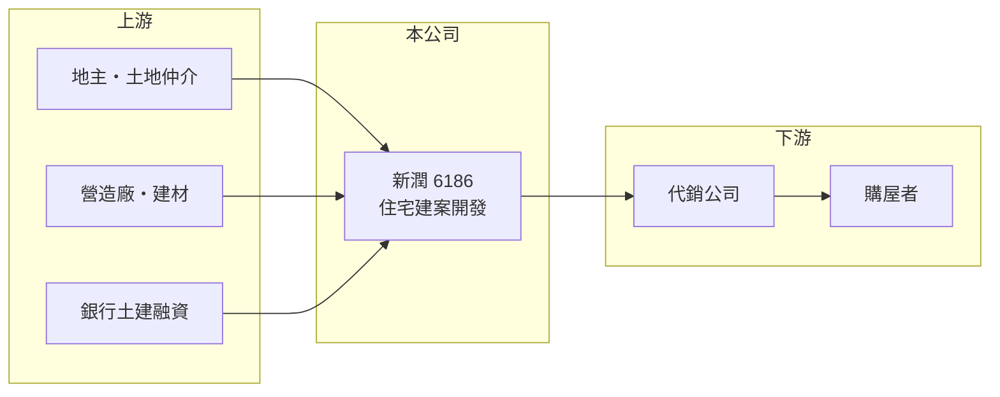

# 6186 新潤

> 上櫃｜[[產業索引-建材營造業|建材營造業]]｜上市（櫃）日期 2002/08/02

# 第一章：企業模式與商業藍圖

> [!info] 撰寫說明
> 精簡版，由 Claude 依公開資料整理，架構比照 [[2330台積電]]，資料截至 2026-10-08。來源：櫃買中心開放資料快照（基本資料、2026 年第二季資產負債與損益、每月營收）、MoneyDJ 理財網財務比率年表（2021 至 2025 年）與個股基本資料（2025 年營收比重、歷年股利、股本）、財經媒體報導標題。公開資料有限，個別建案名稱、銷售金額與土地庫存未查得；年度營收由 2025 年每股營業額乘以櫃買中心股本後依成長率回推，屬推算。櫃買中心資料的實收資本額為 19.49 億元，MoneyDJ 顯示 22.69 億元，差異可能來自現金增資，待校對。#待校對

新潤興業成立於 1998 年 3 月，2002 年 8 月在櫃買中心上櫃，是近幾年成長最快的中型建商之一，營收從 2022 年約 25 億元擴大到 2024 至 2025 年的 90 億元以上（推算）。

- **核心業務：** 新潤購地、規劃興建住宅建案並銷售。建案以[[預售屋]]方式先銷售，等[[建案交屋]]才認列營收，因此營收集中在交屋年度；新潤近年進入大量完工交屋的階段，營收與獲利因而大幅成長。
- **營收結構：** 依 MoneyDJ 的分類，2025 年營建占 100%，獲利完全來自房地銷售。
- **營運據點：** 公司登記於台北市松山區民生東路，董事長為郭長庚；推案以北台灣為主（推估，依公司地址與報導），具體建案名單本次未查得。
- **長期方向：** 新潤的 ROE 從 2022 年的 11% 提高到 2025 年的 33.85%，每股淨值從 20.54 元增加到 26.31 元，同時負債比率從 83.9% 降到 69.8%。這代表公司把交屋帶來的獲利用來強化資本，並可能透過現金增資擴大股本，以支應更大規模的推案。

# 第二章：護城河深度與競爭優勢

建設業護城河很淺，新潤的優勢在於推案節奏與產品去化能力，近年的高 ROE 也有部分來自財務槓桿。

- **競爭優勢：** 能在數年內把營收擴大三倍以上，代表新潤在土地取得、產品規劃與銷售上掌握了一段順風期；2025 年[[毛利率]] 28.42%、營業利益率 19.47%，均為五年來最高，顯示近年交屋的建案取得成本與售價條件良好。
- **主要對手：** 北台灣的上市櫃建商包括 [[2542興富發]]、[[2548華固]]、[[5534長虹]]、[[6177達麗]] 等（推估名單），以及眾多未上市建商。
- **觀察重點：** 觀察[[已售未入帳]]金額與新推案的銷售率，可以判斷這波完工高峰之後是否還有接續的建案；2026 年 1 至 8 月營收較前一年同期減少約 57%，下一批交屋時點是關鍵。現金增資後股本擴大，未來 EPS 會被攤薄，也需納入評估。

# 第三章：財務體質與盈利規模

資料日期：2026-10-08，表格是撰寫當時的快照；最新月營收、毛利率、累計 EPS 由自動排程寫在本筆記的屬性欄位（月營收、毛利率、累計EPS 等）。#待校對

新潤的營收與獲利在 2024 至 2025 年明顯躍升，2025 年 EPS 7.81 元、ROE 33.85%，都是五年來最高。

| 年度 | 營收（推算） | [[毛利率]] | [[營業利益率]] | EPS（元） | [[ROE]] |
|---|---|---|---|---|---|
| 2021 | 約 39.8 億 | 20.65% | 14.02% | 3.08 | 15.32% |
| 2022 | 約 24.9 億 | 28.23% | 16.37% | 2.24 | 10.99% |
| 2023 | 約 36.6 億 | 24.75% | 15.07% | 2.97 | 14.20% |
| 2024 | 約 91.2 億 | 23.70% | 12.97% | 5.63 | 27.50% |
| 2025 | 約 94.5 億 | 28.42% | 19.47% | 7.81 | 33.85% |

- **長期指標：** 近 5 年平均 ROE 約 20.4%（推算）；2021 至 2025 年營收年複合成長率約 24%（推算），但這是交屋時點造成的，不代表每年都能維持。現金股利（MoneyDJ 列示 108 至 114 年度）依序為 3.00、1.25、3.00、2.20、2.00、1.52、5.01 元，每年配發，2025 年度[[配息率]]約 64%。
- **[[ROIC]] 與 [[WACC]]：** 2025 年營業利益約 18.4 億元（營收約 94.5 億元 × 營業利益率 19.47%），稅後約 14.7 億元；投入資本以 2026 年第二季股東權益 45.9 億元加上總負債 115.8 億元的一半（約 57.9 億元，假設一半為有息負債）計，約 103.8 億元，ROIC 約 14.2%（推算）。WACC 約 4.8%（推算：無風險利率 1.75%、市場風險溢酬 6%、β 取建設股常見值 1.0，股東權益成本約 7.75%；稅前負債成本 3%、稅率 20%；負債權重約 56%）。ROIC 明顯高於 WACC，代表近年在創造價值；但 2021 至 2023 年獲利較低時，利差也較小。
- **營建業指標與財務特色：** 2026 年第二季底資產約 161.7 億元，其中流動資產（主要是土地與在建房地）約 148.2 億元，負債約 115.8 億元。2026 年上半年營收 38.6 億元、毛利率約 22.9%、EPS 2.25 元。

# 第四章：總體風險與地緣政治

新潤的風險來自房市週期、完工高峰後的接續，以及高槓桿下的利率與政策變化。

- **產業週期：** 房地產週期長，推案時的房價與交屋時的市場可能不同；2024 至 2025 年的高獲利來自前幾年推出的建案，若之後推案量或銷售率下降，獲利會回到較低水準。
- **營運風險：** 負債比率雖已降到 70% 左右，仍屬高槓桿；銷售放緩時，土地與在建案存貨的利息負擔會增加。營造成本上升與工期延誤也會壓縮毛利，推案集中在北台灣（推估）則缺乏區域分散。
- **其他風險：** 央行[[信用管制]]、囤房稅與預售屋轉售限制等政策，會影響買方需求與建商融資；現金增資帶來的股本擴大，也會稀釋每股獲利。

# 專有名詞解析

## 金融

- **[[信用管制]]**：央行限制購屋與建商貸款成數的政策，會影響房市成交與建商資金。
- **[[配息率]]**：現金股利占每股盈餘的比率，用來衡量公司把多少獲利發給股東。
- **[[ROIC]]**：投入資本報酬率，稅後營業利益除以股東權益加有息負債，衡量本業運用資本的效率。

## 產業

- **[[預售屋]]**：房屋在興建完成前就先銷售，買方分期繳款，建商可藉此降低資金與銷售風險。
- **[[建案交屋]]**：建商在房屋完工並交付買方時才認列營收，因此營建公司的營收常集中在交屋年度。
- **[[已售未入帳]]**：已經賣出、但尚未完工交屋而未認列營收的建案金額，是建商未來營收的主要能見度指標。

# 核心供應鏈

- 上游：地主與土地仲介、營造廠、建材供應商與提供土建融資的銀行（名稱未查得）。
- 下游／客戶：代銷公司與購屋者。
- 同業：[[2542興富發]]、[[2548華固]]、[[5534長虹]]、[[6177達麗]]（推估名單）。

## 最新新聞
<!-- news:start -->
<!-- news:end -->

## 相關連結
- [公開資訊觀測站](https://mopsov.twse.com.tw/mops/web/t05st03?step=1&firstin=1&co_id=6186)
- [Goodinfo](https://goodinfo.tw/tw/StockDetail.asp?STOCK_ID=6186)
- [Yahoo 股市](https://tw.stock.yahoo.com/quote/6186)
- [鉅亨網新聞](https://www.cnyes.com/twstock/6186/news)
