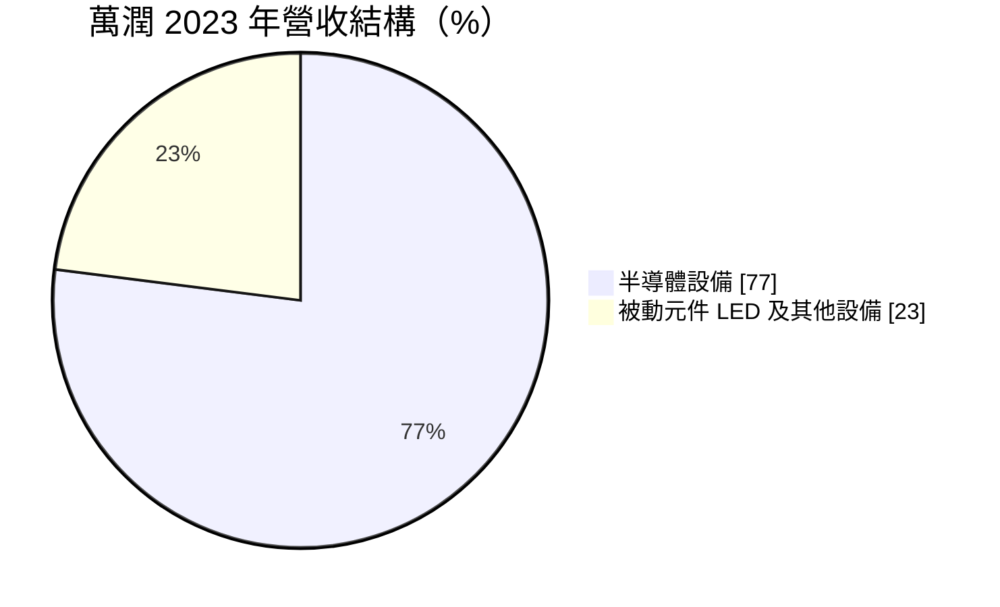
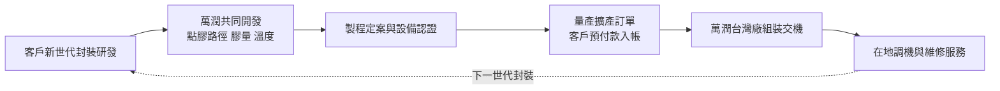
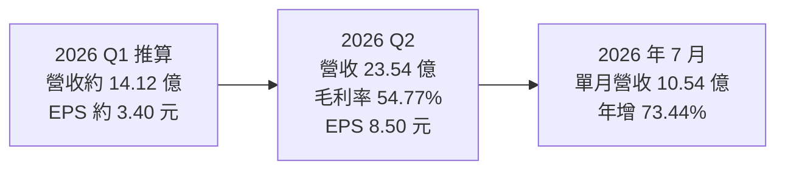
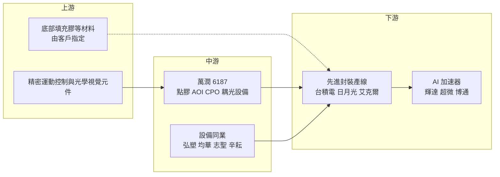

# 6187 萬潤

> 上櫃｜[[產業索引-半導體業|半導體業]]｜上市（櫃）日期 2002/09/27

# 第一章：企業模式與商業藍圖

> [!info] 撰寫說明
> 本文由 Claude 依公開資料整理，架構比照 [[2330台積電]] 的四章研究，資料截至 2026-10-07。財務數字來源：旺得富（工商時報）2026 年 3 月與 8 月報導、poorstock 法說會摘要（2026 年上半年）、理財周刊、聯合新聞網外資報告報導、優分析；產業描述為整理性內容，尚未逐條比對原始文件。#待校對

在評估單一個股的長期投資價值時，首要步驟是拆解企業的底層獲利邏輯。本章針對萬潤科技（股票代號：6187，以下簡稱萬潤）的商業模式進行定性分析，說明一家被動元件與 LED 設備廠，如何轉型為 [[CoWoS]] 先進封裝的關鍵在地設備供應商。

## 一、核心定位：CoWoS 先進封裝的點膠與檢測設備商

萬潤是台灣上櫃的自動化設備廠，早期以被動元件與 LED 製程設備起家，產品包括被動元件的切割機、繞線機、測試分選設備，以及植球機、自動點膠機與自動光學檢測（[[AOI]]）設備。隨著台灣[[先進封裝]]產能快速擴張，萬潤把點膠與檢測技術延伸到晶圓級封裝，成為 CoWoS 製程中的關鍵在地設備商。

萬潤的設備主要用在先進封裝的「點膠、貼合與檢測」環節：在晶片與中介層、載板之間填入底部填充膠（[[Underfill]]），貼合散熱蓋（lid），再以 AOI 檢查缺陷。這些步驟看似不起眼，卻直接影響 AI 晶片封裝的[[良率]]與可靠度。這個定位有兩個商業意義：

* **跟著最大客戶的擴產節奏成長：** 依旺得富報導，萬潤的客戶群為台灣與美國的先進晶片製造商，市場普遍認為主要客戶是 [[2330台積電]] 的 CoWoS 產線（推估）。客戶每擴一條線，萬潤就有對應的設備訂單。
* **以製程知識取代規模：** 萬潤規模遠小於國際設備大廠，靠的是與客戶共同開發、在地即時服務。

## 二、終端應用板塊：半導體設備已成主力

依優分析整理，2023 年半導體設備占營收比重已達 77%。此後隨 AI 晶片封裝需求增加，半導體比重持續提高，但最新年度比重本次未查得，下圖為 2023 年口徑：

* **先進封裝點膠設備：** CoWoS 的底部填充與封膠點膠是萬潤的主力產品，也延伸到 [[SoIC]] 與 CoPoS（面板級 CoWoS）等新世代封裝。
* **AOI 自動光學檢測設備：** 用於先進封裝各階段的外觀與缺陷檢查。
* **矽光子與 [[CPO]] 設備：** 包括光纖陣列單元（FAU）與光引擎耦光設備。理財周刊報導指出，CPO 相關設備預計 2026 年第四季開始交機，2027 年第一季進一步放量。
* **被動元件與 LED 設備：** 起家業務，比重已大幅下降，但仍為部分營收來源。

## 三、資本轉化邏輯：共同開發換取量產訂單

* **研發驅動：** 萬潤的研發人才占比約六成，擁有超過 300 項專利，研發聚焦於 2.5D／3D 封裝、扇出型面板級封裝（[[FOPLP]]）與 CPO 光電整合。
* **合約負債是領先指標：** 2026 年第二季合約負債由 7,400 萬元增至 2.99 億元、季增 304%，代表客戶預付款增加，後續出貨能見度提高。
* **擴充產能：** 研發與生產主要在台灣。2026 年上半年購置不動產、廠房及設備的資本支出約 5.52 億元，為前一年同期的 2.3 倍，為 CoWoS、面板級封裝與 CPO 訂單預作準備。

## 四、企業長期藍圖：從 CoWoS 概念股走向 AI 光通訊設備商

* **跟著台積電先進封裝路線走：** 從 CoWoS-S、CoWoS-L 到 SoIC、CoPoS，萬潤希望在每一代封裝技術都保住點膠與檢測設備的位置。
* **面板級封裝的設備升級：** 外資報告指出，萬潤短期動能仍來自晶圓級（WoS）封裝，中期將轉向面板級封裝，帶來另一波擴產需求與單機價值提升。
* **CPO 第二成長曲線：** 外資預估 CPO 相關營收在 2027 年可達總營收約 30%，之後比重持續提高，屬第三方預估。

# 第二章：護城河深度與競爭優勢

在長期價值投資中，「護城河」指企業抵禦競爭、維持超額利潤的保護機制。本章分析萬潤的護城河構成、國內外競爭對手，以及單一大客戶結構下優勢能守住多少。

## 一、萬潤護城河的核心組成要素

萬潤的護城河屬於「中等寬度但集中」，由四個要素組成：

* **1. 與客戶共同開發：** 先進封裝製程在研發階段就需要設備商參與調整，萬潤與主要客戶一起開發新世代封裝，取得早期參與優勢。一旦製程定案，量產階段更換設備商的風險很高。
* **2. 在地服務速度：** 台灣先進封裝產能擴張速度快，在地設備商能提供即時調機與維修，相比日、美設備商有交期與服務上的優勢。
* **3. 專利與製程知識：** 超過 300 項專利與長期累積的精密點膠經驗，讓新進者難以在短期內達到相同的穩定度。
* **4. 高毛利證明附加價值：** 2025 年[[毛利率]] 54.29%、[[營業利益率]] 30.02%，在設備廠中屬於高水準。

## 二、全球主要競爭對手格局

| 對手 | 定位 | 對萬潤的威脅 |
|---|---|---|
| Nordson（Asymtek）、武藏（Musashi） | 國際點膠設備大廠，品牌與規模大 | 客戶導入第二供應商時的首選 |
| [[3131弘塑]]、[[6640均華]]、[[3583辛耘]]、[[2467志聖]] | 台灣先進封裝設備同業，製程站點不同 | 爭取同一客戶的設備預算 |
| [[KLAC科磊]] 與台灣 AOI 廠 | 檢測設備 | 在 AOI 站點直接競爭 |
| 國際光通訊設備商 | CPO 耦光設備 | 競爭格局尚未定型 |

## 三、優勢轉化：哪些市場守得住、哪些守不住

* **守得住：** 在台積電 CoWoS 點膠站點已建立的地位，以及新世代封裝的共同開發關係，短期內不易被取代。
* **守不住：** 客戶高度集中，若主要客戶導入第二供應商以分散風險，萬潤的市占與議價能力會受影響。2025 年營收年減 3.04%，也顯示即使在 AI 熱潮中，設備訂單仍會隨客戶擴產節奏波動。
* **觀察重點：** CoPoS 與面板級封裝能否延續點膠站點的地位、CPO 設備第四季交機與 2027 年放量是否如期，以及合約負債是否持續增加。

# 第三章：財務體質與盈利規模

資料日期：2026-10-07。數字取自旺得富（工商時報）與 poorstock 法說會摘要，表格是撰寫當時的快照；最新月營收、毛利率、累計 EPS 由自動排程寫在本筆記的屬性欄位（月營收、毛利率、累計EPS 等）。#待校對

財務報表是檢驗護城河是否真實存在的最終標準。本章用三率、ROE、現金流與資本報酬，檢視萬潤在 AI 擴產潮中的獲利品質。

## 一、獲利能力的基石：三率

| 項目 | 2025 全年 | 2026 Q1（推算） | 2026 Q2 | 2026 上半年 |
|---|---|---|---|---|
| 營收（新台幣） | 53.66 億 | 約 14.12 億 | 23.54 億 | 37.66 億 |
| [[毛利率]] | 54.29% | 約 51.8% | 54.77% | 53.65% |
| [[營業利益率]] | 30.02% | 未查得 | 33.27% | 29.5% |
| EPS（元） | 15.46 | 約 3.40 | 8.50 | 11.90 |

* 2026 年第一季數字由上半年減去第二季推算而來，僅供參考。
* **毛利率：** 長期維持五成以上，反映設備的技術附加價值；第一季較低推估與產品組合有關。
* **營業利益率：** 2026 年第二季 33.27% 為歷史次高。上半年營業費用率約 24.1%，研發費用 4.57 億元、年增 20.6%。
* **成長：** 2025 年營收年減 3.04%，但稅後淨利 14.85 億元、年增 13.33%，EPS 15.46 元創歷史新高。2026 年第二季營收季增 66.82%、年增 54.54%，稅後淨利 8.26 億元。6 月單月營收 10.12 億元創新高，7 月 10.54 億元，1 至 7 月累計 48.2 億元、年增 42.72%。
* **外資預估：** 外資報告預估 2026 至 2028 年 EPS 分別為 29.2、51.4、66.7 元，屬第三方預估，非公司財測。

## 二、[[ROE]]：資本效率

萬潤屬於輕資產的設備商，主要資本是研發人力、存貨與廠房。依旺得富報導，2025 年度擬配發股利約 11.78 元，配發率約 76.25%。在高 EPS 與高配發下，股東權益不會快速膨脹，ROE 維持在高水準（推估，精確數字未查得）。

## 三、資本支出與自由現金流

* **[[CapEx]]：** 2026 年上半年約 5.52 億元，為前一年同期的 2.3 倍，主要用於擴充產能與營運能力。
* **[[自由現金流]]：** 設備業需要提前備料，存貨與合約負債會隨訂單大幅波動；第二季合約負債增加，代表客戶預付款入帳，有助於營運現金流。資本支出規模相對營收不大，推估自由現金流足以支應高配息。

## 四、[[ROIC]] 與 [[WACC]]：價值創造利差

萬潤營業利益率三成上下、投入資本以存貨與廠房為主，推估 ROIC 明顯高於資金成本，屬於價值創造型企業（具體數值未查得）。風險在於設備業的營收波動：擴產停頓的年份，營收與 ROIC 可能同步下滑，2025 年營收年減就是例子。

# 第四章：總體風險與地緣政治

任何企業都無法脫離宏觀環境獨立存在。本章分析萬潤未來必須面對的地緣政治、AI 資本支出週期、營運與技術風險。

## 一、地緣政治風險

* **台灣先進封裝集中：** 萬潤的成長與台積電在台灣的 CoWoS 擴產高度相關；若主要客戶把先進封裝產能移往美國或其他地區，萬潤需要跟著建立海外服務據點，成本會上升。
* **美國關稅與出口管制：** 設備出口到美國客戶可能面臨關稅，出口到中國則受美國對先進封裝相關技術的管制影響。
* **兩岸風險：** 營運與客戶均集中在台灣，面臨與其他台灣半導體業相同的地緣政治風險。

## 二、產業週期與市場結構風險

* **AI 資本支出週期：** 萬潤的訂單取決於雲端業者對 AI 加速器的需求，以及台積電的 CoWoS 擴產計畫；若 AI 投資放緩，設備訂單會比晶片需求下滑得更快，這是典型的[[長鞭效應]]。
* **設備業的高波動：** 設備商營收隨客戶擴產節奏劇烈波動，2025 年營收年減、2026 年又大幅成長。
* **匯率：** 對美國客戶的出口以外幣計價，新台幣升值會壓縮營收與毛利。

## 三、營運環境的隱性風險

* **客戶集中：** 營收高度依賴單一大客戶的先進封裝擴產，議價能力受限。
* **擴產與交期：** 訂單快速增加時，零件、組裝人力與工程師可能不足，影響交期與品質。
* **存貨風險：** 為搶交期提前備料，若客戶延後拉貨，存貨跌價風險上升。

## 四、科技演進風險

先進封裝技術變化快，從晶圓級轉向面板級、從有機載板轉向玻璃基板，都可能改變點膠與檢測的需求。若新世代封裝改採不需要底部填充的接合方式（例如 [[Hybrid Bonding]]），點膠設備需求可能減少。CPO 技術標準仍在演進，萬潤的耦光設備能否成為主流方案，仍有不確定性。

# 專有名詞解析

## 半導體

- **[[CoWoS]]**：台積電的 2.5D 先進封裝技術，把運算晶片與 HBM 並排放在中介層上，是 AI 加速器的主流封裝。
- **[[先進封裝]]**：把多顆晶片以中介層、混合鍵合等方式高密度整合的封裝技術，例如 CoWoS、SoIC。
- **[[SoIC]]**：台積電的 3D 晶片堆疊技術，以混合鍵合把晶片上下直接接合，連接密度高於 CoWoS。
- **[[FOPLP]]**：扇出型面板級封裝，用方形大面板取代圓形晶圓做封裝，可提高面積利用率、降低單位成本。
- **[[Underfill]]**：底部填充膠，填入晶片與基板之間的縫隙，分散熱應力、保護接點，是覆晶與先進封裝必要製程。
- **[[AOI]]**：自動光學檢測，用高解析相機與影像演算法自動找出晶圓或封裝的外觀缺陷。
- **[[CPO]]**：共同封裝光學，把光引擎與交換器或運算晶片封裝在一起，縮短電訊號路徑以降低功耗。
- **[[Hybrid Bonding]]**：混合鍵合，以銅對銅直接接合兩片晶圓或晶片，不需凸塊，可大幅提高連接密度。
- **[[良率]]**：合格產品占總產出的比例，先進封裝一顆失敗就會報廢整組昂貴晶片，因此良率格外關鍵。

## 金融

- **[[自由現金流]]**：營業活動現金流減去資本支出，代表企業可自由用於配息、還債或併購的現金。
- **[[長鞭效應]]**：終端需求的小幅變動，沿供應鏈往上游傳遞時被逐級放大，造成上游庫存與訂單劇烈波動。

# 核心供應鏈

## 1. 上游：零組件與材料
- 精密運動控制、光學與視覺元件：國內外零組件供應商（具體名單未查得）
- 點膠材料：底部填充膠等由客戶指定的材料供應商

## 2. 中游：萬潤本身與先進封裝設備同業
- 濕製程設備：[[3131弘塑]]
- 黏晶與挑揀設備：[[6640均華]]
- 壓膜、烘烤與其他製程設備：[[2467志聖]]、[[3583辛耘]]

## 3. 下游：先進封裝客戶
- 晶圓代工與先進封裝：[[2330台積電]]（推估）
- 封測廠：[[3711日月光投控]]、[[AMKR艾克爾]]（推估）

## 4. 終端需求
- AI 加速器：[[NVDA輝達]]、[[AMD超微]]、[[AVGO博通]]

延伸閱讀：[[台積電供應鏈]]

## 供應鏈關係
- 供應給 [[2330台積電]]：點膠機與自動化光學檢測（台積電供應鏈 › 下游：先進封裝大聯盟 (CoWoS 設備與載板) › CoWoS 核心設備群）

## 最新新聞
<!-- news:start（自動產生，請勿手動編輯此範圍） -->
- 2026-10-08 📰 媒體 10:22｜《半導體》萬潤再登新天價 法人擴大買超｜[富聯網](https://news.google.com/rss/articles/CBMiiAFBVV95cUxPTkxYNjBWLVlSLWI2OWh6QWQ5bmdLeGVXSUFFWG5CQTluM3dianc4bTNhdGt0SU1JSkdQVk9xRkxuWHEyWklHY3BrWDBlSTBEYlB4LUtheTZQVU5SOFJTUTZJMHhSR2Z1ME1ldTBOcTlDbE9OVWo3M1Y5UmdkcDdfNjB1dEIxMHVt?oc=5)
- 2026-10-07 📰 媒體 16:01｜萬潤明年EPS年增率逾50%｜[台灣好新聞](https://news.google.com/rss/articles/CBMiuwFBVV95cUxQOEVWSkxZZWpvU0RwWGxuMldmV295cFVjZlg1VzNxSjNsZ2x2dUx2QzdONXJNclJlckotbWV4eld2YWVPNWtWSUozRk45VmFwTTBOeGtTTHluQlpWYUxZNjFFS2VaTmZTTHF2S3hQMnB3Ylg0RkJCNTlqTHNBU1FBWDlQMV80dm5EN1hKSXhHZjV5Y3BsZE5IOEwtVEUwUm5FMXpWNHRVVVNycHBiMl9UN2Fwak5kYTV4MHk0?oc=5)
- 2026-10-07 📰 媒體 07:55｜《半導體》注意股：萬潤 近5日漲17.18%｜[富聯網](https://news.google.com/rss/articles/CBMiiAFBVV95cUxPQmVWbDlqX2gxS1NKYkdHa1VsUC1fV3VnelZxd2cwYzhTNFNVU0kxZlFVa05rUVVfMVkyTmREaTVCbjc4c25rcGQxcl8xR29CU1pnQ1dQRjc0bjJhelR6S29ISWtmbGw2RWUzUGpwVUdtMFRXS0tka1hRQ21ldGU0WTRvLVJOTF9r?oc=5)
- 2026-10-07 📰 媒體 02:24｜萬潤可轉債守穩139元意義何在？｜[CMoney](https://news.google.com/rss/articles/CBMie0FVX3lxTE5DMEdFNElKVTVOQzV5WGtOQUpZUGE0enNSUWk4OWtQbkFTUXlKQ21PSlFPMlZLSlpNOWd1Y0ZQT0dmbEJUSGRZOG1mVW1PZzBCWmphVmlpMjZSc1hGMG5Td3VHQmJlel95WDRqZDN5NWxwdk85NkxOLW5kWQ?oc=5)
- 2026-10-05 📰 媒體 16:30｜萬潤(6187-TW)漲停！CoWoS越缺、CoPoS商機越大，為何設備商最先受惠？｜[鉅亨網](https://news.cnyes.com/news/id/6621754)

完整紀錄：[[6187萬潤 新聞]]
<!-- news:end -->

## 相關連結
- [公開資訊觀測站](https://mopsov.twse.com.tw/mops/web/t05st03?step=1&firstin=1&co_id=6187)
- [Goodinfo](https://goodinfo.tw/tw/StockDetail.asp?STOCK_ID=6187)
- [Yahoo 股市](https://tw.stock.yahoo.com/quote/6187)
- [鉅亨網新聞](https://www.cnyes.com/twstock/6187/news)
