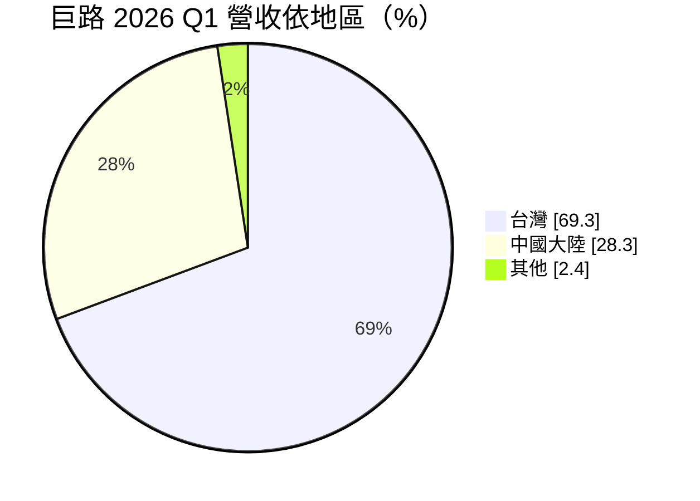
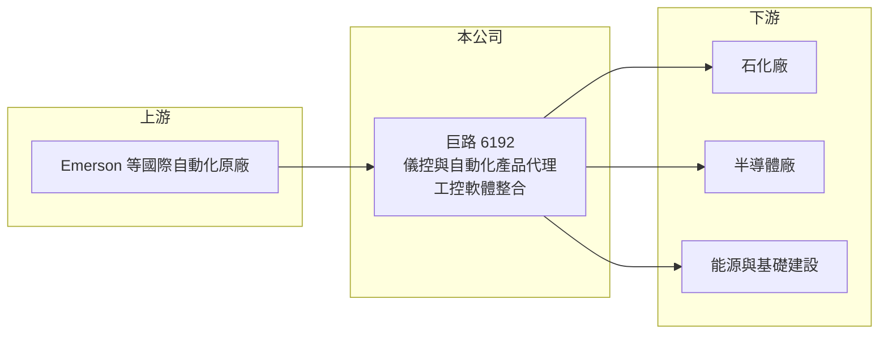

# 6192 巨路

> 上市｜[[產業索引-其他電子業|其他電子業]]｜上市（櫃）日期 2004/09/27

# 第一章：企業模式與商業藍圖

> [!info] 撰寫說明
> 精簡版，由 Claude 依公開資料整理，架構比照 [[2330台積電]]，資料截至 2026-10-07。來源：旺得富（工商時報）2026 年 5 月巨路首季財報報導、winvest 營收快訊。代理品牌細節為整理性內容。#待校對

巨路是[[工業自動化]]控制產品與解決方案的[[代理商]]，客戶以石化與半導體業為主。

- **核心業務：** 代理並整合工業自動化產品，包括 Emerson（艾默生）的儀表、閥門與工控軟體，提供企業客戶系統解決方案。
- **營收結構：** 2026 年第一季依地區台灣占 69.3%、中國大陸占 28.3%，其他地區約 2.4%（推算）。
- **營運據點：** 以台灣為主要市場，並在中國大陸設有營運據點（據點明細本次未查到）。
- **長期方向：** 聚焦高毛利產品線、工控軟體與 AI 相關應用，並爭取台灣能源與核電相關商機。

# 第二章：護城河深度與競爭優勢

巨路的競爭力在於國際原廠代理權與長期服務的工業客戶。

- **競爭優勢：** 石化與半導體廠的儀控設備需要長期維護與備品支援，代理商熟悉現場規格，客戶黏著度高。
- **主要對手：** 其他自動化與儀控產品代理商，如 [[8374羅昇]]，以及西門子、霍尼韋爾、橫河等原廠直營體系。
- **觀察重點：** 半導體客戶在美國、歐洲與亞洲的擴廠帶來的需求，以及 7 月營收年增 53.76% 後能否維持。

# 第三章：財務體質與盈利規模

資料日期：2026-10-07，以下數字是撰寫當時的快照；最新月營收、毛利率、累計 EPS 由自動排程寫在本筆記的屬性欄位（月營收、毛利率、累計EPS 等）。#待校對

巨路營收隨專案出貨波動，但獲利率穩定。

- **營收規模：** 2026 年第一季營收 17.97 億元，年減 0.6%；7 月營收 9.17 億元、年增 53.76%，8 月 6.39 億元、年增 12.99%。
- **獲利：** 2026 年第一季稅後淨利 2.52 億元，年減 10.2%，EPS 2.63 元；報導指出[[毛利率]]與[[營業利益率]]呈成長趨勢。
- **財務特色：** 月營收受大型專案出貨時點影響，單月波動大，宜以季或年累計觀察。

# 第四章：總體風險與地緣政治

巨路的風險來自石化景氣與中國市場。

- **產業週期：** 台灣與中國石化客戶需求放緩，會壓抑儀表與閥門的更新與擴建訂單。
- **營運風險：** 營收依賴少數國際原廠代理權，原廠策略調整或改為直營會影響業務（推估）。
- **其他風險：** 中國對基礎建設投資的宏觀調控，以及新台幣與人民幣匯率波動。

# 專有名詞解析

## 金融

- **[[毛利率]]**：毛利除以營收，反映產品或服務扣除直接成本後的獲利空間。

## 產業

- **[[工業自動化]]**：以控制器、感測器、儀表與軟體讓生產流程自動運作，降低人力並提高穩定性。
- **[[代理商]]**：取得國外原廠授權，在特定地區負責銷售、技術支援與售後服務的通路業者。

# 核心供應鏈

- 上游：Emerson（艾默生）等國際自動化與儀控原廠
- 下游／客戶：台灣與中國的石化廠、半導體廠、能源與基礎建設業主
- 同業：[[8374羅昇]] 等自動化產品代理商（推估）

## 最新新聞
<!-- news:start -->
<!-- news:end -->

## 相關連結
- [公開資訊觀測站](https://mopsov.twse.com.tw/mops/web/t05st03?step=1&firstin=1&co_id=6192)
- [Goodinfo](https://goodinfo.tw/tw/StockDetail.asp?STOCK_ID=6192)
- [Yahoo 股市](https://tw.stock.yahoo.com/quote/6192)
- [鉅亨網新聞](https://www.cnyes.com/twstock/6192/news)
