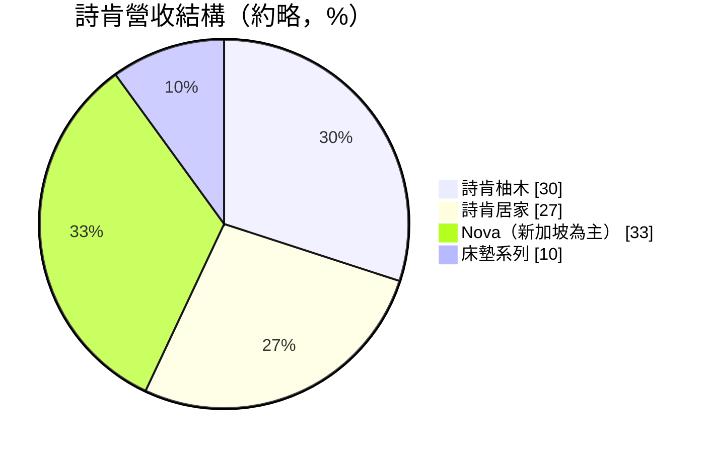
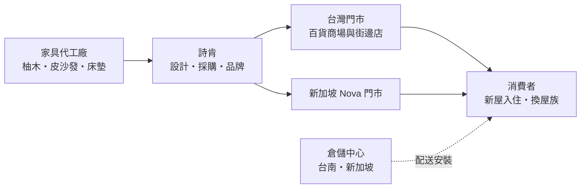
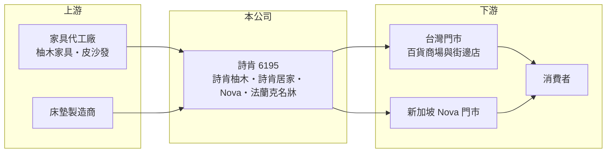

# 6195 詩肯

> 上櫃｜[[產業索引-居家生活|居家生活]]｜上市（櫃）日期 2002/10/21

# 第一章：企業模式與商業藍圖

> [!info] 撰寫說明
> 本文由 Claude 依公開資料整理，架構比照 [[2330台積電]] 的四章研究，資料截至 2026-10-08。財務數字來源：Goodinfo 年度經營績效頁、富果研究 2025 年 11 月法說會整理；品牌營收比重為法說會口頭約略數字，尚未逐條比對原始文件。#待校對

在評估單一個股的長期投資價值時，首要步驟是拆解企業的底層獲利邏輯。本章說明詩肯（股票代號：6195）如何以多品牌門市經營台灣與新加坡的家具零售，以及為何它的毛利率很高、淨利率卻很低。

## 一、核心定位：多品牌的家具零售商

- **核心業務：** 詩肯在台灣經營家具零售超過 30 年，旗下有北歐風實木的「詩肯柚木（Scanteak）」、現代風皮沙發的「詩肯居家（Scanliving）」、新加坡平價訂製家具品牌 Nova（2019 年併購），以及床墊系列，2025 年底再推出新品牌「法蘭克名牀」。公司的角色是設計、採購與零售，商品多由外部工廠生產，核心能力在品牌、門市與售後服務。
- **營收結構：** 依法說會約略數字，詩肯柚木約占 30%、詩肯居家約 27%、Nova 約三分之一、床墊約 9% 至 10%。詩肯居家比重從 2021 年的 21% 提高，柚木則從 2022 年的 34% 下降，代表消費者偏好正從實木轉向皮沙發與軟件家具。

- **營運據點：** 台灣有詩肯柚木約 71 家、詩肯居家獨立門市 12 家、Nova 4 家，新加坡有 Nova 12 家。台灣營收約 15 至 16 億元，以台灣家具市場約 1,000 億元計算，市占率約 1.5% 至 2%。

## 二、資本轉化邏輯：高毛利、高費用的門市生意

- **毛利與費用：** 詩肯的毛利率長期在 54% 至 57%，屬於品牌零售的水準，但門市租金、人事與廣告費用很重，營業利益率在 2021 年最好時約 12%，2025 年降到約 4%。家具零售的獲利取決於「單店營收能否撐住固定費用」，營收小幅下滑就會讓利潤大幅縮水，這就是[[營運槓桿]]。
- **通路轉型：** 商場通路營收比重從約 45% 提高到 54%，公司正把[[坪效]]差、停車不便的街邊店換成百貨與購物中心門市。台南倉儲中心與新加坡大型倉儲的投入，則是為了提升配送與庫存效率。

## 三、長期方向

- **長期方向：** 詩肯的策略是「通路往商場移、品牌往多元走、行銷往短影音轉」。新品牌法蘭克名牀若測試成功將加速展店；Nova 在台灣改以縮小店面、進駐賣場的模式擴點；行銷由 KOL 轉為每月約 100 支短影音。長期而言，公司能否在房市循環中守住單店營收，是獲利回升的關鍵。

# 第二章：護城河深度與競爭優勢

「護城河」指企業抵禦競爭、維持超額利潤的保護機制。本章分析詩肯在分散的家具市場中的位置。

## 一、護城河的核心組成

- **競爭優勢：** 第一是品牌辨識度，「詩肯柚木」在台灣經營數十年，柚木家具幾乎與品牌畫上等號，這種[[品牌溢價]]讓它能維持 55% 以上的毛利率。第二是全台門市網絡與售後服務，家具是高單價、低頻率購買，消費者重視實體體驗與保固，這是純電商難以取代的。第三是多品牌組合，覆蓋實木、皮沙發、訂製家具與床墊，可以服務不同風格與預算的客群。
- **主要對手：** 宜家家居（IKEA）以平價與規模主導大眾市場，[[2908特力]] 旗下特力屋與 HOLA 經營家居用品，另有大量獨立家具行、進口精品家具與電商品牌。床墊市場還有眾多專業品牌競爭。

## 二、優勢轉化：守得住／守不住／觀察重點

- **守得住：** 柚木與皮沙發等中高價位、重視品牌與服務的品類，毛利率多年穩定。
- **守不住：** 營業費用。租金與人事成本上升，加上營收連年小幅下滑約 2% 至 4%，營業利益率從 12% 降到 4%，品牌溢價沒有轉化為穩定的利潤。
- **觀察重點：** 商場通路轉型後的坪效、法蘭克名牀能否成為新的成長引擎，以及 Nova 費用率的改善能否持續。

# 第三章：財務體質與盈利規模

資料日期：2026-10-08。數字取自 Goodinfo 年度經營績效與富果研究法說會整理，表格是撰寫當時的快照；最新月營收、毛利率、累計 EPS 由自動排程寫在本筆記的屬性欄位（月營收、毛利率、累計EPS 等）。#待校對

財務報表是檢驗護城河是否真實存在的最終標準。本章用六年的數字檢視詩肯的毛利穩定與獲利下滑。

## 一、多年度經營績效

| 年度 | 營收（新台幣） | [[毛利率]] | [[營業利益率]] | EPS（元） | [[ROE]] |
|---|---|---|---|---|---|
| 2020 | 21.3 億 | 56.5% | 11.9% | 4.88 | 20.7% |
| 2021 | 23.9 億 | 57.1% | 12.0% | 5.54 | 21.3% |
| 2022 | 24.7 億 | 55.5% | 10.3% | 4.29 | 15.7% |
| 2023 | 23.6 億 | 54.2% | 6.10% | 2.06 | 7.66% |
| 2024 | 22.9 億 | 56.0% | 4.82% | 1.60 | 6.09% |
| 2025 | 22.1 億 | 56.2% | 4.03% | 0.99 | 3.78% |

- **營收規模：** 2020 至 2025 年營收年複合成長率約 0.7%（推算），2022 年達到高點後連續三年小幅下滑，與台灣房市交易量和疫情後居家消費退潮有關。
- **獲利：** 毛利率六年都在 54% 至 57%，但 EPS 從 2021 年的 5.54 元降到 2025 年的 0.99 元。毛利不變、獲利大減，說明問題出在費用端，而不是商品競爭力。2024 至 2025 年業外損益也轉為小幅虧損。
- **財務特色：** 2021 至 2025 年平均 ROE 約 10.9%（推算），但趨勢是逐年下降。公司歷年現金股利發放率在 80% 以上，Goodinfo 統計長期平均現金股利約 2.21 元。高配息加上倉儲投資，使現金減少、銀行借款增加。

## 二、[[ROIC]] 與 [[WACC]]

**ROIC 推算：** 2025 年營業利益約 0.89 億元（22.1 億 × 4.03%），稅後約 0.71 億元。股東權益約 12.8 億元（每股淨值 25.84 元 × 約 0.495 億股）。依 ROA 1.36% 推算總資產約 36 億元，負債中包含大量門市[[租賃負債]]與銀行借款，有息負債金額未查得。只以股東權益計算 ROIC 約 5.6%，納入有息負債後會更低（推算，上限約 5.6%）。2021 年同樣算法，稅後營業利益約 2.29 億元、股東權益約 13.3 億元，ROIC 約 17%（推算）。

**WACC 推算：** 假設台灣 10 年期公債 1.75%、市場風險溢酬 6%、β 取零售股常見值 0.7（推估），股東權益成本約 5.95%；負債成本 2.5%、稅後 2.0%，權益約占資本 75%（推估），WACC 約 5.0%（推算）。

**結論：** 詩肯在 2020 至 2022 年 ROIC 明顯高於 WACC，是創造價值的品牌零售商；2023 年後 ROIC 降到與資金成本相當甚至更低。高毛利證明品牌仍有價值，但能否重新創造經濟價值，取決於費用控制與單店營收的回升。

# 第四章：總體風險與地緣政治

任何企業都無法脫離宏觀環境獨立存在。本章分析詩肯長期面對的風險。

## 一、產業與結構風險

- **產業週期：** 家具需求跟著房市走，新屋交屋、換屋與裝修是主要的購買時機，而家具景氣通常落後房市約半年。台灣房市受信用管制等政策影響，2025 年前三季六都移轉棟數年減近 28%，家具業的需求因此承壓。
- **營運風險：** 門市租金與人事是固定成本，營收下滑時利潤縮水很快。新品牌開店時程受百貨談判影響，短影音行銷的成效也需要時間驗證。新加坡 Nova 的營運受當地房市與消費景氣左右。

## 二、其他風險

- **匯率與原物料：** 柚木與皮革等原料多仰賴進口，木材價格、運費與匯率變動會影響進貨成本。
- **競爭與消費習慣：** 平價家居品牌與電商持續擴張，年輕世代偏好較低單價、可快速更換的家具，對以實木與高價沙發為主的品牌是長期挑戰。

# 專有名詞解析

## 金融

- **[[營運槓桿]]**：固定成本占比高的企業，營收小幅變動就會造成利潤大幅變動的現象。
- **[[租賃負債]]**：承租場地或設備依會計準則認列的未來租金現值負債。
- **[[ROIC]]**：投入資本報酬率，稅後營業利益除以股東權益加有息負債，衡量本業運用資本的效率。

## 產業

- **[[坪效]]**：每坪賣場面積創造的營收，是衡量零售門市經營效率的重要指標。
- **[[品牌溢價]]**：消費者因信任品牌而願意支付高於同類商品的價格，反映在較高的毛利率上。

# 核心供應鏈

## 1. 上游：家具與床墊製造
- 柚木家具、皮沙發與床墊代工廠（具體供應商未查得）

## 2. 中游：詩肯
- 品牌：詩肯柚木、詩肯居家、Nova、法蘭克名牀

## 3. 下游與同業
- 通路：百貨與購物中心（如新光三越）、街邊門市
- 同業：宜家家居（IKEA）、[[2908特力]]（特力屋、HOLA）

## 最新新聞
<!-- news:start -->
<!-- news:end -->

## 相關連結
- [公開資訊觀測站](https://mopsov.twse.com.tw/mops/web/t05st03?step=1&firstin=1&co_id=6195)
- [Goodinfo](https://goodinfo.tw/tw/StockDetail.asp?STOCK_ID=6195)
- [Yahoo 股市](https://tw.stock.yahoo.com/quote/6195)
- [鉅亨網新聞](https://www.cnyes.com/twstock/6195/news)
