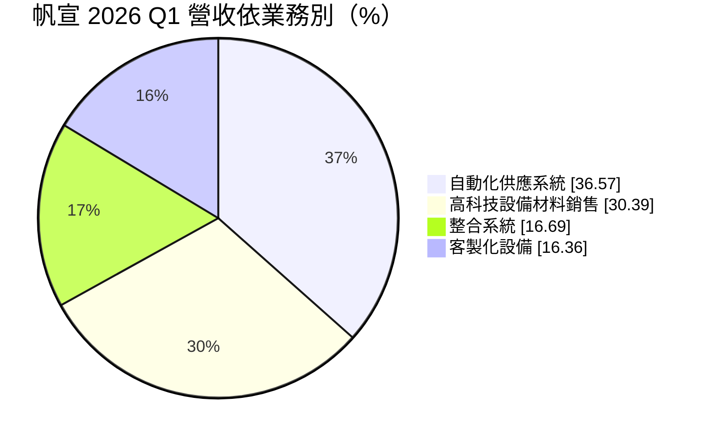
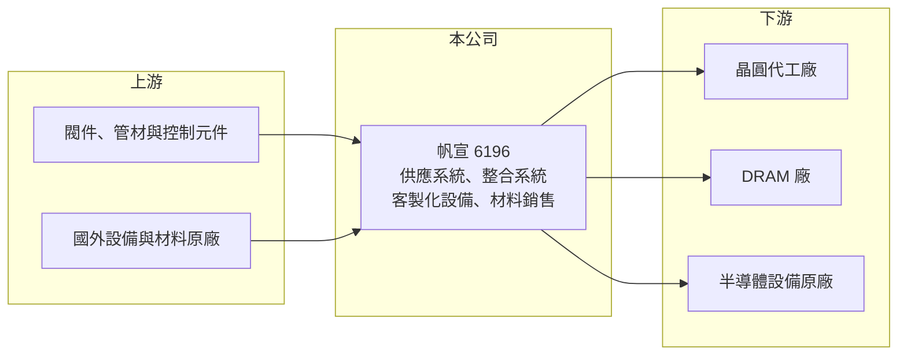

# 6196 帆宣

> 上市｜[[產業索引-其他電子業|其他電子業]]｜上市（櫃）日期 2004/05/24

# 第一章：企業模式與商業藍圖

> [!info] 撰寫說明
> 精簡版，由 Claude 依公開資料整理，架構比照 [[2330台積電]]，資料截至 2026-10-07。來源：富果研究帆宣 2026 年 5 月法說會整理、科技新報月營收報導。客戶名稱依法說描述推論。#待校對

帆宣是半導體廠的[[自動化供應系統]]與設備製造商，2026 年隨晶圓代工與 DRAM 擴產營收大幅成長。

- **核心業務：** 四大業務為自動化供應系統（氣體、化學品供應管路）、客製化設備研發製造、整合系統（[[廠務工程]]統包）與高科技設備材料銷售。
- **營收結構：** 2026 年第一季自動化供應系統 36.57%、高科技設備材料銷售 30.39%、整合系統 16.69%、客製化設備 16.36%。
- **營運據點：** 總部在台灣、台南有六座工廠，並在中國、日本、美國、新加坡、馬來西亞、荷蘭、德國德勒斯登與泰國設點。
- **長期方向：** 跟隨主要客戶海外建廠布局美、日、德據點，並以客製化設備承接半導體設備原廠的模組代工（推估）。

# 第二章：護城河深度與競爭優勢

帆宣的護城河在於與最大晶圓代工客戶的長期合作與跨國交付能力。

- **競爭優勢：** 法說指出主要客戶為台灣最大晶圓代工廠與 DRAM 製造廠，供應系統需要配合客戶製程規格與工期，合格供應商名單不易打入。
- **主要對手：** [[2404漢唐]]、[[5536聖暉]]、[[6139亞翔]]、[[6613朋億]] 等廠務與供應系統同業。
- **觀察重點：** [[在手訂單]]約 1,880 億元，供應商訂單出貨比達 2 倍、供應鏈吃緊，觀察產能消化與準時交付。

# 第三章：財務體質與盈利規模

資料日期：2026-10-07，以下數字是撰寫當時的快照；最新月營收、毛利率、累計 EPS 由自動排程寫在本筆記的屬性欄位（月營收、毛利率、累計EPS 等）。#待校對

帆宣營收規模大但毛利率偏低，獲利靠規模放大。

- **營收規模：** 2025 年全年營收 515.67 億元，年減 15.0%；2026 年前 7 月累計 430.27 億元，年增 47.4%，7 月單月 75.19 億元。
- **獲利：** 2026 年第一季營收 143.1 億元、淨利 11.1 億元、EPS 5.08 元；[[毛利率]]約 13.6%、[[營業利益率]]約 8.2%。
- **財務特色：** 設備材料銷售比重上升會拉低整體毛利率，但能放大營收；公司預期下半年優於上半年。

# 第四章：總體風險與地緣政治

帆宣的風險主要在客戶集中與工程交付。

- **產業週期：** 營收高度依賴晶圓代工與 DRAM 客戶的 [[CapEx]]，2025 年營收年減 15% 即反映擴產節奏放緩。
- **營運風險：** 客戶集中度高，加上供應鏈吃緊，若交期延誤或材料成本上升，毛利率可能受壓。
- **其他風險：** 美國、日本、德國等海外工地的人力成本與法規，以及美元、日圓匯率波動。

# 專有名詞解析

## 金融

- **[[在手訂單]]**：已簽約但尚未認列為營收的工程金額，代表未來數年的營收能見度。
- **[[CapEx]]**：資本支出，企業購買廠房、設備等長期資產的支出。

## 產業

- **[[自動化供應系統]]**：把製程用的特殊氣體與化學品，從儲槽經管路與控制設備穩定送到機台的系統。
- **[[廠務工程]]**：晶圓廠與工廠的水、氣、化學品供應及排放等基礎設施工程。

# 核心供應鏈

- 上游：閥件、管材、控制元件供應商，國外設備與材料原廠（推估）
- 下游／客戶：[[2330台積電]]（台灣最大晶圓代工廠）、DRAM 製造廠，客製化設備推估包括 [[ASML艾司摩爾]] 等設備原廠
- 同業：[[2404漢唐]]、[[5536聖暉]]、[[6139亞翔]]、[[6613朋億]]

## 供應鏈關係
- 供應給 [[2330台積電]]：廠務管線與設備代工（台積電供應鏈 › 上游：台灣建廠、無塵室與廠務系統）

## 最新新聞
<!-- news:start（自動產生，請勿手動編輯此範圍） -->
- 2026-10-07 📰 媒體 18:53｜營收速報 - 帆宣(6196)9月營收71.74億元年增率高達88.49％｜[鉅亨網](https://news.cnyes.com/news/id/6623869)
- 2026-10-07 📰 媒體 16:06｜帆宣營收／第3季219億元、年增91.1%創新高 前三季已超越去年全年｜[UDN](https://news.google.com/rss/articles/CBMickFVX3lxTE96YjRXMnRMTHhsam5Wd29MTjRadzA4aEZScmlxbjNxYUdFMXVrSmc4cjBJN2Y4V3RKRmdKSVNTY1hJRFpOdjFpYmRZV0Naam01T3ZEUFEteWRrdTJfeWZmd1d2Mjd3UHFvUDdMU0lENFpJd9IBVkFVX3lxTE9QbXNyX25UQ3cwSVVibFdJVXJNZ28tbmoxVWlfdGxOaWlqZ3I2ZTUwbDZ1MTI1TzAtTXRlY1JEQkJhZHNmcEpCWFdYcTdBU3BzdVQ0cjJR?oc=5)
- 2026-10-07 📰 媒體 15:17｜《業績-其他電》帆宣9月營收為71.74億元，年增88.49%｜[富聯網](https://news.google.com/rss/articles/CBMiiAFBVV95cUxPWVJwenB6M3pHUjgycFVrNzVqYUNsb1J6Mi1KN2dwSXZ5YmZwUlNhc2Q5aDNTckEzU3E1ZW9LNlY0SDZkX0I4RjI2Q0dReDhjLTlsU0Y5LWhWN1hNeDdjZ3hDeTFKM3I1Tno2Vl82UUZRdnM3SmpobFJ5a3pXendLcDNKZU5uaWtX?oc=5)
- 2026-10-07 📰 媒體 15:08｜營收：帆宣(6196)9月營收71億7433萬元，月增率-0.62%，年增率88.49%｜[富聯網](https://news.google.com/rss/articles/CBMiiAFBVV95cUxPWHM2X19jUktadWVyel94RHFpUzk3UzVISmZ4d2YyNTVobTRTXzZNUU81SUk1RXR0TDdVajRXVWlrMW9XQlNQbG5xb3hwcmRraVZzMS05R3ZibklnbW9udkJXRWxKTW9ldVVNSThod3RPUk5Ba295YUlZMjZmZjdwWE1udHdwTUdW?oc=5)
- 2026-10-05 📰 媒體 12:29｜半導體紅綠交織！「這檔」卡位台積電赴美大單攜帆宣齊漲停 意德士狂飆8%、瑞耘卻挫逾半根｜[Yahoo股市](https://news.google.com/rss/articles/CBMikgRBVV95cUxOTjdPOXI2WkF1anNzd1BWUElkdndLcmZ0bUd0c1gtMGxQQ1ppOUppVVk0UGw2ejUtdm4xMXBEQWROMjgtU1EyTmxFeUtyb2dVZmNIblZFam5ORnM4bGQ1WHFuZzREZ3pZTzZ0OXZXTW0wOTlEZHNnX2ZSU3lZaGYzLWpTblpiUUl0ekNrMUI3dUNvN3JpRmsteUQtWmZjVUo1QVhVY2NDM2tLbEhmcHpwV0ZYcEJiRWtKRFFyOEx3UU5XLTNLUHlBTDEtampQZ2J2OS0zVEhOc0JEY2FFTUpQRFhUblZLUTBUWVJZTng0cTFEamszak9KaTd1X2dPVEFPLVV6RDlYalFsMWs5S3hzM3gzUnlnb0swRjlQSExjSmxaYldWM3N1ZFhSdDIyb0tKMWsxT0IzbmcyeDhSd1FsYUd0emRyaXZZR0xHeXpLZ21YOGRleVBIYVNWb0JJVHF6Z2VzWXdyZnB4NlFaV2k1aXM3QTYtU1FROU5aY1RlVlE3bU1WTUpKWUE5MDFtSzMxNTBKRy1ITTNLR182cGpHcTg5T2FyMURwN0h6WERWS3FHUkpnSm56VW5mVVhiSWRfMklyR09ac1E1Q1ZKSUYxaXJJVGwxaklwM09NVGFHQkNjUHhTRS1QTnFYVDRmcXVFa1NydXhYamR2V2VadURjVWdPajVwYnVFa0llMEhDWnI5Zw?oc=5)

完整紀錄：[[6196帆宣 新聞]]
<!-- news:end -->

## 相關連結
- [公開資訊觀測站](https://mopsov.twse.com.tw/mops/web/t05st03?step=1&firstin=1&co_id=6196)
- [Goodinfo](https://goodinfo.tw/tw/StockDetail.asp?STOCK_ID=6196)
- [Yahoo 股市](https://tw.stock.yahoo.com/quote/6196)
- [鉅亨網新聞](https://www.cnyes.com/twstock/6196/news)
