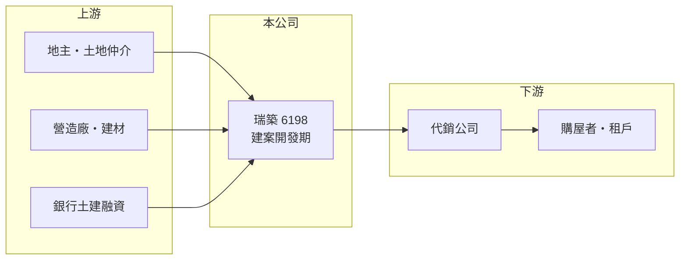

# 6198 瑞築

> 上櫃｜[[產業索引-建材營造業|建材營造業]]｜上市（櫃）日期 2002/12/26

# 第一章：企業模式與商業藍圖

> [!info] 撰寫說明
> 精簡版，由 Claude 依公開資料整理，架構比照 [[2330台積電]]，資料截至 2026-10-08。來源：櫃買中心開放資料快照（基本資料、2026 年第二季資產負債與損益、每月營收）、MoneyDJ 理財網財務比率年表（2021 至 2025 年）與個股基本資料（2025 年營收比重、歷年股利）。公開資料有限，公司沿革、建案名稱、土地位置與開發時程皆未查得；年度營收由每股營業額與成長率回推，數字極小，僅供量級參考。#待校對

瑞築建設成立於 1998 年 10 月，2002 年 12 月在櫃買中心上櫃。它目前的特色是「帳上有大量資產、但幾乎沒有營收」，處於建案開發的投入期，獲利要等未來建案完工交屋才會出現。

- **核心業務：** 依公司名稱與資產結構，瑞築以不動產開發為主業（推估），也就是購地、興建後銷售。建設公司要等[[建案交屋]]才認列營收，在建案完工前，公司只有費用沒有收入，帳面上會呈現小幅虧損。
- **營收結構：** 依 MoneyDJ 的分類，2025 年營收 100% 來自租賃，但金額極小，2026 年 1 至 8 月累計營收只有約 16 萬元。這表示目前沒有建案交屋，租賃收入只是零星的收入。
- **營運據點：** 公司登記於台北市內湖區，董事長為陳朝城；建案與土地位置本次未查得。
- **長期方向：** 2026 年第二季底，瑞築資產約 66.4 億元，其中流動資產約 65.5 億元，推估主要是土地與在建房地；資本公積約 31.1 億元，高於股本 17.1 億元，代表公司曾以溢價增資籌措大筆資金（推估）。公司的長期價值，幾乎完全取決於這批資產未來開發與銷售的成果。

# 第二章：護城河深度與競爭優勢

處於開發期的建商談不上護城河，瑞築的關鍵在於手上的土地與資金能否轉成有利潤的建案。

- **競爭優勢：** 瑞築的負債比率只有約 29%（2026 年第二季底），股東權益約 47.3 億元，資金相對充裕，不必在房市不佳時急於出售。這讓公司有選擇推案時機的空間，但也代表目前大量資本尚未產生報酬。
- **主要對手：** 北台灣的上市櫃建商眾多，例如 [[2542興富發]]、[[2548華固]]、[[6186新潤]]（推估名單）。
- **觀察重點：** 最重要的是建案的完工與交屋時程，以及[[已售未入帳]]的金額。2023 年曾有約 13 億元營收、EPS 2.37 元，顯示一旦有建案交屋，獲利可以明顯轉正；下一批交屋何時出現，是判斷公司價值的核心。

# 第三章：財務體質與盈利規模

資料日期：2026-10-08，表格是撰寫當時的快照；最新月營收、毛利率、累計 EPS 由自動排程寫在本筆記的屬性欄位（月營收、毛利率、累計EPS 等）。#待校對

瑞築五年中只有 2023 年有實質營收與獲利，其他年度營收極低、營業利益率因分母太小而失去意義。

| 年度 | 營收（推算） | [[毛利率]] | [[營業利益率]] | EPS（元） | [[ROE]] |
|---|---|---|---|---|---|
| 2021 | 約 1.0 億 | 74.94% | -15.14% | -0.14 | -1.09% |
| 2022 | 約 0.2 億 | 81.82% | -600.08% | -0.85 | -4.10% |
| 2023 | 約 13.4 億 | 48.55% | 30.36% | 2.37 | 9.44% |
| 2024 | 約 0.1 億 | 16.25% | 大幅為負（營收極低） | -0.56 | -1.85% |
| 2025 | 不足 0.1 億 | 70.51% | 大幅為負（營收極低） | -0.23 | -0.84% |

- **長期指標：** 近 5 年平均 ROE 約 0.3%（推算）；營收年複合成長率不具參考性。MoneyDJ 列示 108 至 114 年度都沒有配發現金股利，2026 年第二季底保留盈餘約 -1.0 億元。每股淨值從 2021 年的 21.21 元增加到 2024 年的 27.97 元，主要來自增資而非獲利。
- **[[ROIC]] 與 [[WACC]]：** 以 2026 年上半年營業損失 0.31 億元年化約 -0.61 億元，稅後約 -0.49 億元；投入資本以 2026 年第二季權益總額 47.3 億元加上總負債 19.1 億元的一半（約 9.6 億元，假設一半為有息負債）計，約 56.9 億元，ROIC 約 -0.9%（推算）。WACC 約 6.9%（推算：無風險利率 1.75%、市場風險溢酬 6%、β 取建設股常見值 1.0，股東權益成本約 7.75%；稅前負債成本 3%、稅率 20%；負債權重約 17%）。開發期 ROIC 低於 WACC 是正常現象，但若建案遲遲無法交屋，資本的機會成本會持續累積。
- **營建業指標與財務特色：** 流動資產約占總資產的 99%，推估以土地與在建房地為主；負債比率從 2021 年的 0.66% 升到 2025 年的 23.44%，代表公司開始動用土建融資推進建案（推估）。

# 第四章：總體風險與地緣政治

瑞築的風險集中在開發時程、單一或少數建案的成敗，以及房市與政策。

- **產業週期：** 建案從購地到交屋需數年，推案時的房價與交屋時的市場可能不同；若在房市降溫時完工，可能面臨去化緩慢或降價求售。
- **營運風險：** 營收高度依賴少數建案，任何一案的工期延誤、成本超支或銷售不佳，都會直接影響整體獲利；長期沒有營收也代表管理費用與利息持續侵蝕股東權益。
- **其他風險：** 央行[[信用管制]]限制建商土建融資與購屋貸款，囤房稅與預售屋轉售限制會影響買方需求；公開資訊有限，投資人較難追蹤建案進度，資訊不對稱的風險較高。

# 專有名詞解析

## 金融

- **[[信用管制]]**：央行限制購屋與建商貸款成數的政策，會影響房市成交與建商資金。
- **[[ROIC]]**：投入資本報酬率，稅後營業利益除以股東權益加有息負債，衡量本業運用資本的效率。
- **[[WACC]]**：加權平均資金成本，股東與債權人要求報酬率的加權平均，是 ROIC 要超越的門檻。

## 產業

- **[[建案交屋]]**：建商在房屋完工並交付買方時才認列營收，因此營建公司的營收常集中在交屋年度。
- **[[已售未入帳]]**：已經賣出、但尚未完工交屋而未認列營收的建案金額，是建商未來營收的主要能見度指標。

# 核心供應鏈

- 上游：地主與土地仲介、營造廠、建材供應商與提供土建融資的銀行（名稱未查得）。
- 下游／客戶：代銷公司、購屋者與少量租戶。
- 同業：[[2542興富發]]、[[2548華固]]、[[6186新潤]]（推估名單）。

## 最新新聞
<!-- news:start -->
<!-- news:end -->

## 相關連結
- [公開資訊觀測站](https://mopsov.twse.com.tw/mops/web/t05st03?step=1&firstin=1&co_id=6198)
- [Goodinfo](https://goodinfo.tw/tw/StockDetail.asp?STOCK_ID=6198)
- [Yahoo 股市](https://tw.stock.yahoo.com/quote/6198)
- [鉅亨網新聞](https://www.cnyes.com/twstock/6198/news)
