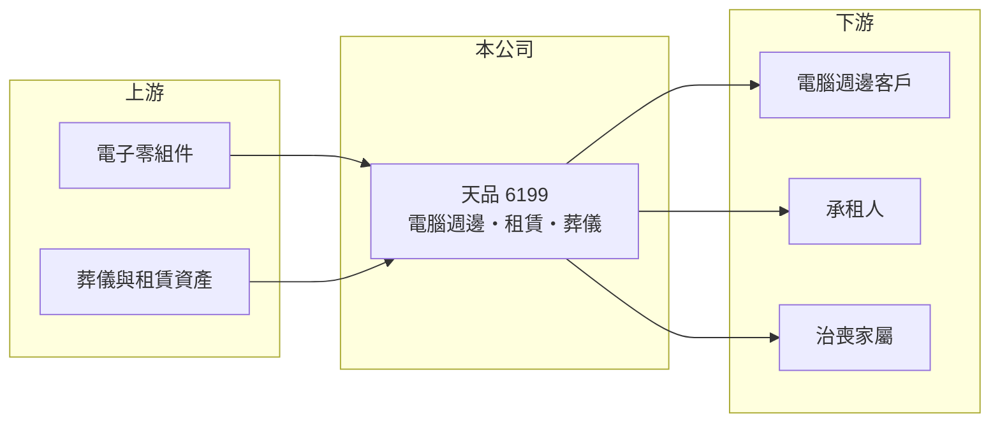

# 6199 天品

> 上櫃｜[[產業索引-其他業|其他業]]｜上市（櫃）日期 2016/10/07

# 第一章：企業模式與商業藍圖

> [!info] 撰寫說明
> 精簡版，由 Claude 依公開資料整理，架構比照 [[2330台積電]]，資料截至 2026-10-07。來源：nstock 公司概況頁、HiStock 財務頁（含「天品轉型奏功 首季由虧損轉盈」新聞標題）、winvest 營收快訊（搜尋結果標題）。2026 年營收倍增的具體業務來源與營收比重未查到。#待校對

天品（天品聯合企業）原為電腦週邊廠，後來跨入租賃與葬儀服務，2026 年轉型後營收與獲利大幅成長。

- **核心業務：** 營業項目包括電腦週邊設備、介面卡、儲存系統與讀卡機的研發製造與買賣，2012 年起加入租賃業務，2013 年起經營葬儀相關服務（[[殯葬業]]）。
- **營收結構：** 各業務比重本次未查到；2026 年營收暴增，新聞以「轉型奏功」描述，推估主要來自葬儀或相關新業務。
- **營運據點：** 以台灣為主（推估），具體據點本次未查到。
- **長期方向：** 公司從硬體製造轉向服務型業務，未來成長取決於轉型後業務的持續性。

# 第二章：護城河深度與競爭優勢

天品的轉型成效已反映在 2026 年財報，但新業務的競爭優勢仍待驗證。

- **競爭優勢：** 2026 年第二季營益率約兩成，顯示新業務具一定獲利能力；具體優勢來源本次未查到。
- **主要對手：** 殯葬服務業者如 [[5530龍巖]]、國寶服務等（推估），電腦週邊業務的對手本次未查到。
- **觀察重點：** 2026 年 3 月單月營收創高後，月營收能否維持在 6,000 萬元以上；營收成長的業務來源需對照公司公告。

# 第三章：財務體質與盈利規模

資料日期：2026-10-07，以下數字是撰寫當時的快照；最新月營收、毛利率、累計 EPS 由自動排程寫在本筆記的屬性欄位（月營收、毛利率、累計EPS 等）。#待校對

天品 2026 年前 8 月營收是去年同期的六倍多，上半年 EPS 已遠高於 2025 年全年。

- **營收規模：** 2026 年 3 月營收約 1.81 億元創歷史新高；4 月 6,192.2 萬元、5 月 6,760.1 萬元、6 月 7,635.8 萬元、8 月約 8,295 萬元（年增 171.7%）；1 至 8 月累計約 6.43 億元，年增約 528%。2025 年全年營收約 2.64 億元。
- **獲利：** 2026 年第一季 EPS 1.22 元，由虧轉盈；第二季 EPS 0.85 元，[[毛利率]] 31.09%、營益率 20.84%、淨利率 28.24%；上半年累計 EPS 2.07 元。2025 年全年 EPS 0.31 元。
- **財務特色：** 資本額約 6.18 億元，市值約 83.68 億元，市場已反映轉型預期。

# 第四章：總體風險與地緣政治

天品的風險在於轉型業務能否持續，以及資訊揭露不足。

- **產業週期：** 若營收來自一次性的大型交易（例如塔位或資產出售），後續年度可能無法維持同樣規模（推估）。
- **營運風險：** 營收月波動大（3 月 1.81 億元、4 月 0.62 億元），單季獲利起伏可能很大。
- **其他風險：** 殯葬法規、租賃資產價值變動，以及股價大漲後的評價修正風險。

# 專有名詞解析

## 金融

- **[[毛利率]]**：營業毛利占營收的比率，反映產品售價扣除直接成本後的獲利空間。

## 產業

- **[[殯葬業]]**：提供墓園、納骨塔、禮廳與治喪服務的產業，設施用地須經政府許可。
- **[[讀卡機]]**：讀取記憶卡或晶片卡資料的電腦週邊設備。

# 核心供應鏈

- 上游：電子零組件供應商、葬儀相關設施與用品（推估）
- 下游／客戶：電腦週邊客戶、承租人與治喪家屬，名稱未揭露
- 同業：[[5530龍巖]]、國寶服務（殯葬，推估）

## 最新新聞
<!-- news:start -->
<!-- news:end -->

## 相關連結
- [公開資訊觀測站](https://mopsov.twse.com.tw/mops/web/t05st03?step=1&firstin=1&co_id=6199)
- [Goodinfo](https://goodinfo.tw/tw/StockDetail.asp?STOCK_ID=6199)
- [Yahoo 股市](https://tw.stock.yahoo.com/quote/6199)
- [鉅亨網新聞](https://www.cnyes.com/twstock/6199/news)
