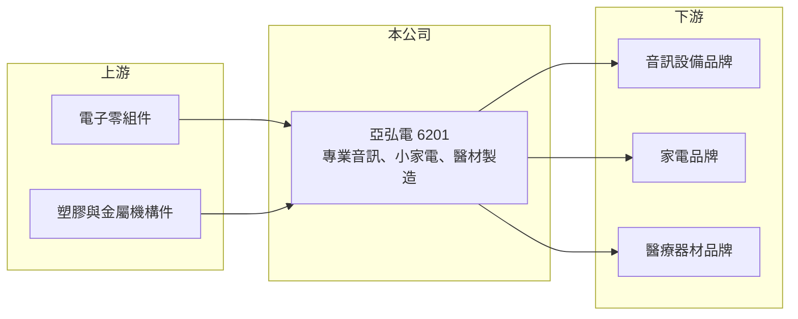

# 6201 亞弘電

> 上市｜[[產業索引-其他電子業|其他電子業]]｜上市（櫃）日期 2004/09/27

# 第一章：企業模式與商業藍圖

> [!info] 撰寫說明
> 精簡版，由 Claude 依公開資料整理，架構比照 [[2330台積電]]，資料截至 2026-10-07。來源：nStock 亞弘電公司簡介與財務摘要。公開資料有限，產品比重、客戶與海外廠區未查到。#待校對

亞弘電是電子產品製造商，產品涵蓋專業音訊、小家電與醫療器材，推估以替品牌客戶生產為主。

- **核心業務：** 專業音訊產品、小家電產品、醫療器材產品與電子零組件的製造。
- **營收結構：** 本次未查到各產品線營收比重，2025 年全年營收 33.27 億元。
- **營運據點：** 1981 年成立，總部在台南市安定區，2002 年上櫃、2004 年轉上市；海外生產據點本次未查到。
- **長期方向：** 以既有的電子組裝能力延伸到醫療器材等認證門檻較高的產品，降低對消費性產品的依賴（推估）。

# 第二章：護城河深度與競爭優勢

亞弘電的優勢在多產品線的製造經驗，以及醫材與專業音訊的認證門檻。

- **競爭優勢：** 醫療器材生產需要品質系統認證，專業音訊客戶重視音質與耐用度，換廠成本高於一般消費電子（推估）。
- **主要對手：** 其他 [[OEM]]／[[ODM]] 電子代工廠與中國小家電代工廠，具體名單本次未查到。
- **觀察重點：** 2026 年第二季營業利益率 11.22%，觀察產品組合改善能否延續，以及高配息政策是否維持。

# 第三章：財務體質與盈利規模

資料日期：2026-10-07，以下數字是撰寫當時的快照；最新月營收、毛利率、累計 EPS 由自動排程寫在本筆記的屬性欄位（月營收、毛利率、累計EPS 等）。#待校對

亞弘電營收規模約 30 億元，配息率高是主要財務特色。

- **營收規模：** 2026 年 8 月營收 3.46 億元，1 至 8 月累計 21.82 億元；2025 年全年 33.27 億元。
- **獲利：** 2026 年第二季 EPS 0.87 元，[[毛利率]] 23.48%、[[營業利益率]] 11.22%、淨利率 9.63%。
- **財務特色：** 資本額 8.92 億元，2024 年配息 4 元、2025 年配息 3.1 元，近五年平均[[殖利率]] 6.38%。

# 第四章：總體風險與地緣政治

亞弘電的風險主要在客戶集中與消費性需求。

- **產業週期：** 小家電與音訊產品屬消費性需求，終端景氣轉弱時品牌客戶會調整庫存，形成[[長鞭效應]]。
- **營運風險：** 代工業務常集中在少數品牌客戶，客戶轉單或產品世代交替會影響營收（推估）。
- **其他風險：** 美國關稅政策與生產地要求、零組件價格與匯率波動，都會影響毛利。

# 專有名詞解析

## 金融

- **[[殖利率]]**：每年現金股利除以股價，用來衡量配息報酬。
- **[[長鞭效應]]**：終端需求的小幅變動，沿供應鏈往上游傳遞時被逐級放大，造成上游庫存與訂單劇烈波動。

## 產業

- **[[OEM]]**：原廠委託製造，代工廠依品牌客戶的設計與規格生產，產品掛品牌商的商標。
- **[[ODM]]**：原廠委託設計製造，代工廠除了生產也負責產品設計，品牌商只提出規格，廣達、緯穎屬此類。

# 核心供應鏈

- 上游：電子零組件、塑膠與金屬機構件供應商（推估）
- 下游／客戶：專業音訊、家電與醫療器材品牌（推估）
- 同業：其他電子產品代工廠（本次未查到具體名單）

## 最新新聞
<!-- news:start -->
<!-- news:end -->

## 相關連結
- [公開資訊觀測站](https://mopsov.twse.com.tw/mops/web/t05st03?step=1&firstin=1&co_id=6201)
- [Goodinfo](https://goodinfo.tw/tw/StockDetail.asp?STOCK_ID=6201)
- [Yahoo 股市](https://tw.stock.yahoo.com/quote/6201)
- [鉅亨網新聞](https://www.cnyes.com/twstock/6201/news)
