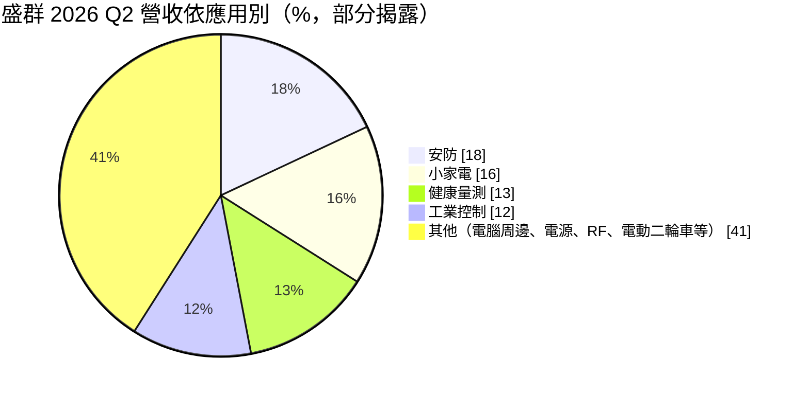
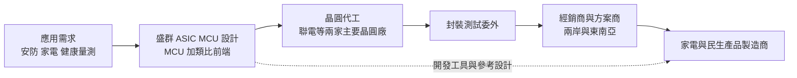
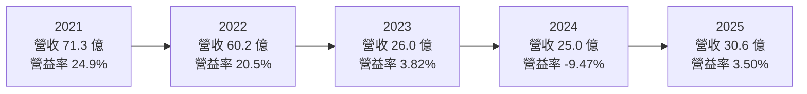
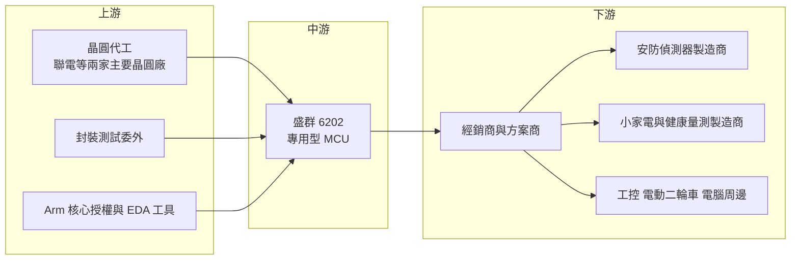

# 6202 盛群

> 上市｜[[產業索引-半導體業|半導體業]]｜上市（櫃）日期 2004/09/27

# 第一章：企業模式與商業藍圖

> [!info] 撰寫說明
> 本文由 Claude 依公開資料整理，架構比照 [[2330台積電]] 的四章研究，資料截至 2026-10-08。財務數字來源：Goodinfo 經營績效與股利政策頁、富果研究 2026 年 2 月與 7 月法說會整理、證交所 OpenAPI 公司基本資料與 2026 年第二季資產負債資料；產業描述為整理性內容，尚未逐條比對原始文件。#待校對

在評估單一個股的長期投資價值時，首要步驟是拆解企業的底層獲利邏輯。本章針對盛群半導體（股票代號：6202，以下簡稱盛群）的商業模式進行定性分析，說明一家專做 8 位元與 32 位元微控制器的台灣 IC 設計公司，如何在中國同業的價格壓力下，靠「專用型 MCU」守住約四成的毛利率。

## 一、核心定位：家電與民生應用的專用型 MCU 供應商

盛群成立於 1998 年，2004 年在證交所上市，總部位於新竹科學園區，是一家 [[Fabless]] 的 [[MCU]] 設計公司。MCU（微控制器）可以理解為一顆「把小型電腦塞進單一晶片」的元件，裡面有處理核心、記憶體與輸入輸出介面，負責控制家電、遙控器、體重計、煙霧偵測器這類產品的基本功能。依富果整理的 2026 年 2 月法說會資料，MCU 占盛群 2025 年營收約 76%，全年出貨約 4.02 億顆。

盛群的特色不在做最強的 MCU，而在做「最懂應用」的 MCU。全球 MCU 大廠（如瑞薩、恩智浦、意法半導體、微芯）主打汽車與工業的高階 32 位元產品，中國同業則以低價通用型產品搶市占。盛群選擇的路線是 [[ASIC MCU]]，也就是在 MCU 裡整合特定應用需要的類比電路，例如量體溫用的感測前端、[[體脂秤]]用的阻抗量測電路、煙霧偵測用的光學感測電路。客戶買到的不只是一顆控制晶片，而是一個接近完成的應用方案，開發時間與零件數都能減少。

這個定位讓盛群在 2021 年晶片缺貨期間達到營收 71.3 億元、EPS 9.04 元的高峰，但也讓它在 2023 至 2024 年的消費性庫存調整中受到重擊，營收一度降到 25 億元上下。理解盛群，必須同時看到它在應用面的技術累積，以及它對消費性景氣的高度敏感。

## 二、終端應用／產品板塊：安防、家電與健康量測

依富果整理的 2026 年 7 月法說會資料，2026 年第二季主要應用比重如下（其餘應用未完整揭露）：

* **安防：** 這是盛群近年成長最快的板塊。依法說會資料，安防營收比重從 2024 年的 6% 升到 2025 年的 17%，出貨約 5,300 萬顆。驅動力來自法規：美國 [[UL 認證]]對住宅煙霧與一氧化碳偵測器的新標準、韓國與中國的家用消防偵測器新法規，都要求更精準的偵測，讓專用的偵測 MCU 需求連續數年增加。法規驅動的需求比消費者喜好穩定，是盛群最重要的結構性成長來源。
* **小家電與 [[BLDC]] 馬達控制：** 吹風機、電風扇、抽油煙機、吸塵器等產品走向變頻與無刷馬達，需要 MCU 進行精細的轉速控制。2025 年馬達控制 MCU 出貨約 1,400 萬顆、年增 120%；公司也在印度吊扇與冰箱壓縮機市場取得進展。
* **健康量測：** 體溫計、血壓計、體脂秤等產品屬剛性需求，2025 年出貨約 4,500 萬顆。體脂秤從四電極升級到八電極，代表每台產品需要更高階的量測晶片。
* **工業控制與其他：** 包括電源、電腦周邊、RF 無線遙控與電動二輪車。法說會提到中國電動自行車新國標實施後，相關訂單逐季增加。

產品技術面，[[32 位元 MCU]] 占 MCU 營收約 25%，但出貨量僅約 12%，代表 32 位元產品單價明顯較高，也是盛群提升平均售價的方向。

## 三、資本轉化邏輯（營運模式）：多品項、長尾、高庫存

盛群的營運模式有三個特徵：

* **品項多、客戶分散：** MCU 市場的客戶是成千上萬的中小型家電與民生產品製造商，單一客戶占比通常不高。好處是不會被單一大客戶綁架，壞處是需要龐大的經銷與技術支援網路，以及大量的產品型號。
* **晶圓代工依賴成熟製程：** 法說會資料指出聯電是盛群長期穩固的合作夥伴，並採兩家主要晶圓廠互為備援。MCU 需要 [[eNVM]]（嵌入式快閃記憶體）製程，這類特殊製程的產能有限，2021 年缺貨時就成為瓶頸。2026 年第二季毛利率中還包含約 3.7 個百分點的聯電一次性回饋，顯示雙方合作關係密切。
* **高庫存是常態：** 因為品項多、晶圓投片到出貨時間長，MCU 公司通常持有較高庫存。盛群 2025 年平均銷貨天數從 330 天降到 216 天，2026 年第二季再降到 184 天。庫存水位（[[庫存週轉天數]]）是觀察盛群景氣位置最重要的指標之一：天數偏高時，公司會被迫降價或提列跌價損失。

## 四、企業長期藍圖：法規驅動的安防與新興應用

* **深化專用型 MCU：** 公司長期策略是在安防與健康量測建立技術門檻，例如從單一煙霧偵測延伸到「一氧化碳加煙霧」複合型產品，並把儲能設備的鋰電池偵測列為新應用。這些產品的共同點是有法規或安全標準撐腰，客戶一旦採用就不易更換。
* **調整定價與毛利結構：** 2026 年因上游晶圓與封測成本上升，公司對產品調價，目標是讓毛利率穩定在約 40%。這顯示經營層願意用價格換取毛利率，而不是追求市占。
* **AI 伺服器周邊（2027 年後）：** 公司正開發伺服器散熱風扇用的 MCU（每台 AI 伺服器可能需要 10 至 20 顆）與光模塊用的 32 位元 MCU。這是盛群首次較明確地切入資料中心市場，但仍在驗證階段，屬長期觀察項目。

# 第二章：護城河深度與競爭優勢

在長期價值投資中，「護城河」指企業抵禦競爭、維持超額利潤的保護機制。本章分析盛群的護城河構成、全球主要競爭對手，以及這些優勢在中國 MCU 廠大量擴張後還能守住多少。

## 一、護城河的核心組成要素

盛群屬於「窄護城河」，優勢來自應用知識與客戶生態，而非規模：

* **1. 類比整合與應用方案能力：** 盛群在 MCU 中整合量測、感測與驅動電路，並提供參考設計與開發工具。中小型家電廠缺乏完整的電子研發團隊，使用盛群的方案可以縮短開發時間。這種「方案型」銷售讓客戶對特定晶片產生依賴，換供應商就要重新設計電路與軟體。
* **2. 法規與安全認證：** 安防與健康量測產品需要通過 UL 等安全認證，認證是針對整機與關鍵零件完成的。客戶一旦以盛群的晶片通過認證，換晶片就等於重新認證，這大幅提高了轉換成本。
* **3. 長期累積的開發者生態：** MCU 客戶的工程師習慣特定廠商的開發環境與指令集。盛群經營兩岸市場二十多年，累積大量熟悉其工具的方案商與工程師，這是新進者難以快速複製的。
* **4. 穩健的財務體質：** 依富果整理的法說會資料，2025 年底盛群現金約 30.56 億元、占總資產約 55%，流動比率 3.7 倍。充足的現金讓公司在景氣低谷時仍能維持研發，不必為了周轉而殺價。

## 二、全球主要競爭對手格局

| 對手 | 定位 | 對盛群的威脅 |
|---|---|---|
| 瑞薩、恩智浦、意法半導體、微芯 | 全球 MCU 龍頭，車用與工業 32 位元為主 | 在高階與 32 位元市場具規模與生態優勢 |
| 中國 MCU 設計公司（如兆易創新、中穎電子） | 政策支持，主打中國家電與消費市場 | 以低價搶占通用型與家電 MCU，是最直接的價格壓力來源 |
| [[4919新唐]] | 台灣 MCU 與音訊、工控晶片，背後有華邦集團 | 在家電與工業 MCU 正面競爭 |
| [[5471松翰]]、[[5487通泰]] | 台灣消費性 MCU、健康量測與觸控 IC | 在健康量測、觸控等利基市場重疊 |

## 三、優勢轉化：哪些市場守得住、哪些守不住

* **守得住：** 安防偵測與健康量測這類有法規門檻、需要類比整合的專用型 MCU。客戶重視精度與認證，中國同業短期內難以完全取代。2026 年法說會提到部分中國客戶因當地晶圓產能吃緊，把觸控 MCU 訂單轉給盛群，也說明盛群在供應穩定性上有一定信任度。
* **守不住：** 通用型、小資源的低階 MCU。這類產品規格標準、轉換成本低，中國同業可以用更低的價格搶單。2023 至 2024 年盛群營收大幅下滑，部分原因正是這塊市場的價格競爭與庫存調整。
* **觀察重點：** 第一，安防法規需求能否延續到多個國家，使安防成為長期穩定的營收支柱；第二，毛利率能否如經營層目標穩定在約 40%；第三，伺服器散熱與光模塊 MCU 能否在 2027 年後實際量產，讓盛群跨出消費與家電市場。

# 第三章：財務體質與盈利規模

資料日期：2026-10-08。數字取自 Goodinfo 年度經營績效與股利政策頁、富果研究法說會整理、證交所 OpenAPI 2026 年第二季資產負債資料，表格是撰寫當時的快照；最新月營收、毛利率、累計 EPS 由自動排程寫在本筆記的屬性欄位（月營收、毛利率、累計EPS 等）。#待校對

財務報表是檢驗護城河是否真實存在的最終標準。本章用五年的三率、[[ROE]]、股利與資本報酬，檢視盛群在消費性 MCU 週期中的獲利品質。

## 一、獲利能力的基石：三率

| 年度 | 營收（新台幣） | [[毛利率]] | [[營業利益率]] | EPS（元） | [[ROE]] |
|---|---|---|---|---|---|
| 2021 | 71.3 億 | 51.1% | 24.9% | 9.04 | 40.6% |
| 2022 | 60.2 億 | 50.6% | 20.5% | 4.89 | 21.7% |
| 2023 | 26.0 億 | 50.4% | 3.82% | 0.49 | 2.59% |
| 2024 | 25.0 億 | 40.3% | -9.47% | -0.66 | -3.82% |
| 2025 | 30.6 億 | 38.9% | 3.50% | 0.76 | 4.86% |

這五年是盛群歷史上波動最劇烈的一段。2021 年全球晶片缺貨，MCU 是最缺的品項之一，盛群營收衝到 71.3 億元、營業利益率接近 25%。2023 年需求反轉、客戶去化庫存，營收一年內腰斬到 26 億元。值得注意的是，2023 年的毛利率仍維持 50.4%，但營業利益率掉到 3.82%，說明公司沒有立刻降價出清，而是讓營收與營業槓桿承受衝擊；到了 2024 年，毛利率才降到約 40%，並出現上市以來少見的營業虧損。

把時間拉長，依 Goodinfo 數字，2016 至 2020 年盛群營收大致在 41.6 億至 56.1 億元之間，毛利率約 46% 至 49%，營業利益率約 20% 至 23%，EPS 3.5 至 4.7 元，是一家相當穩定的高毛利公司。2021 年的高峰與 2023 至 2024 年的低谷都屬於非常態；2016 至 2025 年營收年複合成長率約 -3.4%（推算），反映的是基期與週期，而非長期萎縮的結論。2025 年營收回升 22%、營業費用年減 13%，營業利益率回到正值，顯示公司正從谷底走出。

## 二、[[ROE]]：資本效率

2021 至 2025 年平均 ROE 約 13.2%（推算），但分布極不平均：2021 年 40.6%，2024 年為負。若看較能代表常態的 2016 至 2020 年，ROE 約在 19.7% 至 25.7% 之間。盛群的 ROE 偏低時期，主因是獲利下滑，同時帳上保留大量現金：依證交所 2026 年第二季資料，總資產約 58.6 億元，權益約 41.2 億元，而富果整理的法說會資料顯示現金約 30.47 億元、占總資產 52%。大量現金提高了安全性，卻也拉低了 ROE。

## 三、資本支出與自由現金流

盛群是 Fabless 模式，不需要建廠，資本支出主要是研發設備與光罩，金額相對營收很小（具體金額未查得）。在正常年度，營業現金流應足以涵蓋資本支出，[[自由現金流]]長期為正（推估）；2023 至 2024 年庫存偏高期間，營業現金流可能較弱（推估）。2025 年公司也辦理約 1.5 億元的私募現金增資，期末股本約 2.3 億股。

股利是觀察盛群資本配置的關鍵。依 Goodinfo，2016 至 2020 年度現金股利在 3.5 至 4.7 元之間；2021 至 2025 年度分別為 8.123、4、0.45、0、0.68 元。對照 EPS，2021 至 2023 年配息率約 90%、82%、92%，2025 年約 89%（推算）；2024 年因虧損未配息。盛群的股利政策可以歸納為「有賺就幾乎全數配發」，配息率長期接近九成，股利金額則完全跟著獲利起伏。這種政策對股東而言透明，但也意味著股利無法提供景氣低谷時的穩定現金流。

## 四、[[ROIC]] 與 [[WACC]]：價值創造利差

**ROIC 推算：** 2025 年營業利益約 1.07 億元（30.6 億 × 3.5%），以 20% 稅率計算，稅後營業利益約 0.86 億元。以 2026 年第二季權益約 41.2 億元作為投入資本，盛群沒有重大有息負債（推估），ROIC 約 2.1%（推算）。若扣除約 30.5 億元的現金，只看實際投入營運的資本約 10.7 億元，ROIC 約 8%（推算）。對照 2021 年，營業利益約 17.8 億元（71.3 億 × 24.9%），稅後約 14.2 億元，以稅後淨利 20.4 億元與 ROE 40.6% 回推權益約 50 億元，ROIC 約 28%（推算）。

**WACC 推算：** 股東權益成本用 CAPM 估計，假設台灣 10 年期公債殖利率 1.75%、市場風險溢酬 6%、β 取 IC 設計同業常見值 1.0，權益成本約 7.75%。由於有息負債不重大，WACC 約 7.75%（推算）。

**結論：** 盛群在 2016 至 2022 年的常態期，ROIC 長期明顯高於 WACC，是一家創造價值的公司；2023 至 2025 年的低谷期，以全部權益計算的 ROIC 低於 WACC，若扣除閒置現金則大致與 WACC 打平。未來盛群能否回到創造價值的軌道，取決於兩件事：營收能否回到 40 億元以上讓營業費用被攤薄，以及毛利率能否如經營層目標穩定在約 40%。

# 第四章：總體風險與地緣政治

任何企業都無法脫離宏觀環境獨立存在。本章分析盛群未來必須面對的地緣政治、產業週期、營運與技術風險。

## 一、地緣政治

* **中國市場的雙重角色：** 盛群的客戶大量集中在中國的家電與民生產品製造商，中國既是最大市場，也是最大競爭來源。中國推動晶片國產化，家電品牌在政策與成本考量下，可能優先採用本土 MCU，這會長期壓縮盛群在中國的市占。
* **美中貿易與轉單：** 美國對中國產品課徵關稅，促使部分家電與安防產品組裝移往東南亞、印度。盛群若能跟著客戶布局新生產地，反而可能爭取到「非中國供應鏈」的需求；若跟不上，則會失去訂單。
* **台灣生產集中：** 主要晶圓代工在台灣進行，兩岸風險同樣存在於盛群的供應端。

## 二、產業週期與市場結構

* **MCU 庫存週期特別劇烈：** 2021 年缺貨時，客戶重複下單、超額備貨；2023 年需求反轉，所有庫存一次釋放。這種[[長鞭效應]]在 MCU 產業特別明顯，因為品項多、交期長，供需失衡時調整時間長達一到兩年。
* **中國 MCU 產能擴張：** 中國大量新進 MCU 業者與成熟製程產能，使通用型 MCU 長期處於供給過剩，價格不易回到過去水準。
* **消費性需求：** 家電、健康量測與小家電都屬消費性產品，受全球景氣與消費信心影響。

## 三、營運環境的隱性風險

* **存貨跌價：** 庫存天數長期偏高，若需求轉弱，可能需要提列存貨跌價損失。這類損失不會出現在營收數字裡，卻會直接侵蝕毛利率。
* **晶圓代工成本與產能：** MCU 依賴 eNVM 特殊製程，產能較少。成熟製程漲價或產能吃緊時，盛群的成本與交期都會受影響；公司雖採兩家晶圓廠互為備援，但切換仍需時間。
* **營收集中度與規模：** 年營收約 30 億元的規模，相較國際 MCU 大廠很小，研發資源有限，無法同時在太多新應用投入。

## 四、科技或法規演進

* **32 位元化與 Arm 架構：** MCU 市場長期往 32 位元與 [[ARM安謀]] Cortex-M 架構移動。8 位元產品雖然仍有成本優勢，但新應用越來越多採用 32 位元。盛群 32 位元產品占 MCU 營收約四分之一，需要持續提高才能跟上市場。
* **法規是兩面刃：** 安防法規推升了盛群的需求，但法規標準一旦普及，競爭者也會推出符合規格的產品，屆時價格競爭會再出現。
* **連網與 AI 功能：** 家電走向連網與邊緣 AI，客戶可能要求 MCU 整合無線通訊與更強運算，這會拉高研發門檻，也讓大型 SoC 廠有機會切入原本屬於 MCU 的市場。

# 專有名詞解析

## 半導體

- **[[MCU]]**：微控制器，把處理核心、記憶體與輸入輸出介面整合在單一晶片，負責控制家電與各種電子產品。
- **[[ASIC MCU]]**：在 MCU 中整合特定應用所需的類比與感測電路，替單一應用量身打造的微控制器。
- **[[eNVM]]**：嵌入式非揮發性記憶體，把斷電後仍能保存資料的記憶體做進同一顆晶片，常見於 MCU 與智慧卡。
- **[[Fabless]]**：只做晶片設計、把製造委外給晶圓代工廠的商業模式。
- **[[BLDC]]**：無刷直流馬達，用電子電路取代碳刷換向，壽命長、效率高，散熱風扇與家電大量採用，需要專用驅動 IC。
- **[[32 位元 MCU]]**：一次可處理 32 位元資料的微控制器，運算能力高於 8 位元產品，多採 Arm Cortex-M 核心。

## 應用

- **[[UL 認證]]**：美國安全認證機構 UL 制定的產品安全標準，煙霧與一氧化碳偵測器必須通過才能在美國銷售。
- **[[體脂秤]]**：透過微弱電流量測人體阻抗來推估體脂率的秤，八電極機型需要更精密的量測晶片。

## 金融

- **[[ROE]]**：股東權益報酬率，稅後淨利除以股東權益，衡量公司用股東的錢賺錢的效率。
- **[[ROIC]]**：投入資本報酬率，稅後營業利益除以股東權益加有息負債，衡量本業運用全部資本的效率。
- **[[WACC]]**：加權平均資金成本，股東與債權人要求報酬率的加權平均，ROIC 高於它才算創造價值。
- **[[自由現金流]]**：營業活動現金流減去資本支出，代表企業可自由用於配息、還債或併購的現金。
- **[[長鞭效應]]**：終端需求的小幅變動，沿供應鏈往上游傳遞時被逐級放大，造成上游庫存與訂單劇烈波動。

## 產業

- **[[庫存週轉天數]]**：存貨平均需要多少天才能賣出，天數越高代表庫存壓力越大、跌價風險越高。

# 核心供應鏈

## 1. 上游：晶圓代工、封測與 IP
- 晶圓代工：[[2303聯電]]（法說會資料所稱長期合作夥伴），另一家主要晶圓廠未具名
- 處理器核心授權：[[ARM安謀]]（32 位元產品）
- 設計工具：[[SNPS新思科技]]、[[CDNS益華電腦]]

## 2. 中游：同業競爭
- 台灣 MCU 與消費性 IC：[[4919新唐]]、[[5471松翰]]、[[5487通泰]]
- 國際 MCU 大廠：瑞薩、恩智浦、意法半導體、微芯
- 中國 MCU 業者：兆易創新、中穎電子

## 3. 下游：應用市場
- 安防：住宅煙霧與一氧化碳偵測器、儲能設備電池偵測
- 家電：吹風機、電風扇、抽油煙機、印度吊扇與冰箱壓縮機
- 健康量測：體溫計、血壓計、體脂秤
- 其他：工業控制、電動二輪車、電腦周邊

## 最新新聞
<!-- news:start（自動產生，請勿手動編輯此範圍） -->
- 2026-10-07 📰 媒體 19:50｜營收速報 - 盛群(6202)9月營收3.40億元年增率高達40.16％｜[鉅亨網](https://news.cnyes.com/news/id/6623959)

完整紀錄：[[6202盛群 新聞]]
<!-- news:end -->

## 相關連結
- [公開資訊觀測站](https://mopsov.twse.com.tw/mops/web/t05st03?step=1&firstin=1&co_id=6202)
- [Goodinfo](https://goodinfo.tw/tw/StockDetail.asp?STOCK_ID=6202)
- [Yahoo 股市](https://tw.stock.yahoo.com/quote/6202)
- [鉅亨網新聞](https://www.cnyes.com/twstock/6202/news)
