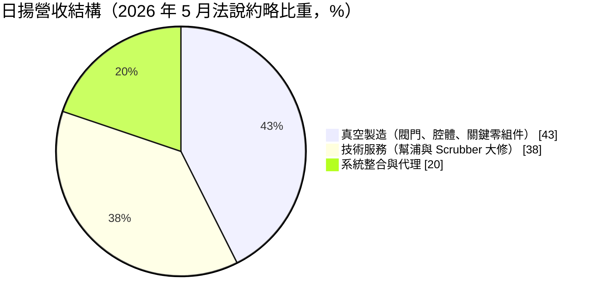
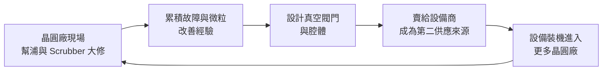
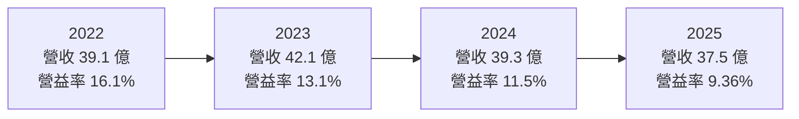
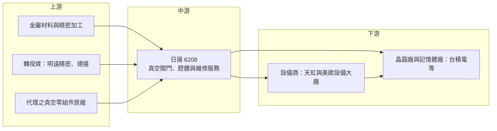

# 6208 日揚

> 上櫃｜[[產業索引-半導體業|半導體業]]｜上市（櫃）日期 2002/12/23

# 第一章：企業模式與商業藍圖

> [!info] 撰寫說明
> 本文由 Claude 依公開資料整理，架構比照 [[2330台積電]] 的四章研究，資料截至 2026-10-08。財務數字來源：Goodinfo 台灣股市資訊網年度經營績效、MoneyDJ 理財網（富邦電子下單 DJ 版）公司基本資料與股利表、富果研究 2025 年 12 月與 2026 年 5 月法說會整理、nStock 公司簡介；產業描述為整理性內容，尚未逐條比對原始文件。#待校對

在評估單一個股的長期投資價值時，首要步驟是拆解企業的底層獲利邏輯。本章針對日揚科技（股票代號：6208，以下簡稱日揚）的商業模式進行定性分析，說明一家以真空技術起家的設備零組件與服務公司，如何在晶圓廠與設備大廠之間找到自己的位置，以及它為何把真空閥門視為下一個十年的成長主軸。

## 一、核心定位：以真空技術為核心的設備零組件與維修服務商

日揚成立於 1997 年，2002 年在櫃買中心掛牌，核心技術是「真空」。半導體製程中的薄膜沉積、蝕刻、離子植入等步驟，幾乎都必須在高度真空的腔體內進行，因此真空幫浦、真空閥門、真空腔體與尾氣處理設備（Scrubber）是每一台製程機台與每一座晶圓廠都少不了的基礎元件。日揚的定位不是製造整台製程設備，而是供應這些真空相關的關鍵零組件，並替晶圓廠維修、翻新與改善真空系統。

這個定位讓日揚同時面對兩種客戶。第一種是晶圓廠與記憶體廠，它們向日揚購買真空幫浦與尾氣處理設備的大修與維護服務；第二種是設備製造商與工程公司，它們向日揚採購真空閥門、腔體等零組件，裝進自家設備再賣給晶圓廠。依富果整理的法說內容，過去兩年最大客戶占營收約兩成，主要來自幫浦大修業務，法說中也提到日揚跟隨 [[2330台積電]] 等主要客戶到海外設點。

日揚的商業模式有兩個值得注意的特性：

* **服務收入提供穩定性：** 晶圓廠的真空幫浦需要定期大修，這類需求與晶圓廠的開工量連動，而不是與新建廠的資本支出連動。只要既有產能持續運轉，維修需求就會存在，因此服務業務在半導體設備景氣下行時，波動通常小於設備銷售。
* **零組件銷售提供成長性：** 閥門與腔體賣給設備商，屬於設備供應鏈的一環。當全球晶圓廠擴產，設備出貨量增加，零組件需求會跟著放大；但反過來，設備景氣反轉時，這部分營收也會較快下滑。

## 二、產品板塊：技術服務、真空製造與系統整合

依 MoneyDJ 揭露的 2025 年營收分類，商品銷售約占 61%、勞務約占 38%、其他約 1%。富果整理的 2026 年 5 月法說內容則以業務別區分，各項比重為約略數字，加總略超過百分之百：

* **技術服務：** 從真空幫浦到尾氣處理設備的全面大修，包括維護、修理、管路重新設計與微粒問題排除。法說資料把這部分定位為高毛利的核心業務，富果整理的 2025 年 12 月法說提到，維修類業務的毛利率約在 40% 至 60% 以上。
* **真空製造：** 高階真空閥門、真空腔體與關鍵零組件。閥門相關業務（含閥門維修）約占總營收兩成，是公司未來最主要的成長投資方向。零組件與設備銷售的毛利率區間較寬，約 10% 至 40%，取決於產品是否為自有設計。
* **系統整合：** 依客戶需求設計、組裝與整合真空系統，並代理部分零組件。這部分毛利率較低，但能讓日揚接觸更多設備與研發單位，累積應用經驗。

除了本業，日揚也長期持有幾家轉投資公司。依 2026 年 5 月法說資料，日揚持有明遠精密約 30.17%、德揚約 34.31%。2026 年第一季日揚喪失對明遠的控制力，改以權益法認列，並一次認列約 1.18 億元的處分利益，這是會計處理造成的一次性收益，並不代表本業獲利的長期水準。

## 三、資本轉化邏輯：從「修」到「造」的營運模式

日揚把在晶圓廠現場累積的維修經驗，轉化為設計與製造零組件的能力，這是它資本轉化的核心邏輯。維修人員每天面對的是幫浦與閥門在真實製程中如何損壞、哪裡容易累積微粒、哪種材料撐得比較久，這些現場知識回饋到產品設計，讓日揚能做出更貼近晶圓廠需求的閥門與腔體。

在海外布局上，日揚採取「輕資產」的方式。依法說資料，日揚在上海已有超過 20 年的據點，在日本熊本設有維修基地，2025 年 5 月設立美國辦公室、7 月組成美國在地團隊，並規劃在亞利桑那州與當地夥伴以「廠中廠」模式提供服務。這樣的安排讓日揚可以跟著客戶出海，又不必一次投入大筆資本自建工廠。代價是海外據點在產生營收之前，人事與開辦費用會先壓低營業利益率，法說提到營業利益率由 2023 年的約 13% 降到 2026 年第一季的約 7%，主因正是海外與新子公司的前期成本。

## 四、企業長期藍圖：閥門「大山計畫」與營收倍增目標

日揚在 2026 年法說中提出三個長期方向。第一是深化核心的幫浦大修服務，把短期合約轉為長期合約，並與主要客戶推動持續改善計畫。第二是閥門業務的「大山計畫」，目標在 2030 年把閥門業務做到約 10 億至 15 億元，年成長 20% 至 25%，並爭取全球前三大的市占。第三是利用零組件與整合能力，與設計夥伴合作承接利基型製程設備的代工。公司整體目標是 2030 年集團營收倍增。

這個藍圖的關鍵在於國際設備大廠。法說資料指出，日揚正在開發三家美歐大型設備商成為閥門客戶，目前處於開發、測試與試作階段，其中數家已開始設計導入（[[Design-in]]）。設備商一旦把日揚的閥門寫進機台的標準料號，後續會隨機台出貨長期採購，這是零組件供應商最有價值的地位。但設計導入到量產通常需要數年，因此這個藍圖的成效要用三到五年的時間來檢驗。

# 第二章：護城河深度與競爭優勢

護城河決定了企業能否把今天的獲利延續到十年後。本章分析日揚在真空零組件與服務市場中的競爭優勢，以及它面對國際大廠時的真實位置。

## 一、護城河的核心組成要素

* **晶圓廠現場的服務關係：** 幫浦與尾氣處理設備的大修，需要工程師長期駐點、熟悉每座廠的機台配置與製程氣體特性。這種關係一旦建立，晶圓廠更換維修廠商的成本與風險都很高，因為任何維修失誤都可能讓整條產線停機。這是日揚最穩固的優勢，也是高毛利的來源。
* **在地化與跟隨出海的能力：** 台灣晶圓廠在美國、日本設廠，需要熟悉自家標準的供應商一起出海。日揚在熊本、亞利桑那的布局，讓它能延續與台灣客戶的關係，這是當地維修業者短期內難以取代的。
* **成為設備商「第二供應來源」的機會：** 真空閥門市場高度集中，設備商有分散供應風險的需求。日揚若能以較低的總成本與在地服務打入設備商，就能取得長期料號。
* **轉投資形成的技術網絡：** 明遠精密、德揚等轉投資公司分別在精密加工與相關領域，讓集團能在零組件製造上相互支援。

## 二、全球主要競爭對手格局

依富果整理的法說資料，全球半導體真空閥門市場由瑞士 VAT 主導，市占約七成；日揚市占約 2%，在 2025 年 12 月法說中被列為全球第七、2026 年 5 月法說中被列為第六。法說也引用產業數字，估計半導體真空閥門市場約由 2025 年的 18.7 億美元成長到 2031 年的 28 億美元。

| 對手 | 定位 | 對日揚的影響 |
|---|---|---|
| VAT（瑞士） | 全球真空閥門龍頭，市占約七成，超過 50 年歷史 | 品牌與料號地位穩固，日揚只能爭取第二供應來源 |
| 其他國際真空零組件廠（如 MKS 等） | 提供閥門、量測與真空子系統 | 在設備商端與日揚競爭同一批料號 |
| 原廠幫浦維修體系（如 Edwards、荏原） | 幫浦原廠提供的保養與大修服務 | 在晶圓廠維修市場與日揚直接競爭 |
| [[3413京鼎]]、[[8091翔名]] 等台灣設備零組件廠 | 製程設備模組與零組件代工 | 在台灣設備在地化供應鏈中爭取同類訂單 |

## 三、優勢轉化：哪些市場守得住、哪些守不住

* **守得住：** 台灣主要晶圓廠的幫浦與尾氣處理大修。這類服務仰賴長年累積的現場經驗與信任，而且台灣客戶出海時需要熟悉的夥伴，日揚的跟隨布局強化了這項優勢。
* **守不住或難以突破：** 全球閥門市場的主導地位。VAT 擁有規模、品牌與數十年的料號累積，富果整理的法說資料提到 VAT 的閥門毛利率接近 60%，日揚在可見的未來只能以第二供應來源的角色切入，價格與規格都較難主導。
* **觀察重點：** 美歐設備大廠的閥門設計導入能否轉為量產料號、閥門營收能否依「大山計畫」維持 20% 以上的年成長、海外據點何時轉虧為盈，以及營業利益率能否回到 2023 年的水準。這三點決定日揚能否從「台灣維修廠」升級為「國際零組件供應商」。

# 第三章：財務體質與盈利規模

資料日期：2026-10-08。數字取自 Goodinfo 年度經營績效與 MoneyDJ 股利表，表格是撰寫當時的快照；最新月營收、毛利率、累計 EPS 由自動排程寫在本筆記的屬性欄位（月營收、毛利率、累計EPS 等）。#待校對

財務報表是檢驗護城河是否真實存在的最終標準。本章用六年的三率、ROE 與資本報酬，檢視日揚在半導體設備景氣循環中的獲利品質。

## 一、獲利能力的基石：三率

| 年度 | 營收（新台幣） | [[毛利率]] | [[營業利益率]] | EPS（元） | [[ROE]] |
|---|---|---|---|---|---|
| 2020 | 25.7 億 | 34.8% | 10.8% | 2.80 | 14.5% |
| 2021 | 33.1 億 | 38.1% | 14.2% | 3.32 | 14.9% |
| 2022 | 39.1 億 | 38.5% | 16.1% | 4.19 | 17.8% |
| 2023 | 42.1 億 | 34.2% | 13.1% | 3.02 | 12.1% |
| 2024 | 39.3 億 | 34.6% | 11.5% | 3.01 | 10.3% |
| 2025 | 37.5 億 | 33.3% | 9.36% | 2.52 | 7.5% |

日揚的六年數字呈現兩段走勢。2020 至 2022 年是半導體擴產週期，營收由 25.7 億元成長到 39.1 億元，毛利率與營業利益率同步走高。2023 年營收再創高，但毛利率開始下滑；2024 至 2025 年營收逐年減少，營業利益率由 16.1% 一路降到 9.36%。法說的解釋包括產品組合變化、上海子公司面臨激烈競爭、轉投資表現轉弱，以及海外據點與研發的前期費用增加。

從長期指標看，2020 至 2025 年營收年複合成長率約 7.8%（推算），毛利率維持在 33% 至 39% 之間，相對穩定；真正波動較大的是營業利益率，代表日揚的費用結構正在因海外擴張而墊高。這類費用是否能換來未來營收，是判斷近年獲利下滑屬於「投資期」還是「競爭力衰退」的關鍵。

需要特別提醒的是，Goodinfo 顯示日揚的股本由 2023 年的約 11.8 億元降到 2024 年的約 9.45 億元，同期每股淨值由 24.68 元升到 32.66 元，推估與股本調整有關，但具體原因未查得。跨年度比較 EPS 時，股本變動會影響可比性，應以淨利與 ROE 為主要參考。

## 二、[[ROE]]：資本效率

2021 至 2025 年日揚的平均 ROE 約 12.5%（推算），高點是 2022 年的 17.8%，2025 年降到 7.5%。日揚的資產規模受轉投資與合併範圍影響，富果整理的法說資料顯示，2025 年 9 月底合併總資產約 77.5 億元。以 Goodinfo 的 ROE 與 ROA 比值推算，資產約為股東權益的兩倍，代表日揚使用了一定程度的負債或包含非控制權益的合併資產。ROE 下滑主要來自營業利益率下降，而不是財務槓桿改變。

## 三、資本支出、[[自由現金流]]與股利

* **[[CapEx]]：** 日揚屬於零組件與服務業，資本密集度遠低於晶圓廠。富果整理的 2025 年 12 月法說提到年度資本支出超過 1 億元，主要用於廠房與設備；2026 年法說則說明海外擴張初期採輕資產、低投資的方式。公司也規劃出售閒置空間，用於補充營運資金、研發與降低負債。
* **自由現金流：** 年度營業現金流與自由現金流的完整數字未查得。以資本支出相對營收僅數個百分點來看，推估在正常年度自由現金流應為正，但海外擴張期的營運資金需求可能使個別年度波動。
* **股利：** 依 MoneyDJ 股利表，2019 至 2025 年度現金股利分別為 1.70、1.99、2.20、2.70、0、2.00、2.00 元。2023 年度未配發現金股利，原因未查得；其餘年度配發率大致在六至八成之間（推算），屬於穩定配息的類型。

## 四、[[ROIC]] 與 [[WACC]]：價值創造利差

**ROIC 推算：** 2025 年營業利益約 3.51 億元（37.5 億元 × 9.36%），以稅率 20% 計算，稅後營業利益約 2.81 億元。股東權益約 31.0 億元（每股淨值 32.84 元 × 約 0.945 億股），依 ROE 與 ROA 的比值推算總負債約 31 億元，假設其中約一半為有息負債，約 15 億元（推估），投入資本約 46 億元，ROIC 約 6.1%（推算）。用同樣方法回推 2022 年，稅後營業利益約 5.04 億元，股東權益約 28.7 億元，加上約 15 億元有息負債，ROIC 約 11.5%（推算）。

**WACC 推算：** 假設台灣 10 年期公債殖利率 1.75%、市場風險溢酬 6%，β 取 MoneyDJ 揭露的 0.58，股東權益成本約 5.2%。若改用半導體設備零組件同業常見的 β 1.0，股東權益成本約 7.75%。負債成本假設 2.5%，稅後約 2.0%，權益占資本約三分之二（推估），WACC 約 4.1% 至 5.9%（推算）。

**結論：** 2020 至 2022 年日揚的 ROIC 明顯高於 WACC，屬於創造價值的期間；2025 年 ROIC 約 6% 左右，只略高於資金成本區間的上緣，價值創造的空間已大幅縮小。對長期投資人而言，關鍵是海外據點與閥門投資能否在三到五年內把營業利益率拉回兩位數，讓 ROIC 重新回到 10% 以上。

# 第四章：總體風險與地緣政治

任何企業都無法脫離宏觀環境獨立存在。本章分析日揚未來必須面對的地緣政治、產業週期、營運與技術風險。

## 一、地緣政治風險

* **美中科技對抗：** 日揚在上海經營超過 20 年，法說資料提到 2025 年上海子公司營收因當地競爭激烈而下滑，母公司對海外的銷售也因美中貿易緊張而減少。中國推動半導體設備與零組件國產化，會持續壓縮外資與台資供應商在中國的空間。
* **跟隨客戶到美國的成本：** 台灣晶圓廠在美國擴產，是日揚的機會，但美國人力與營運成本高，法說中公司也表示要與夥伴建立生態系來降低風險。若客戶在美國的擴產節奏放慢，前期投入會更難回收。
* **台灣集中風險：** 主要客戶與服務據點仍在台灣，面臨與其他台灣半導體供應鏈相同的兩岸風險。

## 二、產業週期與市場結構風險

* **設備景氣循環：** 閥門與零組件銷售跟著設備商出貨走，設備出貨又取決於晶圓廠的資本支出。晶圓廠一旦削減擴產，零組件訂單會比服務收入更快下滑。
* **市場高度集中：** 閥門市場由單一龍頭主導，價格與規格的話語權都在龍頭手上，第二供應來源的價格空間有限。
* **客戶集中：** 最大客戶占營收約兩成，若該客戶調整維修外包策略或改用原廠服務，對營收的影響會相當明顯。

## 三、營運環境的隱性風險

* **海外擴張的管理難度：** 多個新據點同時起步，人才招募、品質管理與跨國協調都是挑戰。2026 年第一季曾發生產品線品質問題（公司表示已於 4 月解決）與預付款減損，顯示快速擴張時營運細節容易出狀況。
* **轉投資與合併範圍變動：** 明遠由合併改為權益法、德揚等持股的損益變化，都會讓財報數字在不同年度之間不易比較，也可能出現一次性的損益。
* **人才競爭：** 真空與製程維修工程師需要長時間培養，台灣半導體產業擴張使人才競爭激烈，薪資成本持續上升。

## 四、科技演進風險

先進製程對真空度、微粒控制與材料純度的要求逐代提高，閥門與腔體的規格也必須跟著升級。如果日揚的研發速度跟不上設備大廠的新世代機台，就只能停留在成熟製程與維修市場。另一方面，若設備原廠把維修服務與機台銷售綁在一起，例如以長期服務合約鎖定晶圓廠，第三方維修業者的空間也可能被壓縮。這兩點是日揚長期必須面對的結構性挑戰。

# 專有名詞解析

## 半導體

- **[[超高真空]]**：壓力極低、氣體分子極少的環境，薄膜沉積與蝕刻等製程必須在真空腔體內進行，以避免雜質污染晶圓。
- **[[真空閥門]]**：控制真空腔體與管路開關及壓力的關鍵零組件，直接影響製程穩定度與微粒控制，全球市場由少數業者主導。
- **[[Design-in]]**：零組件或晶片被客戶寫進產品設計的階段，是日後量產採購的前提，但從導入到量產常需數年。

## 金融

- **[[權益法]]**：持股約兩成至五成、具重大影響力但未控制時，只按持股比例認列被投資公司損益，不把對方營收併入。
- **[[一次性收益]]**：不會在每年重複發生的收益，例如處分利益或喪失控制力的評價利益，評估本業時應予以排除。
- **[[CapEx]]**：資本支出，企業用於購置廠房、設備等長期資產的支出。
- **[[自由現金流]]**：營業活動現金流減去資本支出，代表企業可自由用於配息、還債或併購的現金。
- **[[ROE]]**：股東權益報酬率，稅後淨利除以股東權益，衡量公司運用股東資金的獲利效率。
- **[[ROIC]]**：投入資本報酬率，稅後營業利益除以股東權益加有息負債，衡量本業運用全部資本的效率。
- **[[WACC]]**：加權平均資金成本，股東與債權人要求報酬率的加權平均，ROIC 高於 WACC 才代表創造價值。

## 產業

- **[[Scrubber]]**：尾氣處理設備，用來處理製程排出的有毒、可燃或溫室氣體，是晶圓廠環保與安全的必要設備。
- **[[第二供應來源]]**：設備商或晶圓廠為降低單一供應商風險而培養的替代供應商，通常需要長時間驗證才能取得。
- **[[輕資產]]**：以租用、合作或廠中廠方式擴張，而不大量自建廠房設備的經營策略，可降低資本支出與景氣反轉時的負擔。

# 核心供應鏈

## 1. 上游：材料、精密加工與轉投資
- 精密零組件加工：明遠精密（持股約 30.17%，2026 年起改採權益法）
- 相關轉投資：德揚（持股約 34.31%）
- 系統整合業務代理的國外真空零組件原廠（個別廠商未查得）

## 2. 中游：日揚本身
- 真空閥門與腔體製造、幫浦與 Scrubber 大修、真空系統整合：[[6208日揚]]
- 同業與競爭者：VAT（瑞士）、[[3413京鼎]]、[[8091翔名]]

## 3. 下游：設備商
- 面板級封裝設備的閥門客戶：[[6937天虹]]
- 開發中的美歐設備大廠（名稱未揭露）

## 4. 下游：晶圓廠與記憶體廠
- 主要服務客戶：[[2330台積電]] 等晶圓代工與記憶體廠（法說以台積電為跟隨出海的例子）

延伸閱讀：[[台積電供應鏈]]

## 最新新聞
<!-- news:start -->
<!-- news:end -->

## 相關連結
- [公開資訊觀測站](https://mopsov.twse.com.tw/mops/web/t05st03?step=1&firstin=1&co_id=6208)
- [Goodinfo](https://goodinfo.tw/tw/StockDetail.asp?STOCK_ID=6208)
- [Yahoo 股市](https://tw.stock.yahoo.com/quote/6208)
- [鉅亨網新聞](https://www.cnyes.com/twstock/6208/news)
