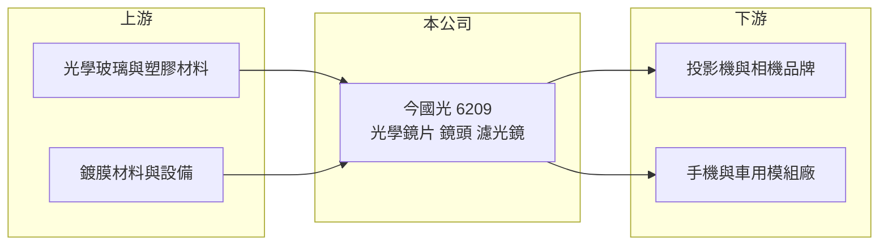

# 6209 今國光

> 上市｜[[產業索引-光電業|光電業]]｜上市（櫃）日期 2004/11/08

# 第一章：企業模式與商業藍圖

> [!info] 撰寫說明
> 精簡版，由 Claude 依公開資料整理，架構比照 [[2330台積電]]，資料截至 2026-10-07。來源：nstock 公司資料頁、winvest 營收快訊、優分析焦點股報導標題。營收比重與成長來源未查得。#待校對

今國光是光學鏡片與鏡頭廠，2026 年營收大幅成長，本章說明其業務。

- **核心業務：** 公司登記業務為相機濾光鏡、相機透鏡及特殊相機的設計與買賣，屬於 [[光學鏡頭]] 與光學元件的中游廠商。
- **營收結構：** 本次未查到產品別營收比重；依業界資料推估產品涵蓋投影機鏡頭、相機與手機鏡片及 [[車用鏡頭]] 等，濾光鏡則仰賴 [[光學鍍膜]] 製程。
- **營運據點：** 生產據點分布本次未查證。
- **長期方向：** 2026 年營收年增近七成，成長由哪一類產品帶動本次未查證，是理解公司方向的關鍵。

# 第二章：護城河深度與競爭優勢

光學鏡片需要精密研磨、鍍膜與組裝經驗，今國光的競爭力來自製程累積。

- **競爭優勢：** 長期經營玻璃與光學鏡片製程，可提供多種光學元件給品牌客戶（推估）。
- **主要對手：** [[3008大立光]]、[[3406玉晶光]]、[[3019亞光]]，以及舜宇光學等中國廠。
- **觀察重點：** 營收連續數月年增七成至一倍以上，需確認成長來源是否可持續，以及毛利率能否維持。

# 第三章：財務體質與盈利規模

資料日期：2026-10-07，以下數字是撰寫當時的快照；最新月營收、毛利率、累計 EPS 由自動排程寫在本筆記的屬性欄位（月營收、毛利率、累計EPS 等）。#待校對

今國光 2026 年營收與獲利同步走高，8 月營收創歷史新高。

- **營收規模：** 2025 年全年營收 36.52 億元；2026 年 1 至 8 月累計 34.95 億元，年增 69.57%；8 月單月 5.57 億元，年增 106.76%，創歷史新高。
- **獲利：** 2026 年上半年 EPS 1.53 元，第二季 EPS 0.73 元，第二季 [[毛利率]] 25.42%，[[營業利益率]] 10.92%。
- **財務特色：** 最新一次現金股利 0.5 元，近五年平均現金股利 0.44 元；營業利益率達兩位數，在光學中小型廠中屬穩健。

# 第四章：總體風險與地緣政治

今國光的風險在於高成長能否延續，以及光學產業的價格競爭。

- **產業週期：** 消費電子與投影機需求有明顯週期，客戶庫存調整時訂單可能快速下滑。
- **營運風險：** 營收短期暴增可能集中於少數客戶或產品，若訂單轉移，營收與產能利用率會同步下降（推估）。
- **其他風險：** 中國光學廠低價競爭、匯率波動，以及兩岸生產布局的地緣政治風險。

# 專有名詞解析

## 應用

- **[[車用鏡頭]]**：裝在車上供行車紀錄、倒車影像與駕駛輔助系統使用的鏡頭，需耐高低溫與震動。
- **[[光學鍍膜]]**：在鏡片表面鍍上薄膜以減少反射、過濾特定波長，是濾光鏡的核心製程。

## 產業

- **[[光學鏡頭]]**：由多片鏡片組成、用來成像或投射光線的元件，用於相機、投影機、手機與車輛。

# 核心供應鏈

- 上游：光學玻璃材料（如日本 HOYA、小原）、鍍膜材料與設備
- 下游／客戶：投影機、相機、手機與車用鏡頭模組廠（推估）
- 同業：[[3008大立光]]、[[3406玉晶光]]、[[3019亞光]]

## 最新新聞
<!-- news:start -->
<!-- news:end -->

## 相關連結
- [公開資訊觀測站](https://mopsov.twse.com.tw/mops/web/t05st03?step=1&firstin=1&co_id=6209)
- [Goodinfo](https://goodinfo.tw/tw/StockDetail.asp?STOCK_ID=6209)
- [Yahoo 股市](https://tw.stock.yahoo.com/quote/6209)
- [鉅亨網新聞](https://www.cnyes.com/twstock/6209/news)
