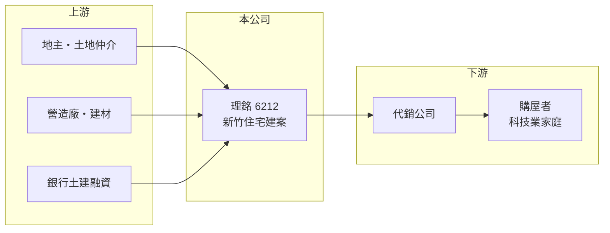

# 6212 理銘

> 上櫃｜[[產業索引-建材營造業|建材營造業]]｜上市（櫃）日期 2002/12/26

# 第一章：企業模式與商業藍圖

> [!info] 撰寫說明
> 精簡版，由 Claude 依公開資料整理，架構比照 [[2330台積電]]，資料截至 2026-10-08。來源：櫃買中心開放資料快照（基本資料、2026 年第二季資產負債與損益、每月營收、本益比殖利率）、MoneyDJ 理財網財務比率年表（2021 至 2025 年）與個股基本資料（2025 年營收比重、歷年股利）、CMoney 報導標題。公開資料有限，個別建案名稱與土地庫存未查得；年度營收由 2025 年每股營業額與歷年成長率回推，屬推算。#待校對

理銘開發成立於 1977 年 11 月，2002 年 12 月在櫃買中心上櫃，是以新竹為主要市場的建設公司。新竹科學園區帶來的高所得人口，是它長期的需求基礎。

- **核心業務：** 理銘購地、興建住宅及大樓後出售或出租。建案以[[預售屋]]方式先銷售，等[[建案交屋]]才認列營收，因此營收在交屋年度暴增、空窗年度驟減，2023 年營收成長約 3.6 倍、2025 年又減少約 55%，就是這個原因。
- **營收結構：** 依 MoneyDJ 的分類，2025 年「興建住宅及大樓之出租/出售」占 100%，業務完全集中在不動產開發。
- **營運據點：** 公司登記於新竹市公道五路，媒體將其歸類為新竹地區營建商，推案以新竹市與竹北一帶為主（推估）。
- **長期方向：** 理銘的資本公積為 0，股本 10.2 億元多年未變，保留盈餘則累積到約 28.3 億元，每股淨值從 2021 年的 25.46 元增加到 2025 年的 36.53 元。這代表公司長期靠自有獲利累積資本，而非向股東增資。新竹的半導體產業擴張能否持續帶動購屋需求，是長期成長的關鍵。

# 第二章：護城河深度與競爭優勢

地方型建商的護城河來自在地經驗與土地取得時機，理銘的優勢在於深耕新竹、緊貼科技業的購屋需求。

- **競爭優勢：** 新竹的房市需求與科學園區的就業與薪資高度相關，長期在當地推案的建商熟悉地段與客群，能較準確地規劃產品。理銘 2025 年[[毛利率]]達 39.49%、營業利益率 31.4%，均為五年來最高，顯示近年交屋建案的土地成本或售價條件良好。
- **主要對手：** 新竹與竹北的建商眾多，包括大量未上市的地方建商與全國性建商（名稱未查得）；上市櫃同業可對照 [[2542興富發]]、[[6186新潤]] 等（推估名單）。
- **觀察重點：** 觀察[[已售未入帳]]金額與新推案的銷售率；2026 年 1 至 8 月營收較前一年同期減少約 43%，下一批交屋時點是重要觀察點。半導體業的景氣與擴廠節奏，也會影響新竹的購屋需求。

# 第三章：財務體質與盈利規模

資料日期：2026-10-08，表格是撰寫當時的快照；最新月營收、毛利率、累計 EPS 由自動排程寫在本筆記的屬性欄位（月營收、毛利率、累計EPS 等）。#待校對

理銘五年來每年都有獲利，營收隨交屋時點劇烈起伏，但毛利率與營業利益率近年逐步提升。

| 年度 | 營收（推算） | [[毛利率]] | [[營業利益率]] | EPS（元） | [[ROE]] |
|---|---|---|---|---|---|
| 2021 | 約 32.8 億 | 22.56% | 15.91% | 4.09 | 16.40% |
| 2022 | 約 12.3 億 | 29.61% | 20.18% | 1.75 | 6.66% |
| 2023 | 約 56.6 億 | 20.20% | 14.43% | 6.26 | 20.64% |
| 2024 | 約 37.9 億 | 27.08% | 20.93% | 6.09 | 17.52% |
| 2025 | 約 16.9 億 | 39.49% | 31.40% | 3.96 | 10.90% |

- **長期指標：** 近 5 年平均 ROE 約 14.4%（推算）；營收年複合成長率因交屋時點不同，不具參考性。現金股利（MoneyDJ 列示 108 至 114 年度）依序為 0、3.00、0、0、3.50、3.50、0 元，配發不規律，2025 年度未配發（櫃買中心殖利率資料亦為 0），公司較傾向保留資金推案。
- **[[ROIC]] 與 [[WACC]]：** 2025 年營業利益約 5.33 億元（營收約 16.9 億元 × 營業利益率 31.4%），稅後約 4.26 億元；投入資本以 2026 年第二季股東權益 38.2 億元加上總負債 74.3 億元的一半（約 37.2 億元，假設一半為有息負債）計，約 75.4 億元，ROIC 約 5.6%（推算）。WACC 約 5.1%（推算：無風險利率 1.75%、市場風險溢酬 6%、β 取建設股常見值 1.0，股東權益成本約 7.75%；稅前負債成本 3%、稅率 20%；負債權重約 49%）。2025 年 ROIC 略高於 WACC；2023 至 2024 年交屋大年 ROE 在 17% 至 21%，利差更大，整體而言公司長期有在創造價值。
- **營建業指標與財務特色：** 2026 年第二季底資產約 112.5 億元，其中流動資產（主要是土地與在建房地）約 111.6 億元，負債約 74.3 億元，負債比率從 2021 年的 80% 降到 2025 年的 66%。2026 年上半年營收 5.51 億元、毛利率約 38.8%、EPS 0.96 元。

# 第四章：總體風險與地緣政治

理銘的風險與所有建設公司相同，另外還有新竹市場對半導體景氣的依賴。

- **產業週期：** 房地產週期長，推案時的房價與交屋時的市場可能不同；新竹房價高度連動科技業薪資與股票分紅，半導體景氣反轉時，購屋需求可能快速降溫。
- **營運風險：** 推案集中在新竹（推估），缺乏區域分散；營收依賴少數建案，交屋空窗會讓單年獲利大幅下滑。營造成本上升與工期延誤也會壓縮毛利。
- **其他風險：** 央行[[信用管制]]、囤房稅與預售屋轉售限制等政策，會直接影響買方需求與建商融資；利率上升會同時提高建商融資成本與買方的房貸負擔。

# 專有名詞解析

## 金融

- **[[信用管制]]**：央行限制購屋與建商貸款成數的政策，會影響房市成交與建商資金。
- **[[ROIC]]**：投入資本報酬率，稅後營業利益除以股東權益加有息負債，衡量本業運用資本的效率。
- **[[WACC]]**：加權平均資金成本，股東與債權人要求報酬率的加權平均，是 ROIC 要超越的門檻。

## 產業

- **[[預售屋]]**：房屋在興建完成前就先銷售，買方分期繳款，建商可藉此降低資金與銷售風險。
- **[[建案交屋]]**：建商在房屋完工並交付買方時才認列營收，因此營建公司的營收常集中在交屋年度。
- **[[已售未入帳]]**：已經賣出、但尚未完工交屋而未認列營收的建案金額，是建商未來營收的主要能見度指標。

# 核心供應鏈

- 上游：地主與土地仲介、營造廠、建材供應商與提供土建融資的銀行（名稱未查得）。
- 下游／客戶：代銷公司與購屋者，以新竹科技業家庭為主要客群（推估）。
- 同業：新竹地區建商（名稱未查得）；上市櫃對照 [[2542興富發]]、[[6186新潤]]（推估名單）。

## 最新新聞
<!-- news:start -->
<!-- news:end -->

## 相關連結
- [公開資訊觀測站](https://mopsov.twse.com.tw/mops/web/t05st03?step=1&firstin=1&co_id=6212)
- [Goodinfo](https://goodinfo.tw/tw/StockDetail.asp?STOCK_ID=6212)
- [Yahoo 股市](https://tw.stock.yahoo.com/quote/6212)
- [鉅亨網新聞](https://www.cnyes.com/twstock/6212/news)
