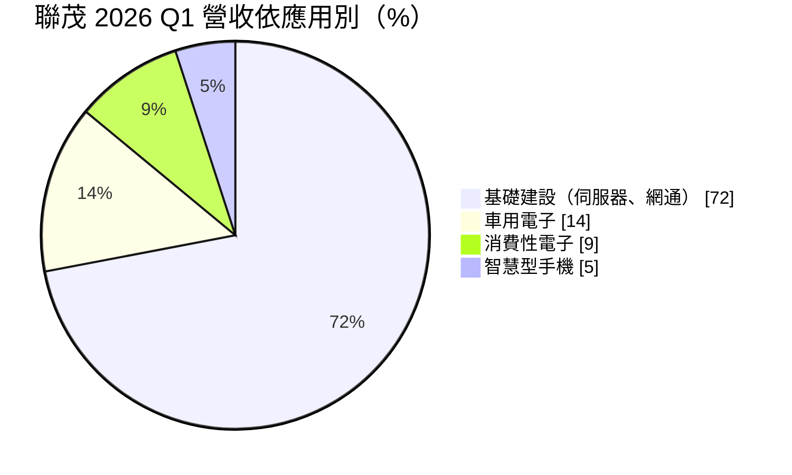
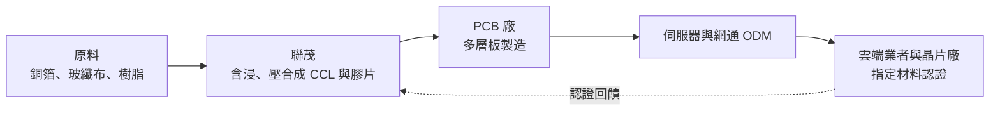
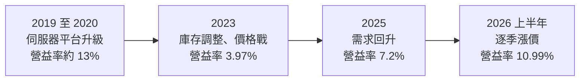
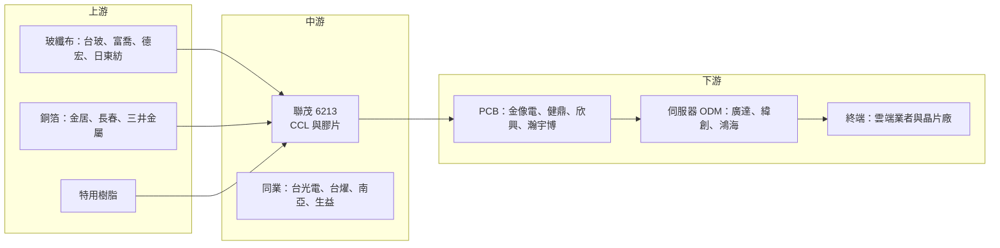

# 6213 聯茂

> 上市｜[[產業索引-電子零組件業|電子零組件業]]｜上市（櫃）日期 2008/01/21

# 第一章：企業模式與商業藍圖

> [!info] 撰寫說明
> 本文由 Claude 依公開資料整理，架構比照 [[2330台積電]] 的四章研究，資料截至 2026-10-08。財務數字來源：Goodinfo 年度經營績效頁、證交所開放資料（基本資料、綜合損益、資產負債、營益分析、股利）、富果研究 2026 年 5 月法說會整理、優分析法說報導；產業描述為整理性內容，尚未逐條比對原始文件。#待校對

拆解一家材料公司的長期價值，第一步是弄清楚它賣的是什麼、賣給誰，以及獲利從哪一層產生。本章針對聯茂電子（股票代號：6213，以下簡稱聯茂）的商業模式進行定性分析，說明它如何從一般型伺服器的材料供應商，逐步往 AI 與高速網通材料升級。

## 一、核心定位：以伺服器為主力的銅箔基板廠

聯茂成立於 1997 年，主要產品是[[CCL]]（銅箔基板）與[[膠片]]（prepreg），也就是印刷電路板（[[PCB]]）最底層的絕緣與導電材料。電路板廠把 CCL 一層層疊壓、鑽孔、蝕刻成多層板，再交給組裝廠做成伺服器主機板、交換器線卡或車用電子模組。因此，聯茂的客戶是 PCB 廠，但真正決定它能否被採用的，往往是更下游的晶片廠、雲端業者與系統廠，因為這些終端業者會指定電路板必須使用經過認證的材料型號。

CCL 是一個看起來同質、實際上分級很細的產業。一般消費性電子用的 FR-4 材料技術門檻低，價格主要由[[銅箔]]、[[玻纖布]]與樹脂成本決定；伺服器、交換器與 AI 加速卡所用的高速材料，則要求極低的訊號損耗（業界以 Low Dk/Df 衡量），並依損耗等級分成 M2、M4、M6、[[M7]]、M8、M9 等級距。等級越高，單價越高，認證時間越長，能供貨的廠商也越少。聯茂的長期定位，就是在伺服器這個最大宗的高速材料市場維持領先份額，並把產品組合往高等級移動。

這個定位帶來兩個重要的商業意義：

* **伺服器平台綁定帶來穩定需求：** 依富果研究整理的 2026 年 5 月法說會內容，一般型伺服器的 CPU 平台約占聯茂營收 60%，公司自稱在此領域市占領先。伺服器平台一旦採用某家材料，在該平台生命週期內通常不會輕易更換，這讓聯茂有相對穩定的基本盤。
* **升級週期是毛利擴張的來源：** 每一代伺服器平台（例如 PCIe 世代更新）都會提高對材料損耗等級的要求。公司在法說中表示 M7 等級的毛利率約 30%，遠高於整體平均，因此平台升級帶來的產品組合改善，是聯茂長期毛利能否往上的關鍵。

## 二、終端應用板塊：基礎建設為主，車用與消費為輔

依 2026 年第一季法說會揭露的應用別比重如下：

* **基礎建設：** 占比約 72%，其中八成以上為一般型伺服器，其餘包括 [[AI伺服器]]周邊板與網通設備。聯茂持續供應主要 AI GPU 大廠的周邊板材料（如 riser card、網路卡、交換卡），並為 AWS、Meta 等雲端業者（[[CSP]]）的自研晶片（[[ASIC]]）平台提供 M7、M8 材料。
* **車用電子：** 約占 14%。車用板對可靠度與耐熱要求高，認證流程長，一旦打入通常可以穩定供貨多年，但成長速度取決於汽車電子化的節奏。
* **消費性電子與手機：** 合計約 14%。這部分以一般材料為主，價格競爭激烈，對整體獲利貢獻相對有限，主要用途是填滿產能。

依材料等級區分，法說會資料顯示 M4/M2 等中低階材料約占 60% 至 70%，M6 約 25%，M7 約 5% 至 6%，M8 為低個位數。也就是說，聯茂目前的營收主體仍是中階材料，高階材料占比的提升才剛起步。公司預期 M8 將隨 AI ASIC 新客戶在 2027 年放量，M9 已通過美系 GPU 大廠認證，M10 則在送樣階段。

## 三、資本轉化邏輯：買進原料、壓合成板、靠等級賺價差

CCL 的成本結構中，原物料占比很高，因此這是一個「材料轉嫁」與「產品組合」決定獲利的生意。可以從三個面向理解：

* **成本轉嫁的時間差：** 銅箔與玻纖布價格上漲時，CCL 廠必須向 PCB 廠調漲售價，但報價通常落後成本一段時間。2026 年第一季聯茂毛利率降到 11.42%，主因就是原物料漲價而售價尚未即時反映；公司在法說會表示「逐季漲價」已成為 2026 年的常態模式，第二季整體價格至少上漲兩成。這說明 CCL 廠的短期毛利會隨原料價格擺盪，但長期能否轉嫁，取決於供需是否偏緊。
* **產能布局決定接單能力：** 聯茂的產能主要在中國江西，約 240 萬張，占總產能近一半；泰國廠目前約 30 萬張，2026 年底再增加 30 萬張，2028 年上半年起再逐季釋出 60 萬張。台灣則定位為高階材料研發中心。把擴產重心放在泰國，是為了回應客戶「中國以外產能」的需求（推估，法說會提及泰國為主要擴產基地）。
* **認證門檻就是進入障礙：** 高速材料必須先通過晶片廠與雲端業者的電性驗證，再由 PCB 廠完成製程驗證，整個過程往往長達一年以上。這讓先通過認證的廠商在該平台生命週期內享有先行者優勢。

## 四、企業長期藍圖：從伺服器基本盤走向 AI 與衛星

聯茂的長期策略可以歸納為三條主線。第一是鞏固一般型伺服器的領先地位，這是公司的現金來源，也是它和客戶建立長期關係的基礎。第二是提高高階材料占比，把 M7、M8 推進 AI ASIC 與高速交換器平台，並以 M9 爭取 GPU 平台的下一代設計。第三是拓展新應用，法說會提到公司 2026 年首度切入[[低軌衛星]]，已送樣 M4、M6、M7 材料，預計 2027 年上半年開始貢獻營收。

在供應鏈方面，公司與台灣、日本及中國的玻纖布廠簽訂策略合作，以確保擴產所需的原料。這反映出 CCL 產業在 AI 需求爆發後的新現實：瓶頸不只在 CCL 本身，也在上游的低介電玻纖布與高階銅箔。長期而言，誰能穩定取得高階原料，誰就能在供給緊張時拿到更好的價格與客戶。

# 第二章：護城河深度與競爭優勢

護城河分析的核心問題是：這家公司的優勢能否在十年後依然存在？本章針對聯茂的競爭優勢進行拆解，並與國內外 CCL 同業比較，評估它在高速材料競賽中的位置。

## 一、護城河的核心組成要素

* **平台認證與客戶黏著度：** 伺服器與網通設備的材料必須經過晶片廠、系統廠與 PCB 廠多層驗證，一旦某一代平台採用聯茂的材料，在整個平台生命週期內換料的成本與風險都很高。這種「被寫進設計規格」的地位，是 CCL 廠最主要的護城河，也是聯茂在一般型伺服器維持領先市占的原因。
* **規模與中國以外產能：** 江西廠提供規模經濟，泰國廠則提供地緣分散的產能。在美中貿易摩擦與關稅不確定的環境下，雲端業者與系統廠愈來愈重視非中國產能，泰國擴產因此不只是增加量，也提高了聯茂在國際客戶心中的供應安全分數。
* **樹脂配方與製程經驗：** 高速材料的關鍵在於樹脂系統的配方，以及含浸、壓合時對厚度與介電常數的精準控制。這些經驗需要多年累積，新進者很難在短時間內複製，但這項優勢在同業之間並不獨特，台光電與台燿都具備同等甚至更高的技術水準。

## 二、全球主要競爭對手格局

| 公司 | 所在地 | 定位與強項 | 與聯茂的關係 |
|---|---|---|---|
| [[2383台光電]] | 台灣 | 全球高速 CCL 龍頭，AI GPU 與高階交換器材料市占最高 | 高階材料的主要對手，技術與規模領先 |
| [[6274台燿]] | 台灣 | 高速網通與交換器材料見長，近年 M7、M8 占比快速提升 | 在 AI ASIC 與交換器材料正面競爭 |
| [[1303南亞]] | 台灣 | 台塑集團旗下，垂直整合玻纖布與銅箔 | 中低階材料的價格競爭者 |
| [[6672騰輝電子-KY]] | 台灣 | 車用與特殊材料為主 | 車用材料的競爭者 |
| 生益科技 | 中國 | 中國最大 CCL 廠，產品線完整 | 中國市場與中階材料的主要對手 |
| 建滔積層板 | 香港／中國 | 垂直整合上游原料，以一般材料規模取勝 | 中低階材料價格的決定者之一 |
| Panasonic | 日本 | Megtron 系列是高速材料的早期標竿 | 高階材料的國際對手 |
| 斗山電子 | 韓國 | 高階記憶體與網通材料 | 部分 AI 平台的競爭者 |

從格局來看，聯茂在一般型伺服器的地位穩固，但在 AI GPU 與高階交換器這兩個附加價值最高的市場，目前仍落後台光電與台燿。2026 年法說會提到聯茂接到同業產能滿載後的溢出訂單，這一方面說明需求強勁，另一方面也說明它在最高階平台上，部分時候扮演的是第二或第三供應商的角色。

## 三、優勢轉化：守得住、守不住與觀察重點

* **守得住：** 一般型伺服器的平台份額。這塊市場量大、認證週期長，聯茂累積的客戶關係與產品認證使其能穩定供貨，並且是公司現金流的主要來源。即使 AI 伺服器搶走市場目光，一般型伺服器仍是資料中心的基本配置。
* **守不住：** 中低階材料的價格。M2、M4 等材料同質性高，中國同業產能龐大，當原料價格回落或需求降溫時，這部分的售價通常最先鬆動。2023 年聯茂營業利益率降到 3.97%，就是一般材料在需求低谷時缺乏定價能力的例子。
* **觀察重點：** 第一，M7 以上高階材料占營收比重能否如公司預期從個位數提升到兩成以上；第二，M8、M9 能否在 AI ASIC 與 GPU 平台取得主要供應商地位，而非僅承接溢出訂單；第三，泰國廠擴產能否如期，並取得足夠的高階玻纖布。這三點決定聯茂能否從「伺服器材料大廠」升級為「AI 材料核心供應商」。

# 第三章：財務體質與盈利規模

資料日期：2026-10-08。數字取自 Goodinfo 年度經營績效頁與證交所開放資料，表格是撰寫當時的快照；最新月營收、毛利率、累計 EPS 由自動排程寫在本筆記的屬性欄位（月營收、毛利率、累計EPS 等）。#待校對

財務報表是檢驗護城河是否真實存在的最終標準。本章用多年度的三率、ROE 與資本報酬，檢視聯茂在 CCL 景氣循環中的獲利品質。

## 一、獲利能力的基石：三率

| 年度 | 營收（新台幣） | [[毛利率]] | [[營業利益率]] | EPS（元） | [[ROE]] |
|---|---|---|---|---|---|
| 2017 | 212 億 | 14.6% | 8.26% | 4.11 | 17.5% |
| 2018 | 224 億 | 14.5% | 7.97% | 5.86 | 23.2% |
| 2019 | 238 億 | 20.1% | 13.0% | 8.13 | 29.1% |
| 2020 | 254 億 | 19.5% | 12.7% | 8.19 | 23.9% |
| 2021 | 325 億 | 18.4% | 11.7% | 9.00 | 18.1% |
| 2022 | 291 億 | 13.5% | 6.51% | 4.94 | 8.96% |
| 2023 | 251 億 | 12.4% | 3.97% | 1.86 | 3.42% |
| 2024 | 294 億 | 12.6% | 4.6% | 2.26 | 4.1% |
| 2025 | 331 億 | 14.5% | 7.2% | 4.16 | 7.21% |
| 2026 上半年 | 206.7 億 | 17.33% | 10.99% | 4.39 | 未查得 |

註：2017 至 2025 年取自 Goodinfo；2026 上半年取自證交所綜合損益與營益分析開放資料。

* **[[毛利率]]：** 聯茂的毛利率長期落在 12% 至 20% 之間，明顯低於以高階材料為主的同業。2019 至 2020 年伺服器平台升級時毛利率曾達 20% 左右，2023 年需求低谷時降到 12.4%。毛利率的高低主要取決於兩件事：產品組合中高階材料的比重，以及原料漲價能否順利轉嫁。
* **[[營業利益率]]：** CCL 廠的營業費用相對固定，營收擴大時營業利益率擴張得比毛利率快。2023 年營業利益率只有 3.97%，2026 年上半年回升到 10.99%，波動幅度大於毛利率，是典型的營運槓桿。
* **營收趨勢：** 2020 年至 2025 年營收從 254 億元成長到 331 億元，年複合成長率約 5.4%（推算），成長並不快，期間還經歷 2022 至 2023 年的衰退，顯示聯茂的營收高度受伺服器與電子產業週期影響。
* **稅率偏高：** 2026 年上半年所得稅費用 7.23 億元，占稅前淨利約 31%（依證交所資料推算），公司法說會也表示今年有效稅率約 35%，主因中國廠盈餘的稅負。這使得聯茂的稅後淨利率明顯低於營業利益率。

## 二、[[ROE]]：資本效率

2021 至 2025 年平均 ROE 約 8.4%（推算），遠低於 2017 至 2020 年平均約 23%。這段落差反映兩件事：一是 2022 至 2024 年產業景氣低迷，二是聯茂在一般材料占比較高的情況下，獲利容易被價格戰侵蝕。2026 年第二季底歸屬母公司權益約 225.9 億元，每股淨值 62.14 元（證交所資料），上半年 EPS 4.39 元，若全年獲利維持上半年水準，ROE 可望回到 14% 左右（推算）。

## 三、資本支出、自由現金流與股利

聯茂近年的資本支出集中在泰國廠。公司未在法說會揭露具體金額，但泰國擴產規劃一路排到 2028 年，代表未來幾年資本支出將維持相對高檔。CCL 屬於中度資本密集產業，景氣好時營收擴張會同時增加應收帳款與存貨，營運現金流可能落後於獲利；長期自由現金流大致為正，但具體金額未查得。

股利方面，2025 年度配發現金股利 3 元，以 EPS 4.16 元計算配發率約 72%（推算）。公司章程規定現金股利不得低於股利總額的 20%，並表示處於成長期，股利會考量資本支出與營運資金規劃，因此配息率可能隨擴產需求調整。

## 四、[[ROIC]] 與 [[WACC]]：價值創造利差

**ROIC 推算：** 2025 年營收 331 億元乘以營業利益率 7.2%，營業利益約 23.8 億元，扣除 20% 稅率後約 19.1 億元。2026 年第二季底權益總計約 225.9 億元，總負債約 207 億元，假設其中約四成為有息負債（推估，約 83 億元），投入資本約 309 億元，2025 年 ROIC 約 6.2%（推算）。若以 2026 年上半年營業利益 22.7 億元年化並用相同資本基礎計算，ROIC 約 11.8%（推算）。若改用聯茂實際約 31% 至 35% 的有效稅率，ROIC 還會再低 1 至 2 個百分點。

**WACC 推算：** 假設台灣 10 年期公債殖利率 1.75%、市場風險溢酬 6%、β 取電子零組件常見值 1.2，股東權益成本約 8.95%。負債成本假設 2.5%，稅後約 2.0%。以帳面價值計，權益約占 73%、負債約占 27%，WACC 約 7.1%（推算）；若以市值計算，由於股價淨值比偏高（2026 年 10 月初約 12.7 倍，證交所本益比資料），權益比重接近百分之百，WACC 會接近 9%（推算）。

**結論：** 聯茂在 2019 至 2021 年伺服器景氣高峰時 ROIC 明顯高於 WACC，2022 至 2025 年則低於或接近資金成本，處於「沒有明顯創造價值」的狀態。2026 年漲價與高階材料放量讓 ROIC 回升到資金成本之上，但這是否能延續，取決於高階材料占比能否結構性提高，而不只是一次性的漲價效應。對長期投資人而言，聯茂是一家典型的週期型材料股，景氣循環的位置比單一年度的獲利更重要。

# 第四章：總體風險與地緣政治

任何企業都無法脫離宏觀環境獨立存在。本章分析聯茂未來必須面對的地緣政治、產業週期、營運與技術風險。

## 一、地緣政治

* **中國產能的雙面性：** 江西廠約占總產能一半，提供成本與規模優勢，但也讓聯茂暴露在美中貿易摩擦、關稅與出口管制的風險之下。美國雲端業者與系統廠若要求供應鏈進一步去中國化，江西產能能服務的客戶範圍可能縮小。
* **泰國擴產的執行風險：** 泰國是聯茂分散地緣風險的主要解方，但新廠需要時間爬坡，設備交期長達一年以上，人才與供應鏈也需要重新建立。若擴產進度延誤，可能錯過客戶要求非中國產能的窗口。
* **台灣據點的角色：** 台灣主要負責高階材料研發，與其他台灣科技廠一樣面臨兩岸情勢的長期不確定性。

## 二、產業週期與市場結構

* **CCL 是典型的週期產業：** 2021 年至 2023 年聯茂營收從 325 億元降到 251 億元，EPS 從 9 元降到 1.86 元，說明電子產業庫存調整時，CCL 廠的獲利會大幅收縮。伺服器、手機與消費性電子的需求波動，會沿著 PCB 供應鏈放大成[[長鞭效應]]。
* **原料價格決定短期毛利：** 銅價、玻纖布與樹脂價格上漲時，若轉嫁不及，毛利率會先受壓；原料價格下跌時，售價也往往跟著下修。2026 年的逐季漲價模式建立在供給偏緊的前提上，一旦玻纖布與 CCL 新產能在 2027 至 2028 年大量開出，價格可能回落。
* **市場集中在少數平台：** 一般型伺服器約占營收 60%，若主要 CPU 平台的材料規格轉向其他供應商，或伺服器資本支出被 AI 伺服器排擠，聯茂的基本盤會受到影響。

## 三、營運環境的隱性風險

* **高階玻纖布短缺：** 2026 年上半年聯茂產能利用率約 75%，法說會指出主因是 E-glass 玻纖布短缺與泰國新廠爬坡。低介電玻纖布的供應集中在少數日本與台灣廠商，若缺料延續，聯茂即使有訂單也無法全數出貨。
* **高稅率侵蝕淨利：** 有效稅率約 35%，公司表示要到 2027 年後才會逐步下降，這使得營業利益轉成股東報酬的效率偏低。
* **匯率：** 營收以美元計價為主，新台幣升值時會壓縮以台幣計算的營收與毛利率。

## 四、科技演進風險

高速材料的規格每隔兩到三年就會升級一次，從 M6、M7 走向 M8、M9，未來 AI 平台甚至可能採用石英玻纖布或其他新材料。每一次升級都是重新洗牌的機會：技術領先者可以拿到新平台，落後者則只能在舊規格上與更多廠商競爭價格。聯茂已通過 M9 部分認證，但能否在下一代平台成為主要供應商仍待觀察。此外，[[CoWoS]] 等先進封裝與共同封裝光學可能改變電路板的設計方式，長期也會影響 CCL 的需求結構。

# 專有名詞解析

## 半導體

- **[[ASIC]]**：特殊應用積體電路，為特定用途客製設計的晶片，雲端業者自研的 AI 加速晶片多屬此類。

## 應用

- **[[AI伺服器]]**：搭載 GPU 或 AI 加速晶片的伺服器，對電路板層數、材料等級與散熱要求遠高於一般伺服器。
- **[[CSP]]**：雲端服務供應商，例如 AWS、Microsoft、Google、Meta，是資料中心設備的最大買家。

## 金融

- **[[長鞭效應]]**：終端需求的小幅變動，沿供應鏈往上游傳遞時被逐級放大，造成上游庫存與訂單劇烈波動。
- **[[ROIC]]**：投入資本報酬率，衡量公司每投入一元營運資本能賺回多少稅後營業利益。
- **[[WACC]]**：加權平均資金成本，股東與債權人要求報酬的加權平均，ROIC 高於 WACC 才代表創造價值。

## 產業

- **[[CCL]]**：銅箔基板，在玻纖布與樹脂構成的絕緣層兩面貼上銅箔，是印刷電路板最底層的材料。
- **[[PCB]]**：印刷電路板，用來承載並連接電子元件的板子，伺服器主機板與手機主板都是 PCB。
- **[[玻纖布]]**：以玻璃纖維織成的布，是 CCL 的骨架材料，低介電玻纖布是高速材料的關鍵原料。
- **[[銅箔]]**：貼在 CCL 表面的薄銅層，用來形成電路，高速材料需要表面更平滑的低粗糙度銅箔。
- **[[Low Dk Df]]**：低介電常數與低介電損耗，數值越低代表訊號在電路板中傳輸時衰減越少，是高速材料的核心規格。
- **[[M7]]**：業界對高速 CCL 損耗等級的通稱之一，數字越大代表損耗越低、單價越高，M7 以上多用於 AI 伺服器與高速交換器。
- **[[膠片]]**：又稱 prepreg，含浸樹脂後半固化的玻纖布，用來黏合多層電路板的各層。
- **[[低軌衛星]]**：在約 500 至 2,000 公里高度運行的通訊衛星，地面設備與衛星本體需要高頻低損耗材料。

# 核心供應鏈

## 1. 上游：玻纖布、銅箔與樹脂
- 玻纖布：[[1802台玻]]、[[1815富喬]]、[[5475德宏]]、日東紡（Nittobo）
- 銅箔：[[8358金居]]、長春集團、三井金屬
- 樹脂：日系與美系特用樹脂廠（具體供應商未查得）

## 2. 中游：聯茂本身與 CCL 同業
- 高速材料同業：[[2383台光電]]、[[6274台燿]]
- 一般與中階材料同業：[[1303南亞]]、[[6672騰輝電子-KY]]、生益科技、建滔積層板
- 國際對手：Panasonic、斗山電子

## 3. 下游：PCB 廠
- 伺服器與網通板：[[2368金像電]]、[[3044健鼎]]、[[5469瀚宇博]]、[[8155博智]]
- 載板與 HDI：[[3037欣興]]、[[2313華通]]

## 4. 下游：系統廠與終端客戶
- 伺服器 ODM：[[2382廣達]]、[[3231緯創]]、[[2317鴻海]]
- 雲端業者與晶片廠：[[AMZN亞馬遜]]、[[META臉書]]、[[NVDA輝達]]

## 最新新聞
<!-- news:start（自動產生，請勿手動編輯此範圍） -->
- 2026-10-08 📰 媒體 12:57｜聯茂泰國廠年底產能翻倍達每月60萬張 今年完成M8產品量產｜[鉅亨網](https://news.cnyes.com/news/id/6624711)
- 2026-10-08 📰 媒體 08:10｜鉅亨速報 - Factset 最新調查：聯茂(6213-TW)EPS預估上修至16.26元，預估目標價為610元｜[鉅亨網](https://news.cnyes.com/news/id/6624494)
- 2026-10-05 📰 媒體 17:50｜營收速報 - 聯茂(6213)9月營收58.24億元年增率高達110.74％｜[鉅亨網](https://news.cnyes.com/news/id/6621841)

完整紀錄：[[6213聯茂 新聞]]
<!-- news:end -->

## 相關連結
- [公開資訊觀測站](https://mopsov.twse.com.tw/mops/web/t05st03?step=1&firstin=1&co_id=6213)
- [Goodinfo](https://goodinfo.tw/tw/StockDetail.asp?STOCK_ID=6213)
- [Yahoo 股市](https://tw.stock.yahoo.com/quote/6213)
- [鉅亨網新聞](https://www.cnyes.com/twstock/6213/news)
