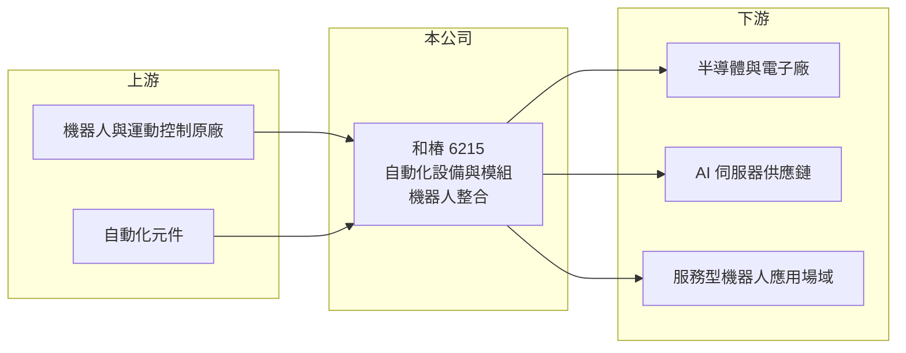

# 6215 和椿

> 上市｜[[產業索引-其他電子業|其他電子業]]｜上市（櫃）日期 2007/12/31

# 第一章：企業模式與商業藍圖

> [!info] 撰寫說明
> 精簡版，由 Claude 依公開資料整理，架構比照 [[2330台積電]]，資料截至 2026-10-07。來源：經濟日報 2026 年第一季財報報導、優分析、winvest 營收快訊。產品比重本次未查到。#待校對

和椿是[[工業自動化]]設備、模組與機器人整合商，2026 年在 AI 基礎建設與半導體擴產帶動下營收倍增。

- **核心業務：** 主力產品線為自動化設備與模組、機器人及其他產品，提供工廠自動化與機器人整合方案。
- **營收結構：** 報導指出設備與模組、機器人各產品線營收同步成長，但未揭露各類別比重。
- **營運據點：** 以台灣為主，生產與海外據點明細本次未查到。
- **長期方向：** 與普渡、優必選等[[服務型機器人]]品牌合作，並切入 AI 基礎建設、[[AI伺服器]]與高階半導體供應鏈，持續投入 AI 運算平台與機器人整合研發。

# 第二章：護城河深度與競爭優勢

和椿的優勢在系統整合能力與機器人品牌合作關係。

- **競爭優勢：** 自動化整合需依客戶產線客製，累積的產業應用經驗與原廠合作關係是主要門檻（推估）。
- **主要對手：** [[2049上銀]]、[[4583台灣精銳]]、[[8374羅昇]]、[[2464盟立]] 等台灣自動化與機器人業者。
- **觀察重點：** 2026 年 8 月營收年增 132.82%，觀察 AI 與半導體客戶擴產訂單能延續多久。

# 第三章：財務體質與盈利規模

資料日期：2026-10-07，以下數字是撰寫當時的快照；最新月營收、毛利率、累計 EPS 由自動排程寫在本筆記的屬性欄位（月營收、毛利率、累計EPS 等）。#待校對

和椿 2026 年營收與獲利同步大幅成長，毛利率也提升。

- **營收規模：** 2026 年第一季營收 7.73 億元，年增 58.7%；8 月單月營收 4.07 億元，年增 132.82%。
- **獲利：** 2026 年第一季稅後淨利 0.94 億元、EPS 1.14 元，年增約兩倍；[[毛利率]]約 29.9%（依營業毛利 2.31 億元推算）。2025 年全年 EPS 2.08 元，配發現金股利 1 元。
- **財務特色：** 營業毛利年增 101.2%，增幅高於營收，顯示產品組合改善與[[營運槓桿]]效果。

# 第四章：總體風險與地緣政治

和椿的風險在客戶擴產循環與新事業的不確定性。

- **產業週期：** 自動化設備需求跟隨製造業與半導體資本支出，客戶擴產放緩時訂單容易下滑。
- **營運風險：** 服務型機器人市場仍在早期，品牌合作能否轉為穩定營收尚待觀察。
- **其他風險：** 機器人與關鍵零組件多仰賴進口，匯率與中國品牌價格競爭會影響毛利。

# 專有名詞解析

## 應用

- **[[服務型機器人]]**：用於送餐、清潔、導覽、配送等商業與生活場景的機器人，有別於工廠內的工業機器人。
- **[[AI伺服器]]**：搭載 GPU 或 AI 加速器、專門執行 AI 訓練與推論的伺服器。

## 金融

- **[[營運槓桿]]**：固定成本占比高時，營收變動會以更大幅度反映在營業利益上。

## 產業

- **[[工業自動化]]**：以控制器、感測器、儀表與軟體讓生產流程自動運作，降低人力並提高穩定性。

# 核心供應鏈

- 上游：機器人品牌（普渡、優必選等）、運動控制與自動化元件原廠（推估）
- 下游／客戶：半導體與電子製造廠、AI 伺服器供應鏈、餐飲與服務業場域
- 同業：[[2049上銀]]、[[4583台灣精銳]]、[[8374羅昇]]、[[2464盟立]]

## 最新新聞
<!-- news:start -->
<!-- news:end -->

## 相關連結
- [公開資訊觀測站](https://mopsov.twse.com.tw/mops/web/t05st03?step=1&firstin=1&co_id=6215)
- [Goodinfo](https://goodinfo.tw/tw/StockDetail.asp?STOCK_ID=6215)
- [Yahoo 股市](https://tw.stock.yahoo.com/quote/6215)
- [鉅亨網新聞](https://www.cnyes.com/twstock/6215/news)
