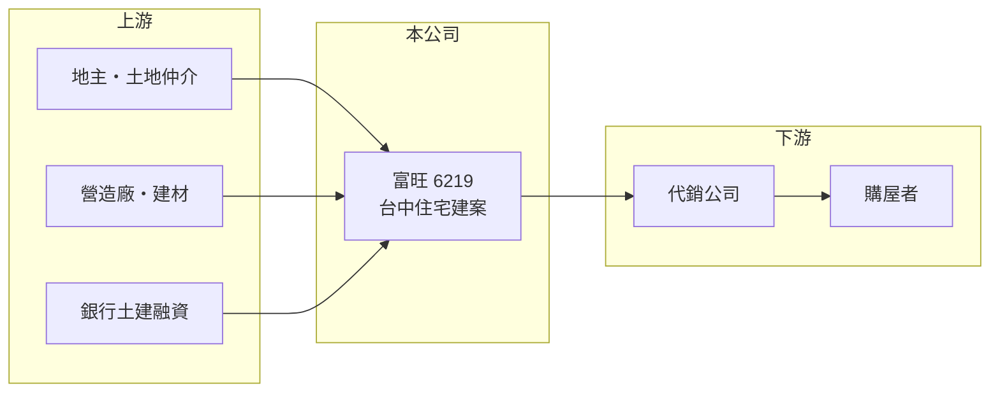

# 6219 富旺

> 上櫃｜[[產業索引-建材營造業|建材營造業]]｜上市（櫃）日期 2003/02/26

# 第一章：企業模式與商業藍圖

> [!info] 撰寫說明
> 精簡版，由 Claude 依公開資料整理，架構比照 [[2330台積電]]，資料截至 2026-10-08。來源：櫃買中心開放資料快照（基本資料、2026 年第二季資產負債與損益、每月營收）、MoneyDJ 理財網財務比率年表（2021 至 2025 年）與個股基本資料（2025 年營收比重、歷年股利）、聯合新聞網報導標題。公開資料有限，個別建案名稱、2022 年大幅虧損的原因與土地庫存未查得；年度營收由 2025 年每股營業額與歷年成長率回推，屬推算。#待校對

富旺國際開發成立於 1997 年 4 月，2003 年 2 月在櫃買中心上櫃，是以台中為總部的建設公司。它的特色是財務槓桿很高、獲利波動很大，五年中有三年虧損或接近虧損，也有 ROE 超過 30% 的年度。

- **核心業務：** 富旺購地、規劃興建住宅建案並銷售。建案以[[預售屋]]方式先銷售，等[[建案交屋]]才認列營收，因此營收與獲利集中在交屋年度；2025 年 1 至 8 月營收幾乎為零，全年營收則集中在下半年交屋入帳。
- **營收結構：** 依 MoneyDJ 的分類，2025 年房地銷售占 99.89%、其他占 0.11%，業務幾乎完全集中在建案銷售。
- **營運據點：** 公司登記於台中市西區，推案以台中為主（推估，依公司地址與報導），具體建案名單本次未查得。
- **長期方向：** 富旺的負債比率長期在 82% 至 91%，是高度依賴融資的開發模式。2022 年稅後淨利率 -169%、每股淨值從 12.2 元跌到 5.61 元，之後靠 2023 至 2024 年的交屋獲利回升到 15 元以上。在如此高的槓桿下，長期能否降低負債、讓獲利穩定下來，比擴大推案量更重要。

# 第二章：護城河深度與競爭優勢

高槓桿的地方型建商護城河很淺，富旺的優勢在於台中的在地經驗，但財務彈性是它最大的弱點。

- **競爭優勢：** 長期在台中推案，熟悉在地地段與買方偏好，是地方建商的主要優勢。富旺 2021 至 2024 年[[毛利率]]在 21% 至 27%，屬建設業一般水準，2025 年降到 14.95%，顯示部分建案的利潤空間受到壓縮。
- **主要對手：** 台中是全台建商最密集的城市之一，上市櫃同業包括 [[6171大城地產]]、[[2536宏普]]（推估名單），以及大量未上市的地方建商。
- **觀察重點：** 觀察[[已售未入帳]]金額與新推案的銷售率，以及負債比率能否下降。2026 年上半年營業利益約 0.68 億元，但業外淨損約 0.71 億元（推估主要是利息費用），使稅前轉為虧損，說明利息負擔已足以吃掉本業獲利。

# 第三章：財務體質與盈利規模

資料日期：2026-10-08，表格是撰寫當時的快照；最新月營收、毛利率、累計 EPS 由自動排程寫在本筆記的屬性欄位（月營收、毛利率、累計EPS 等）。#待校對

富旺的獲利呈現大起大落：2022 年大虧、2024 年 EPS 5.08 元、2025 年又轉為虧損，是高槓桿建商的典型樣貌。

| 年度 | 營收（推算） | [[毛利率]] | [[營業利益率]] | EPS（元） | [[ROE]] |
|---|---|---|---|---|---|
| 2021 | 約 31.9 億 | 22.00% | 11.86% | 0.44 | 3.39% |
| 2022 | 約 5.8 億 | 26.68% | -18.12% | -6.35 | -71.30% |
| 2023 | 約 26.0 億 | 21.29% | 6.44% | 2.02 | 16.42% |
| 2024 | 約 47.7 億 | 25.76% | 13.37% | 5.08 | 33.68% |
| 2025 | 約 27.7 億 | 14.95% | -2.94% | -0.76 | -4.65% |

- **長期指標：** 近 5 年平均 ROE 約 -4.6%（推算），主要被 2022 年的大虧拖累；營收年複合成長率因交屋時點不同，不具參考性。現金股利（MoneyDJ 列示 108 至 113 年度）依序為 1.17、2.00、0.25、0、0、0.70 元，配發不穩定，114 年度未見配發資料。
- **[[ROIC]] 與 [[WACC]]：** 2025 年營業利益約 -0.81 億元（營收約 27.7 億元 × 營業利益率 -2.94%），稅後約 -0.65 億元；投入資本以 2026 年第二季股東權益 19.8 億元加上總負債 125.5 億元的一半（約 62.7 億元，假設一半為有息負債）計，約 82.6 億元，ROIC 約 -0.8%（推算）；2024 年交屋大年則為正值。WACC 約 3.7% 至 4.1%（推算：無風險利率 1.75%、市場風險溢酬 6%、β 取 1.0 至 1.3，因槓桿高而上調區間，股東權益成本約 7.75% 至 9.55%；稅前負債成本 3%、稅率 20%；負債權重約 76%）。長期來看 ROIC 多數年度低於或接近 WACC，代表公司尚未穩定創造價值。
- **營建業指標與財務特色：** 2026 年第二季底資產約 145.3 億元，其中流動資產（主要是土地與在建房地）約 132.6 億元，負債約 125.5 億元、股東權益僅約 19.8 億元。2026 年上半年營收 12.75 億元、毛利率約 23.4%、EPS -0.07 元。

# 第四章：總體風險與地緣政治

富旺的風險以財務槓桿最為突出，房市稍有降溫就可能放大成虧損。

- **產業週期：** 房地產週期長，推案時的房價與交屋時的市場可能不同；高槓桿建商在房市降溫時最先受到衝擊，2022 年的大幅虧損就顯示獲利對景氣與個案非常敏感。
- **營運風險：** 負債比率接近九成，利息費用會持續侵蝕本業獲利；若建案銷售放緩，存貨與借款同時累積，可能需要降價求售或增資。推案集中在台中（推估），缺乏區域分散。
- **其他風險：** 央行[[信用管制]]限制建商土建融資與購屋貸款成數，對高槓桿建商的影響尤其大；利率上升、囤房稅與預售屋轉售限制也會影響資金與買方需求。

# 專有名詞解析

## 金融

- **[[信用管制]]**：央行限制購屋與建商貸款成數的政策，會影響房市成交與建商資金。
- **[[ROIC]]**：投入資本報酬率，稅後營業利益除以股東權益加有息負債，衡量本業運用資本的效率。
- **[[WACC]]**：加權平均資金成本，股東與債權人要求報酬率的加權平均，是 ROIC 要超越的門檻。

## 產業

- **[[預售屋]]**：房屋在興建完成前就先銷售，買方分期繳款，建商可藉此降低資金與銷售風險。
- **[[建案交屋]]**：建商在房屋完工並交付買方時才認列營收，因此營建公司的營收常集中在交屋年度。
- **[[已售未入帳]]**：已經賣出、但尚未完工交屋而未認列營收的建案金額，是建商未來營收的主要能見度指標。

# 核心供應鏈

- 上游：地主與土地仲介、營造廠、建材供應商與提供土建融資的銀行（名稱未查得）。
- 下游／客戶：代銷公司與購屋者。
- 同業：台中建商如 [[6171大城地產]]、[[2536宏普]]（推估名單）。

## 最新新聞
<!-- news:start（自動產生，請勿手動編輯此範圍） -->
- 2026-10-08 📰 媒體 17:24｜營收速報 - 富旺(6219)9月營收2.58億元年增率高達104168.02％｜[鉅亨網](https://news.cnyes.com/news/id/6625034)

完整紀錄：[[6219富旺 新聞]]
<!-- news:end -->

## 相關連結
- [公開資訊觀測站](https://mopsov.twse.com.tw/mops/web/t05st03?step=1&firstin=1&co_id=6219)
- [Goodinfo](https://goodinfo.tw/tw/StockDetail.asp?STOCK_ID=6219)
- [Yahoo 股市](https://tw.stock.yahoo.com/quote/6219)
- [鉅亨網新聞](https://www.cnyes.com/twstock/6219/news)
