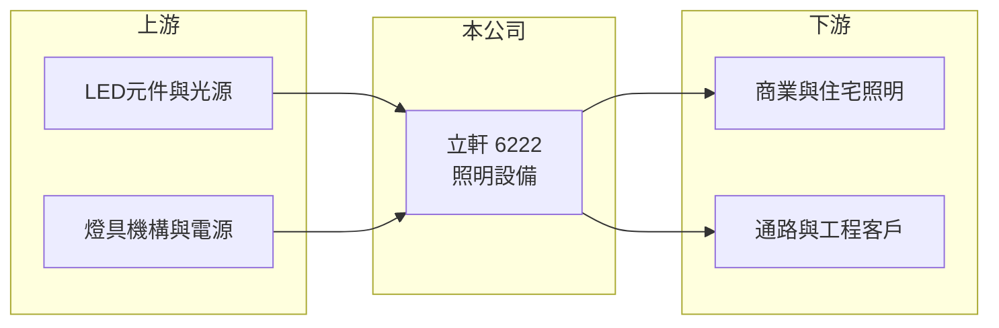

# 6222 立軒

> 上櫃｜[[產業索引-光電業|光電業]]｜上市（櫃）日期 2003/01/09

# 第一章：企業模式與商業藍圖

> [!info] 撰寫說明
> 精簡版，由 Claude 依公開資料整理，架構比照 [[2330台積電]]，資料截至 2026-10-07。來源：nstock 公司資料頁、winvest 營收快訊。公開資料有限，營收比重與營運據點未查得。#待校對

立軒目前營收極小，本章只能就登記業務與公開數字說明其現況。

- **核心業務：** 公司登記業務為照明設備的設計、加工、製造與銷售，以及電器銷售，屬於 [[LED照明]] 等照明產品的下游業者。
- **營收結構：** 2025 年全年營收僅約 0.03 億元，本業規模已非常小，產品別比重未查得。
- **營運據點：** 生產與銷售據點本次未查證。
- **長期方向：** 公司未來轉型方向本次未查得，需留意公司公告。

# 第二章：護城河深度與競爭優勢

以目前營收規模，立軒在照明市場沒有可觀察的護城河。

- **競爭優勢：** 本次資料未顯示明確競爭優勢；掛牌 23 年、資本額 9.57 億元是目前主要的公開特徵。
- **主要對手：** 照明市場同業眾多，包括 [[2393億光]] 等 LED 照明廠與大量中國照明廠。
- **觀察重點：** 營收是否回升、虧損能否收斂，以及公司是否提出新的業務方向。

# 第三章：財務體質與盈利規模

資料日期：2026-10-07，以下數字是撰寫當時的快照；最新月營收、毛利率、累計 EPS 由自動排程寫在本筆記的屬性欄位（月營收、毛利率、累計EPS 等）。#待校對

立軒營收極小且持續虧損，市值主要不是由本業支撐。

- **營收規模：** 2025 年全年營收約 0.03 億元；2026 年 1 至 8 月累計約 0.02 億元，年減 32.94%；6 月單月營收僅 6.7 萬元。
- **獲利：** 2025 年 EPS -0.4 元；2026 年上半年 EPS -0.1 元，第二季 [[毛利率]] 24.53%，但 [[營業利益率]] 約 -1,048%。
- **財務特色：** 近五年未配息；市值約 22 億元，遠高於營收規模，股價與本業獲利關聯不大。

# 第四章：總體風險與地緣政治

立軒的主要風險在於本業幾乎停滯。

- **產業週期：** 照明產品已成熟，價格競爭激烈，小廠難以靠規模取得成本優勢。
- **營運風險：** 營收過小使費用無法被覆蓋，虧損會持續侵蝕淨值。
- **其他風險：** 股價與基本面脫鉤，交易面波動大，投資判斷需以公司重大訊息為準。

# 專有名詞解析

## 金融

- **[[毛利率]]**：毛利除以營收，反映產品售價扣除直接生產成本後的獲利空間。
- **[[營業利益率]]**：營業利益除以營收，反映扣除營業費用後本業的獲利能力。

## 產業

- **[[LED照明]]**：以 LED 為光源的燈具與照明系統，比傳統燈泡省電、壽命長，是 LED 最大的應用市場之一。

# 核心供應鏈

- 上游：LED 元件廠如 [[2393億光]]、燈具機構與電源供應商（推估）
- 下游／客戶：商業、住宅照明與工程客戶（推估）
- 同業：台灣與中國照明廠

## 最新新聞
<!-- news:start（自動產生，請勿手動編輯此範圍） -->
- 2026-10-08 🏛️ 重訊 17:17｜公告本公司115年第三次股東臨時會重要決議事項｜[觀測站](https://mops.twse.com.tw/mops/#/web/t05st01)

完整紀錄：[[6222立軒 新聞]]
<!-- news:end -->

## 相關連結
- [公開資訊觀測站](https://mopsov.twse.com.tw/mops/web/t05st03?step=1&firstin=1&co_id=6222)
- [Goodinfo](https://goodinfo.tw/tw/StockDetail.asp?STOCK_ID=6222)
- [Yahoo 股市](https://tw.stock.yahoo.com/quote/6222)
- [鉅亨網新聞](https://www.cnyes.com/twstock/6222/news)
