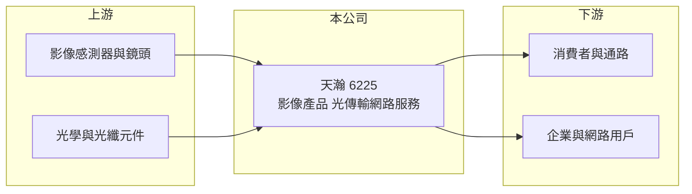

# 6225 天瀚

> 上市｜[[產業索引-光電業|光電業]]｜上市（櫃）日期 2004/09/27

# 第一章：企業模式與商業藍圖

> [!info] 撰寫說明
> 精簡版，由 Claude 依公開資料整理，架構比照 [[2330台積電]]，資料截至 2026-10-07。來源：nstock 公司資料頁、winvest 營收快訊。公開資料有限，營收比重未查得。#待校對

天瀚早年以消費性影像產品起家，目前營收規模很小，本章說明其業務組成。

- **核心業務：** 公司業務包括數位攝影機、[[行車紀錄器]]、[[微型投影機]]，以及 [[光傳輸網路]] 服務。
- **營收結構：** 本次未查到各業務營收比重；2025 年全年營收僅 0.54 億元。
- **營運據點：** 生產與營運據點本次未查證。
- **長期方向：** 光傳輸網路服務是相對新的業務，能否成為主要收入來源是觀察重點（推估）。

# 第二章：護城河深度與競爭優勢

消費性影像產品已被手機取代大半，天瀚目前的競爭力不易從公開資料判斷。

- **競爭優勢：** 長期經營影像與投影產品，具備品牌與產品設計經驗（推估）。
- **主要對手：** 行車紀錄器與攝影機有 Garmin、GoPro 及大量中國品牌；光傳輸網路服務對手為各地電信與網路業者。
- **觀察重點：** 2026 年營收月增減幅度極大，股價一年內大漲，需確認是否有新的業務或訂單支撐。

# 第三章：財務體質與盈利規模

資料日期：2026-10-07，以下數字是撰寫當時的快照；最新月營收、毛利率、累計 EPS 由自動排程寫在本筆記的屬性欄位（月營收、毛利率、累計EPS 等）。#待校對

天瀚營收規模小、月營收波動大，2026 年第二季小幅獲利。

- **營收規模：** 2025 年全年營收 0.54 億元；2026 年 1 至 8 月累計 0.33 億元；6 月單月 1,521.1 萬元，年增 846.55%，7 月則回落至 275.3 萬元。
- **獲利：** 2025 年 EPS -0.06 元；2026 年第二季 EPS 0.02 元，[[毛利率]] 54.59%，[[營業利益率]] 2.72%。
- **財務特色：** 資本額 2.78 億元，近五年未配息；股價約 70 元，遠高於一年均價約 26.6 元。

# 第四章：總體風險與地緣政治

天瀚的風險在於營收規模小、單一訂單影響大。

- **產業週期：** 消費性影像產品市場萎縮，需求受手機功能取代。
- **營運風險：** 月營收可因單筆訂單大幅跳動，獲利穩定性低。
- **其他風險：** 股價短期漲幅大、與獲利規模落差大，波動風險高。

# 專有名詞解析

## 應用

- **[[行車紀錄器]]**：裝在車上連續錄影的攝影裝置，用於事故舉證與行車安全。
- **[[微型投影機]]**：體積小、可攜帶的投影裝置，多採 LED 或雷射光源。

## 產業

- **[[光傳輸網路]]**：以光纖傳送資料的網路基礎設施與服務，頻寬大、損耗低。

# 核心供應鏈

- 上游：影像感測器、鏡頭模組與光纖元件供應商（推估）
- 下游／客戶：消費性通路、企業與網路服務用戶（推估）
- 同業：消費性影像品牌與網路服務業者

## 最新新聞
<!-- news:start -->
<!-- news:end -->

## 相關連結
- [公開資訊觀測站](https://mopsov.twse.com.tw/mops/web/t05st03?step=1&firstin=1&co_id=6225)
- [Goodinfo](https://goodinfo.tw/tw/StockDetail.asp?STOCK_ID=6225)
- [Yahoo 股市](https://tw.stock.yahoo.com/quote/6225)
- [鉅亨網新聞](https://www.cnyes.com/twstock/6225/news)
