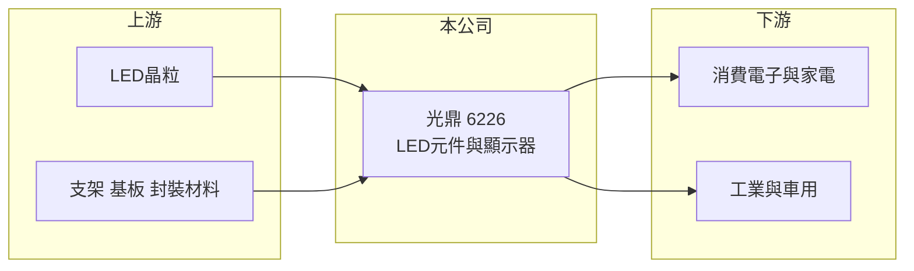

# 6226 光鼎

> 上市｜[[產業索引-光電業|光電業]]｜上市（櫃）日期 2008/11/10

# 第一章：企業模式與商業藍圖

> [!info] 撰寫說明
> 精簡版，由 Claude 依公開資料整理，架構比照 [[2330台積電]]，資料截至 2026-10-07。來源：nstock 公司資料頁、winvest 營收快訊。公開資料有限，營收比重未查得。#待校對

光鼎是中小型 LED 元件與顯示器廠，本章說明其業務定位。

- **核心業務：** 公司製造、加工與銷售各種發光二極體及發光二極體顯示器，屬於 [[LED封裝]] 中游廠商。
- **營收結構：** 本次未查到產品別營收比重；依業務內容推估以 LED 燈珠、SMD 元件與數字顯示器為主。
- **營運據點：** 生產據點分布本次未查證。
- **長期方向：** 一般 LED 元件價格競爭激烈，往車用、工業或 [[Mini LED]] 等利基應用移動才能改善獲利（推估）。

# 第二章：護城河深度與競爭優勢

光鼎規模不大，競爭力主要來自產品廣度與客戶服務，而非成本。

- **競爭優勢：** 掛牌 17 年，產品線涵蓋多種 LED 元件與顯示器，可滿足少量多樣訂單（推估）。
- **主要對手：** [[2393億光]]、[[6168宏齊]]、[[6164華興]]、[[3031佰鴻]]，以及中國 LED 封裝廠。
- **觀察重點：** 2026 年營收小幅成長，但第二季本業仍虧損，需觀察營業利益率何時轉正。

# 第三章：財務體質與盈利規模

資料日期：2026-10-07，以下數字是撰寫當時的快照；最新月營收、毛利率、累計 EPS 由自動排程寫在本筆記的屬性欄位（月營收、毛利率、累計EPS 等）。#待校對

光鼎營收約 6 億元，2025 年虧損，2026 年第二季小幅獲利。

- **營收規模：** 2025 年全年營收 6.09 億元；2026 年 1 至 8 月累計 4.4 億元，年增 7.14%；8 月單月 0.53 億元，年增 13.06%。
- **獲利：** 2025 年 EPS -0.28 元；2026 年第二季 EPS 0.02 元，[[毛利率]] 31%，[[營業利益率]] -2.16%，淨利率 1.38%。
- **財務特色：** 第二季靠業外收益才轉為小幅獲利；近五年平均現金股利僅 0.02 元，2025 年度未配息。

# 第四章：總體風險與地緣政治

光鼎面對成熟 LED 產業的價格競爭與本業虧損壓力。

- **產業週期：** LED 元件需求跟隨消費電子、家電與工業景氣，庫存調整時訂單起伏大。
- **營運風險：** 毛利率三成但本業仍虧損，代表費用偏高，營收若未成長，獲利難以改善。
- **其他風險：** 中國同業低價競爭、上游 [[LED晶粒]] 價格變動與匯率波動。

# 專有名詞解析

## 半導體

- **[[LED封裝]]**：把 LED 晶粒固定在支架或基板上並封上螢光膠與透鏡，做成可焊接使用的元件。
- **[[LED晶粒]]**：在藍寶石或其他基板上長出發光層後切割而成的發光晶片，是 LED 元件的核心。

## 產業

- **[[Mini LED]]**：晶粒尺寸約 100 至 200 微米的 LED，用在高階背光與小間距顯示屏。

# 核心供應鏈

- 上游：LED 晶粒廠 [[3714富采]]、支架與封裝材料供應商
- 下游／客戶：消費電子、家電、工業與車用模組廠（推估）
- 同業：[[2393億光]]、[[6168宏齊]]、[[6164華興]]、[[3031佰鴻]]

## 最新新聞
<!-- news:start -->
<!-- news:end -->

## 相關連結
- [公開資訊觀測站](https://mopsov.twse.com.tw/mops/web/t05st03?step=1&firstin=1&co_id=6226)
- [Goodinfo](https://goodinfo.tw/tw/StockDetail.asp?STOCK_ID=6226)
- [Yahoo 股市](https://tw.stock.yahoo.com/quote/6226)
- [鉅亨網新聞](https://www.cnyes.com/twstock/6226/news)
