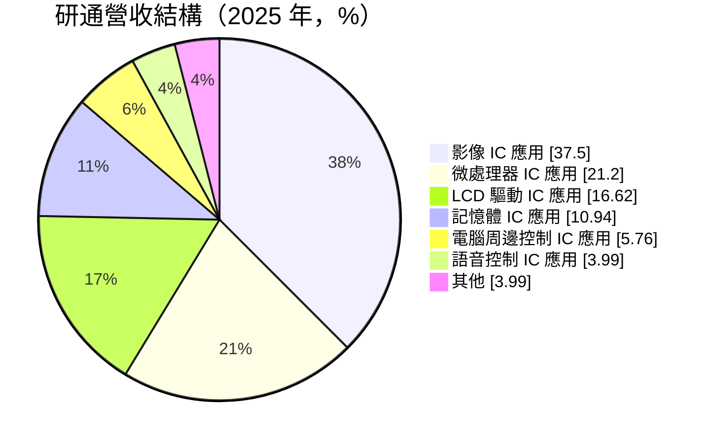
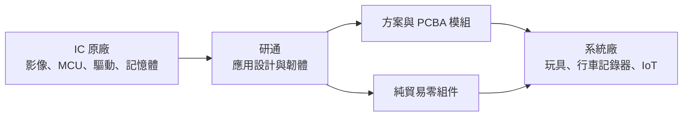
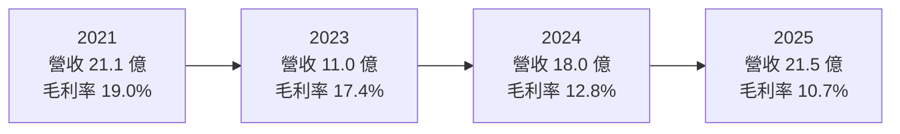
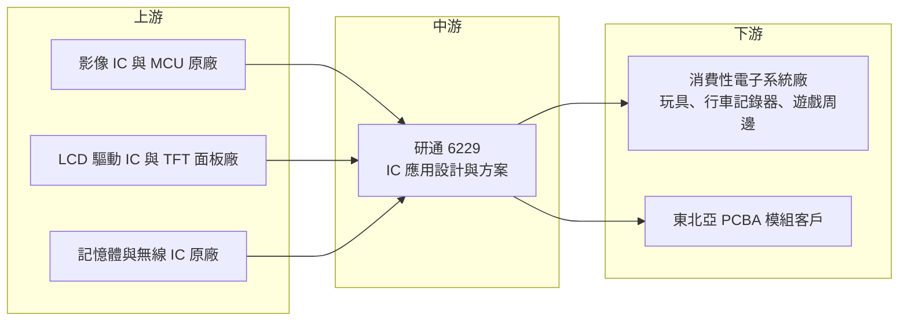

# 6229 研通

> 上櫃｜[[產業索引-半導體業|半導體業]]｜上市（櫃）日期 2003/01/14

# 第一章：企業模式與商業藍圖

> [!info] 撰寫說明
> 本文由 Claude 依公開資料整理，架構比照 [[2330台積電]] 的四章研究，資料截至 2026-10-08。財務數字來源：Goodinfo 台灣股市資訊網年度經營績效、MoneyDJ 理財網（富邦電子下單 DJ 版）公司基本資料、季度財報與股利表、富果研究 2026 年 7 月法說會整理；產業描述為整理性內容，尚未逐條比對原始文件。#待校對

在評估單一個股的長期投資價值時，首要步驟是拆解企業的底層獲利邏輯。本章針對研通科技（股票代號：6229，以下簡稱研通）的商業模式進行定性分析，說明一家介於 IC 原廠與系統廠之間的「應用設計加通路」公司，靠什麼賺錢、為什麼毛利率長期偏低，以及它想如何提高附加價值。

## 一、核心定位：IC 應用設計與零組件方案供應商

研通成立於 1992 年，2003 年在櫃買中心掛牌。依富果整理的 2026 年 7 月法說內容，研通把自己定位為專業的 IC 應用設計公司，替客戶銷售、設計並服務 TFT 面板與 [[MCU]] 等產品，提供整體解決方案；同時也銷售 IC 與半導體零組件，並往模組、半成品與成品延伸。

用白話說，研通扮演的是「懂應用的零組件供應商」。上游的 IC 原廠設計出通用晶片，但玩具、計算機、行車記錄器這類中小型消費性產品的系統廠，往往沒有足夠的研發人力把晶片做成可量產的產品。研通的工程師替客戶撰寫韌體、設計參考電路，甚至直接交付組好的電路板模組，讓客戶能快速推出產品。研通的收入主要來自賣出零組件的價差，應用設計服務則是取得訂單、綁住客戶的手段。

這種模式有兩個特性：

* **營收規模大、毛利率低：** 收入以零組件銷售額認列，營收看起來不小，但毛利只有價差部分，Goodinfo 顯示研通近六年毛利率介於 10.7% 至 19%。
* **獲利取決於產品組合：** 有附加設計服務的方案型產品毛利較高；單純買進賣出的貿易型產品毛利很薄。法說資料指出，2025 年毛利率下滑，主因就是低毛利的純貿易產品占比上升。

## 二、產品板塊：影像、微處理器、驅動與記憶體

依 MoneyDJ 揭露的 2025 年營收比重，研通的產品分布如下：

* **影像 IC：** 應用在車用多媒體、行車記錄器、遊戲機、無人機與運動攝影機，是研通最大的產品線。影像類產品需要較多韌體與光學調校，應用設計的附加價值相對較高。
* **微處理器 IC：** 用於時鐘、計算機、健身器材與 [[IoT]] 產品。這類產品型號多、單價低，但需求穩定，適合以方案方式長期供貨。
* **LCD 驅動 IC 與 TFT 面板：** 搭配中小尺寸顯示器使用，研通同時銷售面板與驅動 IC（[[DDI]]），能提供顯示模組的整合方案。
* **記憶體 IC：** 以貿易性質為主，價格隨記憶體景氣波動。法說資料提到，2026 年上半年記憶體與成熟製程漲價，帶動貿易型產品營收增加。
* **電腦周邊與語音 IC：** 包括 [[USB Type-C]]、HDMI、VGA 轉換晶片，以及玩具、電子禮品、電子樂器使用的語音 IC。研通在玩具方案上已經營多年。

此外，研通也替東北亞客戶製作 2.4G、藍牙與 Wi-Fi 攝影機的 [[PCBA]] 模組，這是從賣晶片走向賣模組的嘗試。

## 三、資本轉化邏輯：以設計服務換取零組件訂單

研通的資本主要投入在存貨與應收帳款，也就是「[[營運資金]]」，而不是廠房設備。它向原廠買進晶片、承擔庫存，再以方案的方式賣給客戶，賺取價差。這種模式的報酬率取決於三件事：價差有多大、存貨週轉有多快、應收帳款能不能準時收回。

方案型產品的價值在於「轉換成本」：客戶一旦以研通提供的參考設計量產，後續改版與追加訂單通常會繼續向研通採購。純貿易產品則沒有這層保護，客戶隨時可以比價換供應商。因此研通的長期獲利能力，取決於方案型產品在營收中的比重能否提高。

## 四、企業長期藍圖：把規模轉為獲利

法說資料顯示，研通在 2025 年完成內部組織重整與整合，2026 年的首要目標是把過去兩年拓展市場所取得的營收規模轉化為實際獲利。具體方向包括往模組、半成品與成品延伸，以提高每一筆訂單的附加價值；以及管理匯率風險，降低美元部位並在必要時使用遠期合約。

從長期來看，研通面對的是整個 IC 通路與應用設計產業的結構問題：原廠愈來愈傾向直接服務大客戶，中小型客戶則受到中國[[方案商]]的價格競爭。研通能否在消費性電子的利基市場中找到穩定的方案型產品，例如車用多媒體、運動攝影、IoT 模組，是決定它十年後仍有存在價值的關鍵。

# 第二章：護城河深度與競爭優勢

護城河決定了企業能否把今天的獲利延續到十年後。本章分析研通作為中小型應用設計與通路商的競爭優勢，以及它的弱點。

## 一、護城河的核心組成要素

* **應用設計能力與客戶黏著：** 研通替客戶完成韌體與電路設計，客戶量產後更換供應商需要重新驗證，因此方案型訂單具有一定黏著度。這是研通與單純的[[代理商]]或貿易商最大的差別。
* **產品線廣度：** 影像、MCU、驅動、記憶體、語音、周邊轉換晶片都有涵蓋，可以替同一個客戶提供一整套零組件，減少客戶的採購管理成本。
* **長年經營的利基應用：** 玩具、電子禮品、計算機這類市場規模不大，大型通路商與原廠不一定願意投入工程資源，研通在這些市場累積了多年的方案與客戶關係。

整體而言，研通的護城河屬於「淺而窄」的類型。它來自服務與關係，而非專利或規模，因此容易受到價格競爭侵蝕，必須持續投入工程人力維持。

## 二、全球主要競爭對手格局

| 對手 | 定位 | 對研通的影響 |
|---|---|---|
| [[3702大聯大]]、[[3036文曄]] | 全球大型半導體通路商，規模與原廠議價能力強 | 掌握主流原廠與大型客戶，研通只能在中小客戶與利基產品競爭 |
| [[3028增你強]] 等台灣中型通路商 | 代理特定原廠產品並提供技術支援 | 在相同產品線與客戶群中直接競爭 |
| 中國方案商與 IC 設計公司 | 以低價晶片搭配完整方案服務中國系統廠 | 壓縮消費性產品的價差，法說提到產業競爭「內捲」加劇 |
| IC 原廠直銷 | 原廠直接服務大型系統廠 | 客戶規模變大後可能繞過通路商 |

## 三、優勢轉化：哪些市場守得住、哪些守不住

* **守得住：** 需要韌體與光學調校的影像方案、長期供貨的 MCU 方案，以及研通已經營多年的玩具與語音方案。這些產品的客戶規模不大，轉換成本主要來自工程配合。
* **守不住：** 記憶體與標準零組件的純貿易。這部分價格透明，研通沒有定價能力，景氣好時可以撐大營收，景氣差時毛利與庫存都會受傷。
* **觀察重點：** 毛利率能否回到 15% 以上、營業利益率能否穩定為正、PCBA 模組與成品業務能否成長，以及存貨與應收帳款週轉天數是否惡化。營收成長若主要來自貿易型產品，就不應視為競爭力提升。

# 第三章：財務體質與盈利規模

資料日期：2026-10-08。數字取自 Goodinfo 年度經營績效與 MoneyDJ 季度財報、股利表，表格是撰寫當時的快照；最新月營收、毛利率、累計 EPS 由自動排程寫在本筆記的屬性欄位（月營收、毛利率、累計EPS 等）。#待校對

財務報表是檢驗護城河是否真實存在的最終標準。本章用六年的三率、ROE 與資本報酬，檢視研通的獲利品質與資本效率。

## 一、獲利能力的基石：三率

| 年度 | 營收（新台幣） | [[毛利率]] | [[營業利益率]] | EPS（元） | [[ROE]] |
|---|---|---|---|---|---|
| 2020 | 17.5 億 | 15.4% | 2.52% | 1.32 | 9.87% |
| 2021 | 21.1 億 | 19.0% | 6.33% | 4.49 | 26.9% |
| 2022 | 16.0 億 | 17.1% | 1.95% | 2.22 | 11.6% |
| 2023 | 11.0 億 | 17.4% | -2.52% | 0.05 | 0.3% |
| 2024 | 18.0 億 | 12.8% | -0.55% | 0.61 | 3.13% |
| 2025 | 21.5 億 | 10.7% | 0.2% | 0.05 | 0.27% |

研通的六年數字清楚呈現了通路型公司的特性。2021 年在缺貨潮中，晶片供不應求、價差擴大，營業利益率達 6.33%，EPS 4.49 元。2023 年消費性電子庫存調整，營收萎縮到 11.0 億元，本業轉為虧損。2024 至 2025 年營收回到 21.5 億元，但毛利率由 17.4% 降到 10.7%，營業利益率只在損益兩平附近，代表營收回升主要來自低毛利的貿易型產品，而不是方案型產品。

拉長來看，2020 至 2025 年營收年複合成長率約 4.2%（推算），但毛利率呈下降趨勢。對研通而言，營收規模不是重點，毛利率與營業利益率才是判斷方案業務是否健康的指標。MoneyDJ 季度資料顯示，2026 年上半年營收約 14.7 億元、累計 EPS 約 0.75 元，獲利有所回升，但這主要與記憶體與成熟製程漲價有關，是否能延續仍需觀察。

## 二、[[ROE]]：資本效率

2021 至 2025 年研通的平均 ROE 約 8.4%（推算），但分布極不平均：2021 年高達 26.9%，2023 與 2025 年則接近零。這代表研通的資本效率高度依賴零組件景氣，在缺貨或漲價期間可以快速放大，平常年度則只能維持小幅獲利。股本由 2023 年的約 3.56 億元增加到 2024 年的約 4.04 億元，跨年度比較 EPS 時需留意。

## 三、資本支出、[[自由現金流]]與股利

* **[[CapEx]]：** 研通沒有工廠，資本支出極低，主要的資金需求是存貨與應收帳款等營運資金。營收快速成長的年度，營運資金需求增加，營業現金流可能反而轉弱。
* **自由現金流：** 年度現金流量數字未查得。以通路業的特性推估，營收擴張期自由現金流容易為負，營收收縮期則因存貨去化而轉正，與獲利的方向常常相反。
* **股利：** 依 MoneyDJ 股利表，2019 至 2025 年度現金股利分別為 0.54、1.02、2.50、1.60、0.50、1.00、0.60 元。2023 與 2025 年度 EPS 僅 0.05 元，仍分別配發 0.50 元與 0.60 元，推估動用了以前年度的保留盈餘或[[資本公積]]。這種配發方式可以維持股利，但長期不可持續，未來股利仍取決於本業能否恢復穩定獲利。

## 四、[[ROIC]] 與 [[WACC]]：價值創造利差

**ROIC 推算：** 2025 年營業利益約 0.04 億元（21.5 億元 × 0.2%），稅後約 0.03 億元。股東權益約 7.0 億元（每股淨值 17.31 元 × 約 0.404 億股），依 ROE 與 ROA 的比值推算總負債約 8.7 億元，假設其中一半為有息的銀行借款，約 4.4 億元（推估），投入資本約 11.4 億元，ROIC 約 0.3%（推算）。用同樣方法回推 2021 年，稅後營業利益約 1.07 億元，股東權益約 7.0 億元，加上約 3.8 億元有息負債，ROIC 約 9.9%（推算）。

**WACC 推算：** 假設台灣 10 年期公債殖利率 1.75%、市場風險溢酬 6%，β 取 MoneyDJ 揭露的 0.58，股東權益成本約 5.2%；若改用通路同業常見的 β 0.9，股東權益成本約 7.2%。負債成本假設 2.5%，稅後約 2.0%，權益占資本約六成五（推估），WACC 約 4.1% 至 5.4%（推算）。

**結論：** 研通只有在 2021 年這類零組件缺貨的高峰年度，ROIC 明顯高於 WACC；2023 至 2025 年 ROIC 接近零，遠低於資金成本，代表本業在一般年度沒有創造經濟價值。研通要成為長期值得持有的公司，必須證明方案型產品能讓營業利益率穩定維持在 3% 以上，ROIC 才可能持續高於資金成本。

# 第四章：總體風險與地緣政治

任何企業都無法脫離宏觀環境獨立存在。本章分析研通未來必須面對的地緣政治、產業週期、營運與技術風險。

## 一、地緣政治風險

* **關稅與生產移轉：** 法說資料指出，關稅正推動電子產品製造在不同地區之間移轉。研通的客戶多為消費性電子系統廠，若客戶把生產線從中國移到東南亞或其他地區，研通需要跟著調整服務據點與物流，否則可能失去客戶。
* **中國供應商崛起：** 中國 IC 設計公司在消費性晶片的價格與方案完整度上持續進步，可能讓研通代理的產品失去價格競爭力。
* **匯率：** 研通以美元進貨與銷售的比重高，2025 年曾出現匯兌損失，公司已採取降低美元部位與遠期合約避險的措施。

## 二、產業週期與市場結構風險

* **零組件景氣循環：** 記憶體、成熟製程晶片的價格波動直接影響研通的價差與存貨價值。漲價期營收與獲利同步擴大，跌價期則可能出現[[存貨跌價損失]]。
* **[[長鞭效應]]：** 消費性電子終端需求的小幅變化，傳到通路與上游時會被放大。2023 年營收萎縮三成以上，就是庫存調整的典型結果。
* **AI 排擠效應：** 法說提到半導體資源向 AI 傾斜，造成消費性電子零組件的缺貨與漲價。短期可能推升營收，長期則可能讓消費性產品客戶的成本上升、需求減弱。

## 三、營運環境的隱性風險

* **存貨與應收帳款管理：** 通路商的主要風險在資產負債表。客戶倒帳或存貨滯銷，都可能一次吃掉多年的薄利。
* **原廠代理權變動：** 若主要原廠收回代理權或改由大型通路商代理，研通的產品線會出現缺口。
* **規模不足：** 研通營收約 20 億元上下，與大型通路商相比議價能力有限，費用率較難透過規模攤薄。

## 四、科技演進風險

消費性電子正在快速整合功能，過去需要多顆晶片的產品，愈來愈多改用單一系統單晶片完成，並由原廠或中國方案商提供完整的軟體開發套件。這會降低系統廠對應用設計服務的需求，壓縮研通的附加價值。研通往 PCBA 模組與成品延伸，正是對這個趨勢的回應，但這也意味著研通必須承擔更多製造與品質責任，經營模式的風險結構會跟著改變。

# 專有名詞解析

## 半導體

- **[[MCU]]**：微控制器，把處理器、記憶體與輸入輸出介面整合在一顆晶片上，用於家電、玩具與各種控制應用。
- **[[USB Type-C]]**：一種正反皆可插的 USB 接頭規格，可同時傳輸資料、影像與電力，需要專用的控制晶片。
- **[[DDI]]**：顯示驅動 IC，負責控制面板每個像素的電壓，是 LCD 與 OLED 面板必備的晶片。

## 應用

- **[[IoT]]**：物聯網，讓各種裝置連上網路、彼此交換資料，例如智慧家電與感測器。

## 金融

- **[[營運資金]]**：存貨加應收帳款減應付帳款，是通路與貿易業最主要的資金需求。
- **[[存貨跌價損失]]**：存貨的市價低於帳面成本時，必須認列的損失，零組件跌價時通路商最容易受到影響。
- **[[資本公積]]**：股東投入超過面額的部分等非來自營業獲利的權益項目，在一定條件下可用來配發現金。
- **[[長鞭效應]]**：終端需求的小幅變動，沿供應鏈往上游傳遞時被逐級放大，造成上游庫存與訂單劇烈波動。
- **[[ROIC]]**：投入資本報酬率，稅後營業利益除以股東權益加有息負債，衡量本業運用全部資本的效率。
- **[[WACC]]**：加權平均資金成本，股東與債權人要求報酬率的加權平均，ROIC 高於 WACC 才代表創造價值。

## 產業

- **[[代理商]]**：向原廠取得授權，在特定地區或客戶群銷售原廠產品並提供技術支援的公司，收入主要來自買賣價差。
- **[[方案商]]**：不只賣晶片，還替客戶完成韌體與參考設計、提供可量產方案的業者，附加價值與客戶黏著度高於純貿易。
- **[[PCBA]]**：已完成零件焊接的印刷電路板組件，客戶拿到後可直接組裝進產品。

# 核心供應鏈

## 1. 上游：IC 與面板原廠
- 影像、MCU、LCD 驅動、記憶體、無線與電源管理 IC 原廠（研通未公開代理品牌，個別原廠未查得）
- 中小尺寸 TFT 面板供應商（未查得）

## 2. 中游：研通本身與同業
- IC 應用設計與零組件方案：[[6229研通]]
- 大型通路同業：[[3702大聯大]]、[[3036文曄]]
- 中型通路同業：[[3028增你強]]

## 3. 下游：系統廠客戶
- 車用多媒體、行車記錄器、遊戲機、無人機、運動攝影機業者
- 時鐘、計算機、健身器材、玩具與電子禮品業者
- 東北亞的 2.4G、藍牙、Wi-Fi 攝影機模組客戶

## 最新新聞
<!-- news:start -->
<!-- news:end -->

## 相關連結
- [公開資訊觀測站](https://mopsov.twse.com.tw/mops/web/t05st03?step=1&firstin=1&co_id=6229)
- [Goodinfo](https://goodinfo.tw/tw/StockDetail.asp?STOCK_ID=6229)
- [Yahoo 股市](https://tw.stock.yahoo.com/quote/6229)
- [鉅亨網新聞](https://www.cnyes.com/twstock/6229/news)
