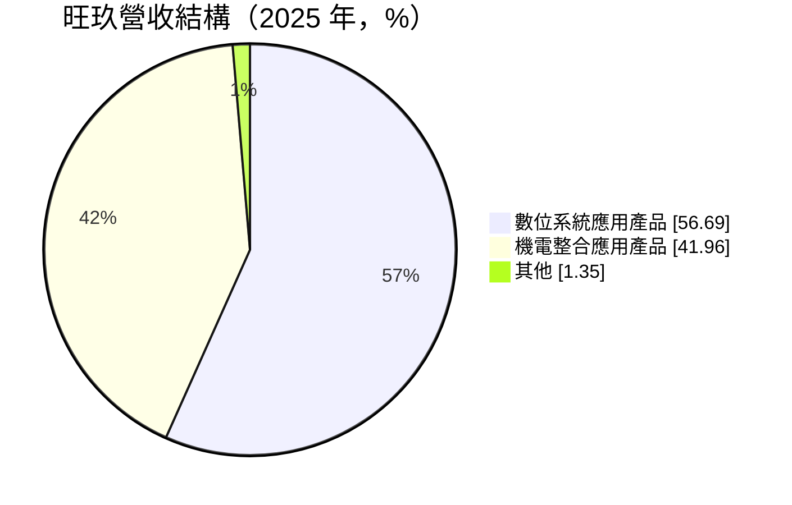
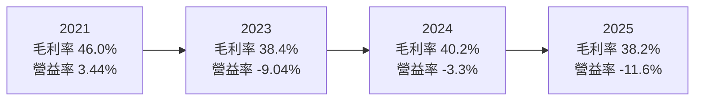
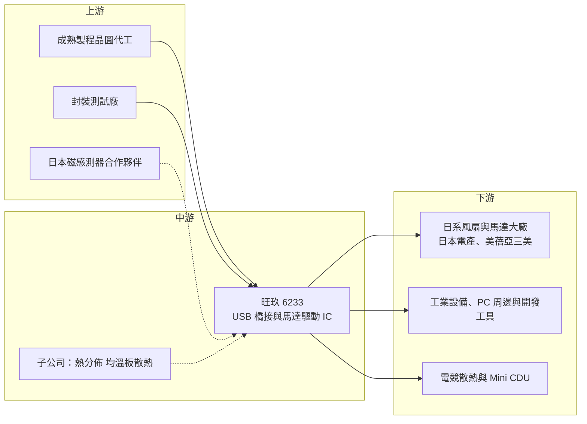

# 6233 旺玖

> 上櫃｜[[產業索引-半導體業|半導體業]]｜上市（櫃）日期 2003/02/20

# 第一章：企業模式與商業藍圖

> [!info] 撰寫說明
> 本文由 Claude 依公開資料整理，架構比照 [[2330台積電]] 的四章研究，資料截至 2026-10-08。財務數字來源：Goodinfo 台灣股市資訊網年度經營績效、MoneyDJ 理財網（富邦電子下單 DJ 版）公司基本資料與股利表、富果研究 2025 年 11 月法說會整理（內含 2023 年財務數字）；產業描述為整理性內容，尚未逐條比對原始文件。#待校對

在評估單一個股的長期投資價值時，首要步驟是拆解企業的底層獲利邏輯。本章針對旺玖科技（股票代號：6233，以下簡稱旺玖）的商業模式進行定性分析，說明一家以 USB 轉序列埠晶片聞名的小型 [[Fabless]] 公司，如何靠日系風扇大廠的長期關係維持高毛利，以及它為何在本業長年虧損的情況下，仍試圖往智慧風扇與[[預測性維護]]轉型。

## 一、核心定位：利基型介面與馬達驅動 IC 設計公司

旺玖成立於 1997 年，2003 年在櫃買中心掛牌，是一家沒有晶圓廠、專注設計晶片的 IC 設計公司。旺玖最為人熟知的產品是 PL2303 USB 轉序列埠（USB-to-Serial）[[USB橋接晶片]]，這顆晶片讓電腦可以透過 USB 連接使用舊式序列埠的工業設備、收銀機、量測儀器與開發板，在全球工程師社群中有很高的知名度。

依富果整理的 2025 年 11 月法說內容，旺玖目前以兩個平台經營：一是 Smart IO（智慧輸入輸出），以 USB 橋接晶片為基礎；二是機電整合，核心是風扇[[馬達驅動IC]]。法說資料提到，旺玖是日本電產（Nidec）與美蓓亞三美（MinebeaMitsumi）的長期供應商，並表示在日系辦公自動化（OA）設備風扇市場的占有率超過九成。

旺玖的商業模式有三個特點：

* **小而專的利基市場：** USB 橋接與 OA 風扇驅動都不是大市場，但產品一旦被客戶採用，常會在同一個設計中使用多年，因此毛利率能維持在 38% 至 47%。
* **營收規模小、費用負擔重：** 年營收只有約 4 億元，研發與管理費用相對營收比例偏高，使本業長期在損益兩平附近甚至虧損。
* **資產以現金與投資為主：** 法說資料顯示，2023 年 9 月底總資產約 13.46 億元，其中現金占 39%、長期股權投資占 35%，負債僅約 1.2 億元。旺玖的淨利常依賴持有台股的股利等業外收入。

## 二、產品板塊：數位系統與機電整合

依 MoneyDJ 揭露的 2025 年營收比重，旺玖的產品分為數位系統應用與機電整合應用兩大類（MoneyDJ 的分類名稱為「微機電整合應用產品」）：

* **Smart IO（數位系統）：** PL2303 USB 轉序列埠晶片是長期的營收來源，並延伸成支援 [[UART]]、I2C、SPI 的感測器集線器（Sensor Hub）。新產品是 USB3 主機對主機（host-to-host）晶片，搭配旺玖的 Virtual Hub 軟體專利，可以在兩台電腦之間共享螢幕、傳輸檔案與充電。
* **機電整合：** 核心是風扇馬達驅動 IC，供應日系風扇大廠。旺玖正把傳統風扇升級為數位化的「智慧風扇」，並運用自家在電表與斷路器產品累積的數位訊號處理（[[DSP]]）技術。旺玖開發的 I-BUS 協定可串接最多 127 個裝置並支援熱插拔，目標是伺服器與電競應用。
* **資料擷取與預測性維護：** 智慧風扇可以收集電流、電壓與轉速資料，再用預測模型估算馬達壽命。初期應用是電競散熱與小型冷卻液分配單元（Mini [[CDU]]），未來可能延伸到無人工廠與智慧空調。
* **磁感測器：** 與合作超過 15 年的日本夥伴共同開發奈特斯拉等級的磁感測器，用於電池安全監測，法說資料表示預計 2027 年下半年量產。

## 三、資本轉化邏輯：從單顆晶片到邊緣 AI 系統方案

旺玖的研發策略是避開成熟製程晶片的中國價格戰，轉向有專利保護、毛利較高的利基產品，並把產品從單顆晶片往上整合成完整的系統方案。

這個邏輯的優點是附加價值提高：單顆驅動 IC 的售價有限，但一套能預測故障的智慧散熱方案，可以向客戶收取更高的價格，並與國外動輒數千美元的模組競爭。缺點是旺玖必須同時具備硬體、韌體、資料模型與系統整合的能力，以一家年營收約 4 億元的公司而言，資源相當吃緊，也更依賴合作夥伴。

旺玖旗下另有子公司熱分佈，擁有[[均溫板]]類型的散熱技術，法說中管理層認為其在 AI 伺服器散熱有潛力，但也承認綜效需要時間。

## 四、企業長期藍圖：以邊緣 AI 散熱與感測重新定位

法說資料顯示，旺玖把 Smart IO 與機電整合兩大平台都定位為邊緣 AI（[[Edge AI]]）的基礎元件。長期藍圖可以歸納為三條路線：USB3 主機對主機產品延伸 USB 橋接的老本行；智慧風扇與預測性維護切入電競與資料中心散熱；磁感測器切入電池安全監測。管理層在 2025 年法說中表示最壞的情況已經過去，最差也能維持約損益兩平。

這個藍圖方向合理，但旺玖過去十多年營收規模一直停留在 4 億元上下，新產品要真正改變公司的獲利結構，需要至少一條產品線做到數億元以上的營收。投資人應以「新產品營收是否放量」而非「題材是否熱門」來評估轉型成效。

# 第二章：護城河深度與競爭優勢

護城河決定了企業能否把今天的獲利延續到十年後。本章分析旺玖在利基型 IC 市場的競爭優勢，以及它面對大型 IC 設計公司與中國同業時的處境。

## 一、護城河的核心組成要素

* **日系風扇大廠的長期供應關係：** 日系馬達廠對品質與供貨穩定度要求極高，認證期長，一旦採用通常不輕易更換。旺玖與日本電產、美蓓亞三美的長期合作，是它毛利率能維持在四成上下的主要原因。
* **PL2303 的品牌與裝置基礎：** USB 轉序列埠晶片已被大量工業設備與開發工具採用，驅動程式與相容性經過多年驗證。工業客戶傾向沿用熟悉的晶片，形成一定的轉換成本。
* **專利與協定：** Virtual Hub 與 I-BUS 等專利技術，是旺玖在新產品上試圖建立的差異化。專利的價值取決於市場是否採用，目前仍在推廣階段。
* **穩健的資產負債表：** 低負債、高現金與股權投資，讓旺玖能在本業虧損時仍維持研發投入，不至於因資金壓力被迫放棄轉型。

## 二、全球主要競爭對手格局

| 對手 | 定位 | 對旺玖的威脅 |
|---|---|---|
| FTDI（英國） | USB 轉序列埠晶片的國際品牌 | 在工業與開發工具市場與 PL2303 直接競爭 |
| Silicon Labs 等國際介面 IC 廠 | 提供 USB 橋接與 MCU 整合方案 | 以整合度與品牌爭取工業客戶 |
| 中國 USB 介面晶片廠（如沁恒） | 以低價供應相容晶片 | 壓低標準型 USB 橋接晶片的價格 |
| [[6138茂達]] 等風扇與馬達驅動 IC 廠 | 台灣電源與馬達驅動 IC 設計公司 | 在筆電、伺服器風扇驅動市場的規模與產品線較大 |

## 三、優勢轉化：哪些市場守得住、哪些守不住

* **守得住：** 日系 OA 設備風扇驅動，以及需要長期穩定供貨的工業 USB 橋接應用。這些客戶重視可靠度與相容性，價格敏感度較低。
* **守不住：** 一般消費性的 USB 轉接晶片。法說資料也承認標準型產品面臨嚴重的價格競爭，這部分營收長期會被中國同業侵蝕。
* **觀察重點：** 營業利益率能否轉正並維持、USB3 主機對主機與智慧風扇是否帶來實際營收、磁感測器能否在 2027 年如期量產，以及晶圓代工端的供應是否穩定（法說提到 2025 年曾發生代工端問題）。

# 第三章：財務體質與盈利規模

資料日期：2026-10-08。數字取自 Goodinfo 年度經營績效與 MoneyDJ 股利表，表格是撰寫當時的快照；最新月營收、毛利率、累計 EPS 由自動排程寫在本筆記的屬性欄位（月營收、毛利率、累計EPS 等）。#待校對

財務報表是檢驗護城河是否真實存在的最終標準。本章用六年的三率、ROE 與資本報酬，檢視旺玖的獲利結構。

## 一、獲利能力的基石：三率

| 年度 | 營收（新台幣） | [[毛利率]] | [[營業利益率]] | EPS（元） | [[ROE]] |
|---|---|---|---|---|---|
| 2020 | 3.74 億 | 47.3% | -1.66% | 0.11 | 0.98% |
| 2021 | 4.48 億 | 46.0% | 3.44% | 0.75 | 6.37% |
| 2022 | 4.38 億 | 40.1% | -0.22% | 0.50 | 3.93% |
| 2023 | 3.61 億 | 38.4% | -9.04% | 0.04 | 0.27% |
| 2024 | 4.17 億 | 40.2% | -3.3% | 0.36 | 2.48% |
| 2025 | 3.88 億 | 38.2% | -11.6% | -0.16 | -0.96% |

旺玖的數字有一個很明顯的結構：毛利率很高，但營業利益率長期為負。六年中只有 2021 年本業明確獲利，其餘年度營業利益率在 -11.6% 到約零之間。原因是營收規模太小，每年約 4 億元的營收、四成左右的毛利，只能產生約 1.5 億元的毛利，而研發與營運費用大致與此相當，任何營收下滑都會讓本業轉虧。

毛利率由 2020 年的 47.3% 降到 2025 年的 38.2%，顯示標準型產品的價格競爭正在加劇。2020 至 2025 年營收年複合成長率約 0.7%（推算），幾乎沒有成長。旺玖的淨利常高於營業利益，例如 2024 年本業虧損但 EPS 仍有 0.36 元，差額主要來自持股的股利與投資收益等[[業外收益]]，這部分不屬於本業競爭力。

## 二、[[ROE]]：資本效率

2021 至 2025 年旺玖的平均 ROE 約 2.4%（推算），遠低於一般 IC 設計公司。原因有二：一是本業獲利能力不足；二是資產中有相當比例是現金與股權投資，這些資產的報酬率本來就不高。旺玖的每股淨值由 2020 年的 11.28 元升到 2025 年的 17.2 元，增加的主因推估是持有股票的評價變動，而非本業累積的盈餘。

## 三、資本支出、[[自由現金流]]與股利

* **[[CapEx]]：** 旺玖是 [[Fabless]] 模式，生產外包給晶圓代工與封測廠，資本支出極低，主要投入是研發人力。
* **自由現金流：** 年度現金流數字未查得。以本業長期小幅虧損推估，營業現金流大致在零附近，主要現金來源是投資收入。
* **股利：** 依 MoneyDJ 股利表，2019 至 2021 年度未配發現金股利，2022 至 2025 年度分別為 0.48、0.21、0.36、0.75 元。2025 年度 EPS 為 -0.16 元仍配發 0.75 元，推估動用保留盈餘或資本公積，與本業獲利無直接關係。

## 四、[[ROIC]] 與 [[WACC]]：價值創造利差

**ROIC 推算：** 2025 年營業虧損約 0.45 億元（3.88 億元 × -11.6%），虧損不計稅。股東權益約 13.9 億元（每股淨值 17.2 元 × 約 0.81 億股），旺玖幾乎沒有有息負債（2023 年 9 月底總負債僅約 1.2 億元，推估多為應付款項），投入資本以約 13.9 億元計，ROIC 約 -3.2%（推算）。若扣除現金與股權投資，只看營運資產，ROIC 的負值會更大。用同樣方法回推 2021 年，營業利益約 0.15 億元，稅後約 0.12 億元，股東權益約 9.9 億元，ROIC 約 1.2%（推算）。

**WACC 推算：** 假設台灣 10 年期公債殖利率 1.75%、市場風險溢酬 6%，β 取 MoneyDJ 揭露的 0.75，股東權益成本約 6.3%。旺玖幾乎沒有負債，WACC 約等於股東權益成本，約 6.3%（推算）。

**結論：** 近六年旺玖的本業 ROIC 都低於 WACC，代表在現有規模下，本業並沒有創造經濟價值；公司的價值主要來自帳上的現金與股權投資。只有當新產品讓營收規模明顯擴大、營業利益率轉為穩定正數時，旺玖的本業才有機會跨過資金成本。

# 第四章：總體風險與地緣政治

任何企業都無法脫離宏觀環境獨立存在。本章分析旺玖未來必須面對的地緣政治、產業週期、營運與技術風險。

## 一、地緣政治風險

* **中國成熟製程晶片的價格競爭：** 法說資料明確指出，旺玖的策略是避開中國在成熟製程晶片上的價格競爭。中國在政策支持下大量投入 USB 介面、馬達驅動等成熟晶片，會持續壓低標準型產品的價格。
* **日系客戶的供應鏈調整：** 旺玖的重要客戶是日系馬達廠，若這些客戶因地緣政治調整生產據點或採購政策，旺玖需要跟著調整供貨與支援。
* **台灣代工集中：** 旺玖的晶片由代工廠生產，若台灣供應中斷，小型 IC 設計公司通常不是代工廠優先保障的對象。

## 二、產業週期與市場結構風險

* **消費性與 PC 周邊需求：** USB 橋接晶片的需求與 PC 周邊、工業設備的出貨連動，庫存調整時營收會明顯下滑，例如 2023 年營收減少約一成八。
* **利基市場天花板：** OA 風扇驅動與 USB 轉序列埠市場規模有限，即使維持高市占，也很難帶來大幅成長。
* **晶圓代工產能排擠：** 成熟製程產能若因漲價或 AI 需求而吃緊，小型客戶的投片成本與交期都會受到影響。

## 三、營運環境的隱性風險

* **規模不經濟：** 營收約 4 億元，研發費用占比高，任何營收下滑都會放大虧損。
* **新事業的執行風險：** 智慧風扇、預測性維護與磁感測器都仰賴合作夥伴，量產時程取決於夥伴的進度。子公司熱分佈的綜效也需要時間。
* **業外收入的波動：** 淨利依賴股權投資的股利與評價，股市下跌時，淨利與每股淨值會同步受影響。

## 四、科技演進風險

USB 轉序列埠晶片的需求來自舊式設備與序列埠介面，長期而言，隨著新設備直接採用 USB 或網路介面，這類需求會逐漸萎縮。PL2303 是旺玖的老本行，但不會是十年後的成長來源。另一方面，[[USB4]] 與 Thunderbolt 等新世代介面由大型 IC 設計公司主導，旺玖在高速介面的研發資源有限。旺玖把未來押在智慧散熱與感測，方向正確與否，要看邊緣 AI 與資料中心散熱是否真的需要這類低成本的智慧化方案。

# 專有名詞解析

## 半導體

- **[[Fabless]]**：無晶圓廠的 IC 設計公司，只負責設計晶片，製造外包給晶圓代工與封測廠。
- **[[USB橋接晶片]]**：把 USB 訊號轉換成序列埠、I2C 等其他介面的晶片，讓新電腦能連接舊式或工業設備。
- **[[UART]]**：通用非同步收發傳輸器，是最常見的序列通訊介面，大量用於工業設備與嵌入式系統。
- **[[馬達驅動IC]]**：控制馬達轉速與方向的晶片，風扇、硬碟與家電都需要，效率與噪音表現取決於驅動演算法。
- **[[DSP]]**：數位訊號處理器，專門用來快速處理聲音、電流等連續訊號的運算單元。
- **[[Edge AI]]**：在終端裝置上直接執行 AI 運算，而非把資料傳回雲端，可降低延遲並保護資料隱私。
- **[[均溫板]]**：內部封有工作液體的扁平散熱元件，靠液體蒸發與凝結快速把熱量擴散到整個平面。
- **[[USB4]]**：新世代 USB 規格，傳輸速度可達 40Gbps 以上，並整合影像與充電功能。

## 金融

- **[[業外收益]]**：本業以外的收入，例如投資股利、處分利益與匯兌收益，評估本業競爭力時應另外看待。
- **[[ROIC]]**：投入資本報酬率，稅後營業利益除以股東權益加有息負債，衡量本業運用全部資本的效率。
- **[[WACC]]**：加權平均資金成本，股東與債權人要求報酬率的加權平均，ROIC 高於 WACC 才代表創造價值。

## 產業

- **[[預測性維護]]**：收集設備運轉資料，用模型預估零件何時會故障，在故障前安排維修，以減少停機時間。
- **[[CDU]]**：冷卻液分配單元，負責在液冷系統中分配與控制冷卻液，是 AI 伺服器液冷散熱的關鍵設備。

# 核心供應鏈

## 1. 上游：晶圓代工與封測
- 成熟製程晶圓代工與封裝測試廠（旺玖未公開合作對象，未查得）
- 磁感測器共同開發：合作超過 15 年的日本夥伴（名稱未揭露）

## 2. 中游：旺玖本身與同業
- USB 橋接、馬達驅動 IC 與智慧風扇方案：[[6233旺玖]]
- 國際 USB 橋接同業：FTDI、Silicon Labs
- 台灣馬達驅動 IC 同業：[[6138茂達]]

## 3. 下游：主要客戶與應用
- 日系風扇與馬達廠：日本電產（Nidec）、美蓓亞三美（MinebeaMitsumi）
- 工業設備、收銀與量測儀器、開發板與 PC 周邊業者
- 電競散熱與 Mini CDU 專案客戶（法說提到一家台灣知名企業，名稱未揭露）

## 最新新聞
<!-- news:start -->
<!-- news:end -->

## 相關連結
- [公開資訊觀測站](https://mopsov.twse.com.tw/mops/web/t05st03?step=1&firstin=1&co_id=6233)
- [Goodinfo](https://goodinfo.tw/tw/StockDetail.asp?STOCK_ID=6233)
- [Yahoo 股市](https://tw.stock.yahoo.com/quote/6233)
- [鉅亨網新聞](https://www.cnyes.com/twstock/6233/news)
