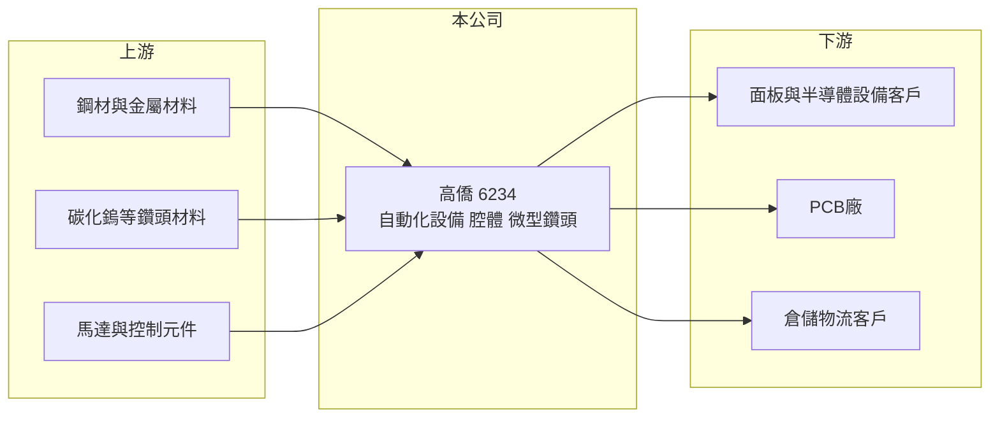

# 6234 高僑

> 上櫃｜[[產業索引-光電業|光電業]]｜上市（櫃）日期 2003/03/12

# 第一章：企業模式與商業藍圖

> [!info] 撰寫說明
> 精簡版，由 Claude 依公開資料整理，架構比照 [[2330台積電]]，資料截至 2026-10-07。來源：nstock 公司資料頁、winvest 營收快訊。公開資料有限，營收比重未查得。#待校對

高僑是台中大甲的設備與精密零件廠，本章說明其業務組成。

- **核心業務：** 公司研發、設計與製造各產業 [[自動化設備]]、各類腔體、倉儲與輸送設備，以及精密微型鑽頭。
- **營收結構：** 本次未查到各產品線營收比重；微型鑽頭推估用於 [[PCB]] 鑽孔，腔體推估供面板或半導體設備使用。
- **營運據點：** 公司登記地址在台中市大甲區，其他生產據點本次未查證。
- **長期方向：** 2026 年營收明顯成長，若設備與腔體接單來自 AI 相關 PCB 或半導體擴產，可望延續（推估）。

# 第二章：護城河深度與競爭優勢

設備與腔體屬客製化生意，高僑的競爭力在加工能力與客戶關係。

- **競爭優勢：** 同時具備大型機構加工（腔體、輸送設備）與精密微型鑽頭製造能力（推估）。
- **主要對手：** 微型鑽頭方面有 [[PCB鑽針]] 廠 [[8021尖點]] 等；腔體與自動化設備則面對眾多台灣與中國設備廠。
- **觀察重點：** 營收成長是否帶動毛利率回升，目前第二季毛利率不到一成。

# 第三章：財務體質與盈利規模

資料日期：2026-10-07，以下數字是撰寫當時的快照；最新月營收、毛利率、累計 EPS 由自動排程寫在本筆記的屬性欄位（月營收、毛利率、累計EPS 等）。#待校對

高僑 2026 年營收大幅成長，但本業毛利率仍低。

- **營收規模：** 2025 年全年營收 4.78 億元；2026 年 1 至 8 月累計 4.13 億元，年增 33.77%；7 月單月 0.61 億元年增 111.52%，8 月 0.76 億元年增 68.4%。
- **獲利：** 2025 年 EPS 0.05 元；2026 年第二季 EPS 0.09 元，[[毛利率]] 8.77%，[[營業利益率]] 0.88%，淨利率 6.29%。
- **財務特色：** 淨利率遠高於營業利益率，第二季獲利主要來自業外收益。

# 第四章：總體風險與地緣政治

高僑的風險在於設備業的接單週期與低毛利。

- **產業週期：** 設備與腔體訂單跟隨客戶擴產週期，擴產停止時營收可能大幅下滑。
- **營運風險：** 毛利率不到一成，專案成本控制或交期延誤都可能造成虧損。
- **其他風險：** 鋼材等原物料價格、匯率，以及主要客戶產業（面板、PCB、半導體）的景氣變化。

# 專有名詞解析

## 產業

- **[[自動化設備]]**：以機械、感測與控制系統取代人工完成搬運、組裝或檢測的生產設備。
- **[[PCB]]**：印刷電路板，用來承載並連接電子零件，是所有電子產品的基礎元件。
- **[[PCB鑽針]]**：在電路板上鑽出導通孔的微型鑽頭，孔徑小、耗損快，屬消耗品。

# 核心供應鏈

- 上游：鋼材、碳化鎢材料、馬達與控制元件供應商（推估）
- 下游／客戶：面板與半導體設備廠、PCB 廠、倉儲物流業者（推估）
- 同業：PCB 鑽針 [[8021尖點]]；自動化與輸送設備同業

## 最新新聞
<!-- news:start（自動產生，請勿手動編輯此範圍） -->
- 2026-10-07 📰 媒體 08:21｜營收速報 - 高僑(6234)9月營收1.05億元年增率高達133.52％｜[鉅亨網](https://news.cnyes.com/news/id/6623362)

完整紀錄：[[6234高僑 新聞]]
<!-- news:end -->

## 相關連結
- [公開資訊觀測站](https://mopsov.twse.com.tw/mops/web/t05st03?step=1&firstin=1&co_id=6234)
- [Goodinfo](https://goodinfo.tw/tw/StockDetail.asp?STOCK_ID=6234)
- [Yahoo 股市](https://tw.stock.yahoo.com/quote/6234)
- [鉅亨網新聞](https://www.cnyes.com/twstock/6234/news)
