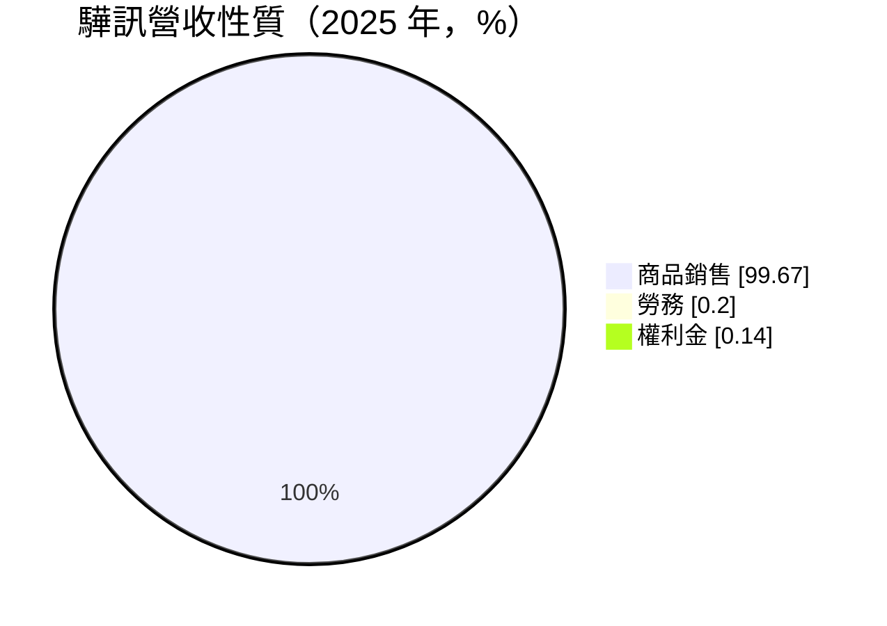
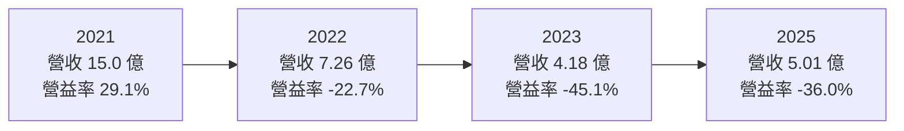
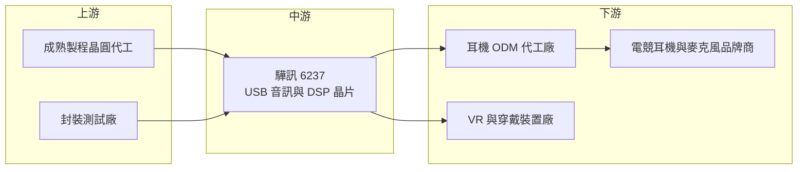

# 6237 驊訊

> 上櫃｜[[產業索引-半導體業|半導體業]]｜上市（櫃）日期 2003/04/21

# 第一章：企業模式與商業藍圖

> [!info] 撰寫說明
> 本文由 Claude 依公開資料整理，架構比照 [[2330台積電]] 的四章研究，資料截至 2026-10-08。財務數字來源：Goodinfo 台灣股市資訊網年度經營績效、MoneyDJ 理財網（富邦電子下單 DJ 版）公司基本資料與股利表、工商時報 2021 年報導、理財周刊 2026 年 6 月報導；產業描述為整理性內容，尚未逐條比對原始文件。#待校對

在評估單一個股的長期投資價值時，首要步驟是拆解企業的底層獲利邏輯。本章針對驊訊電子（股票代號：6237，以下簡稱驊訊）的商業模式進行定性分析，說明一家以 PC 音效晶片起家的 IC 設計公司，如何在[[電競]]耳機與 USB 音訊市場找到利基，又為何在疫情紅利結束後連續多年虧損。

## 一、核心定位：專注音訊的小型 IC 設計公司

驊訊成立於 1991 年，2003 年在櫃買中心掛牌，英文名稱為 C-Media。驊訊早年以 PC 音效卡晶片聞名，在 PCI 音效卡的年代，許多主機板與音效卡都使用驊訊的晶片。隨著 PC 音效功能被整合進主機板內建的[[音訊編解碼晶片]]，驊訊把重心轉向 USB 音訊，也就是讓耳機、麥克風、喇叭透過 USB 直接連接電腦或遊戲機的晶片。

依理財周刊 2026 年 6 月的報導，驊訊被描述為台灣最大的 PCI 與 USB 音訊晶片供應商之一，產品應用在耳機、電腦、遊戲機與虛擬實境裝置，電競仍是核心業務。驊訊是典型的 [[Fabless]] 公司，MoneyDJ 揭露的 2025 年營收中，商品銷售占 99.67%，勞務與權利金收入合計不到 0.5%，代表營收幾乎全部來自賣晶片。

驊訊的商業模式有兩個特點：

* **利基市場、高毛利：** 電競耳機與專業麥克風重視音質與低延遲，驊訊的晶片售價高於一般消費性產品，毛利率在多數年份維持在 44% 至 59%。
* **營收高度集中在單一應用：** 電競與遠距通訊需求是主要動能，營收隨這類消費性需求大起大落，2021 年營收約 15 億元，2023 年只剩約 4.2 億元。

## 二、產品板塊：電競耳機、麥克風與 VR 音訊

MoneyDJ 未提供依應用別的營收比重，以下依工商時報與理財周刊報導整理驊訊的主要產品線：

* **USB 音訊控制晶片：** 用於電競耳機、通訊耳機、專業麥克風與擴充座。電競耳機從入門款到高階款都有對應產品，是驊訊最主要的營收來源。
* **音效處理 [[DSP]] 與 [[SoC]]：** 包括雙麥克風環境降噪與語音處理的系統單晶片，以及卡拉 OK 用的音效 DSP 與 USB 麥克風晶片，應用在直播與行動 K 歌麥克風。
* **虛擬實境音訊：** 替 VR 裝置提供 DSP 與 USB 音訊控制器，以及一體式 VR 頭戴裝置使用的 SoC。理財周刊的報導指出，AR／VR 需求近期趨於平穩，公司以維持既有客戶為主。
* **AI 音訊技術：** 聚焦通訊降噪與娛樂音效，[[AI降噪]]已用於電競與通訊產品，人聲分離與聲音強化則用於卡拉 OK 產品。公司也在擴展穿戴式電子產品的音訊晶片。

## 三、資本轉化邏輯：以音訊演算法提高晶片附加價值

驊訊的核心資產是音訊演算法與韌體，而不是晶片製程。同一顆 USB 音訊晶片，搭配虛擬環繞音效、降噪、等化器等軟體功能，就能賣給品牌商做成不同價位的耳機。耳機品牌商與 [[ODM]] 代工廠通常不具備自行開發音效演算法的能力，因此會選擇提供完整韌體與調音工具的晶片廠。

這個模式的優點是資本支出極低、毛利率高；缺點是驊訊對終端需求沒有控制力。2020 至 2021 年疫情帶動居家娛樂、遠距工作與電競需求，工商時報 2021 年 9 月報導驊訊單月營收創新高、訂單滿到年底，並因代工成本上升而調漲價格。但需求在 2022 年迅速回落，客戶開始去化庫存，驊訊營收在兩年內縮小到原本的三成以下。

## 四、企業長期藍圖：從電競耳機延伸到穿戴式裝置

依理財周刊的報導，驊訊的策略是以電競為主軸、持續推動技術升級與產品創新，同時深化穿戴式電子產品的音訊晶片開發，並在 AR／VR 方面維持既有客戶、觀察新的成長機會。2026 年市場曾因[[AI眼鏡]]相關話題關注驊訊，但驊訊在 AI 眼鏡上的具體產品與營收貢獻未查得，不宜過度解讀。

長期而言，耳機與穿戴裝置正從有線 USB 轉向無線藍牙，而藍牙音訊 SoC 市場由規模更大的中國與國際晶片廠主導。驊訊能否在無線、低延遲電競音訊或穿戴式裝置中建立新的利基，是決定它十年後營收規模的關鍵。

# 第二章：護城河深度與競爭優勢

護城河決定了企業能否把今天的獲利延續到十年後。本章分析驊訊在音訊晶片市場的競爭優勢，以及它面對大型晶片廠時的處境。

## 一、護城河的核心組成要素

* **音訊演算法與調音工具：** 驊訊累積三十多年的音效處理經驗，提供品牌商完整的韌體與調音工具。品牌商一旦以驊訊平台開發出一系列產品，後續改款時沿用同一平台的機率較高。
* **電競音訊的口碑：** 電競玩家重視定位音效與低延遲，驊訊在這個市場的產品線完整，從入門到高階都有對應方案，品牌商可以用同一家供應商覆蓋整條產品線。
* **高毛利的產品定位：** 驊訊不以低價取勝，而是在音質與功能上做出區隔，這讓它在營收大幅衰退的年份，毛利率大致仍維持在四成以上。

這些優勢的限制在於市場規模。電競 USB 耳機是利基市場，驊訊的護城河足以守住毛利率，卻不足以支撐營收規模，因此在需求下滑時，費用無法被攤薄，本業就會轉虧。

## 二、全球主要競爭對手格局

| 對手 | 定位 | 對驊訊的威脅 |
|---|---|---|
| [[2379瑞昱]] | PC 音訊編解碼晶片龍頭，產品線涵蓋 USB 音訊與藍牙 | 規模與通路優勢大，可以低價整合方案搶入門市場 |
| 中國藍牙與音訊 SoC 廠（如炬芯、中科藍訊、恆玄） | 無線耳機與藍牙音訊 SoC 的主要供應者 | 耳機轉向無線時，取得新產品的主導權 |
| XMOS 等國際音訊處理晶片廠 | 專業音訊與語音處理 | 在高階麥克風與專業音訊市場競爭 |
| 遊戲機與平台廠自有方案 | 主機與平台廠自行定義音訊規格 | 可能減少對第三方音訊晶片的需求 |

## 三、優勢轉化：哪些市場守得住、哪些守不住

* **守得住：** 有線 USB 電競耳機、專業 USB 麥克風、卡拉 OK 與直播麥克風。這些產品重視音效調校與低延遲，品牌商對驊訊的平台依賴度較高。
* **守不住：** 一般通訊耳機與入門級產品。這類產品價格敏感，容易被大型晶片廠的整合方案取代。另外，在藍牙無線耳機市場，驊訊的規模不足以與中國晶片廠競爭。
* **觀察重點：** 營業利益率何時能回到正數、穿戴式裝置與 AI 降噪產品能否帶來新客戶，以及營收能否穩定回到 10 億元以上的規模。依理財周刊報導，2026 年 4 月營收已連續 13 個月年增，但需要看到年度營業利益轉正，才能確認不是單純的庫存回補。

# 第三章：財務體質與盈利規模

資料日期：2026-10-08。數字取自 Goodinfo 年度經營績效與 MoneyDJ 股利表，表格是撰寫當時的快照；最新月營收、毛利率、累計 EPS 由自動排程寫在本筆記的屬性欄位（月營收、毛利率、累計EPS 等）。#待校對

財務報表是檢驗護城河是否真實存在的最終標準。本章用六年的三率、ROE 與資本報酬，檢視驊訊在疫情前後的獲利變化。

## 一、獲利能力的基石：三率

| 年度 | 營收（新台幣） | [[毛利率]] | [[營業利益率]] | EPS（元） | [[ROE]] |
|---|---|---|---|---|---|
| 2020 | 8.22 億 | 51.3% | 14.8% | 2.44 | 12.2% |
| 2021 | 15.0 億 | 51.3% | 29.1% | 5.75 | 25.7% |
| 2022 | 7.26 億 | 19.0% | -22.7% | -1.63 | -7.11% |
| 2023 | 4.18 億 | 44.8% | -45.1% | -1.34 | -6.33% |
| 2024 | 4.49 億 | 58.9% | -24.5% | -0.27 | -1.32% |
| 2025 | 5.01 億 | 43.9% | -36.0% | -1.52 | -7.93% |

驊訊的六年數字是一個完整的「紅利與退潮」案例。2021 年營收倍增到 15.0 億元，營業利益率達 29.1%，EPS 5.75 元，充分展現 IC 設計公司的[[營運槓桿]]：營收增加時，費用幾乎不變，獲利會成倍放大。但同樣的槓桿在下行時反向作用，2022 年營收腰斬，毛利率驟降到 19.0%（推估與庫存跌價有關，具體原因未查得），本業轉為大幅虧損。2023 至 2025 年營收停留在 4 億至 5 億元，毛利率雖回到四成以上，但營收太小，營業利益率仍在 -24% 到 -45% 之間。

2020 至 2025 年營收年複合成長率約 -9.4%（推算）。拉長來看，2021 年的高峰應視為疫情造成的特殊年度，而非常態；驊訊在正常年度的營收規模推估約在 5 億至 8 億元之間，要達到損益兩平，需要營收回到明顯高於近三年的水準。

## 二、[[ROE]]：資本效率

2021 至 2025 年驊訊的平均 ROE 約 0.6%（推算），其中只有 2021 年為正，2022 年起連續四年為負。每股淨值由 2021 年的 24.27 元降到 2025 年的 18.84 元，連續虧損與配息正在侵蝕股東權益。驊訊幾乎沒有負債，Goodinfo 的 ROE 與 ROA 數字非常接近，代表 ROE 的變化完全來自本業獲利，而非財務槓桿。

## 三、資本支出、[[自由現金流]]與股利

* **[[CapEx]]：** 驊訊是 Fabless 模式，資本支出極低，主要支出是研發人員薪資。這也代表虧損年度的現金流出主要來自研發費用。
* **自由現金流：** 年度現金流數字未查得。以 2022 至 2025 年連續營業虧損推估，這段期間營業現金流可能多為負值或接近零，主要靠過去累積的現金支應。
* **股利：** 依 MoneyDJ 股利表，2019 至 2025 年度現金股利分別為 0.25、1.00、1.00、0.25、0.25、0.25、0.10 元。2021 年度 EPS 5.75 元只配發 1.00 元，配發率不到兩成（推算）；2022 至 2025 年度虧損仍維持小額配息，推估動用保留盈餘或資本公積。

## 四、[[ROIC]] 與 [[WACC]]：價值創造利差

**ROIC 推算：** 2025 年營業虧損約 1.80 億元（5.01 億元 × -36.0%），虧損不計稅。股東權益約 15.0 億元（每股淨值 18.84 元 × 約 0.796 億股），驊訊幾乎沒有有息負債（ROE 與 ROA 接近，推估負債比僅約 5%），投入資本以約 15.0 億元計，ROIC 約 -12%（推算）。用同樣方法回推 2021 年，營業利益約 4.37 億元，稅後約 3.49 億元，股東權益約 19.4 億元，ROIC 約 18%（推算）。

**WACC 推算：** 假設台灣 10 年期公債殖利率 1.75%、市場風險溢酬 6%，β 取 MoneyDJ 揭露的 0.84，股東權益成本約 6.8%。驊訊幾乎沒有負債，WACC 約等於股東權益成本，約 6.8%（推算）。

**結論：** 2020 至 2021 年驊訊的 ROIC 高於 WACC，屬於創造價值的期間；2022 至 2025 年 ROIC 持續為負，遠低於資金成本，正在毀損經濟價值。驊訊要回到價值創造，需要的不只是營收回升，而是找到能讓營收穩定維持在損益兩平以上的新應用。

# 第四章：總體風險與地緣政治

任何企業都無法脫離宏觀環境獨立存在。本章分析驊訊未來必須面對的地緣政治、產業週期、營運與技術風險。

## 一、地緣政治風險

* **中國客戶與競爭者：** 電競耳機與麥克風的品牌商與代工廠大量集中在中國，驊訊的客戶也與中國市場高度相關。中國推動晶片國產化，當地品牌商可能改用本土音訊晶片，壓縮驊訊的市場。
* **關稅與供應鏈移轉：** 美國對中國製消費性電子課徵關稅，可能使耳機品牌商把生產移往東南亞，驊訊需要跟著調整客戶支援。
* **晶圓代工集中在台灣：** 驊訊的晶片由台灣代工廠生產，面臨與其他台灣 IC 設計公司相同的兩岸風險。

## 二、產業週期與市場結構風險

* **消費性電子的庫存循環：** 2021 至 2023 年的營收劇烈波動，說明驊訊高度受到消費性電子庫存循環與[[長鞭效應]]的影響。終端需求的小幅下滑，會在品牌商去化庫存時被放大成晶片訂單的大幅減少。
* **疫情紅利不可複製：** 遠距工作與居家娛樂帶來的需求高峰屬於一次性事件，不應作為評估長期營收的基準。
* **市場規模有限：** 有線 USB 電競耳機是利基市場，成長空間有限。

## 三、營運環境的隱性風險

* **規模不經濟：** 營收在 4 億至 5 億元時，研發與營運費用遠高於毛利，虧損會持續侵蝕現金與淨值。
* **代工成本上升：** 成熟製程漲價會提高晶片成本，小型 IC 設計公司的議價能力有限，若無法轉嫁給客戶，毛利率會被壓縮。
* **客戶集中：** 電競耳機品牌數量有限，少數大客戶的產品週期會左右驊訊的營收。

## 四、科技演進風險

耳機與麥克風正快速轉向無線，藍牙 LE Audio 等新規格讓無線音訊的延遲與音質持續改善，過去必須用有線 USB 才能達到的電競表現，未來可能由無線方案取代。這對以 USB 音訊為核心的驊訊是結構性威脅。另一方面，AI 降噪與語音處理逐漸被整合進大型 SoC 或由軟體在處理器上執行，獨立音訊處理晶片的需求也可能被壓縮。驊訊的長期存續，取決於它能否把音訊演算法優勢移植到無線與穿戴式平台。

# 專有名詞解析

## 半導體

- **[[Fabless]]**：無晶圓廠的 IC 設計公司，只負責設計晶片，製造外包給晶圓代工與封測廠。
- **[[DSP]]**：數位訊號處理器，專門用來快速處理聲音、電流等連續訊號的運算單元。
- **[[SoC]]**：系統單晶片，把處理器、記憶體控制與各種功能整合在單一晶片上。
- **[[音訊編解碼晶片]]**：負責把類比聲音訊號與數位訊號互相轉換的晶片，電腦主機板與耳機都需要。

## 應用

- **[[AI降噪]]**：以 AI 模型分辨人聲與背景噪音並濾除噪音，常用於通訊耳機、會議與直播設備。
- **[[AI眼鏡]]**：內建相機、麥克風與 AI 助理的智慧眼鏡，可進行語音互動、拍照與即時翻譯。

## 金融

- **[[營運槓桿]]**：固定費用占比高的公司，營收增加時獲利成倍放大，營收減少時虧損也會擴大。
- **[[長鞭效應]]**：終端需求的小幅變動，沿供應鏈往上游傳遞時被逐級放大，造成上游庫存與訂單劇烈波動。
- **[[ROIC]]**：投入資本報酬率，稅後營業利益除以股東權益加有息負債，衡量本業運用全部資本的效率。
- **[[WACC]]**：加權平均資金成本，股東與債權人要求報酬率的加權平均，ROIC 高於 WACC 才代表創造價值。

## 產業

- **[[電競]]**：電子競技，以電玩遊戲進行的競賽與相關周邊產業，玩家重視低延遲與定位音效。
- **[[ODM]]**：原廠委託設計製造，代工廠替品牌商設計並生產產品，品牌商負責行銷。

# 核心供應鏈

## 1. 上游：晶圓代工與封測
- 成熟製程晶圓代工與封裝測試廠（驊訊未公開合作對象，未查得）

## 2. 中游：驊訊本身與同業
- USB 音訊控制晶片、音效 DSP 與 VR 音訊 SoC：[[6237驊訊]]
- 台灣音訊晶片同業：[[2379瑞昱]]
- 中國藍牙音訊 SoC 同業：炬芯、中科藍訊、恆玄

## 3. 下游：品牌商與代工廠
- 電競耳機、專業麥克風、直播與卡拉 OK 麥克風品牌商（個別客戶未查得）
- 耳機與音訊產品 ODM 代工廠
- VR 一體機與穿戴式裝置業者

## 最新新聞
<!-- news:start -->
<!-- news:end -->

## 相關連結
- [公開資訊觀測站](https://mopsov.twse.com.tw/mops/web/t05st03?step=1&firstin=1&co_id=6237)
- [Goodinfo](https://goodinfo.tw/tw/StockDetail.asp?STOCK_ID=6237)
- [Yahoo 股市](https://tw.stock.yahoo.com/quote/6237)
- [鉅亨網新聞](https://www.cnyes.com/twstock/6237/news)
