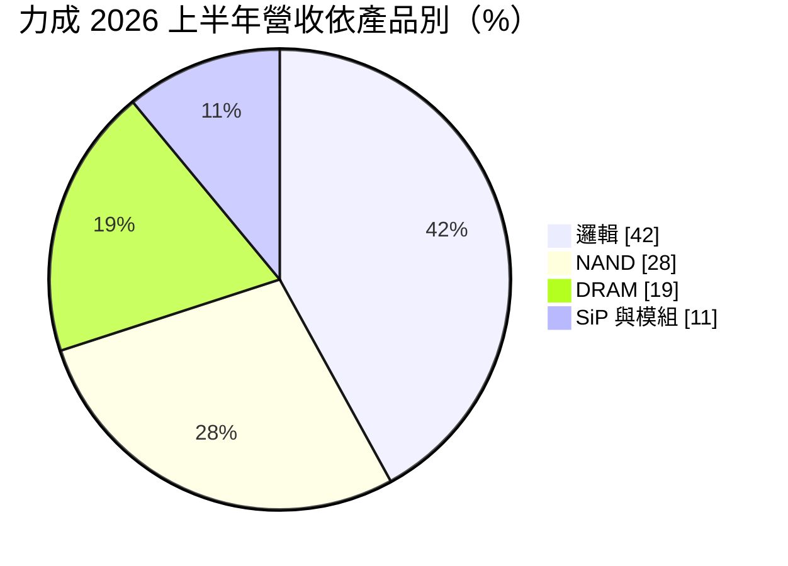
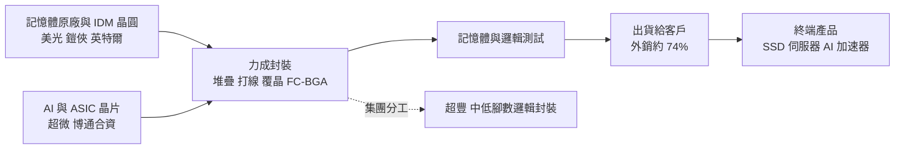
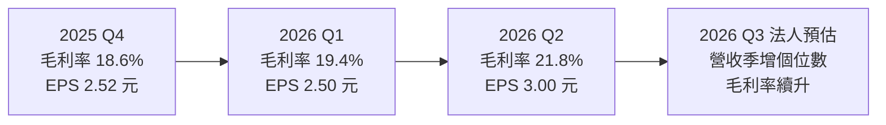
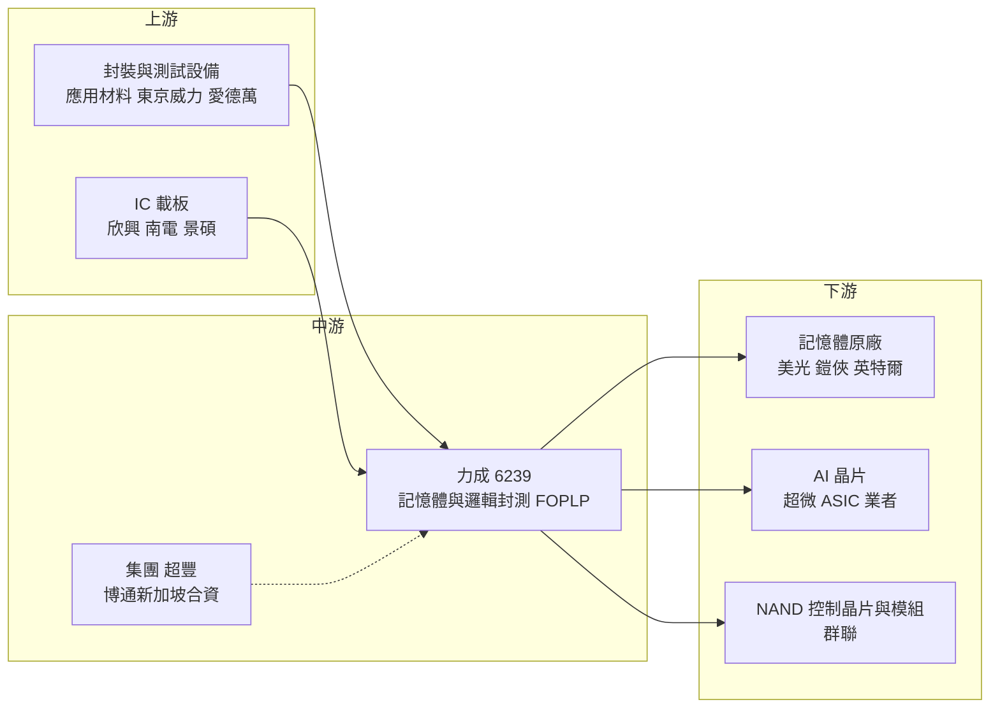

# 6239 力成

> 上市｜[[產業索引-半導體業|半導體業]]｜上市（櫃）日期 2004/11/08

# 第一章：企業模式與商業藍圖

> [!info] 撰寫說明
> 本文由 Claude 依公開資料整理，架構比照 [[2330台積電]] 的四章研究，資料截至 2026-10-07。財務數字來源：力成 2025 年財報董事會公告與股利公告（旺得富／中時新聞網）、2025 年第四季與 2026 年第一季法說會整理（永豐金證券、富果研究）、2026 年第二季法說會報導（優分析、工商時報）、今周刊；產業描述為整理性內容，尚未逐條比對原始文件。#待校對

在評估單一個股的長期投資價值時，首要步驟是拆解企業的底層獲利邏輯。本章針對力成科技（股票代號：6239，以下簡稱力成）的商業模式進行定性分析，說明這家記憶體封測龍頭如何靠邏輯 IC 與面板級扇出封裝，嘗試從「記憶體循環股」轉型為 AI 先進封裝股。

## 一、核心定位：全球最大的記憶體封測廠之一

力成成立於 1997 年 5 月 15 日，2004 年 11 月掛牌，總部位於新竹湖口工業區，董事長為蔡篤恭。力成以 DRAM 與 NAND 快閃記憶體的封裝與測試起家，長期服務美光、鎧俠等記憶體原廠，是全球記憶體封測代工的龍頭業者之一。

封測位在半導體製造流程的後段：晶圓廠完成晶圓後，封測廠負責切割、黏晶、打線或覆晶、封膠，再做功能與可靠度測試。記憶體封測的特色是量大、測試時間長，且常需要多顆晶片堆疊（如企業級 SSD 用的高層數 NAND 堆疊），技術門檻在於堆疊[[良率]]與測試產能。力成的定位有兩個重點：

* **記憶體原廠的外包夥伴：** 不做自有品牌晶片，替記憶體原廠與 [[IDM]] 承接封裝與測試，與客戶共同經歷記憶體景氣循環。
* **邏輯先進封裝的第二引擎：** 以覆晶（[[Flip Chip]]）、[[FC-BGA]] 與面板級扇出型封裝（[[FOPLP]]）切入 AI 與高效能運算晶片。

## 二、終端應用板塊：邏輯已是最大項目

依優分析對 2026 年上半年法說的整理：

* **依服務別：** 封裝 66%、測試 23%、[[SiP]]／模組 11%。2026 年第一季比重相近（封裝 67%、測試 22%、SiP／模組 11%；邏輯 43%、NAND 26%、DRAM 20%）。
* **邏輯：** 力成雖被視為記憶體封測股，但邏輯產品已是單一最大項目，主要來自高階 FC-BGA 與覆晶封裝。工商時報報導，力成已成為 [[AMD超微]] AI 晶片供應鏈夥伴，並與 [[AVGO博通]] 在新加坡成立合資公司開發先進封裝技術。
* **NAND 與 DRAM：** 合計近五成，主要客戶包括美光、鎧俠、[[INTC英特爾]] 等（今周刊整理）。

## 三、資本轉化邏輯：規模化測試與堆疊封裝

* **產能據點：** 主要產能位於新竹湖口與竹科，並有海外據點。今周刊報導提到力成去年收購友達位於竹科的廠房，作為先進封裝基地。依旺得富公司資料，力成外銷比重約 74%。
* **集團分工：** 旗下封測廠 [[2441超豐]] 專注於中低腳數邏輯 IC 封裝，力成本體集中在記憶體與高階邏輯。
* **營運槓桿：** 封測屬資本密集產業，機台與廠房投入後，[[產能利用率]]與報價就決定毛利率；2026 年第一季法說表示將依產品別調漲價格，漲幅從個位數到雙位數不等。

## 四、企業長期藍圖：FOPLP 與 HBM 相關技術

* **面板級扇出封裝：** 力成是台灣最早投入 FOPLP 的封測廠之一。依今周刊，面板面積約為 12 吋晶圓的 3.5 倍，可產出的封裝數量為晶圓級的 5 至 6 倍。富果研究整理 2026 年第一季法說指出，FOPLP 良率已達 95%，第一階段產能年內到位；第二季法說時公司坦言設備交期有延遲，但仍有信心在 2027 年年中以前量產，目標成為全球第一家量產 FOPLP AI 應用的公司。
* **[[TSV]] 技術：** 力成持續開發矽穿孔連接技術，工商時報報導已完成 TSV interconnection DDR5 試產，預計 2026 年第四季量產，也是與 [[HBM]] 相關的技術基礎。
* **擴大資本支出：** 依富果研究，2026 年原計畫資本支出約 400 億元，第一季法說表示將再向上追加；今周刊指出其中約 200 億元用於面板級封裝擴產。

# 第二章：護城河深度與競爭優勢

在長期價值投資中，「護城河」指企業抵禦競爭、維持超額利潤的保護機制。本章分析力成的護城河構成、全球主要競爭對手，以及這些優勢在 AI 先進封裝競賽中能守住多少。

## 一、力成護城河的核心組成要素

力成的護城河屬於「中等」，由四個要素組成：

* **1. 記憶體封測的規模與經驗：** 高層數 NAND 堆疊與 DRAM 測試需要大量專用測試機台與長期累積的製程數據，新進者難以在短期內複製產能與良率。
* **2. 與原廠的深度綁定：** 美光、鎧俠等客戶的產品驗證週期長，一旦導入很少輕易更換封測廠。力成在部分客戶廠區旁設立產線，形成高度依存的合作關係。
* **3. 先進封裝的先發優勢：** 在 FOPLP 投入多年，良率已達 95%，並與 AMD、博通等 AI 晶片業者建立合作。
* **4. 測試產能的規模經濟：** 測試占營收約二成多，記憶體測試的機台投資大、時間長，規模越大單位成本越低。

## 二、全球主要競爭對手格局

| 對手 | 定位 | 對力成的威脅 |
|---|---|---|
| [[3711日月光投控]] | 全球最大封測集團，也在發展面板級封裝 | 邏輯先進封裝規模遠大於力成 |
| [[AMKR艾克爾]] | 美國封測大廠，在亞利桑那建廠 | 具美國在地產能的地緣優勢 |
| [[2330台積電]] | CoWoS 與 InFO 主導最高階 AI 封裝 | FOPLP 想切入的市場由它定義規格 |
| [[8150南茂]]、華東科技 | 台灣記憶體封測同業 | 在 DRAM 封測直接競爭 |
| 長電科技、通富微電、華天科技 | 中國封測廠，受政策支持 | 價格競爭力強，搶中國客戶 |
| 記憶體原廠自有封測 | 三星、SK 海力士多以自有封測為主 | HBM 堆疊多在原廠內部完成 |

## 三、優勢轉化：哪些市場守得住、哪些守不住

* **守得住：** 記憶體原廠外包的一般 DRAM、NAND 封測與測試，尤其是企業級 SSD 所需的高層數堆疊。2026 年記憶體超級循環下，訂單與漲價都對力成有利。
* **守不住：** 最高階 AI GPU 封裝仍集中在台積電 [[CoWoS]]；HBM 主流堆疊封裝由原廠自做；邏輯先進封裝的規模也難以與日月光、艾克爾正面比拚。
* **觀察重點：** FOPLP 能否在 2027 年中如期量產並取得穩定訂單、TSV DDR5 量產進度，以及資本支出大增後的折舊壓力能否被漲價與高附加價值產品抵銷。

# 第三章：財務體質與盈利規模

資料日期：2026-10-07。數字取自力成財報公告與法說會媒體整理（旺得富、永豐金證券、富果研究、優分析），表格是撰寫當時的快照；最新月營收、毛利率、累計 EPS 由自動排程寫在本筆記的屬性欄位（月營收、毛利率、累計EPS 等）。#待校對

財務報表是檢驗護城河是否真實存在的最終標準。本章用三率、ROE、現金流與資本報酬，檢視力成在記憶體超級循環與大舉擴產下的獲利品質。

## 一、獲利能力的基石：三率

| 項目 | 2025 全年 | 2025 Q4 | 2026 Q1 | 2026 Q2 |
|---|---|---|---|---|
| 營收（新台幣） | 749.29 億 | 約 214 億 | 213.14 億 | 231.16 億 |
| [[毛利率]] | 約 17.0% | 18.6% | 19.4% | 21.8% |
| [[營業利益率]] | 約 10.9% | 未查得 | 13.0% | 15.3% |
| EPS（元） | 7.48 | 2.52 | 2.50 | 3.00 |

* **毛利率與營業利益率：** 2025 全年數字由公告的營業毛利 127.29 億元、營業利益 81.31 億元除以營收換算。2026 年起毛利率逐季走升，反映記憶體需求回升與漲價。
* **淨利：** 2025 年歸屬母公司淨利 55.35 億元。2026 年第二季稅後淨利 22.19 億元，季增 20.3%、年增 131.1%，EPS 3 元創兩年半新高；上半年營收 444.3 億元、年增 32.41%，EPS 5.5 元。
* **展望：** 依工商時報，法人預估第三季營收可望季增個位數，全年營收目標挑戰歷史新高；今周刊引述法人預估全年營收可望突破千億元（推估性質）。

## 二、[[ROE]]：資本效率

封測業的 ROE 隨產能利用率起伏。力成在 2025 年上半年曾出現獲利探低，之後隨記憶體需求回升而逐季改善。具體 ROE 數值本次未查得；推估 2026 年在獲利成長下會明顯高於 2025 年，但大額資本支出投入後資產規模擴大，短期可能拉低資產周轉率。力成董事會決議 2025 年度每股現金股利 4.5 元，以 EPS 7.48 元計算配發率約六成。

## 三、資本支出與自由現金流

* **[[CapEx]]：** 2026 年原計畫約 400 億元，第一季已公告約 140 億元，並確定向上追加；其中約 200 億元用於面板級封裝擴產，是力成歷年來相當高的投資規模。
* **[[自由現金流]]：** 以 2025 年營收約 749 億元對照，400 億元以上的資本支出會明顯壓縮自由現金流（推估）。未來兩到三年折舊將明顯增加，FOPLP 若延後量產，折舊會先壓縮毛利率；在此情況下未來配發率是否維持需要觀察。

## 四、[[ROIC]] 與 [[WACC]]：價值創造利差

記憶體封測在景氣高峰時 ROIC 可明顯高於資金成本，低谷時利差收窄甚至轉負（推估，具體數值未查得）。2026 年的關鍵在於：大筆資本投入 FOPLP 後，投入資本大幅增加，若 2027 年中量產順利並取得 AI 訂單，ROIC 可望維持；若延後，分母先增加、分子延後到位，利差會階段性縮小。

# 第四章：總體風險與地緣政治

任何企業都無法脫離宏觀環境獨立存在。本章分析力成未來必須面對的地緣政治、記憶體週期、營運與技術風險。

## 一、地緣政治風險

* **台灣集中與海外分散：** 力成主要產能在台灣，面臨與其他台灣半導體廠相同的兩岸風險。與博通在新加坡成立合資公司，被視為分散地緣政治風險的布局。
* **美國關稅與在地化：** 美國推動半導體製造回流，封測環節也受到關注。艾克爾已在美國建廠，力成若無美國產能，未來可能在部分美國客戶訂單上處於劣勢。
* **中國市場：** 中國封測廠受國產化政策支持，可能擠壓力成在中國客戶的市占。

## 二、產業週期與市場結構風險

* **記憶體循環：** DRAM 與 NAND 合計約占營收近五成，記憶體報價與原廠稼動率直接影響力成的訂單量。若原廠擴產過度或需求轉弱，封測訂單也會跟著下滑，並因[[長鞭效應]]放大，2025 年上半年的獲利低點就是前例。
* **客戶集中：** 前幾大記憶體客戶占比高，單一客戶的委外策略調整（例如收回自做）會對營收造成明顯影響。

## 三、營運環境的隱性風險

* **擴產與折舊：** 400 億元以上的資本支出若遇到需求放緩或 FOPLP 延後量產，將形成折舊壓力。
* **設備交期：** 第二季法說時公司已表示 FOPLP 設備交期延遲，量產時程仍有變數。
* **匯率：** 外銷比重高，2025 年第二季就曾出現匯損拖累獲利、單季 EPS 僅約 1.3 元的情況。
* **人才與水電：** 與台灣同業相同，面臨工程人才競爭與供電穩定問題。

## 四、科技演進風險

先進封裝技術路線仍在演變，晶圓級（CoWoS、InFO）與面板級（FOPLP）誰能成為 AI 晶片主流仍未定論。面板級封裝面臨翹曲、對位精度與良率挑戰，力成雖已達 95% 良率，但要推到 99% 以上並穩定量產仍需時間。HBM 主流封裝若持續由原廠內部完成，力成在 HBM 領域的空間有限。

# 專有名詞解析

## 半導體

- **[[Flip Chip]]**：覆晶封裝，把晶片翻面以凸塊直接接合到基板，比打線封裝的訊號路徑更短、接點更多。
- **[[FC-BGA]]**：覆晶球柵陣列封裝，覆晶接合到多層載板後以錫球陣列連接主機板，是 CPU、GPU 與 AI 晶片常用的封裝。
- **[[FOPLP]]**：扇出型面板級封裝，用方形大面板取代圓形晶圓做封裝，可提高面積利用率、降低單位成本。
- **[[SiP]]**：系統級封裝，把多顆不同功能的晶片與被動元件封裝在同一模組內，常見於穿戴裝置與手機。
- **[[TSV]]**：矽穿孔，在晶片內垂直打通導線，讓多層晶片上下堆疊直接連通，是 HBM 的關鍵技術。
- **[[HBM]]**：高頻寬記憶體，以 TSV 垂直堆疊多層 DRAM，提供 AI 加速器所需的超高資料傳輸量。
- **[[CoWoS]]**：台積電的 2.5D 先進封裝技術，把運算晶片與 HBM 並排放在中介層上，是 AI 加速器的主流封裝。
- **[[IDM]]**：整合元件製造商，從設計、製造到封測都自己做的半導體公司，例如英特爾、三星。
- **[[良率]]**：合格產品占總產出的比例，直接決定封測與晶圓廠的成本與獲利。

## 金融

- **[[產能利用率]]**：實際投產量占總產能的比例，封測與晶圓廠的毛利率高度取決於此數字。
- **[[自由現金流]]**：營業活動現金流減去資本支出，代表企業可自由用於配息、還債或併購的現金。
- **[[長鞭效應]]**：終端需求的小幅變動，沿供應鏈往上游傳遞時被逐級放大，造成上游庫存與訂單劇烈波動。

# 核心供應鏈

## 1. 上游：設備與材料
- 封裝與測試設備：[[AMAT應用材料]]、[[8035東京威力科創]]、愛德萬測試（Advantest）
- 載板：[[3037欣興]]、[[8046南電]]、[[3189景碩]]

## 2. 中游：力成本身與合作夥伴
- 集團封測廠：[[2441超豐]]
- 先進封裝合資：[[AVGO博通]]（新加坡合資公司）

## 3. 下游：主要客戶
- 記憶體原廠：美光、鎧俠、[[INTC英特爾]]
- AI 晶片：[[AMD超微]]、ASIC 業者
- NAND 控制晶片與模組：[[8299群聯]]

## 4. 同業
- [[3711日月光投控]]、[[AMKR艾克爾]]、[[8150南茂]]、[[2449京元電子]]

## 最新新聞
<!-- news:start（自動產生，請勿手動編輯此範圍） -->
- 2026-10-08 🏛️ 重訊 10:45｜說明媒體報導本公司相關資訊｜[觀測站](https://mops.twse.com.tw/mops/#/web/t05st01)
- 2026-10-07 📰 媒體 17:50｜營收速報 - 力成(6239)9月營收85.07億元年增率高達26.96％｜[鉅亨網](https://news.cnyes.com/news/id/6623805)
- 2026-10-06 🏛️ 重訊 15:37｜代子公司晶兆成科技股份有限公司公告訂購機器設備｜[觀測站](https://mops.twse.com.tw/mops/#/web/t05st01)

完整紀錄：[[6239力成 新聞]]
<!-- news:end -->

## 相關連結
- [公開資訊觀測站](https://mopsov.twse.com.tw/mops/web/t05st03?step=1&firstin=1&co_id=6239)
- [Goodinfo](https://goodinfo.tw/tw/StockDetail.asp?STOCK_ID=6239)
- [Yahoo 股市](https://tw.stock.yahoo.com/quote/6239)
- [鉅亨網新聞](https://www.cnyes.com/twstock/6239/news)
