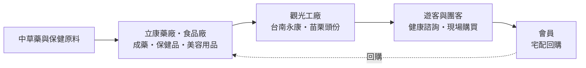
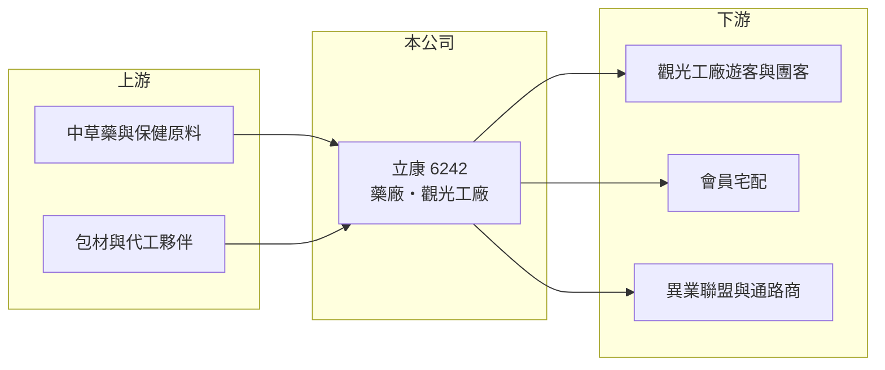

# 6242 立康

> 上櫃｜[[產業索引-生技醫療業|生技醫療業]]｜上市（櫃）日期 2003/04/23

# 第一章：企業模式與商業藍圖

> [!info] 撰寫說明
> 本文由 Claude 依公開資料整理，架構比照 [[2330台積電]] 的四章研究，資料截至 2026-10-08。財務數字來源：Goodinfo 年度經營績效表、櫃買中心開放資料（基本資料、2026 年第二季財報、每月營收、本益比殖利率）；業務與廠區資料取自富果研究整理的 2025 年 12 月法說會摘要（AI 摘要，非公司原始文件）。各產品系列營收比重未查得。#待校對

立康是一家把工廠變成銷售通路的公司：它在觀光工廠裡接待遊客、提供健康諮詢，再把自家生產的成藥與保健品直接賣給消費者。本章說明立康生醫事業（股票代號：6242，以下簡稱立康）的商業模式。

## 一、核心定位：自有產品加上觀光工廠直銷

立康成立於 1985 年，2003 年在櫃買中心掛牌，總部位於台南市永康區，董事長兼總經理為鄭育修，實收資本額約 3.18 億元。依法說會資料，公司產品分為四大系列：

* **[[成藥]]系列：** 不需醫師處方即可購買的藥品，需取得藥品許可證並在合格藥廠生產，是立康與一般保健品公司的區別。
* **營養保健系列：** [[保健食品]]類產品，與成藥一起構成健康產品的主力。
* **美容清潔與生活用品系列：** 延伸到日常消費品，增加遊客的購買品項。

立康的銷售方式以[[觀光工廠]]為核心：苗栗頭份有「立康健康養生觀光工廠」，台南永康有「立康中草藥產業文化館」。依法說會資料，台南文化館在 2020 至 2024 年的統計期間，產值穩居全台觀光工廠第一。

## 二、資本轉化邏輯：體驗帶動銷售，省下通路費

* **高毛利來自直銷：** 產品不經過藥局或量販通路，直接在觀光工廠賣給遊客，省下通路抽成，因此[[毛利率]]長年約 66% 至 69%。
* **營收受旅遊市場影響：** 遊客與團客是主要客源，國內旅遊景氣與遊覽車團客數量直接決定營收。依法說會資料，2023 至 2024 年受國內旅遊市場調整影響，營收小幅回落。
* **會員回購：** 公司整合歷年會員資料，以數據分眾行銷與宅配服務提高回購，降低對現場來客的依賴。

## 三、長期方向：南投新廠與大健康生態圈

依法說會資料，立康在 2025 年啟動南投埔里新廠興建計畫，將導入智慧製造，提升產能與品質。公司以「大健康產業」為核心，擴大地銷團隊與異業策略聯盟，目標是從仰賴團客的觀光工廠，轉向散客、會員與通路並重的健康產品公司。

# 第二章：護城河深度與競爭優勢

護城河是企業抵禦競爭、長期維持超額利潤的機制。本章說明立康觀光工廠模式的優勢，以及面對旅遊市場變化時能守住多少。

## 一、立康護城河的核心組成要素

* **1. 藥廠資格與成藥藥證：** 成藥需要在合格藥廠生產並取得許可證，一般保健品業者不易跨入，讓立康的產品具有「藥品等級」的信任感。
* **2. 觀光工廠的通路地位：** 觀光工廠需要土地、場館與營運經驗，也需要和旅行社、遊覽車業者建立長期合作。立康台南館產值多年居全台觀光工廠第一，代表這個通路已經累積規模。
* **3. 高毛利、低負債：** 毛利率接近七成，2026 年第二季底負債約 3.0 億元、權益約 8.4 億元，財務體質穩健。

## 二、主要競爭對手格局

| 對手 | 定位 | 對立康的影響 |
|---|---|---|
| 其他觀光工廠 | 食品、酒類、日用品等主題 | 爭取同一批遊客與旅行團行程 |
| [[4127天良]] | 保健品電視購物 | 在保健品直銷市場競爭 |
| [[1707葡萄王]] | 保健品製造與直銷 | 在保健品市場規模較大 |
| 連鎖藥局 | 販售成藥與保健品 | 消費者可在一般通路購買同類產品 |

## 三、優勢轉化：守得住與守不住的地方

* **守得住：** 2019 至 2025 年毛利率除 2022 年外都維持在 66% 至 69%，每年 EPS 都為正，代表觀光工廠直銷模式能穩定賺錢。
* **守不住：** 營業利益率從 2022 年的 20.1% 降到 2025 年的 16.7%；2022 年營收因防疫產品暴增到 6.84 億元，之後回落，顯示營收成長有一次性因素。
* **觀察重點：** 南投新廠的完工時程與散客比重、會員回購營收的成長，以及國內旅遊團客的恢復程度。

# 第三章：財務體質與盈利規模

資料日期：2026-10-08，表格是撰寫當時的快照；最新月營收、毛利率、累計 EPS 由自動排程寫在本筆記的屬性欄位（月營收、毛利率、累計EPS 等）。#待校對

財務報表是檢驗護城河是否真實存在的最終標準。本章用五年的三率、ROE 與資本報酬，檢視立康的獲利品質。

## 一、多年度財務表現

| 年度 | 營收（新台幣） | [[毛利率]] | [[營業利益率]] | EPS（元） | [[ROE]] |
|---|---|---|---|---|---|
| 2021 | 3.87 億 | 68.4% | 14.8% | 2.32 | 10.3% |
| 2022 | 6.84 億 | 56.8% | 20.1% | 4.81 | 21.1% |
| 2023 | 6.29 億 | 67.7% | 21.2% | 4.14 | 18.5% |
| 2024 | 5.66 億 | 68.3% | 15.9% | 2.48 | 10.4% |
| 2025 | 5.89 億 | 67.6% | 16.7% | 2.64 | 9.71% |

資料來源：Goodinfo 年度經營績效（合併報表）。2026 年上半年（櫃買中心資料）營收約 2.84 億元、毛利率約 67.0%、營業利益率約 14.1%、EPS 1.11 元；2026 年 1 至 8 月累計營收年減約 4.2%。

* **防疫效應：** 2022 年銷售防疫產品給醫療院所，營收年增約 77%，但毛利率降到 56.8%；2023 年後毛利率回到 68% 上下，營收回落到 5.7 億至 6.3 億元。
* **長期指標：** 2020 至 2025 年營收年複合成長率約 5.2%（推算）；2021 至 2025 年平均 ROE 約 14.0%（推算）。依櫃買中心資料，近一年現金股利 2.0 元，以 2025 年 EPS 計算配發率約 76%（推算）。股本從 2022 年約 2.33 億元增加到 2024 年約 3.18 億元，EPS 因股本擴大而下降（增資方式待校對）。

## 二、[[ROIC]] 與 [[WACC]]：價值創造利差

**ROIC 推算：** 2025 年營業利益約 0.98 億元，稅率 20% 後約 0.78 億元。官方資料揭露負債總計約 3.0 億元，以流動負債為主，假設三成為有息負債約 0.9 億元（推估），加上權益約 8.4 億元，投入資本約 9.3 億元，ROIC 約 8.4%（推算）。

**WACC 推算：** 台灣 10 年期公債殖利率取 1.75%、市場風險溢酬 6%、β 取消費性保健品同業常見值 0.6（未查得公司實際 β），股東權益成本約 5.35%。負債成本假設 2.5%，稅後約 2.0%，權益約占投入資本 90%，WACC 約 5.0%（推算）。

**結論：** ROIC 高於 WACC 約 3 個百分點，代表觀光工廠直銷模式長期能創造價值，但利差比 2022 至 2023 年縮小。南投新廠的資本支出會增加投入資本，新廠能否帶來相應的營收成長，決定未來利差的方向。

# 第四章：總體風險與地緣政治

任何企業都無法脫離宏觀環境獨立存在。本章分析立康長期必須面對的市場、法規與營運風險。

## 一、市場風險

* **國內旅遊景氣：** 觀光工廠的來客高度依賴國內旅遊與團客，景氣轉弱、出國旅遊增加或遊覽車業縮減，都會直接影響營收。
* **人口結構：** 主要客群偏向中高齡，雖然有利保健需求，但也要持續吸引新世代消費者。

## 二、法規風險

* **廣告與標示規範：** 成藥與保健品的功效宣稱受藥事法與食品安全衛生管理法規範，現場銷售話術與廣告若違規可能受罰並影響信譽。
* **藥廠標準：** 成藥生產須符合 GMP 規範，法規升級會增加設備與品管成本。

## 三、營運風險

* **新廠執行：** 南投埔里新廠仍在建置階段，資本支出、完工時程與新廠來客量都有不確定性。
* **通路單一：** 觀光工廠占銷售比重高，若無法擴大會員宅配與其他通路，營收成長空間有限。

# 專有名詞解析

## 金融

- **[[ROIC]]**：投入資本報酬率，稅後營業利益除以股東權益加有息負債，衡量本業運用資本的效率。
- **[[WACC]]**：加權平均資金成本，股東與債權人要求報酬率的加權平均，是 ROIC 要超越的門檻。

## 產業

- **[[成藥]]**：依藥事法核准、不需醫師處方即可購買的藥品，作用較緩和，常用於止痛、腸胃或外用。
- **[[保健食品]]**：以補充營養或維持健康為訴求的食品，不屬藥品，進入門檻低、品牌競爭激烈。
- **[[觀光工廠]]**：開放參觀並提供導覽、體驗與現場銷售的工廠，經濟部有評鑑制度，兼具行銷與通路功能。

# 核心供應鏈

## 1. 上游：原料
- 中草藥、保健原料與包材供應商（名稱未查得）

## 2. 中游：立康與同業
- 保健品同業：[[4127天良]]、[[1707葡萄王]]

## 3. 下游：客戶
- 觀光工廠遊客、旅行社與遊覽車團客、會員與異業合作通路

## 最新新聞
<!-- news:start -->
<!-- news:end -->

## 相關連結
- [公開資訊觀測站](https://mopsov.twse.com.tw/mops/web/t05st03?step=1&firstin=1&co_id=6242)
- [Goodinfo](https://goodinfo.tw/tw/StockDetail.asp?STOCK_ID=6242)
- [Yahoo 股市](https://tw.stock.yahoo.com/quote/6242)
- [鉅亨網新聞](https://www.cnyes.com/twstock/6242/news)
