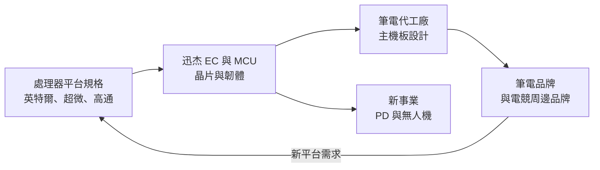
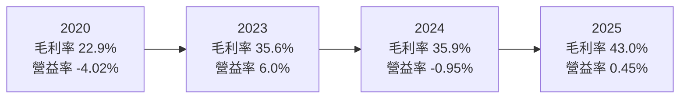
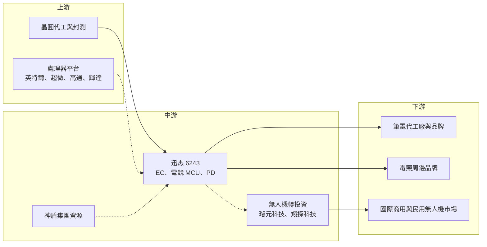

# 6243 迅杰

> 上市｜[[產業索引-半導體業|半導體業]]｜上市（櫃）日期 2009/12/17

# 第一章：企業模式與商業藍圖

> [!info] 撰寫說明
> 本文由 Claude 依公開資料整理，架構比照 [[2330台積電]] 的四章研究，資料截至 2026-10-08。財務數字來源：Goodinfo 台灣股市資訊網年度經營績效、MoneyDJ 理財網（富邦電子下單 DJ 版）公司基本資料與股利表、富果研究 2025 年 12 月法說會整理、旺得富 2023 年 12 月報導；產業描述為整理性內容，尚未逐條比對原始文件。#待校對

在評估單一個股的長期投資價值時，首要步驟是拆解企業的底層獲利邏輯。本章針對迅杰科技（股票代號：6243，以下簡稱迅杰）的商業模式進行定性分析，說明一家長年供應筆電嵌入式控制器的小型 IC 設計公司，如何以[[電競]] MCU 撐起毛利率，以及它為何在 2025 年跨足[[無人機]]這個看似不相關的領域。

## 一、核心定位：筆電與電競周邊的控制晶片設計公司

迅杰成立於 1998 年，2003 年掛牌，是一家 [[Fabless]] 型態的 IC 設計公司。MoneyDJ 揭露的 2025 年營收比重中，電腦及周邊消費電子 IC 占 99.85%，代表迅杰的營收幾乎全部來自 PC 相關晶片。迅杰目前隸屬神盾集團，[[6462神盾]] 在 2023 年的報導中將迅杰列為集團發展 AI 的轉投資公司之一，持股比例未查得。

迅杰最核心的產品是筆電的嵌入式控制器（[[EC]]）。EC 是筆電主機板上一顆不起眼但不可缺少的晶片，負責鍵盤掃描、電池充放電管理、風扇控制、開關機時序與各種低速周邊。中央處理器還沒開機時，EC 就已經在工作，因此 EC 的韌體必須與處理器平台、主機板設計高度配合，這也讓 EC 成為一個進入門檻不低的利基市場。

迅杰的商業模式有三個特點：

* **長期平台綁定：** EC 需要配合英特爾、超微等處理器平台的每一代規格更新，筆電品牌與代工廠驗證過一家 EC 供應商後，通常會在多個機種沿用。
* **營收規模小：** Goodinfo 顯示迅杰近六年營收介於 6.3 億至 8.8 億元，在 IC 設計業屬於小型公司，研發費用占營收比例偏高。
* **產品組合決定毛利率：** 電競 MCU 毛利較高，隨著它的占比提高，毛利率由 2020 年的 22.9% 提升到 2025 年的 43%。

## 二、產品板塊：EC、電競 MCU 與新產品

依富果整理的 2025 年 12 月法說內容，迅杰的產品線如下（法說只提到電競 MCU 占總營收超過五成，其他產品的比重未揭露，因此不繪製圓餅圖）：

* **嵌入式控制器（EC）：** 迅杰經營超過 20 年的產品線。2025 年由 8 位元架構升級為 32 位元，主要客戶已進入量產。EC 的功能也從傳統的低速控制，擴展到邊緣 AI（[[Edge AI]]）PC 所需的安全功能。2023 年的報導也提到迅杰規劃推出 AI Chromebook 使用的 [[ARM架構]] EC（架構由 [[ARM安謀]] 授權）。
* **電競 [[MCU]]：** 迅杰營收最大的產品線，占總營收超過五成，屬於利基產品。電競鍵盤、滑鼠等周邊需要高回報率與低延遲的控制晶片，毛利率高於一般消費性 MCU。
* **[[USB PD]]（電力傳輸）：** 研發約兩年，2025 年送樣，並替主要客戶開發 Common Footprint 1.0 與 2.0 規格，預計 2026 年開始設計導入（[[Design-in]]）。
* **無人機事業：** 2025 年成立新事業單位，投資兩家台灣無人機業者璿元科技與翔探科技，目標從晶片供應商轉型為系統整合者，以自有品牌經營國際商用與民用市場，並強調「[[非紅供應鏈]]」。

## 三、資本轉化邏輯：以韌體與平台驗證累積客戶

迅杰的資本主要投入在研發人力與晶片光罩，而不是廠房。它的價值來自兩件事：一是跟上每一代 PC 平台規格所累積的韌體能力，二是與筆電品牌及代工廠多年合作所建立的驗證紀錄。

這種模式的報酬取決於產品組合。EC 屬於長期穩定但成長有限的產品；電競 MCU 毛利較高，但與電競周邊的景氣連動。富果整理的法說資料指出，2025 年營收雖然年減，但因產品組合改善與費用控制，營業利益反而增加；2025 年第三季的稅後虧損，主要來自第二季的業外匯兌損失。

## 四、企業長期藍圖：守住 PC 核心，培養無人機第二引擎

法說資料顯示，迅杰的長期策略有三個層次。第一，維持 PC 與筆電的核心業務，提高電競 MCU 與 32 位元 EC 等高毛利產品的比重。第二，運用神盾集團在 AI 影像、低延遲通訊、衛星定位與飛控軟體的資源，降低技術開發與供應鏈成本。第三，把無人機發展為第二個成長引擎，長期替無人機客戶設計客製化 [[ASIC]]。

無人機事業的邏輯是：歐美市場對非中國製無人機的需求增加，台灣業者有機會切入；迅杰則希望從晶片供應商升級為系統整合者，提高附加價值。但這也是一個與 EC 完全不同的商業模式，需要系統設計、品牌與通路能力。法說資料也提到，投資協議剛簽訂，營收將分階段認列，短期貢獻有限。這條路能否成功，需要用三到五年的時間觀察。

# 第二章：護城河深度與競爭優勢

護城河決定了企業能否把今天的獲利延續到十年後。本章分析迅杰在 EC 與電競 MCU 市場的競爭優勢，以及它面對大型 IC 設計公司的處境。

## 一、護城河的核心組成要素

* **平台驗證與韌體累積：** EC 必須配合每一代處理器平台的電源管理與開機規格，迅杰累積 20 多年的韌體與驗證經驗，新進者要取得筆電品牌與代工廠的信任並不容易。
* **轉換成本：** 筆電主機板一旦以某家 EC 設計，韌體與 BIOS 都需要配合，更換供應商要重新開發與驗證，因此客戶在同一代平台內很少更換。
* **電競 MCU 的利基定位：** 電競周邊對回報率、延遲與燈效控制的要求高於一般周邊，迅杰在這個市場的毛利率高於傳統 EC。
* **集團資源：** 隸屬神盾集團，可以在技術、供應商議價與新事業開發上獲得支援。

這些優勢的限制在於市場地位。EC 市場由少數大廠主導，迅杰屬於規模較小的供應商，能守住既有客戶，但不容易擴大市占。

## 二、全球主要競爭對手格局

| 對手 | 定位 | 對迅杰的威脅 |
|---|---|---|
| [[3014聯陽]] | 筆電 EC 的主要供應商之一，產品線涵蓋 EC 與 PD | 規模與客戶覆蓋率高，在主流筆電平台具優勢 |
| [[4919新唐]] | MCU 與 EC 產品線完整的 IC 設計公司 | 以 MCU 產品廣度與資源競爭 EC 與周邊控制晶片 |
| Microchip 等國際 MCU 廠 | 全球 MCU 大廠，也供應嵌入式控制器 | 在商用與伺服器平台的 EC 與 MCU 市場具品牌優勢 |
| 中國 MCU 業者 | 以低價供應消費性與周邊 MCU | 壓低電競周邊 MCU 的價格 |

## 三、優勢轉化：哪些市場守得住、哪些守不住

* **守得住：** 已量產的 32 位元 EC 客戶與既有電競 MCU 客戶。這些客戶在同一代平台內更換供應商的成本高，迅杰只要維持品質與支援，就能保住訂單。
* **守不住：** 一般消費性周邊 MCU 與低階 EC。這些產品價格透明，容易被規模更大的台灣與中國同業以低價取代。
* **觀察重點：** USB PD 能否在 2026 至 2027 年完成設計導入並放量、電競 MCU 占比能否持續提高、無人機事業何時開始貢獻營收並轉為獲利，以及營業利益率能否穩定維持在 5% 以上。

# 第三章：財務體質與盈利規模

資料日期：2026-10-08。數字取自 Goodinfo 年度經營績效與 MoneyDJ 股利表，表格是撰寫當時的快照；最新月營收、毛利率、累計 EPS 由自動排程寫在本筆記的屬性欄位（月營收、毛利率、累計EPS 等）。#待校對

財務報表是檢驗護城河是否真實存在的最終標準。本章用六年的三率、ROE 與資本報酬，檢視迅杰的獲利品質。

## 一、獲利能力的基石：三率

| 年度 | 營收（新台幣） | [[毛利率]] | [[營業利益率]] | EPS（元） | [[ROE]] |
|---|---|---|---|---|---|
| 2020 | 6.37 億 | 22.9% | -4.02% | -0.82 | -13.0% |
| 2021 | 8.27 億 | 31.7% | 7.92% | 1.60 | 10.1% |
| 2022 | 7.14 億 | 34.7% | 0.59% | 1.74 | 9.95% |
| 2023 | 8.75 億 | 35.6% | 6.0% | 1.50 | 8.27% |
| 2024 | 7.21 億 | 35.9% | -0.95% | 1.12 | 5.99% |
| 2025 | 6.28 億 | 43.0% | 0.45% | -0.52 | -2.91% |

迅杰的六年數字有兩個趨勢。第一，毛利率穩定上升，由 2020 年的 22.9% 提高到 2025 年的 43.0%，反映電競 MCU 等高毛利產品占比增加，產品組合明顯改善。第二，營業利益率始終偏低，只有 2021 年與 2023 年超過 6%，其餘年份都在零附近。原因是營收規模停留在 6 億至 9 億元，毛利增加的幅度被研發與營運費用吸收。

2020 至 2025 年營收年複合成長率約 -0.3%（推算），基本上沒有成長。迅杰的稅後淨利常與營業利益方向不同，例如 2022 與 2024 年營業利益接近零或為負，EPS 仍有 1.74 元與 1.12 元，差額來自利息、匯兌與投資收益等業外項目；2025 年則因匯兌損失而由盈轉虧。評估本業時，應以營業利益率為主。

另外，Goodinfo 顯示迅杰的股本在 2020 年約 7.5 億元，2021 年降為約 4.43 億元，每股淨值由 5.87 元升到 16.99 元，推估 2020 至 2021 年間曾進行減資等資本重整，具體內容未查得。2021 年以前與以後的 EPS 不宜直接比較。

## 二、[[ROE]]：資本效率

2021 至 2025 年迅杰的平均 ROE 約 6.3%（推算），在 IC 設計業屬於偏低的水準。迅杰的資產中現金比重高，富果整理的法說資料顯示，2025 年第三季底現金及約當現金約 7.51 億元，約占股東權益九成以上（推算）。高現金部位讓迅杰的財務很安全，但也拉低了 ROE。

## 三、資本支出、[[自由現金流]]與股利

* **[[CapEx]]：** 迅杰是 Fabless 模式，資本支出很低。2025 年的主要資本運用是投資無人機業者，屬於策略性投資而非廠房設備。
* **自由現金流：** 年度現金流數字未查得。法說資料顯示，存貨由 2024 年高峰的約 2.5 億元降到 2025 年第三季的約 1.31 億元，存貨去化應有助於 2025 年的營業現金流。
* **股利：** 依 MoneyDJ 股利表，2019 與 2020 年度未配發現金股利，2021 至 2024 年度分別為 1.17、1.20、1.20、1.20 元，2025 年度因虧損未配發。2022 至 2024 年度的配發率約在七成至全額之間（推算），屬於「有盈餘就穩定配息」的類型。

## 四、[[ROIC]] 與 [[WACC]]：價值創造利差

**ROIC 推算：** 2025 年營業利益約 0.03 億元（6.28 億元 × 0.45%），稅後約 0.02 億元。股東權益約 7.69 億元（每股淨值 16.97 元 × 約 0.453 億股），依 ROE 與 ROA 的比值推算總負債約 3.9 億元，推估多為應付款項而非借款，投入資本以約 7.7 億元計，ROIC 約 0.3%（推算）。用同樣方法回推 2023 年，營業利益約 0.53 億元，稅後約 0.42 億元，股東權益約 8.2 億元，ROIC 約 5.1%（推算）。若扣除帳上大量現金，只計算營運所需的資本，ROIC 會明顯較高，代表本業的資本效率並不差，問題在於獲利絕對金額太小。

**WACC 推算：** 假設台灣 10 年期公債殖利率 1.75%、市場風險溢酬 6%，β 取 MoneyDJ 揭露的 0.62，股東權益成本約 5.5%；若改用 IC 設計同業常見的 β 1.0，股東權益成本約 7.75%。迅杰幾乎沒有有息負債，WACC 約 5.5% 至 7.75%（推算）。

**結論：** 迅杰的 ROIC 在獲利較好的 2021 與 2023 年，大致與 WACC 相當；2024 至 2025 年則低於資金成本。迅杰要成為長期創造價值的公司，必須讓營業利益率穩定站上 5% 以上，PD 與無人機等新事業能否帶來足夠規模，是決定這件事的關鍵。

# 第四章：總體風險與地緣政治

任何企業都無法脫離宏觀環境獨立存在。本章分析迅杰未來必須面對的地緣政治、產業週期、營運與技術風險。

## 一、地緣政治風險

* **非紅供應鏈的雙面性：** 迅杰的無人機事業以「非紅供應鏈」為賣點，受惠於歐美市場排除中國無人機的政策。但這類政策需求高度依賴政府採購與國防預算，政策方向一旦改變，需求也會跟著變化。
* **PC 供應鏈移轉：** 筆電組裝正由中國逐步移往東南亞等地，迅杰需要跟著客戶調整技術支援與供貨據點。
* **晶圓代工集中在台灣：** 與其他台灣 IC 設計公司相同，生產集中在台灣，面臨兩岸風險。

## 二、產業週期與市場結構風險

* **PC 換機週期：** EC 與電競 MCU 的需求都與 PC 出貨連動。法說資料提到，記憶體缺貨與漲價可能影響客戶訂單，而處理器廠推出新的邊緣 AI 平台則可能帶動換機，PC 景氣的起伏會直接反映在迅杰的營收。
* **電競周邊景氣：** 電競 MCU 占營收超過五成，電競周邊屬於消費性產品，需求受景氣與流行影響。
* **市場集中度高：** EC 市場由少數大廠主導，迅杰的議價能力有限。

## 三、營運環境的隱性風險

* **匯率：** 迅杰的營收以美元計價為主，2025 年第二季曾因匯兌損失導致稅後虧損，公司表示已降低美元部位。
* **新事業的執行風險：** 無人機事業與既有的晶片業務差異很大，需要新的系統整合、品牌與通路能力。投資初期的費用與可能的投資損失，會壓低整體獲利。
* **集團關係：** 隸屬神盾集團可以取得資源，但集團的策略調整與關係人交易，也可能影響迅杰的經營方向。

## 四、科技演進風險

PC 架構正在快速演變。[[ARM安謀]] 架構筆電、高通等新平台進入 PC 市場，EC 的功能與規格也隨之改變；處理器廠若把更多 EC 功能整合進晶片組或系統單晶片，獨立 EC 的需求可能縮小。另一方面，邊緣 AI PC 對安全功能的需求增加，也可能讓 EC 承擔更多角色。迅杰已把 EC 升級到 32 位元並加入安全功能，能否在每一代新平台都取得設計導入，是它長期存續的關鍵。

# 專有名詞解析

## 半導體

- **[[Fabless]]**：無晶圓廠的 IC 設計公司，只負責設計晶片，製造外包給晶圓代工與封測廠。
- **[[EC]]**：嵌入式控制器，筆電主機板上負責鍵盤、電池、風扇與開關機管理的晶片，處理器開機前就開始運作。
- **[[MCU]]**：微控制器，把處理器、記憶體與輸入輸出介面整合在一顆晶片上，用於家電、玩具與各種控制應用。
- **[[ASIC]]**：特殊應用積體電路，替特定客戶或用途量身設計的晶片，效能與功耗通常優於通用晶片。
- **[[ARM架構]]**：安謀公司授權的處理器指令集架構，以低功耗著稱，廣泛用於手機，近年也進入筆電與伺服器。
- **[[Edge AI]]**：在終端裝置上直接執行 AI 運算，而非把資料傳回雲端，可降低延遲並保護資料隱私。
- **[[Design-in]]**：零組件或晶片被客戶寫進產品設計的階段，是日後量產採購的前提，但從導入到量產常需數年。

## 應用

- **[[無人機]]**：不需駕駛員在機上操控的飛行器，應用於巡檢、測繪、物流與國防。

## 金融

- **[[ROIC]]**：投入資本報酬率，稅後營業利益除以股東權益加有息負債，衡量本業運用全部資本的效率。
- **[[WACC]]**：加權平均資金成本，股東與債權人要求報酬率的加權平均，ROIC 高於 WACC 才代表創造價值。

## 產業

- **[[USB PD]]**：USB 電力傳輸規格，讓裝置透過 USB Type-C 協商電壓與電流，最高可提供數百瓦電力。
- **[[非紅供應鏈]]**：排除中國大陸零組件與製造的供應鏈，常見於歐美政府採購與國防相關產品。
- **[[電競]]**：電子競技，以電玩遊戲進行的競賽與相關周邊產業，玩家重視低延遲與高回報率。

# 核心供應鏈

## 1. 上游：晶圓代工與處理器平台
- 晶圓代工與封裝測試廠（迅杰未公開合作對象，未查得）
- 需配合規格的處理器平台：[[INTC英特爾]]、[[AMD超微]]、[[QCOM高通]]、[[NVDA輝達]]

## 2. 中游：迅杰本身與集團
- EC、電競 MCU 與 USB PD 晶片：[[6243迅杰]]
- 所屬集團：[[6462神盾]]
- 無人機轉投資：璿元科技、翔探科技
- EC 與 MCU 同業：[[3014聯陽]]、[[4919新唐]]

## 3. 下游：客戶
- 筆電代工廠與筆電品牌（個別客戶未查得）
- 電競鍵盤、滑鼠等周邊品牌（個別客戶未查得）
- 歐美商用與民用無人機市場

## 最新新聞
<!-- news:start -->
<!-- news:end -->

## 相關連結
- [公開資訊觀測站](https://mopsov.twse.com.tw/mops/web/t05st03?step=1&firstin=1&co_id=6243)
- [Goodinfo](https://goodinfo.tw/tw/StockDetail.asp?STOCK_ID=6243)
- [Yahoo 股市](https://tw.stock.yahoo.com/quote/6243)
- [鉅亨網新聞](https://www.cnyes.com/twstock/6243/news)
