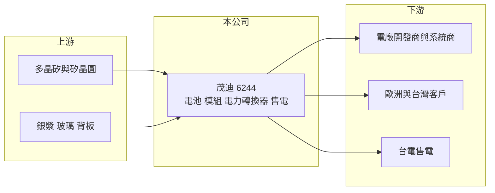

# 6244 茂迪

> 上櫃｜[[產業索引-光電業|光電業]]｜上市（櫃）日期 2003/05/15

# 第一章：企業模式與商業藍圖

> [!info] 撰寫說明
> 精簡版，由 Claude 依公開資料整理，架構比照 [[2330台積電]]，資料截至 2026-10-07。來源：nstock 公司資料頁、winvest 營收快訊。營收比重未查得。#待校對

茂迪是台灣老牌太陽能廠，本章說明其從電池到電廠的業務組成。

- **核心業務：** 公司製造與銷售 [[太陽能電池]]、[[太陽能模組]] 與電力轉換器，並從事太陽能發電系統的設計架設及發電售電。
- **營收結構：** 本次未查到產品別營收比重；業務橫跨電池、模組、系統與售電。
- **營運據點：** 公司登記地址在新北市深坑區，生產據點分布本次未查證。
- **長期方向：** 公司已與歐洲客戶接洽，拓展台灣以外市場是近期方向；售電收入可提供相對穩定的現金流（推估）。

# 第二章：護城河深度與競爭優勢

太陽能電池與模組高度標準化，茂迪的競爭力在非中國供應鏈與在地服務。

- **競爭優勢：** 在美國、歐洲對中國太陽能產品設限下，台灣製電池與模組可爭取非中國供應鏈訂單（推估）。
- **主要對手：** [[3576聯合再生]]、[[6443元晶]] 等台灣同業，以及隆基、晶科、天合等中國大廠。
- **觀察重點：** 歐洲客戶接單進度，以及 [[太陽光電]] 電池技術世代轉換下的設備投資需求。

# 第三章：財務體質與盈利規模

資料日期：2026-10-07，以下數字是撰寫當時的快照；最新月營收、毛利率、累計 EPS 由自動排程寫在本筆記的屬性欄位（月營收、毛利率、累計EPS 等）。#待校對

茂迪營收約 30 億元，2026 年第二季獲利明顯改善。

- **營收規模：** 2025 年全年營收 30.63 億元；2026 年 6 月單月 3.08 億元，年增 65.82%；9 月單月 2.93 億元，年增 0.59%。
- **獲利：** 2025 年 EPS 0.14 元；2026 年第二季 EPS 0.34 元，[[毛利率]] 22.11%，[[營業利益率]] 10.72%，淨利率 14.58%。
- **財務特色：** 資本額 38.7 億元，2025 年配發現金股利 0.36 元；第二季淨利率高於營業利益率，含業外收益。

# 第四章：總體風險與地緣政治

茂迪的風險主要來自全球太陽能產品價格與貿易政策。

- **產業週期：** 中國產能過剩使電池與模組價格長期下跌，台灣廠難以在價格上競爭。
- **營運風險：** 電池技術快速更替，舊產線可能需要提列減損，新產線則需大量資本支出。
- **其他風險：** 美國與歐洲的關稅與原產地規定變動、台灣綠電政策、匯率與多晶矽等原物料價格。

# 專有名詞解析

## 產業

- **[[太陽能電池]]**：把光能轉成電能的矽晶片元件，是太陽能模組的核心。
- **[[太陽能模組]]**：把多片太陽能電池串接並以玻璃、背板封裝，安裝在屋頂或電廠的發電單元。
- **[[太陽光電]]**：利用太陽能電池把陽光直接轉成電力的發電方式，涵蓋電池、模組、逆變器與電廠。

# 核心供應鏈

- 上游：矽晶圓 [[5483中美晶]]、銀漿 [[3691碩禾]]、玻璃與背板供應商
- 下游／客戶：太陽能電廠開發商、系統商、歐洲客戶與售電對象
- 同業：[[3576聯合再生]]、[[6443元晶]]、中國太陽能大廠

## 最新新聞
<!-- news:start（自動產生，請勿手動編輯此範圍） -->
- 2026-10-05 🏛️ 重訊 15:23｜本公司有價證券近期多次達公布注意交易資訊標準，故公告 相關訊息，以利投資人區別暸解。｜[觀測站](https://mops.twse.com.tw/mops/#/web/t05st01)

完整紀錄：[[6244茂迪 新聞]]
<!-- news:end -->

## 相關連結
- [公開資訊觀測站](https://mopsov.twse.com.tw/mops/web/t05st03?step=1&firstin=1&co_id=6244)
- [Goodinfo](https://goodinfo.tw/tw/StockDetail.asp?STOCK_ID=6244)
- [Yahoo 股市](https://tw.stock.yahoo.com/quote/6244)
- [鉅亨網新聞](https://www.cnyes.com/twstock/6244/news)
