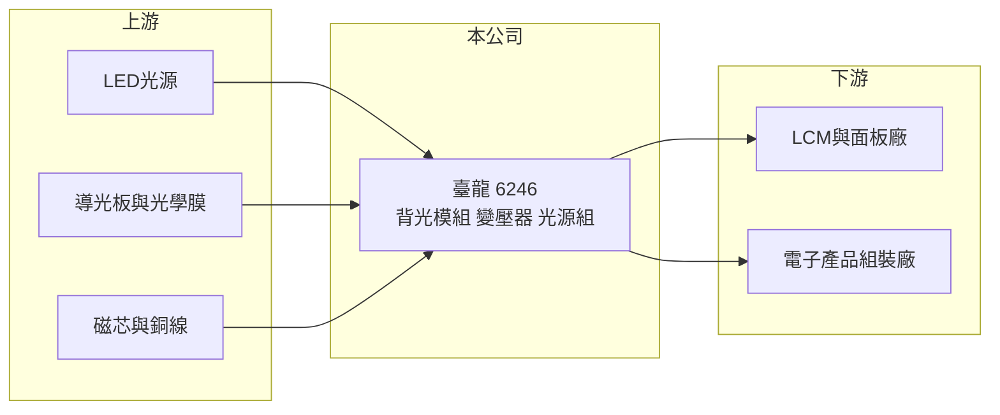

# 6246 臺龍

> 上櫃｜[[產業索引-光電業|光電業]]｜上市（櫃）日期 2003/06/18

# 第一章：企業模式與商業藍圖

> [!info] 撰寫說明
> 精簡版，由 Claude 依公開資料整理，架構比照 [[2330台積電]]，資料截至 2026-10-07。來源：nstock 公司資料頁、winvest 營收快訊。公開資料有限，營收比重未查得。#待校對

臺龍是小型顯示零組件廠，本章說明其產品與在面板供應鏈中的位置。

- **核心業務：** 公司製造與買賣 [[背光模組]]、變壓器及光源組等電子零件，產品供顯示器與電子產品使用。
- **營收結構：** 本次未查到產品別營收比重；依業務推估以中小尺寸背光模組為主。
- **營運據點：** 生產據點分布本次未查證。
- **長期方向：** 背光模組需要跟上 [[Mini LED]] 等光源升級，並分散到工業、車用等應用（推估）。

# 第二章：護城河深度與競爭優勢

背光模組是面板供應鏈中毛利偏低的環節，臺龍的競爭力在客製化與交期。

- **競爭優勢：** 掛牌 23 年，具備中小尺寸背光與光源組的設計量產經驗（推估）。
- **主要對手：** [[6176瑞儀]]、[[5371中光電]] 等台灣背光大廠，以及中國背光模組廠。
- **觀察重點：** 2026 年營收年減約兩成，需觀察主要客戶訂單是否回流。

# 第三章：財務體質與盈利規模

資料日期：2026-10-07，以下數字是撰寫當時的快照；最新月營收、毛利率、累計 EPS 由自動排程寫在本筆記的屬性欄位（月營收、毛利率、累計EPS 等）。#待校對

臺龍 2025 年獲利不錯，但 2026 年營收衰退並轉為虧損。

- **營收規模：** 2025 年全年營收 16 億元；2026 年 1 至 8 月累計 8.53 億元，年減 18.01%；8 月單月 1.12 億元，年減 10%。
- **獲利：** 2025 年 EPS 1.14 元；2026 年第二季 EPS -0.23 元，[[毛利率]] 10.62%，[[營業利益率]] -1.09%，[[ROE]] -2.12%。
- **財務特色：** 資本額僅 3.79 億元，股本小使 EPS 對獲利變化敏感；2025 年度未配息，近五年平均現金股利 0.02 元。

# 第四章：總體風險與地緣政治

臺龍的風險在於客戶集中與面板產業週期。

- **產業週期：** 背光模組需求跟隨面板與終端產品出貨，庫存調整時訂單下滑明顯。
- **營運風險：** 毛利率約一成，營收下滑時容易轉為本業虧損；客戶若集中，單一客戶轉單影響大（推估）。
- **其他風險：** [[OLED]] 等自發光顯示技術普及會減少背光需求，另有匯率與原物料價格風險。

# 專有名詞解析

## 產業

- **[[背光模組]]**：液晶面板本身不發光，背光模組以 LED 光源與導光板、光學膜提供均勻光線。
- **[[Mini LED]]**：晶粒尺寸約 100 至 200 微米的 LED，用在高階背光與小間距顯示屏。
- **[[OLED]]**：有機發光二極體顯示技術，每個像素自行發光，不需要背光模組。

# 核心供應鏈

- 上游：LED 元件廠如 [[2393億光]]、導光板與光學膜供應商、磁性材料（推估）
- 下游／客戶：LCM 與面板廠如 [[6167久正]]、電子產品組裝廠（推估）
- 同業：[[6176瑞儀]]、[[5371中光電]]

## 最新新聞
<!-- news:start -->
<!-- news:end -->

## 相關連結
- [公開資訊觀測站](https://mopsov.twse.com.tw/mops/web/t05st03?step=1&firstin=1&co_id=6246)
- [Goodinfo](https://goodinfo.tw/tw/StockDetail.asp?STOCK_ID=6246)
- [Yahoo 股市](https://tw.stock.yahoo.com/quote/6246)
- [鉅亨網新聞](https://www.cnyes.com/twstock/6246/news)
