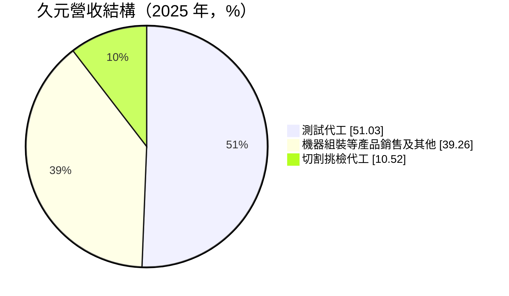
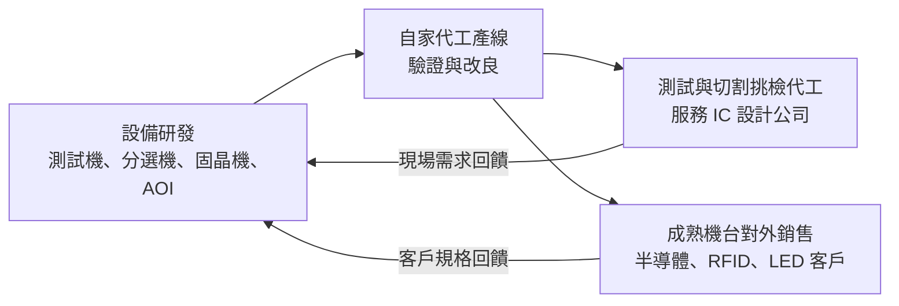
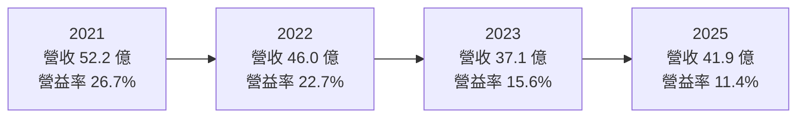
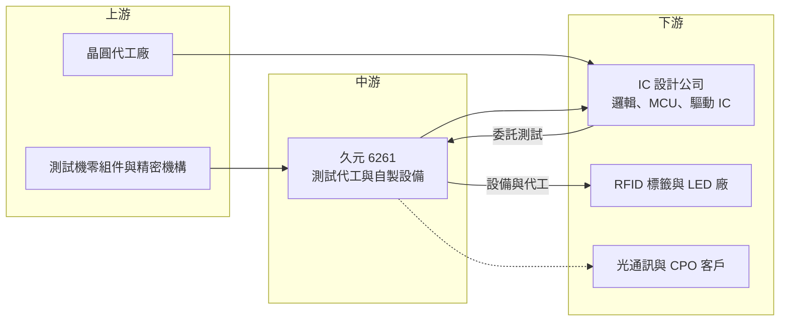

# 6261 久元

> 上櫃｜[[產業索引-半導體業|半導體業]]｜上市（櫃）日期 2004/03/29

# 第一章：企業模式與商業藍圖

> [!info] 撰寫說明
> 本文由 Claude 依公開資料整理，架構比照 [[2330台積電]] 的四章研究，資料截至 2026-10-08。財務數字來源：Goodinfo 台灣股市資訊網年度經營績效、MoneyDJ 理財網（富邦電子下單 DJ 版）公司基本資料與股利表、富果研究 2026 年 9 月法說會整理；產業描述為整理性內容，尚未逐條比對原始文件。#待校對

在評估單一個股的長期投資價值時，首要步驟是拆解企業的底層獲利邏輯。本章針對久元電子（股票代號：6261，以下簡稱久元）的商業模式進行定性分析，說明一家同時做[[測試代工]]、又自己製造測試與封裝設備的公司，如何把兩種業務結合成「設備加服務」的模式，以及它在半導體後段製程中的位置。

## 一、核心定位：自製設備的後段製程代工廠

久元成立於 1991 年，2004 年掛牌，總部位於新竹科學園區。依富果整理的 2026 年 9 月法說內容，久元把自己定位為專業的半導體後段解決方案供應商，業務橫跨半導體、RFID 與 LED 三個領域，而且每個領域都同時有「代工服務」與「設備銷售」兩條線。

這種「自己做設備、也自己用設備做代工」的模式，在台灣後段產業並不常見。一般的測試代工廠向國外或國內設備商購買測試機與[[分選機]]；一般的設備商則把機台賣給代工廠。久元兩邊都做，好處是設備部門可以先在自家產線上驗證機台，代工部門則能用較低的成本取得客製化設備；代價是公司必須同時管理資本密集的代工業務與研發密集的設備業務。

依 MoneyDJ 揭露的 2025 年營收比重，久元的營收來源如下：

## 二、產品板塊：半導體、RFID 與 LED 三大領域

* **半導體測試代工：** 久元最大的業務，提供邏輯 IC、混合訊號 IC、[[MCU]] 與 LCD 驅動 IC（[[DDI]]）的測試服務。測試代工是在晶片封裝前後檢查功能是否正常，並把不良品挑出，屬於半導體製造不可省略的環節。
* **自製設備銷售：** 久元自行研發製造測試機、分選機、[[固晶機]]與 [[AOI]] 自動光學檢測機，除自用外也對外銷售。法說資料指出，設備銷售占營收接近四成，而且比重持續成長。
* **RFID：** 提供 [[RFID]] 天線嵌體與標籤的設計與代工，並銷售 RFID 覆晶接合設備。RFID 標籤大量用於零售、物流與防偽，需要把微小的晶片接合到天線上，久元同時供應這個製程所需的設備與代工。
* **LED 與 [[Mini LED]]：** 提供 LED 與 [[VCSEL]] 的代工服務，並銷售自動固晶機。法說資料顯示，RFID 與 LED 合計約占營收 11%。

在據點方面，久元在新竹科學園區有普鼎、科技、力行、創新四座廠；中國有江蘇揚州、蘇州與廣東深圳的子公司，負責 RFID 代工、半導體設備製造銷售與測試服務；美國加州聖塔克拉拉設有銷售據點。

## 三、資本轉化邏輯：設備與代工互相支撐

久元的資本轉化邏輯可以理解為一個循環：設備部門開發新機台，先在自家代工產線上驗證並改良；驗證成熟後，代工部門用自製機台降低成本、擴充產能，設備部門再把成熟機台賣給外部客戶。

測試代工的特性是資本密集：每接一批新訂單，都需要先購買測試機台，機台使用率決定了毛利率。久元在 2026 年法說中表示，2026 與 2027 年的資本支出都將超過 10 億元，主要用於半導體測試代工設備，以因應新訂單。這個規模約為 2025 年營收的四分之一，代表久元正處於積極擴產的階段。

## 四、企業長期藍圖：擴充測試產能並切入 CPO

法說資料列出的長期方向包括：擴充半導體測試代工產能；強化半導體、光電與 [[IoT]] 領域的後段代工與自製設備能力；推動產品線多元化並拓展國內外市場。

在新技術方面，久元在共同封裝光學（[[CPO]]）的測試代工與設備兩端都有布局，已有客戶專案進行中，並在開發 CPO 測試設備。CPO 是把光通訊元件與交換器晶片封裝在一起的技術，被視為 AI 資料中心降低傳輸耗電的關鍵。法說資料也坦言，CPO 的營收貢獻取決於市場發展。對久元而言，CPO 是讓設備與代工能力進入高成長市場的機會，但距離成為主要營收來源仍有一段時間。

# 第二章：護城河深度與競爭優勢

護城河決定了企業能否把今天的獲利延續到十年後。本章分析久元在後段測試與設備市場的競爭優勢，以及它面對大型測試廠與設備商時的位置。

## 一、護城河的核心組成要素

* **設備自製能力：** 久元能自行開發測試機、分選機與固晶機，代工產線的設備成本低於向外採購，也能依客戶需求快速調整機台。這是一般測試代工廠不具備的成本與彈性優勢。
* **跨領域的後段製程經驗：** 同時經營半導體、RFID 與 LED 的後段製程，累積了微小晶粒取放、接合與光電檢測的技術。這些技術可以互相移轉，例如 LED 的固晶經驗可延伸到 VCSEL 與光通訊元件。
* **與 IC 設計公司的長期合作：** 測試代工需要與客戶共同開發測試程式，客戶的產品一旦在久元完成測試程式開發，轉換到其他測試廠需要重新驗證，具有一定的轉換成本。
* **財務體質：** 久元的每股淨值約 52 元，股東權益規模大，負債比例低，有能力在擴產期支應大額資本支出。

## 二、全球主要競爭對手格局

| 對手 | 定位 | 對久元的影響 |
|---|---|---|
| [[2449京元電子]]、[[3264欣銓]]、[[6257矽格]] | 台灣主要獨立測試代工廠，規模大、產能完整 | 在邏輯、混合訊號與 MCU 測試爭取同一批 IC 設計客戶 |
| [[6147頎邦]]、[[8150南茂]] | 驅動 IC 封裝測試大廠 | 在 LCD 驅動 IC 測試與久元直接競爭 |
| [[7769鴻勁]]、[[6187萬潤]] | 台灣半導體後段設備商 | 在分選機、自動化設備市場與久元的設備部門競爭 |
| [[6706惠特]]、[[6223旺矽]] | LED 與光電檢測、分選設備商 | 在 LED、VCSEL 檢測與固晶設備市場競爭 |

## 三、優勢轉化：哪些市場守得住、哪些守不住

* **守得住：** 中小型 IC 設計公司的 MCU、混合訊號與驅動 IC 測試，以及 RFID 與 LED 的後段設備。這些市場重視彈性與成本，久元的設備自製能力可以發揮作用。
* **守不住：** 大型高效能運算晶片的測試。這類測試需要昂貴的國際品牌測試機與龐大產能，由規模更大的測試廠主導，久元難以與之競爭。
* **觀察重點：** 2026 至 2027 年每年超過 10 億元的資本支出能否帶來對應的營收成長、測試代工的[[產能利用率]]與毛利率是否維持、設備銷售能否持續提高占比，以及 CPO 測試設備能否取得量產訂單。

# 第三章：財務體質與盈利規模

資料日期：2026-10-08。數字取自 Goodinfo 年度經營績效與 MoneyDJ 股利表，表格是撰寫當時的快照；最新月營收、毛利率、累計 EPS 由自動排程寫在本筆記的屬性欄位（月營收、毛利率、累計EPS 等）。#待校對

財務報表是檢驗護城河是否真實存在的最終標準。本章用六年的三率、ROE 與資本報酬，檢視久元在半導體景氣循環中的獲利品質。

## 一、獲利能力的基石：三率

| 年度 | 營收（新台幣） | [[毛利率]] | [[營業利益率]] | EPS（元） | [[ROE]] |
|---|---|---|---|---|---|
| 2020 | 35.0 億 | 32.2% | 19.7% | 4.12 | 8.57% |
| 2021 | 52.2 億 | 38.8% | 26.7% | 8.41 | 16.7% |
| 2022 | 46.0 億 | 35.3% | 22.7% | 6.65 | 12.8% |
| 2023 | 37.1 億 | 28.4% | 15.6% | 4.09 | 7.51% |
| 2024 | 39.7 億 | 30.1% | 11.6% | 4.06 | 7.07% |
| 2025 | 41.9 億 | 29.9% | 11.4% | 4.23 | 7.34% |

久元的六年數字反映了典型的後段測試循環。2021 年半導體缺貨潮帶動測試需求，營收達 52.2 億元、營業利益率 26.7%、EPS 8.41 元。2023 年消費性晶片庫存調整，營收降到 37.1 億元，毛利率跌破三成。2024 至 2025 年營收逐步回升，但營業利益率反而由 15.6% 降到約 11%，推估與擴產前期的折舊、人力費用增加，以及設備銷售占比提高（設備毛利結構不同）有關，具體原因未查得。

2020 至 2025 年營收年複合成長率約 3.7%（推算）。值得注意的是，2023 至 2025 年 EPS 維持在 4.06 至 4.23 元之間，非常穩定，代表久元在景氣低谷時仍有相當的獲利底線，這與測試代工客戶分散、加上設備業務的互補有關。

## 二、[[ROE]]：資本效率

2021 至 2025 年久元的平均 ROE 約 10.3%（推算），高點是 2021 年的 16.7%，近三年維持在 7% 出頭。久元的每股淨值約 52 元，股東權益規模大，而且負債比例低（Goodinfo 的 ROE 與 ROA 比值顯示資產約為股東權益的 1.2 倍），因此 ROE 主要由營業利益率決定。近年 ROE 偏低，反映的是獲利率下滑，以及帳上可能有部分資金尚未投入營運。

## 三、資本支出、[[自由現金流]]與股利

* **[[CapEx]]：** 富果整理的法說資料顯示，2026 與 2027 年資本支出都將超過 10 億元，主要用於半導體測試代工設備。測試代工屬資本密集業務，這代表未來兩年的折舊會明顯增加，需要營收成長來吸收。
* **自由現金流：** 年度現金流數字未查得。以過去營業利益率超過一成、資本支出規模有限推估，2025 年以前的自由現金流應多為正值；2026 至 2027 年大舉擴產期間，自由現金流可能轉弱甚至為負（推估）。
* **股利：** 依 MoneyDJ 股利表，2019 至 2025 年度現金股利分別為 3.00、4.00、5.00、5.00、4.00、4.00、2.50 元。久元過去[[配息率]]很高，2020、2023、2024 年度幾乎把全部盈餘配出；2025 年度降為 2.50 元，法說說明是為了保留資金建廠與擴充產能。這是一個資本配置轉向的訊號：久元由「高配息」轉為「再投資」。

## 四、[[ROIC]] 與 [[WACC]]：價值創造利差

**ROIC 推算：** 2025 年營業利益約 4.78 億元（41.9 億元 × 11.4%），以稅率 20% 計算，稅後營業利益約 3.82 億元。股東權益約 66.7 億元（每股淨值 51.92 元 × 約 1.285 億股），依 ROE 與 ROA 的比值推算總負債約 15 億元，假設其中有息負債約 5 億元（推估），投入資本約 72 億元，ROIC 約 5.3%（推算）。用同樣方法回推 2021 年，稅後營業利益約 11.2 億元，股東權益約 66.9 億元，加上約 5 億元有息負債，ROIC 約 15.5%（推算）。

**WACC 推算：** 假設台灣 10 年期公債殖利率 1.75%、市場風險溢酬 6%，β 取 MoneyDJ 揭露的 0.78，股東權益成本約 6.4%。負債成本假設 2.5%，稅後約 2.0%，權益占資本約 93%（推估），WACC 約 6.1%（推算）。

**結論：** 2020 至 2022 年久元的 ROIC 明顯高於 WACC；2023 至 2025 年 ROIC 約 5% 至 6%，略低於或接近資金成本，價值創造的利差幾乎消失。2026 至 2027 年的大額資本支出，是久元把 ROIC 拉回 10% 以上的嘗試，成敗取決於新產能的利用率。若新產能無法滿載，折舊增加反而會讓 ROIC 進一步下滑。

# 第四章：總體風險與地緣政治

任何企業都無法脫離宏觀環境獨立存在。本章分析久元未來必須面對的地緣政治、產業週期、營運與技術風險。

## 一、地緣政治風險

* **中國據點的雙面性：** 久元在揚州、蘇州與深圳設有子公司，提供 RFID 代工、設備製造與測試服務。中國市場提供成長機會，但美中科技管制與中國本土化政策，可能限制久元設備銷往中國或使中國客戶改用本土設備。
* **客戶「台灣加一」需求：** 國際客戶要求測試產能分散到台灣以外，久元的測試代工主要在新竹，若客戶要求在其他地區就近測試，久元需要評估是否跟進。
* **台灣集中風險：** 主要測試產能集中在新竹科學園區，面臨與其他台灣半導體廠相同的兩岸風險。

## 二、產業週期與市場結構風險

* **後段測試的景氣循環：** 測試代工的需求跟著晶片出貨量走，消費性與 PC 晶片庫存調整時，測試量會明顯下滑。2021 至 2023 年營收減少約三成，就是循環的縮影。
* **設備業務的循環更劇烈：** 設備銷售與客戶的擴產計畫連動，景氣反轉時客戶會先砍設備採購，設備營收的波動通常大於代工。
* **LED 與 RFID 的價格競爭：** LED 產業長期面臨中國廠商的價格競爭，RFID 標籤則是高度價格敏感的大量產品，兩者毛利都容易受壓。

## 三、營運環境的隱性風險

* **擴產的折舊壓力：** 每年超過 10 億元的資本支出，會在 2027 年以後轉為折舊。若新訂單量不如預期，產能利用率下滑會直接壓縮毛利率。
* **股利政策轉變：** 久元過去以高配息吸引長期投資人，2025 年度起為擴產降低配息。若擴產效益延遲，股東可能同時面對較低的股利與較低的報酬率。
* **人才與水電：** 與其他新竹科學園區的半導體公司相同，面臨工程人才競爭與水電供應的挑戰。

## 四、科技演進風險

晶片測試的難度隨著先進封裝、[[Chiplet]] 與 CPO 等技術的發展持續提高，需要更高階的測試機台與更複雜的測試程式。久元的優勢在中低階測試與自製設備，若主要客戶的產品轉向高階封裝，而久元的設備與測試能力跟不上，就會失去客戶。另一方面，CPO 若成為 AI 資料中心的主流，光電元件的測試與組裝需求會大幅增加，這是久元可以運用 LED、VCSEL 經驗切入的新市場。技術轉變對久元既是威脅也是機會。

# 專有名詞解析

## 半導體

- **[[測試代工]]**：替 IC 設計公司檢查晶片功能、挑出不良品的代工服務，是半導體後段製程的重要環節。
- **[[分選機]]**：測試時負責取放晶片、依測試結果分類良品與不良品的自動化設備。
- **[[固晶機]]**：把晶粒精準放置並接合到基板或支架上的設備，用於 LED、RFID 與半導體封裝。
- **[[AOI]]**：自動光學檢測，用相機與影像演算法自動檢查產品外觀缺陷的技術。
- **[[VCSEL]]**：垂直共振腔面射型雷射，用於臉部辨識、光通訊與車用光達。
- **[[CPO]]**：共同封裝光學，把光學元件與交換器晶片封裝在一起，以降低 AI 資料中心的傳輸耗電。
- **[[Chiplet]]**：把大型晶片拆成多個小晶片分別製造，再以先進封裝整合，可提高良率並降低成本。
- **[[DDI]]**：顯示驅動 IC，負責控制面板每個像素的電壓，是 LCD 與 OLED 面板必備的晶片。

## 應用

- **[[RFID]]**：無線射頻辨識，透過無線電波讀取標籤中晶片的資料，用於物流、零售與防偽。

## 金融

- **[[產能利用率]]**：實際產出占總產能的比例，測試代工的毛利率高度取決於此數字。
- **[[配息率]]**：現金股利占每股盈餘的比例，反映公司把多少獲利發給股東、多少留作再投資。
- **[[ROIC]]**：投入資本報酬率，稅後營業利益除以股東權益加有息負債，衡量本業運用全部資本的效率。
- **[[WACC]]**：加權平均資金成本，股東與債權人要求報酬率的加權平均，ROIC 高於 WACC 才代表創造價值。

## 產業

- **[[Mini LED]]**：晶粒尺寸約 100 至 200 微米的 LED，用於高階顯示器背光與直顯螢幕。

# 核心供應鏈

## 1. 上游：設備零組件與晶圓
- 測試機與自動化設備所需的精密機構、電子零組件（個別供應商未查得）
- 客戶晶圓來源：[[2330台積電]]、[[2303聯電]] 等晶圓代工廠（久元客戶的晶圓多來自台灣成熟製程廠，推估）

## 2. 中游：久元本身與同業
- 測試代工、切割挑檢與後段設備：[[6261久元]]
- 測試代工同業：[[2449京元電子]]、[[3264欣銓]]、[[6257矽格]]
- 驅動 IC 封測同業：[[6147頎邦]]、[[8150南茂]]
- 後段設備同業：[[7769鴻勁]]、[[6187萬潤]]、[[6706惠特]]、[[6223旺矽]]

## 3. 下游：客戶
- 邏輯、混合訊號、MCU 與 LCD 驅動 IC 設計公司（個別客戶未查得）
- RFID 嵌體與標籤業者、LED 與 VCSEL 業者
- CPO 與光通訊專案客戶（法說提到專案進行中，名稱未揭露）

## 最新新聞
<!-- news:start（自動產生，請勿手動編輯此範圍） -->
- 2026-10-08 📰 媒體 21:20｜營收速報 - 久元(6261)9月營收4.30億元年增率高達40.66％｜[鉅亨網](https://news.cnyes.com/news/id/6626018)

完整紀錄：[[6261久元 新聞]]
<!-- news:end -->

## 相關連結
- [公開資訊觀測站](https://mopsov.twse.com.tw/mops/web/t05st03?step=1&firstin=1&co_id=6261)
- [Goodinfo](https://goodinfo.tw/tw/StockDetail.asp?STOCK_ID=6261)
- [Yahoo 股市](https://tw.stock.yahoo.com/quote/6261)
- [鉅亨網新聞](https://www.cnyes.com/twstock/6261/news)
