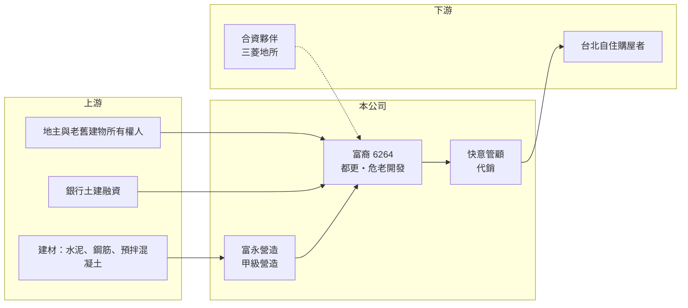

# 6264 富裔

> 上櫃｜[[產業索引-建材營造業|建材營造業]]｜上市（櫃）日期 2004/02/24

# 第一章：企業模式與商業藍圖

> [!info] 撰寫說明
> 精簡版，由 Claude 依公開資料整理，架構比照 [[2330台積電]]，資料截至 2026-10-08。來源：櫃買中心開放資料（基本資料、資產負債、綜合損益）、Goodinfo 年度經營績效、富果法說會備忘錄（2025-12-23）。建案總銷與時程為管理層 2025 年底說法，可能已變動。#待校對

本章說明富裔（6264）如何以台北精華區的[[都更]]與[[危老重建]]為核心，經營土地開發到營造的整合型建設事業。

- **核心業務：** 富裔實業成立於 1997 年，2004 年上櫃，董事長祝文定，總部在台北。公司專注台北市精華區的都市更新、危老重建、土地開發與建案銷售，屬於典型的住宅開發商。依 2025 年法說會，管理層表示公司前身為國礎建設，具有數十年建築設計背景，這是富裔切入高難度都更案的基礎。
- **集團分工：** 母公司負責土地開發與規劃設計，子公司富永營造是甲級營造廠，負責集團建案施工，也承接外部公共工程。快意管顧原本經營飯店，2025 年結束飯店業務後轉為建案代銷；與台灣三菱地所合資的富裔菱則引進日系營造管理。設計、開發、營造到銷售都在集團內完成，好處是能控管工期與成本，代價是固定人力與管理費用較高。
- **營收結構：** 建設公司的營收在[[建案交屋]]時才一次認列，富裔 2023 至 2025 年營收只有 1 至 2 億元，主要來自零星餘屋與工程收入，屬於建案認列的空窗期。依 2025 年 12 月法說會，在庫建案總銷約 165.6 億元，包括國王雙子星（約 34 億元）、富裔大湖（約 31.6 億元）、至誠路 A/B 區（合計約 32.4 億元）等案。
- **長期方向：** 2025 年公司把東區原泡泡飯店改建為住宅案「富裔巨蛋」，正式從飯店轉向收益率較高的住宅開發，並以「城市改造者」定位深耕台北都更。都更案從整合地主、報核事業計畫到動工往往要五年以上，富裔能否把手上案量依序轉為交屋營收，是長期價值的關鍵。

# 第二章：護城河深度與競爭優勢

本章分析富裔在台北都更市場的競爭條件與限制。

- **競爭優勢：** 台北市精華區的新建住宅土地幾乎只能透過都更與危老取得，這需要長時間與地主溝通、熟悉法規與建築設計。富裔以設計背景起家，並有自家營造廠，可以承接整合難度高、大型建商不一定願意投入的案子，例如同意比例達 100% 的富裔大湖海砂屋都更案。
- **主要對手：** 台北都更市場的參與者包括 [[2542興富發]]、[[5522遠雄]]、[[2548華固]] 等大型建商，以及大量專做都更的中小型建設公司。大型建商的資金成本與品牌較具優勢，富裔則以個案整合能力與合資夥伴（三菱地所）補足規模劣勢。
- **觀察重點：** 第一是 2026 年後幾個主要建案能否如期完工交屋，讓營收從 1 至 2 億元的低谷回到數十億元規模。第二是負債比例，2025 年第三季已超過 80%，若建案延宕，利息負擔會持續侵蝕淨值。第三是[[信用管制]]與房貸政策對台北高總價住宅銷售的影響。

# 第三章：財務體質與盈利規模

資料日期：2026-10-08，表格是撰寫當時的快照；最新月營收、毛利率、累計 EPS 由自動排程寫在本筆記的屬性欄位（月營收、毛利率、累計EPS 等）。#待校對

本章用多年度數字檢視富裔在建案空窗期的財務壓力。

| 年度 | 營收（新台幣） | [[毛利率]] | [[營業利益率]] | EPS（元） | [[ROE]] |
|---|---|---|---|---|---|
| 2021 | 5.94 億 | -5.4% | -20.2% | -0.19 | -5.15% |
| 2022 | 7.67 億 | -13.9% | -25.8% | -1.86 | -33.4%（來源欄位對位不完整） |
| 2023 | 2.13 億 | -36.7% | -93.7% | -0.98 | -25.7% |
| 2024 | 2.00 億 | 27.0% | -24.6% | 0.05 | 0.52% |
| 2025 | 1.12 億 | 16.6% | -89.3% | -0.50 | -9.59% |

- **營收規模：** 近五年營收在 1 至 8 億元之間，遠低於手上在庫案量的規模，反映都更案前期投入長、認列集中的特性。依櫃買中心資料，2026 年上半年營收約 0.44 億元、每股虧損 0.50 元，主要建案仍未大量交屋。
- **獲利：** 2021 至 2025 年營業利益率全為負，近五年平均 ROE 約 -14.7%（推算）。建設公司在沒有交屋的年度，仍要負擔人事、行銷與利息費用，因此本業虧損是空窗期的常態，但持續時間過長會消耗淨值。
- **財務特色：** 2026 年第二季股本約 13.6 億元，歸屬母公司權益約 9.2 億元，每股淨值 6.76 元，總負債約 39.9 億元（流動 23.9 億、非流動 15.9 億），負債遠高於淨值。Goodinfo 統計的歷年平均現金股利只有約 0.27 元，近年未配息。
- **[[ROIC]] 與 [[WACC]]：** 2025 年營業利益約 -1.0 億元（1.12 億 × -89.3%），虧損不計稅；投入資本以股東權益 9.2 億元加上有息負債推算，有息負債以總負債約六成、約 24 億元假設（建設融資與土地融資，實際數字未查得），ROIC 約 -3%（推算）。WACC 以 CAPM 推估：無風險利率 1.75%、市場風險溢酬 6%、β 取高槓桿建設股常見值 1.0，股東權益成本約 7.75%；負債成本 2.5%、稅後約 2.0%；以帳面權重股權約 28%、負債約 72%，WACC 約 3.6%（推算）。ROIC 長期低於 WACC，代表過去幾年資本並未創造價值，未來要靠大型都更案交屋扭轉。

# 第四章：總體風險與地緣政治

本章整理富裔長期必須面對的風險。

- **產業週期：** 住宅開發高度依賴房市景氣、利率與銀行放款態度。台灣央行的選擇性信用管制與房貸成數限制，會直接影響台北高總價住宅的去化速度與售價，建案從推出到交屋往往跨越一個以上的景氣循環。
- **營運風險：** 都更案需要所有權人同意、政府審議與鄰損協調，任何環節延宕都會讓建案時程後移，利息與管理費用卻持續發生。營收集中在少數大案，單一建案的延誤或銷售不佳就會讓年度獲利大幅波動。
- **其他風險：** 營建材料與工資上漲會壓縮已預售建案的利潤；高負債結構使公司對利率上升較敏感；轉型過程中結束飯店事業也代表失去一部分穩定現金流來源。

# 專有名詞解析

## 金融

- **[[信用管制]]**：央行限制房貸成數、寬限期與土建融條件的政策，用來抑制房市過熱。
- **[[ROIC]]**：投入資本報酬率，稅後營業利益除以投入資本，衡量本業運用資金創造報酬的能力。
- **[[WACC]]**：加權平均資金成本，股東與債權人要求報酬率的加權平均，ROIC 高於 WACC 才代表創造價值。

## 產業

- **[[都更]]**：都市更新，由建商整合老舊建物所有權人重建，地主以土地換取新屋，流程長且需政府審議。
- **[[危老重建]]**：危險及老舊建築物加速重建條例的重建模式，門檻與審議較都更簡單，但基地規模通常較小。
- **[[建案交屋]]**：建設公司把房屋所有權移轉給買方，營收與獲利在此時一次認列。

# 核心供應鏈

- 上游：都更地主與老舊建物所有權人；建材如水泥、鋼筋、預拌混凝土（例如 [[1101台泥]]、[[2002中鋼]]，產業參考，實際供應商未查得）；提供土地與建築融資的銀行。
- 下游／客戶：台北市自住與換屋購屋者；與台灣三菱地所合資開發高端案。
- 同業：[[2542興富發]]、[[2548華固]]、[[5522遠雄]] 等在台北推案的建設公司。

## 最新新聞
<!-- news:start -->
<!-- news:end -->

## 相關連結
- [公開資訊觀測站](https://mopsov.twse.com.tw/mops/web/t05st03?step=1&firstin=1&co_id=6264)
- [Goodinfo](https://goodinfo.tw/tw/StockDetail.asp?STOCK_ID=6264)
- [Yahoo 股市](https://tw.stock.yahoo.com/quote/6264)
- [鉅亨網新聞](https://www.cnyes.com/twstock/6264/news)
