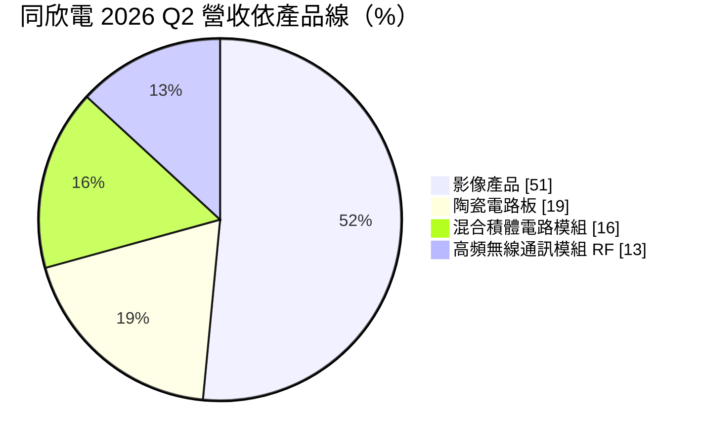
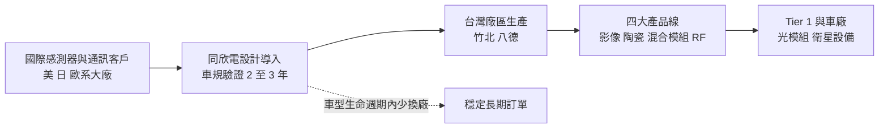
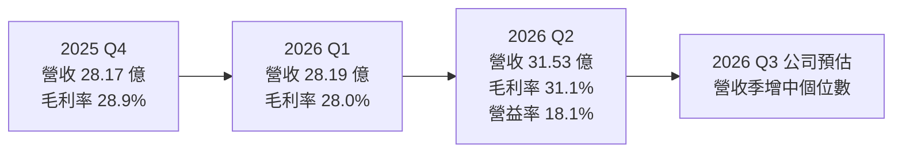
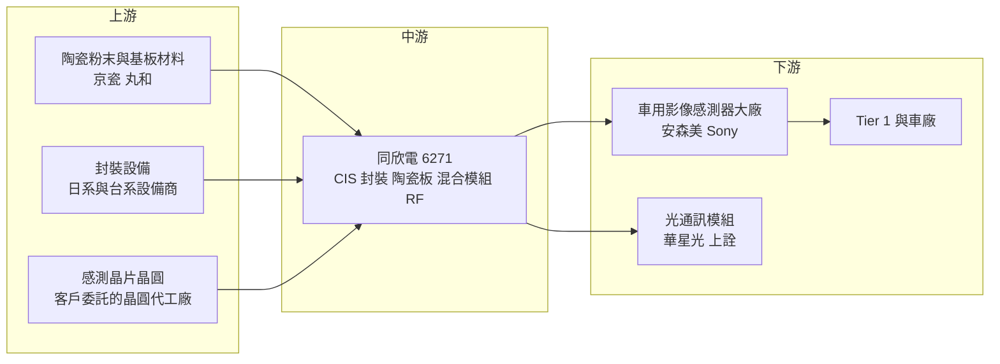

# 6271 同欣電

> 上市｜[[產業索引-半導體業|半導體業]]｜上市（櫃）日期 2007/11/16

# 第一章：企業模式與商業藍圖

> [!info] 撰寫說明
> 本文由 Claude 依公開資料整理，架構比照 [[2330台積電]] 的四章研究，資料截至 2026-10-07。財務數字來源：旺得富（工商時報）2025 年第四季財報報導、經濟日報 2026 年第一季財報報導、poorstock 法說會摘要（2026 年第二季）、winvest 月營收快訊、富果研究法說會筆記；產業描述為整理性內容，尚未逐條比對原始文件。#待校對

在評估單一個股的長期投資價值時，首要步驟是拆解企業的底層獲利邏輯。本章針對同欣電子（股票代號：6271，以下簡稱同欣電）的商業模式進行定性分析，說明它如何以「少量多樣、高可靠度」的特殊封裝，在車用影像與 AI 光通訊市場建立自己的位置。

## 一、核心定位：車用影像感測器的關鍵封裝夥伴

同欣電成立於 1974 年，總部位於桃園八德，早期以陶瓷電路板與混合積體電路（[[Hybrid IC]]）起家。2022 年同欣電以吸收合併方式整併子公司勝麗國際，合併基準日為 2022 年 6 月 30 日，把勝麗的影像感測器（[[CIS]]）封裝業務納入本體，從此影像產品成為最大營收來源。

同欣電不設計晶片，也不賣自有品牌終端產品，而是替國際感測器、通訊與工業客戶做特殊封裝與模組製造。這個定位有兩個商業意義：

* **避開大型封測廠的主戰場：** 產品少量多樣、客製化程度高，[[3711日月光投控]] 這類大廠缺乏誘因投入，同欣電因此能避開正面價格競爭。
* **車用比重罕見地高：** 依 2025 年全年應用別，車用占 64%、工業 12%、通訊 11%、智慧手機 8%、生醫 4%，車用比重之高在台灣封裝廠中相當少見。

## 二、終端應用板塊：四大產品線

依 2026 年第二季法說會資料，同欣電的產品線比重如下：

* **影像產品：** 主要是車用 CIS 的晶圓重組與封裝，用在 [[ADAS]] 前視、環景、車內監控攝影機。富果研究的法說筆記提到，客戶為美、日、歐系的感測器領導廠商。也涵蓋部分安防、工業與醫療影像應用。
* **陶瓷電路板：** 用於車用 LED 頭燈、手機閃光燈等高散熱需求的元件，[[陶瓷基板]]的導熱與耐溫特性是一般有機基板做不到的。
* **混合積體電路模組：** 把多顆晶片與被動元件整合在陶瓷基板上，應用於車用電子、工業控制與醫療設備，是同欣電歷史最久的業務。
* **高頻無線通訊模組 RF：** 近年成長最快，應用包括資料中心光收發模組（400G、800G 到 1.6T）與[[低軌衛星]]通訊設備。

2026 年第二季，影像、陶瓷、RF 三條產品線都季增 16% 至 17%，只有混合模組季減 8%，成長動能集中在車用影像與 AI 光通訊相關的 RF 模組。

## 三、資本轉化邏輯：車規驗證換長期訂單

* **台灣集中生產：** 竹北廠是稼動率最高的廠區，八德廠為較新廠房，空間寬敞但營運成本較高，公司表示仍在評估最適合進駐的產品線。勝麗合併後影像產能也併入同欣電體系。產能幾乎集中在台灣，與它強調品質一致性的車用定位有關。
* **驗證形成長約性質：** 車用產品需通過[[車規驗證]]，一旦導入，同一車型生命週期內很少更換封裝廠。

## 四、企業長期藍圖：車用高畫素化與光通訊

* **深耕車用：** 汽車攝影機數量隨 ADAS 等級提高而增加，L2+ 以上車款常配置 8 顆以上鏡頭，CIS 解析度也從 1 至 2 百萬畫素提升到 8 百萬畫素，帶動封裝規格與單價提升。同欣電跟著美、日、歐系客戶的高階方案走，並協助客戶在中國市場推廣高階產品。
* **擴大 RF 與光通訊：** AI 資料中心對 800G、1.6T 光模組需求大增，RF 模組的封裝經驗可延伸到光通訊元件。
* **資本支出節制：** 資本支出由 2023 年的 27.4 億元降至 2024 年的 10.9 億元，2025 年回升至約 14.1 億元，資源集中在高景氣產品線，而不是全面擴產。

# 第二章：護城河深度與競爭優勢

在長期價值投資中，「護城河」指企業抵禦競爭、維持超額利潤的保護機制。本章分析同欣電的護城河構成、主要競爭對手，以及這些利基優勢能守住多少。

## 一、同欣電護城河的核心組成要素

同欣電的護城河屬於「中等寬度」，核心不在規模，而在車規驗證與長期客戶關係：

* **1. 車規驗證與轉換成本：** 車用 CIS 封裝需要通過 AEC-Q100 等驗證，從設計導入到量產往往需要 2 至 3 年，車廠與 Tier 1 一旦定案，同一車型的生命週期內很少更換封裝廠。
* **2. 少量多樣的製程能力：** 陶瓷基板、混合模組與 RF 模組客製化程度高、批量不大，大型封測廠通常不願投入。
* **3. 與國際感測器大廠綁定：** 美、日、歐系客戶在車用影像感測器市場市占率高，同欣電跟著客戶成長，間接分享車用 CIS 市場的龍頭地位。
* **4. 陶瓷材料技術：** 從 1970 年代累積的陶瓷金屬化與厚膜製程經驗，新進者短期難以複製。

## 二、全球主要競爭對手格局

| 對手 | 定位 | 對同欣電的威脅 |
|---|---|---|
| 晶方科技、華天科技 | 中國 CIS 封裝廠 | 消費性 CIS 價格戰，逐步往車規延伸 |
| 感測器 [[IDM]] 自有後段 | 感測器大廠自建封裝 | 高階產品可能收回自做 |
| 京瓷（Kyocera）、丸和 | 日本陶瓷基板大廠 | 陶瓷電路板的主要國際對手 |
| [[3363上詮]]、[[4979華星光]] 與中國光模組廠 | 光通訊廠自有封裝或垂直整合 | 爭奪光通訊後段封裝 |
| [[3711日月光投控]]、[[AMKR艾克爾]] | 大型封測廠 | 若車用影像封裝標準化，可能進入利基市場 |

## 三、優勢轉化：哪些市場守得住、哪些守不住

* **守得住：** 已導入量產的車用平台在生命週期內轉單機率低；陶瓷基板與混合模組技術門檻高、市場小，大廠缺乏誘因進入。
* **守不住：** 2025 年全年營收 115.43 億元、年減 4.5%，反映車市庫存調整時，同欣電也無法完全倖免。混合模組在 2026 年第一季仍年減 18%，部分舊產品線正在萎縮。
* **觀察重點：** 一是車用 CIS 高畫素化的速度，以及中國車廠是否大量採用國際客戶的高階方案；二是 RF 模組在 AI 光通訊的放量程度；三是 2026 年第二季[[毛利率]] 31.1% 能否在後續季度守住。

# 第三章：財務體質與盈利規模

資料日期：2026-10-07。數字取自旺得富（工商時報）、經濟日報、poorstock 法說會摘要與 winvest 月營收快訊，表格是撰寫當時的快照；最新月營收、毛利率、累計 EPS 由自動排程寫在本筆記的屬性欄位（月營收、毛利率、累計EPS 等）。#待校對

財務報表是檢驗護城河是否真實存在的最終標準。本章用三率、ROE、現金流與資本報酬，檢視同欣電在車市調整後的獲利品質。

## 一、獲利能力的基石：三率

| 項目 | 2025 全年 | 2025 Q4 | 2026 Q1 | 2026 Q2 |
|---|---|---|---|---|
| 營收（新台幣） | 115.43 億 | 28.17 億 | 28.19 億 | 31.53 億 |
| [[毛利率]] | 27.6% | 28.9% | 28.0% | 31.1% |
| [[營業利益率]] | 13.9% | 14.3% | 14.0% | 18.1% |
| EPS（元） | 7.64 | 2.23 | 1.89 | 2.48 至 2.49 |

* **毛利率與營業利益率：** 2026 年第二季三條產品線同步成長，產能利用率提升帶動毛利率升到 31.1%、營業利益率升到 18.1%。
* **淨利率與匯率：** 2025 年 EPS 7.64 元，低於 2024 年的 8.20 元；[[淨利率]]約 13.9%。2025 年第二季曾因新台幣急升出現大額匯損，單季 EPS 僅 0.34 元，因此 2026 年第二季 EPS 年增幅度看起來特別大，比較時應注意基期偏低。2026 年上半年累計 EPS 為 4.37 元，年增約 40%。
* **月營收：** 2026 年 7 月 11.30 億元、年增 22.42%，8 月 11.74 億元、年增 23.09%，1 至 8 月累計 82.76 億元、年增 6.76%，第三季動能延續。

## 二、[[ROE]]：資本效率

同欣電負債比偏低，獲利受匯率影響大。2025 年 EPS 7.64 元在約 20.9 億元股本下，對應的 ROE 約在一成上下（推估）。富果研究法說筆記指出，2024 年度配發現金股利 3 元，配發率約 39% 至 40%，在封測同業中偏保守，保留較多盈餘支應陶瓷與 RF 新產能；2025 年度股利數字未查得。

## 三、資本支出與自由現金流

* **[[CapEx]]：** 2023 年 27.4 億元、2024 年 10.9 億元、2025 年約 14.1 億元，2026 年第一季僅約 9,000 萬元，維持節制。
* **[[自由現金流]]：** 八德新廠已完成建置，未來擴產可先利用既有廠房空間，資本支出不必大幅跳升，自由現金流相對穩定。

## 四、[[ROIC]] 與 [[WACC]]：價值創造利差

同欣電的投入資本以廠房與機台為主，2023 年大額資本支出後，2024 至 2025 年營收下滑使 ROIC 承壓。2026 年營業利益率回到 18% 附近，且資本支出節制、分母增加有限，推估 ROIC 與資金成本的利差會較 2025 年擴大（具體數值未查得）。

# 第四章：總體風險與地緣政治

任何企業都無法脫離宏觀環境獨立存在。本章分析同欣電未來必須面對的地緣政治、車市週期、營運與技術風險。

## 一、地緣政治風險

* **中國車市的雙面性：** 中國是全球最大的電動車市場，同欣電透過國際客戶切入中國車廠高階方案，但中國政策鼓勵本土感測器（如韋爾股份旗下豪威）與本土封裝廠，長期可能擠壓國際客戶的市占。
* **美國關稅：** 產品多數以零組件形式出貨給國際客戶，直接受美國關稅影響較小，但若汽車終端需求因關稅下滑，仍會間接反映到訂單。
* **台灣集中風險：** 主要產能集中在台灣，車廠對供應鏈分散的要求提高時，可能被要求在海外設置備援產能。

## 二、產業週期與市場結構風險

* **車市週期與庫存調整：** 車用占營收六成以上，汽車銷量放緩或車廠調整庫存時，營收會直接受影響，2025 年營收年減 4.5% 即為例證；車用供應鏈層級多，庫存調整容易出現[[長鞭效應]]。
* **匯率：** 新台幣快速升值會同時壓縮毛利率與業外收益，是同欣電獲利波動最大的來源之一。
* **光通訊需求波動：** RF 模組成長依賴 AI 資料中心建置，若雲端業者資本支出放緩，成長動能會降溫。

## 三、營運環境的隱性風險

* **客戶集中：** 影像產品高度依賴少數國際 CIS 大廠，任一主要客戶市占率下滑或轉單，影響顯著。
* **舊產品線萎縮：** 混合積體電路模組近年營收衰退，需要靠新產品補位。
* **新廠成本：** 八德廠營運成本較高，若產品線進駐速度不如預期，會拖累毛利率。

## 四、科技演進風險

車用影像正朝更高畫素、更大尺寸與堆疊式感測器發展，部分封裝可能改由晶圓廠或感測器大廠以晶圓級封裝自行完成，同欣電需要持續投資新封裝技術。光通訊方面，共同封裝光學（[[CPO]]）若成為主流，光元件封裝會更靠近晶片與先進封裝廠，對獨立模組封裝廠是挑戰也是機會。

# 專有名詞解析

## 半導體

- **[[CIS]]**：CMOS 影像感測器，把光線轉成電子訊號的晶片，用於手機與車用攝影機，Sony、安森美為主要廠商。
- **[[Hybrid IC]]**：混合積體電路，把多顆晶片與電阻、電容等被動元件整合在同一基板上的模組，耐用度高，常用於車用與工業。
- **[[陶瓷基板]]**：以氧化鋁、氮化鋁等陶瓷製成的電路板，導熱與耐高溫能力遠優於一般有機板，用於 LED 與功率元件。
- **[[CPO]]**：共同封裝光學，把光引擎與交換器或運算晶片封裝在一起，縮短電訊號路徑以降低功耗。
- **[[IDM]]**：整合元件製造商，從設計、製造到封測都自己做的半導體公司，例如英特爾、三星。

## 應用

- **[[ADAS]]**：先進駕駛輔助系統，透過攝影機、雷達等感測器協助車道維持、自動煞車等功能。
- **[[車規驗證]]**：車用晶片與元件須通過 AEC-Q100 等可靠度測試與車廠認證，流程常需 2 至 3 年，因此轉換成本高。
- **[[低軌衛星]]**：運行在約 500 至 2,000 公里高度的通訊衛星群，延遲較低，需大量地面接收設備，代表業者為 Starlink。

## 金融

- **[[淨利率]]**：稅後淨利占營收的比例，會受匯兌損益、業外收益等非本業項目影響。
- **[[自由現金流]]**：營業活動現金流減去資本支出，代表企業可自由用於配息、還債或併購的現金。
- **[[長鞭效應]]**：終端需求的小幅變動，沿供應鏈往上游傳遞時被逐級放大，造成上游庫存與訂單劇烈波動。

# 核心供應鏈

## 1. 上游：材料與設備
- 陶瓷粉末與基板材料：日本京瓷、丸和等陶瓷材料供應商
- 封裝設備：日系與台系封裝設備商（具體名單未查得）
- 影像感測晶片晶圓來源：客戶委託的晶圓代工廠，如 [[2330台積電]]（推估）

## 2. 中游：同欣電本身與合作夥伴
- 已併入的影像感測封裝業務：勝麗國際（2022 年吸收合併）
- 封測同業：[[3711日月光投控]]、[[AMKR艾克爾]]

## 3. 下游：感測器與通訊客戶
- 車用影像感測器：美、日、歐系感測器大廠（如安森美 onsemi、[[SONY索尼]]，推估）
- 光通訊模組：[[4979華星光]]、[[3363上詮]] 等光通訊供應鏈
- 車用電子 Tier 1 與車廠：Bosch、Continental 等（推估）

## 4. 同業與競爭者
- 中國 CIS 封裝：晶方科技、華天科技
- 台灣封裝相關：[[2449京元電子]]、[[6239力成]]

## 最新新聞
<!-- news:start（自動產生，請勿手動編輯此範圍） -->
- 2026-10-08 🏛️ 重訊 15:02｜公告民國115年度9月份本公司合併營收淨額｜[觀測站](https://mops.twse.com.tw/mops/#/web/t05st01)

完整紀錄：[[6271同欣電 新聞]]
<!-- news:end -->

## 相關連結
- [公開資訊觀測站](https://mopsov.twse.com.tw/mops/web/t05st03?step=1&firstin=1&co_id=6271)
- [Goodinfo](https://goodinfo.tw/tw/StockDetail.asp?STOCK_ID=6271)
- [Yahoo 股市](https://tw.stock.yahoo.com/quote/6271)
- [鉅亨網新聞](https://www.cnyes.com/twstock/6271/news)
