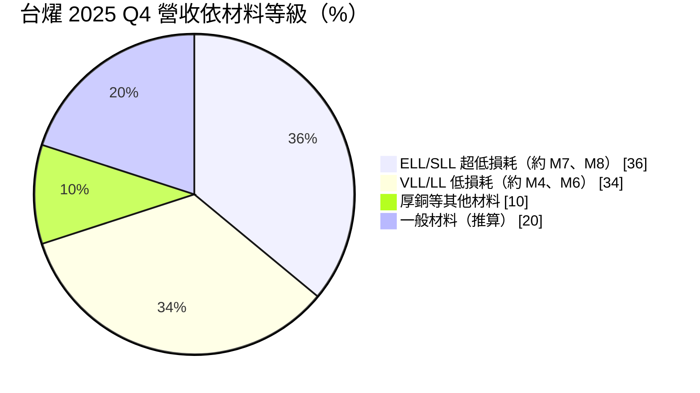
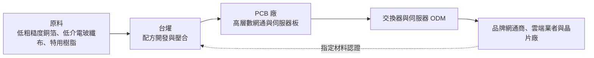
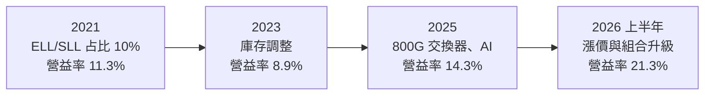
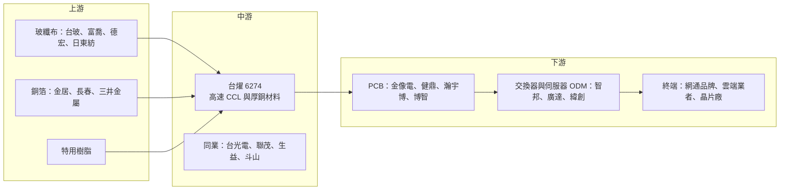

# 6274 台燿

> 上櫃｜[[產業索引-電子零組件業|電子零組件業]]｜上市（櫃）日期 2003/12/18

# 第一章：企業模式與商業藍圖

> [!info] 撰寫說明
> 本文由 Claude 依公開資料整理，架構比照 [[2330台積電]] 的四章研究，資料截至 2026-10-08。財務數字來源：Goodinfo 年度經營績效頁、櫃買中心開放資料（基本資料、綜合損益、資產負債、本益比殖利率）、富果研究 2026 年 3 月法說會整理、工商時報 2026 年 6 月報導；產業描述為整理性內容，尚未逐條比對原始文件。#待校對

評估一家材料公司的長期價值，關鍵在於它的產品是否站在技術升級的路徑上。本章針對台燿科技（股票代號：6274，以下簡稱台燿）的商業模式進行定性分析，說明它如何從一般銅箔基板廠，轉型為以高速網通與 AI 材料為主的供應商。

## 一、核心定位：以高速網通材料見長的銅箔基板廠

台燿成立於 1974 年，總部位於新竹竹北，主要產品是[[CCL]]（銅箔基板）與膠片，是印刷電路板（[[PCB]]）的基礎材料。和多數 CCL 廠一樣，台燿的直接客戶是 PCB 廠，但產品能否被採用，由更下游的晶片廠、網通設備商與雲端業者在設計階段指定材料型號決定。

台燿的特色在於產品組合偏向高速材料。依富果研究整理的 2025 年第四季法說會資料，損耗等級最低的 ELL/SLL 系列（約對應業界所稱的 M7、M8 等級）占營收 36%，而 2021 年時只有 10%。這五年間的轉變，讓台燿從一家以一般與中階材料為主的公司，變成高速交換器與 AI 伺服器材料的重要供應商之一。

這個定位有兩層商業意義：

* **交換器是台燿的起家優勢：** 網通交換器的傳輸速度每兩到三年翻倍，從 100G、400G 走到 800G 與 1.6T，每一代都要求更低損耗的材料。台燿長期耕耘網通客戶，因此在交換器材料的升級中具有先行者地位，2026 年報導指出公司已取得美系品牌交換器客戶的訂單。
* **產品組合升級帶來結構性毛利提升：** 高階材料售價可達低階材料的兩倍以上。工商時報引述外資報告指出，台燿正調漲低階 CCL 價格並減少低毛利訂單，低階產品約占營收 18%，公司寧可讓總出貨量下降約一成，也要提高 M7、M8 占比。這種主動取捨，是台燿近年毛利率能維持在 22% 以上的原因。

## 二、終端應用板塊：交換器、AI 伺服器與 AI 電源

依 2025 年第四季法說會揭露的產品等級比重如下：

註：前三項為法說會揭露數字，一般材料的 20% 為 100% 減去前三項的推算值。

* **高速交換器：** 100G 至 800G 交換器需求成長，帶動 ELL/SLL 材料需求，800G 與 1.6T 交換器在 2026 年下半年放量，是 M8 材料的主要需求來源。
* **AI 伺服器：** 包括 GPU 伺服器與雲端業者自研晶片（[[ASIC]]）平台，報導指出部分伺服器 CPU 平台已開始採用 M8 等級材料，高於原先預期的 M6、M7。
* **AI 電源：** 這是台燿近年新的成長亮點。AI 資料中心機櫃功率提升，電源系統走向 [[HVDC]] 架構，需要承載大電流的厚銅基板，銅箔厚度從 3 盎司提高到 6 盎司。依 2026 年報導，此類厚銅材料約占營收 11%，2025 年此類產品年增 49%。
* **一般材料：** 包括消費性電子與部分車用材料，台燿正逐步降低這部分的比重。

## 三、資本轉化邏輯：選擇性接單與跟著平台擴產

台燿的資本轉化邏輯，可以用「選擇性接單、跟著平台擴產」來概括：

* **選擇性接單：** CCL 產能有限時，優先把產能分配給高階、高毛利的訂單，並對低階產品漲價。這讓台燿的毛利率在原物料上漲時仍能維持相對穩定，2025 年全年毛利率 22.7%（Goodinfo），高於聯茂等以一般材料為主的同業。
* **擴產追隨客戶需求：** 依 2025 年第四季法說會，台燿在中國常熟投資約人民幣 9.5 億元、在泰國投資約泰銖 60 餘億元，兩地各增加約 60 萬張月產能，預計 2027 年第三季同步投產。工商時報報導則指出公司預估 2027 年總產能年增 30% 至 35%，未來 18 個月總產能擴大約 65%。
* **策略性備貨：** 2025 年第四季存貨約 74 億元，公司說明是為了特殊規格材料需求而策略性提高庫存。營收快速成長時，應收帳款與存貨同步上升，使 2025 年第四季營運現金流與自由現金流轉為淨流出，這是 CCL 廠在擴張期常見的現象。

## 四、企業長期藍圖：高階材料加中國以外產能

台燿的長期藍圖有三條主線。第一是持續拉高 ELL/SLL 等級的占比，從 M7、M8 推進到 M9，以搶占 800G、1.6T 交換器與下一代 AI 平台。第二是把 AI 電源用厚銅材料做成第二條成長曲線，這個市場與高速材料不同，重點在承載電流與散熱，而不是訊號損耗，競爭者也相對較少。第三是建立中國以外的產能，泰國廠的意義不只是增加產量，報導指出客戶願意為「中國以外生產」支付溢價，這讓地緣分散本身成為一種定價優勢。

## 補充：廠區分布

台燿的生產據點包括台灣竹北、中國廣東與江蘇等地，以及正在建設的泰國廠（中國廠區的具體城市與產能比重，本文未逐一查證，待校對）。台灣據點同時是研發與高階材料的主要基地。

# 第二章：護城河深度與競爭優勢

護城河分析的核心問題是：這家公司的優勢能否在十年後依然存在？本章針對台燿的競爭優勢進行拆解，並與國內外 CCL 同業比較，評估它在高速材料競賽中的位置。

## 一、護城河的核心組成要素

* **網通客戶的長期認證關係：** 交換器材料的認證涉及晶片廠、網通品牌與 PCB 廠，週期長、規格嚴。台燿多年在網通領域累積的認證與合作經驗，讓它在每一代交換器升級時都有機會優先參與設計，這是它和以伺服器為主的同業最大的差異。
* **樹脂配方與高階材料的開發能力：** 超低損耗材料的關鍵在樹脂系統與玻纖布、銅箔的搭配，這需要長期的材料科學累積。台燿把 ELL/SLL 占比在五年內從 10% 拉到 36%，說明它的研發能跟上客戶的規格升級。
* **產品組合管理能力：** 在供給吃緊時主動放棄低毛利訂單，代表管理層有清楚的資本配置紀律。這種能力不是技術專利，但在週期產業中，能否在好景氣時調整產品組合、在壞景氣時守住價格，往往決定長期報酬。
* **厚銅電源材料的利基：** AI 電源用厚銅基板屬於較新的應用，台燿較早布局，在這個利基市場有先發優勢。

## 二、全球主要競爭對手格局

| 公司 | 所在地 | 定位與強項 | 與台燿的關係 |
|---|---|---|---|
| [[2383台光電]] | 台灣 | 全球高速 CCL 龍頭，AI GPU 與交換器材料市占最高 | 最主要的直接競爭者，規模與技術領先 |
| [[6213聯茂]] | 台灣 | 一般型伺服器材料市占領先，正往 M7、M8 升級 | 伺服器與 AI ASIC 材料的競爭者 |
| [[1303南亞]] | 台灣 | 台塑集團，垂直整合上游原料 | 一般與中階材料競爭者 |
| 生益科技 | 中國 | 中國最大 CCL 廠，積極開發高速材料 | 中國市場與中階材料主要對手 |
| Panasonic | 日本 | Megtron 系列是高速材料標竿 | 高階網通材料的國際對手 |
| 斗山電子 | 韓國 | 高階網通與記憶體材料 | 部分交換器與 AI 平台的競爭者 |
| 建滔積層板 | 香港／中國 | 垂直整合，以一般材料規模取勝 | 低階材料價格的主要參考 |

從格局來看，台燿在高速交換器材料的地位僅次於台光電，在 AI 電源厚銅材料則有利基優勢。但在 AI GPU 主板材料這塊最大的市場，台光電仍明顯領先，台燿主要透過交換器與 ASIC 平台參與 AI 成長。

## 三、優勢轉化：守得住、守不住與觀察重點

* **守得住：** 高速交換器材料的份額與 AI 電源厚銅材料。這兩個市場規格升級快、認證門檻高，台燿已經在客戶的設計鏈中站穩位置，短期內被取代的機率低。
* **守不住：** 一般材料與部分中階材料的價格。這部分同質性高，中國同業產能龐大，台燿主動降低占比，正是因為在這裡沒有定價權。2022 至 2023 年營業利益率降到 8% 至 9%，說明一旦需求下降，即使是產品組合較佳的 CCL 廠也難以完全抵擋價格壓力。
* **觀察重點：** 第一，M8、M9 能否在 1.6T 交換器與下一代 AI 平台取得主要供應商地位；第二，2027 年常熟與泰國新產能開出時，需求能否同步跟上，避免產能過剩；第三，AI 電源厚銅材料能否持續擴大占比，成為穩定的第二成長引擎。

# 第三章：財務體質與盈利規模

資料日期：2026-10-08。數字取自 Goodinfo 年度經營績效頁與櫃買中心開放資料，表格是撰寫當時的快照；最新月營收、毛利率、累計 EPS 由自動排程寫在本筆記的屬性欄位（月營收、毛利率、累計EPS 等）。#待校對

財務報表是檢驗護城河是否真實存在的最終標準。本章用多年度的三率、ROE 與資本報酬，檢視台燿在產品組合轉型前後的獲利品質變化。

## 一、獲利能力的基石：三率

| 年度 | 營收（新台幣） | [[毛利率]] | [[營業利益率]] | EPS（元） | [[ROE]] |
|---|---|---|---|---|---|
| 2017 | 161 億 | 20.7% | 8.33% | 4.12 | 14.8% |
| 2018 | 178 億 | 22.6% | 13.5% | 7.46 | 24.1% |
| 2019 | 175 億 | 23.6% | 12.3% | 6.92 | 19.2% |
| 2020 | 180 億 | 23.4% | 12.6% | 6.67 | 16.8% |
| 2021 | 211 億 | 21.0% | 11.3% | 7.01 | 16.5% |
| 2022 | 185 億 | 18.4% | 8.11% | 4.69 | 10.7% |
| 2023 | 160 億 | 19.7% | 8.9% | 3.05 | 7.03% |
| 2024 | 231 億 | 23.2% | 14.4% | 9.56 | 20.1% |
| 2025 | 303 億 | 22.7% | 14.3% | 12.13 | 20.7% |
| 2026 上半年 | 243.6 億 | 27.8% | 21.3% | 12.40 | 未查得 |

註：2017 至 2025 年取自 Goodinfo；2026 上半年由櫃買中心綜合損益開放資料計算（營業毛利 67.8 億元、營業利益 51.9 億元）。

* **[[毛利率]]：** 台燿毛利率長期落在 18% 至 24% 之間，2026 年上半年升到約 27.8%（推算），是近十年新高。與聯茂相比，台燿的毛利率長期高出 5 至 10 個百分點，差距主要來自高階材料占比。
* **[[營業利益率]]：** 2023 年的 8.9% 到 2026 年上半年的 21.3%，營業利益率擴張幅度遠大於毛利率，說明營收放大時費用被攤薄的營運槓桿非常明顯。
* **營收趨勢：** 2020 年至 2025 年營收從 180 億元成長到 303 億元，年複合成長率約 11.0%（推算）。成長主要集中在 2024 至 2025 年，與 AI 與 800G 交換器需求同步。
* **稅負：** 2026 年上半年所得稅費用約 17 億元，占稅前淨利約 32%（依櫃買中心資料推算），偏高的有效稅率使稅後淨利率明顯低於營業利益率。

## 二、[[ROE]]：資本效率

2021 至 2025 年平均 ROE 約 15.0%（推算），其中 2023 年低谷只有 7%，2024 至 2025 年回到 20% 以上。富果整理的 2025 年第四季單季 ROE 達 26.3%。2026 年第二季底歸屬母公司權益約 241.5 億元，每股淨值 80.69 元（櫃買中心資料），以上半年 EPS 12.40 元推算，全年 ROE 可能超過 30%（推算）。ROE 的高低幾乎完全由景氣與產品組合決定，台燿的財務槓桿並不高。

## 三、資本支出、自由現金流與股利

常熟與泰國兩地擴產合計金額約為人民幣 9.5 億元加上泰銖 60 餘億元，換算新台幣約 100 億元上下（推算，依匯率而定），將在 2026 至 2027 年集中投入。加上營收擴張帶動應收帳款與存貨增加，2025 年第四季營運現金流與自由現金流為淨流出，公司預期隨營收穩定後恢復正向。這代表台燿未來兩年的自由現金流可能較為緊繃，股利政策需要和擴產需求取得平衡。

股利方面，櫃買中心資料顯示最近一次年度股利每股約 7.51 元，以 2025 年 EPS 12.13 元計算配發率約 62%（推算）。Goodinfo 統計長期一般平均現金股利約 2.14 元，說明過去股利水準較低，近兩年才隨獲利大幅提高。

## 四、[[ROIC]] 與 [[WACC]]：價值創造利差

**ROIC 推算：** 2025 年營收 303 億元乘以營業利益率 14.3%，營業利益約 43.3 億元，扣除 20% 稅率後約 34.7 億元。2026 年第二季底權益總計約 241.5 億元，總負債約 227.9 億元，假設其中約 45% 為有息負債（推估，約 103 億元），投入資本約 344 億元，2025 年 ROIC 約 10.1%（推算）。以 2026 年上半年營業利益 51.9 億元年化，用相同方法計算，ROIC 約 24%（推算）。

**WACC 推算：** 假設台灣 10 年期公債殖利率 1.75%、市場風險溢酬 6%、β 取電子材料股常見值 1.3，股東權益成本約 9.55%。負債成本假設 2.5%，稅後約 2.0%。以帳面價值計，權益約占 70%、負債約占 30%，WACC 約 7.3%（推算）；若以市值計算，股價淨值比約 21.8 倍（櫃買中心 2026 年 10 月初資料），權益比重接近百分之百，WACC 約 9.5%（推算）。

**結論：** 台燿在 2018 至 2021 年與 2024 年之後，ROIC 都高於資金成本，代表在景氣正常時能夠創造價值；2022 至 2023 年低谷期則大致與資金成本打平。產品組合往高階移動，提高了它在景氣循環中的平均 ROIC，但 CCL 產業的週期性仍在。長期投資人應關注的不是單一年度的高 ROIC，而是在下一次景氣低谷時，ROIC 能否仍維持在 WACC 之上。

# 第四章：總體風險與地緣政治

任何企業都無法脫離宏觀環境獨立存在。本章分析台燿未來必須面對的地緣政治、產業週期、營運與技術風險。

## 一、地緣政治

* **中國產能與去中國化趨勢：** 台燿仍有相當比重的產能在中國，常熟也是本輪擴產地點之一。美國客戶若要求更嚴格的非中國供應鏈，中國產能能服務的高階客戶可能受限。泰國廠是對沖這項風險的主要布局。
* **關稅與出口管制：** AI 晶片與伺服器的出口管制若擴大，可能影響部分中國終端市場的需求，進而影響中國廠的產能利用率。
* **台灣研發據點：** 台灣竹北是研發與高階材料的核心，面臨與其他台灣科技廠相同的兩岸長期不確定性。

## 二、產業週期與市場結構

* **高度週期性：** 2021 年至 2023 年，台燿 EPS 從 7.01 元降到 3.05 元，說明即使產品組合較好，CCL 仍會隨電子產業庫存循環劇烈波動。[[長鞭效應]]讓上游材料廠的訂單變化往往大於終端需求的變化。
* **擴產潮後的供給壓力：** 2026 至 2028 年，台光電、台燿、聯茂與中國同業都在擴產，若 AI 需求成長放緩，高階材料可能出現供過於求，價格壓力會從低階材料蔓延到中高階材料。
* **原料價格：** 銅價、低介電玻纖布與樹脂價格的變動直接影響毛利率。2025 年第四季毛利率從前一季的 23.8% 降到 22.1%，就是原料漲價的影響。

## 三、營運環境的隱性風險

* **營運資金壓力：** 營收快速成長時，存貨與應收帳款大幅增加，2025 年第四季存貨約 74 億元。若需求突然下滑，高庫存可能帶來跌價損失。
* **新廠執行：** 泰國與常熟兩地同時擴產，設備安裝、人員培訓與客戶認證都需要時間，若進度延誤，可能錯過 2027 年的需求高峰。
* **客戶集中：** 高階材料的終端需求集中在少數網通品牌與雲端業者，單一平台的規格變動或供應商調整都可能對營收造成明顯影響。

## 四、科技演進風險

高速材料規格平均每兩到三年升級一次，從 M8 到 M9 之後，業界正在討論石英玻纖布、新型樹脂與更低粗糙度銅箔的組合。每一次規格升級都是重新洗牌，領先者可以拿下新平台，落後者只能在舊規格上競爭價格。另一個長期變數是共同封裝光學（CPO）與光通訊的普及，若交換器內部的高速訊號改用光傳輸，電路板材料的需求結構可能改變。台燿能否在這些技術轉變中維持材料規格的領先，是十年尺度上最重要的觀察點。

# 專有名詞解析

## 半導體

- **[[ASIC]]**：特殊應用積體電路，為特定用途客製設計的晶片，雲端業者自研的 AI 加速晶片多屬此類。

## 應用

- **[[AI伺服器]]**：搭載 GPU 或 AI 加速晶片的伺服器，對電路板層數、材料等級與散熱要求遠高於一般伺服器。
- **[[1.6T交換器]]**：單一連接埠傳輸速度達每秒 1.6 兆位元的資料中心交換器，是 800G 之後的下一代規格。

## 金融

- **[[長鞭效應]]**：終端需求的小幅變動，沿供應鏈往上游傳遞時被逐級放大，造成上游庫存與訂單劇烈波動。
- **[[ROIC]]**：投入資本報酬率，衡量公司每投入一元營運資本能賺回多少稅後營業利益。
- **[[WACC]]**：加權平均資金成本，股東與債權人要求報酬的加權平均，ROIC 高於 WACC 才代表創造價值。

## 產業

- **[[CCL]]**：銅箔基板，在玻纖布與樹脂構成的絕緣層兩面貼上銅箔，是印刷電路板最底層的材料。
- **[[PCB]]**：印刷電路板，用來承載並連接電子元件的板子，伺服器主機板與交換器線卡都是 PCB。
- **[[玻纖布]]**：以玻璃纖維織成的布，是 CCL 的骨架材料，低介電玻纖布是高速材料的關鍵原料。
- **[[銅箔]]**：貼在 CCL 表面的薄銅層，用來形成電路，高速材料需要表面更平滑的低粗糙度銅箔。
- **[[Low Dk Df]]**：低介電常數與低介電損耗，數值越低代表訊號在電路板中傳輸時衰減越少，是高速材料的核心規格。
- **[[M7]]**：業界對高速 CCL 損耗等級的通稱之一，數字越大代表損耗越低、單價越高，M7 以上多用於 AI 伺服器與高速交換器。
- **[[HVDC]]**：高壓直流供電，AI 資料中心為提高機櫃功率與效率，逐步由交流改為高壓直流供電架構。
- **[[厚銅基板]]**：銅箔厚度遠高於一般板材的基板，用於需要承載大電流的電源系統。
- **[[CPO]]**：共同封裝光學，把光學收發元件與交換晶片封裝在一起，以降低高速傳輸的耗電。

# 核心供應鏈

## 1. 上游：玻纖布、銅箔與樹脂
- 玻纖布：[[1802台玻]]、[[1815富喬]]、[[5475德宏]]、日東紡（Nittobo）
- 銅箔：[[8358金居]]、長春集團、三井金屬
- 樹脂：日系與美系特用樹脂廠（具體供應商未查得）

## 2. 中游：台燿本身與 CCL 同業
- 高速材料同業：[[2383台光電]]、[[6213聯茂]]
- 其他同業：[[1303南亞]]、生益科技、Panasonic、斗山電子

## 3. 下游：PCB 廠
- 網通與伺服器板：[[2368金像電]]、[[3044健鼎]]、[[5469瀚宇博]]、[[8155博智]]

## 4. 下游：系統廠與終端客戶
- 交換器與伺服器 ODM：[[2345智邦]]、[[2382廣達]]、[[3231緯創]]
- 晶片與雲端業者：[[AVGO博通]]、[[NVDA輝達]]、[[AMZN亞馬遜]]、[[GOOGL谷歌]]（終端需求來源，非直接客戶）

## 最新新聞
<!-- news:start（自動產生，請勿手動編輯此範圍） -->
- 2026-10-08 📰 媒體 12:10｜鉅亨速報 - Factset 最新調查：台燿(6274-TW)EPS預估上修至37.64元，預估目標價為2170元｜[鉅亨網](https://news.cnyes.com/news/id/6624693)
- 2026-10-05 📰 媒體 18:50｜營收速報 - 台燿(6274)9月營收61.26億元年增率高達114.8％｜[鉅亨網](https://news.cnyes.com/news/id/6621913)
- 2026-10-05 📰 媒體 12:10｜鉅亨速報 - Factset 最新調查：台燿(6274-TW)EPS預估上修至37.3元，預估目標價為2072.5元｜[鉅亨網](https://news.cnyes.com/news/id/6621620)

完整紀錄：[[6274台燿 新聞]]
<!-- news:end -->

## 相關連結
- [公開資訊觀測站](https://mopsov.twse.com.tw/mops/web/t05st03?step=1&firstin=1&co_id=6274)
- [Goodinfo](https://goodinfo.tw/tw/StockDetail.asp?STOCK_ID=6274)
- [Yahoo 股市](https://tw.stock.yahoo.com/quote/6274)
- [鉅亨網新聞](https://www.cnyes.com/twstock/6274/news)
