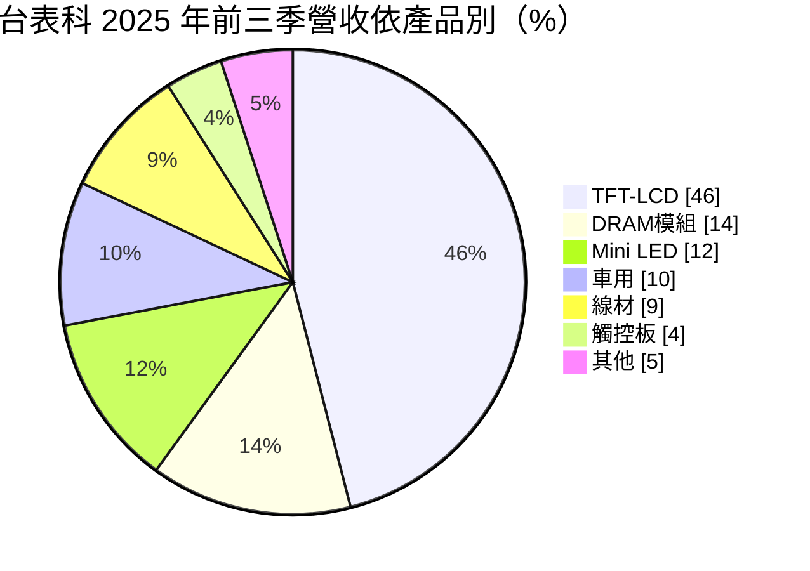
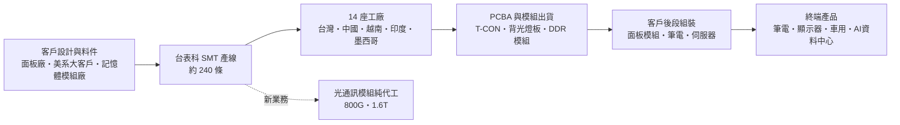
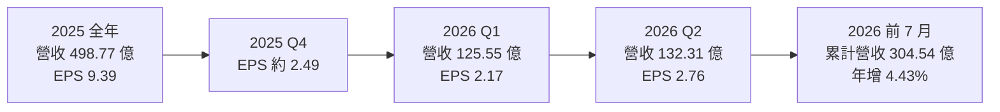
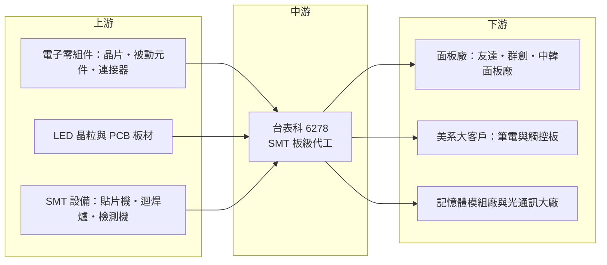

# 6278 台表科

> 上市｜[[產業索引-光電業|光電業]]｜上市（櫃）日期 2010/08/24

# 第一章：企業模式與商業藍圖

> [!info] 撰寫說明
> 本文由 Claude 依公開資料整理，架構比照 [[2330台積電]] 的四章研究，資料截至 2026-10-07。財務數字來源：富果研究（台表科 2024 年 12 月與 2025 年 12 月法說會摘要）、理財周刊（2025 年財報與 2026 年上半年財報分析）、工商時報（2026 年 5 月投顧報告與 6 月股東會報導）、winvest 營收快訊、科技新報月營收報導；產業描述為整理性內容，尚未逐條比對原始文件。#待校對

在評估單一個股的長期投資價值時，首要步驟是拆解企業的底層獲利邏輯。本章針對台灣表面黏著科技（股票代號：6278，以下簡稱台表科）的商業模式進行定性分析，說明一家以面板背光與顯示模組 [[SMT]] 起家的代工廠，如何在消費性電子成熟後，把產品組合轉向記憶體模組、車用與光通訊。

## 一、核心定位：以 SMT 為核心的專業電子製造服務

台表科成立於 1990 年 3 月，2010 年 8 月上市，資本額約 29.24 億元，屬於[[EMS]]（電子製造服務）產業中專注表面黏著（Surface Mount Technology）製程的代工廠。公司不設計自有品牌產品，而是接受客戶提供的電路設計與料件，把晶片、被動元件與連接器焊到電路板上，完成 [[PCBA]]（印刷電路板組裝）後交給客戶進行下一道組裝。

和鴻海、和碩這類整機組裝的大型 EMS 相比，台表科的定位較窄，集中在「板級」組裝，主要有兩個特點：

* **面板供應鏈的長期夥伴：** 台表科最早的主力是 TFT-LCD 面板的驅動板、時序控制板（[[T-CON]]）與背光模組，客戶大約一半來自台灣、中國與韓國的面板廠。
* **規模化的 SMT 產線：** 依 2025 年 12 月法說會資料，台表科全球有 14 座工廠、約 240 條 SMT 產線，以規模經濟和多地生產提供具成本競爭力的代工服務。

## 二、終端應用／產品板塊：顯示器仍是大宗，記憶體與車用接棒

2025 年前三季的產品營收結構如下：

* **TFT-LCD：** 筆電、顯示器、電視面板的驅動板與控制板 SMT，是營收最大的板塊。客戶以面板廠為主，也包括美系大客戶；2025 年第三季美系大客戶單一占營收約 34%，台灣面板廠約 15%、中國面板廠約 16%。
* **[[Mini LED]]：** 曾是成長主軸，Mini LED 背光的燈板需要把上萬顆微小 LED 晶粒精準打件，台表科在 2022 年此類產品占營收約 32%，之後隨終端需求放緩，2024 年前三季降到約 10%，2025 年前三季約 12%。
* **[[DRAM模組]]：** 替記憶體模組廠打件 DDR 模組，2025 年前三季占 14%，公司目標 2026 年提高到兩成以上，是目前最明確的成長來源。
* **車用電子：** 約占一成，屬於驗證期長、訂單穩定的板塊。
* **線材與觸控板：** 筆電觸控板與高速傳輸線材的組裝，屬於配合大客戶產品線的業務。

依理財周刊 2026 年 10 月的分析，傳統消費性電子仍占營收約六成、DRAM 產品約兩成，AI 與高速光通訊合計僅約 6% 至 7%。公司在 2026 年 6 月股東會表示，消費性電子占比將從七成降到 2026 年的六成，2027 年再降到五成。

## 三、資本轉化邏輯（營運模式）：薄利多量的板級代工

* **毛利率先天偏低：** EMS 的料件多由客戶指定，代工廠賺的是組裝加工費，台表科 2025 年[[毛利率]]約 12.8%、[[營業利益率]]約 7.0%（依全年營收 498.77 億元、毛利 63.86 億元、營業利益 35.05 億元推算），在 EMS 產業中屬中上水準，但遠低於零組件廠。
* **產能稼動決定獲利：** SMT 設備投資相對晶圓廠小，但產線稼動率與產品組合直接影響毛利率。新產品轉換或新廠爬坡期間，毛利率容易下滑。
* **多地布局換取訂單：** 中國以外的越南、印度、墨西哥據點，是因應美系客戶「中國加一」要求的必要投資，2026 年資本支出已上修到 1.5 億美元（股東會口徑；2025 年 12 月法說會原規劃 8,000 萬至 1 億美元），用於印度、越南與合肥等地擴產。

## 四、企業長期藍圖：從消費性代工轉向 AI 與記憶體

* **光通訊代工：** 董事長伍開雲在 2026 年 6 月股東會表示，台表科已進入國際光通訊大廠供應鏈，[[光收發模組]]採純代工模式，毛利率優於一般產品。800G 產品預計 2026 年第四季放量，1.6T 預計 2027 年量產。依工商時報引述的投顧報告，光通訊占營收可望在 2026 年第四季升到 4% 至 5%，2027 年突破雙位數（推估性質的外部預測）。
* **記憶體模組：** 目標營收占比提高到兩成，受惠於 AI 伺服器帶動的 DDR5 模組需求。
* **新應用：** 機器人、[[低軌衛星]]等新應用預計 2027 年起逐步貢獻。
* **據點分散：** 持續擴充中國與越南，推進印度與墨西哥，降低單一地區風險。

# 第二章：護城河深度與競爭優勢

在長期價值投資中，「護城河」指企業抵禦競爭、維持超額利潤的保護機制。本章分析台表科的護城河構成、主要競爭對手，以及這些優勢在 EMS 價格競爭中能守住多少。

## 一、台表科護城河的核心組成要素

EMS 產業進入門檻不算高，台表科的護城河屬於「窄護城河」，主要來自以下三點：

* **1. 精密打件的製程經驗：** Mini LED 背光燈板需要在一塊板子上精準打上數千到數萬顆 LED 晶粒，對貼片精度、迴焊溫度曲線與檢測的要求高於一般 PCBA。台表科在 Mini LED 量產初期就累積大量經驗，這套能力可以延伸到光通訊模組這類高精度產品。
* **2. 大客戶認證與長期關係：** 美系大客戶與面板廠都有嚴格的供應商稽核與產品認證，台表科長期打入這些客戶的供應鏈，新進者要取代需要時間。2024 年第三季起承接美系大客戶的新 T-CON 板，是關係延伸的例子。
* **3. 規模與多地產能：** 14 座工廠、約 240 條 SMT 線分布於多個國家，能滿足客戶就近供貨與地緣分散的要求，小型代工廠難以複製。

## 二、全球主要競爭對手格局

| 對手 | 定位 | 對台表科的威脅 |
|---|---|---|
| [[2317鴻海]] | 全球最大 EMS，從板卡到整機與伺服器 | 規模與議價力遠大於台表科，可整包承接大客戶訂單 |
| 中國本土 EMS 與面板廠自有 SMT 線 | 貼近中國面板廠，成本低 | 中國面板廠可能把打件轉回內部或本土廠商 |
| 記憶體模組廠自有產線 | 部分模組品牌自行打件 | DRAM 模組業務的議價空間受限 |
| 光通訊模組廠自製或其他代工廠 | 光通訊大廠多有自有產線，也委外給專業代工 | 台表科屬新進者，需證明良率與交期 |

上表的競爭關係為整理性描述，個別對手的市占數字未查得。

## 三、優勢轉化：哪些市場守得住、哪些守不住

* **守得住：** 需要高精度打件、認證週期長的產品，例如 Mini LED 背光、車用電子與光通訊模組。這些產品的客戶重視良率與交期，換供應商的成本較高。
* **守不住：** 一般消費性電子的 PCBA。2026 年上半年營收年增約 3%，但[[毛利率]]從前一年同期的 12.74% 降到 11.56%，營業利益率從 7.12% 降到 5.98%，顯示本業在價格與產品組合上承受壓力。
* **觀察重點：** 800G 光通訊能否在 2026 年第四季如期放量、DRAM 模組占比能否站穩兩成，以及新廠爬坡期間毛利率能否止跌回升。這三點決定台表科能否從「面板代工廠」轉型為「AI 供應鏈代工廠」。

# 第三章：財務體質與盈利規模

資料日期：2026-10-07。數字取自理財周刊、富果研究、winvest 與科技新報整理的財報與月營收，表格是撰寫當時的快照；最新月營收、毛利率、累計 EPS 由自動排程寫在本筆記的屬性欄位（月營收、毛利率、累計EPS 等）。#待校對

財務報表是檢驗護城河是否真實存在的最終標準。本章用三率、ROE、現金流與資本報酬，檢視台表科在產品轉型期的獲利品質。

## 一、獲利能力的基石：三率

| 項目 | 2025 全年 | 2025 上半年 | 2026 Q1 | 2026 Q2 | 2026 上半年 |
|---|---|---|---|---|---|
| 營收（新台幣） | 498.77 億 | 約 250 億（推算） | 125.55 億 | 132.31 億 | 257.86 億 |
| [[毛利率]] | 約 12.8%（推算） | 12.74% | 未查得 | 未查得 | 11.56% |
| [[營業利益率]] | 約 7.0%（推算） | 7.12% | 未查得 | 未查得 | 5.98% |
| EPS（元） | 9.39 | 4.52 | 2.17 | 2.76 | 4.93 |

* **營收：** 2025 年營收 498.77 億元，年增 10.13%，創新高。2026 年前 7 月累計 304.54 億元，年增 4.43%，7 月單月 46.68 億元、年增 12.18%，成長動能在下半年轉強。
* **[[毛利率]]與[[營業利益率]]：** 2026 年上半年兩者都比去年同期下滑約 1.2 個百分點，代表新產品與新廠的爬坡成本尚未被營收成長吸收。
* **EPS 與業外：** 2026 年第二季 EPS 2.76 元、年增約 68%，但依理財周刊分析，第二季營業利益反而年減 2.62%，EPS 成長主要來自業外（匯兌）收益回升；2025 年前三季則曾因匯損使稅後淨利年減 8.4%。評估本業時應以營業利益為準，匯兌損益屬波動項目。

## 二、[[ROE]]：資本效率

台表科屬輕資產的代工業，SMT 設備投資金額遠低於半導體廠，獲利主要靠周轉與稼動。以 2025 年 EPS 9.39 元、配發現金股利 5.5 元計算，配息率約 59%，現金殖利率依當時股價約 4.4%。ROE 的具體數值未查得；依 EPS 規模與資本額推估，近年 ROE 大致落在雙位數區間（推估）。

## 三、資本支出與[[自由現金流]]

* **[[CapEx]]：** 2025 年規劃 1 億至 1.3 億美元，用於新廠建設；2026 年原規劃 8,000 萬至 1 億美元，股東會上修至 1.5 億美元，用於印度、越南、墨西哥與中國擴產及光通訊新品。
* **自由現金流：** EMS 業需要大量營運資金支應存貨與應收帳款，營收成長期營運資金占用會上升。資本支出上修後，2026 至 2027 年的自由現金流可能低於過去水準（推估），股利能否維持在 5 元以上，取決於光通訊與記憶體能否把獲利帶上來。

## 四、[[ROIC]] 與 [[WACC]]：價值創造利差

EMS 業的投入資本報酬率主要由營業利益率乘以資本周轉率構成。台表科營業利益率約 6% 至 7%，資本周轉率較高，ROIC 應高於資金成本，但利差不大（推估，具體數值未查得）。若光通訊這類毛利率較高的產品占比提升到雙位數，營業利益率可望改善，ROIC 與 WACC 的利差才會明顯擴大；反之，若新廠利用率不足，新增投入資本會先稀釋報酬率。

# 第四章：總體風險與地緣政治

任何企業都無法脫離宏觀環境獨立存在。本章分析台表科未來必須面對的地緣政治、產業週期、營運與技術風險。

## 一、地緣政治風險

* **中國產能比重高：** 台表科 14 座工廠多數在大中華區，中國面板廠也是重要客戶。美中關稅與出口管制升溫時，美系客戶會要求轉移到中國以外的產地。
* **非中國產能的投資壓力：** 印度、越南、墨西哥據點能對沖關稅風險，但新據點的人力訓練、供應鏈配套與良率爬坡都需要時間，初期會壓抑毛利率。
* **美國關稅政策：** 終端產品若銷往美國，關稅成本最終會在品牌商、組裝廠與代工廠之間分攤，台表科作為板級代工廠議價力較弱。

## 二、產業週期與市場結構風險

* **面板與消費性電子週期：** 消費性電子仍占營收約六成，面板廠稼動率、筆電與電視出貨會直接影響訂單。這類需求容易出現[[長鞭效應]]，品牌商調整庫存時，上游代工訂單的波動更大。
* **記憶體價格循環：** DRAM 模組業務的出貨量與記憶體價格、模組廠的備貨意願連動，記憶體報價反轉時訂單可能快速縮減。
* **匯率：** 營收以美元計價為主，新台幣升值會造成匯損，2025 年前三季就曾因匯損拖累淨利。

## 三、營運環境的隱性風險

* **大客戶集中：** 美系大客戶單一占營收約三成以上，該客戶產品週期或供應商策略的變化，對營收影響很大。
* **新業務執行風險：** 光通訊屬新進市場，800G 與 1.6T 的量產時程若延後，市場對轉型的期待可能落空。理財周刊也指出，2026 年下半年股價已反映相當程度的成長預期，需要後續財報驗證。
* **人力與新廠管理：** 多國同時擴產，管理幅度與人力成本同步上升。

## 四、科技或法規演進風險

* **顯示技術變化：** 若 [[OLED]] 持續滲透筆電與顯示器，LCD 背光與 Mini LED 背光的需求可能受到侵蝕，台表科需要在新顯示技術中找到對應的打件需求。
* **光通訊技術路線：** 若[[CPO]]（共同封裝光學）在 1.6T 之後成為主流，光引擎會直接整合在交換器晶片封裝內，可插拔光模組的組裝需求可能改變，台表科需跟上新的組裝形態。
* **環保與在地化法規：** 歐美對供應鏈碳排、原產地規則的要求提高，增加多地營運的合規成本。

# 專有名詞解析

## 金融

- **[[毛利率]]**：毛利除以營收，代表產品扣除直接成本後的獲利空間；EMS 業毛利率普遍在一成上下。
- **[[營業利益率]]**：營業利益除以營收，反映本業扣除研發、管銷費用後的獲利能力。
- **[[自由現金流]]**：營業活動現金流減去資本支出，代表企業可自由用於配息、還債或併購的現金。
- **[[長鞭效應]]**：終端需求的小幅變動，沿供應鏈往上游傳遞時被逐級放大，造成上游庫存與訂單劇烈波動。

## 產業

- **[[SMT]]**：表面黏著技術，以自動化設備把電子元件直接貼焊在電路板表面，是電子產品組裝最核心的製程。
- **[[EMS]]**：電子製造服務，替品牌客戶代工電路板組裝、測試與整機組裝的產業，代表廠商為鴻海、和碩。
- **[[PCBA]]**：印刷電路板組裝，指已經焊上晶片與零件、可以運作的電路板，是 SMT 製程的產出。
- **[[T-CON]]**：時序控制板，負責把影像訊號轉換成面板驅動 IC 可用的時序，是 LCD 面板的必要零件。
- **[[Mini LED]]**：把 LED 晶粒縮小到約百微米等級，大量排列做為背光，可提升對比與亮度，常見於高階筆電與電視。
- **[[OLED]]**：有機發光二極體顯示技術，每個像素自行發光，不需背光模組。
- **[[DRAM模組]]**：把多顆 DRAM 晶片焊在電路板上組成的記憶體條，供電腦與伺服器使用。
- **[[光收發模組]]**：把電訊號轉成光訊號傳輸、再轉回電訊號的模組，資料中心以 800G、1.6T 速率區分世代。
- **[[CPO]]**：共同封裝光學，把光學引擎和交換器晶片封裝在一起，縮短電訊號傳輸距離以降低耗電。
- **[[低軌衛星]]**：在距地表約數百至兩千公里軌道運行的通訊衛星，需要大量地面終端與衛星板件。

# 核心供應鏈

## 1. 上游：零組件與設備
- 被動元件：[[2327國巨]]
- LED 晶粒（Mini LED 背光）：[[3714富采]]
- SMT 設備：多為日系與歐系貼片機、檢測設備廠（個別廠商未查得）

## 2. 中游：台表科本身與同業
- 板級 SMT 代工：台表科
- 大型 EMS 同業：[[2317鴻海]]

## 3. 下游：主要客戶
- 面板廠：[[2409友達]]、[[3481群創]]，以及中國與韓國面板廠
- 美系大客戶：[[AAPL蘋果]]（法說會資料稱美系客戶，此處依富果研究整理之客戶別）
- 記憶體模組與光通訊客戶：公司未揭露名稱

## 最新新聞
<!-- news:start -->
<!-- news:end -->

## 相關連結
- [公開資訊觀測站](https://mopsov.twse.com.tw/mops/web/t05st03?step=1&firstin=1&co_id=6278)
- [Goodinfo](https://goodinfo.tw/tw/StockDetail.asp?STOCK_ID=6278)
- [Yahoo 股市](https://tw.stock.yahoo.com/quote/6278)
- [鉅亨網新聞](https://www.cnyes.com/twstock/6278/news)
