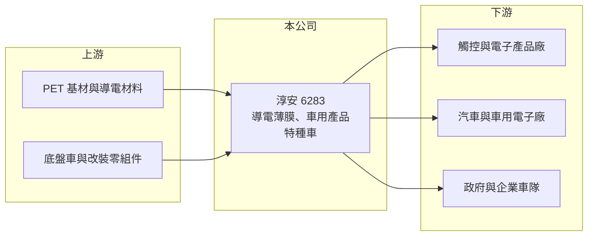

# 6283 淳安

> 上市｜[[產業索引-其他電子業|其他電子業]]｜上市（櫃）日期 2008/01/21

# 第一章：企業模式與商業藍圖

> [!info] 撰寫說明
> 精簡版，由 Claude 依公開資料整理，架構比照 [[2330台積電]]，資料截至 2026-10-07。來源：nStock 淳安公司簡介與財務摘要、winvest 營收快訊。公開資料有限，產品比重與客戶未查到。#待校對

淳安從事智能化產品與特種車兩大業務，2026 年營收衰退且本業虧損。

- **核心業務：** 研發、製造及銷售智能化產品（[[導電薄膜]]與車用產品）以及[[特種車]]產品。
- **營收結構：** 本次未查到兩大業務的營收比重，2025 年全年營收 18.1 億元。
- **營運據點：** 1996 年成立，2008 年掛牌，生產據點明細本次未查到。
- **長期方向：** 從觸控與導電薄膜延伸到車用電子與特種車，尋找比消費電子更穩定的應用（推估）。

# 第二章：護城河深度與競爭優勢

淳安的競爭地位較弱，目前重點在轉型能否帶來獲利。

- **競爭優勢：** 具備薄膜製程與車輛改裝兩種技術，可承接客製化需求（推估）。
- **主要對手：** 導電薄膜面對日本、中國薄膜廠競爭，特種車則與國內外改裝車與車體廠競爭，具體名單本次未查到。
- **觀察重點：** 2026 年第二季[[毛利率]]僅 5.28%，需觀察產品組合與產能利用能否改善、何時轉虧為盈。

# 第三章：財務體質與盈利規模

資料日期：2026-10-07，以下數字是撰寫當時的快照；最新月營收、毛利率、累計 EPS 由自動排程寫在本筆記的屬性欄位（月營收、毛利率、累計EPS 等）。#待校對

淳安 2026 年營收下滑、連續虧損，財務體質偏弱。

- **營收規模：** 2026 年 8 月營收 9,963 萬元，年減 12.69%；7 月 1.56 億元，年減 35.4%；1 至 8 月累計 10.76 億元，2025 年全年 18.1 億元。
- **獲利：** 2026 年第二季 EPS -0.46 元，上半年累計 -0.53 元；第二季[[營業利益率]] -17.92%、淨利率 -16.63%。
- **財務特色：** 資本額 14.76 億元，近五年沒有配息紀錄，第二季單季 [[ROE]] -3.89%。

# 第四章：總體風險與地緣政治

淳安的風險在於持續虧損與營收波動。

- **產業週期：** 導電薄膜需求跟隨觸控面板與消費電子景氣，特種車則依賴政府與企業採購，訂單時點不穩定。
- **營運風險：** 毛利率過低無法支應營業費用，若虧損延續將侵蝕股東權益，可能需要增資或處分資產（推估）。
- **其他風險：** 原物料與零組件價格、匯率變動，以及特種車相關法規與標案預算變化。

# 專有名詞解析

## 金融

- **[[毛利率]]**：毛利除以營收，反映產品或服務扣除直接成本後的獲利空間。
- **[[ROE]]**：股東權益報酬率，稅後淨利除以股東權益，衡量公司運用股東資金的獲利效率。

## 產業

- **[[導電薄膜]]**：表面鍍有透明導電層的塑膠薄膜，用於觸控面板、加熱與電磁屏蔽等用途。
- **[[特種車]]**：為特定用途改裝的車輛，例如消防、救護、工程與冷凍車，通常依客戶需求客製。

# 核心供應鏈

- 上游：PET 基材、導電材料供應商，底盤車與改裝零組件供應商（推估）
- 下游／客戶：觸控與電子產品廠、汽車與車用電子廠、政府與企業車隊（推估）
- 同業：國內外導電薄膜廠與特種車改裝廠（本次未查到具體名單）

## 最新新聞
<!-- news:start -->
<!-- news:end -->

## 相關連結
- [公開資訊觀測站](https://mopsov.twse.com.tw/mops/web/t05st03?step=1&firstin=1&co_id=6283)
- [Goodinfo](https://goodinfo.tw/tw/StockDetail.asp?STOCK_ID=6283)
- [Yahoo 股市](https://tw.stock.yahoo.com/quote/6283)
- [鉅亨網新聞](https://www.cnyes.com/twstock/6283/news)
