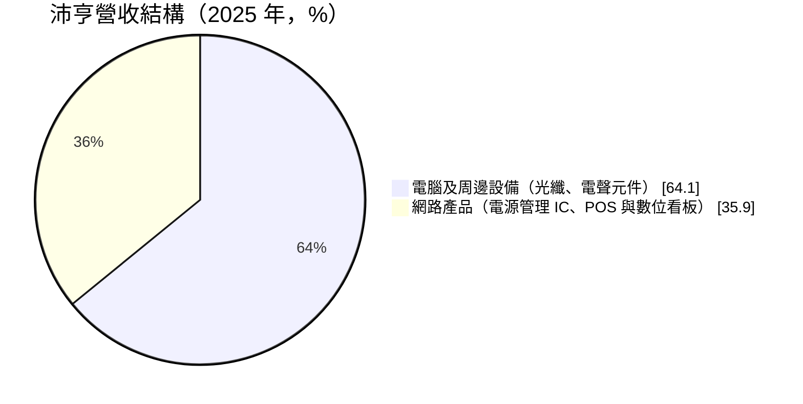
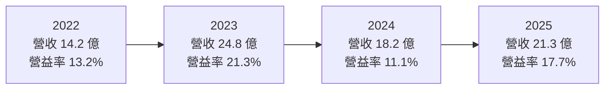
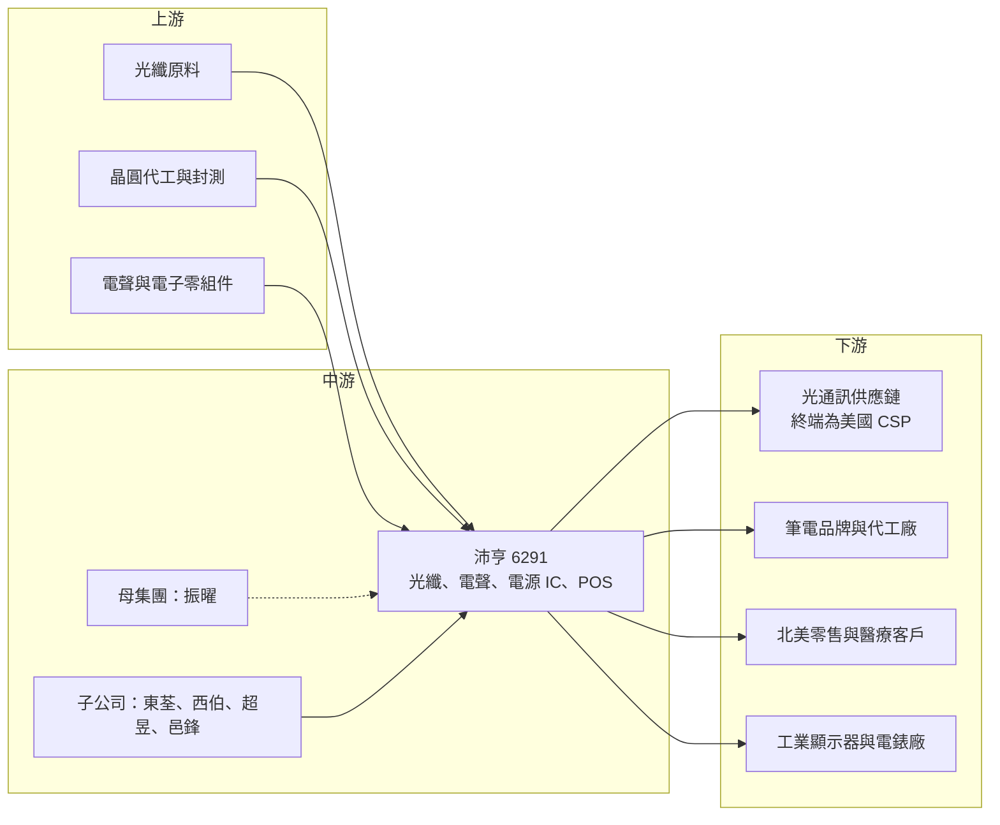

# 6291 沛亨

> 上櫃｜[[產業索引-半導體業|半導體業]]｜上市（櫃）日期 2004/01/28

# 第一章：企業模式與商業藍圖

> [!info] 撰寫說明
> 本文由 Claude 依公開資料整理，架構比照 [[2330台積電]] 的四章研究，資料截至 2026-10-08。財務數字來源：Goodinfo 台灣股市資訊網年度經營績效、MoneyDJ 理財網（富邦電子下單 DJ 版）公司基本資料與股利表、富果研究 2026 年 5 月法說會整理、聯合新聞網 2025 年 11 月與 2026 年 1 月報導、自由時報 2021 年 3 月報導；產業描述為整理性內容，尚未逐條比對原始文件。#待校對

在評估單一個股的長期投資價值時，首要步驟是拆解企業的底層獲利邏輯。本章針對沛亨半導體（股票代號：6291，以下簡稱沛亨）的商業模式進行定性分析。沛亨的名字裡有「半導體」，但它今天的營收主力早已不是電源 IC，而是透過併購取得的光纖、[[電聲元件]]與 POS 系統。理解這個轉變，是理解沛亨的關鍵。

## 一、核心定位：以併購轉型的多角化電子公司

沛亨成立於 1992 年，2004 年掛牌，原本是一家設計電源管理 IC 的 [[Fabless]] 公司。依富果整理的 2026 年 5 月法說內容，沛亨在 2018 年加入 [[6143振曜]] 集團，此後陸續併購東荃、西伯、超昱、邑鋒等公司，業務由電源管理 IC 擴展到光纖、電聲元件與 POS 系統。

其中最關鍵的一步是 2021 年合併東荃科技。依自由時報 2021 年 3 月的報導，振曜董事會決議讓旗下兩家轉投資公司東荃與沛亨合併，沛亨為存續公司，以 1 比 1 的換股比例發行新股取得東荃全部股權。東荃專注嵌入式平台的軟硬體，主要產品是[[數位看板]]、網路通訊設備、工業用液晶螢幕與 [[POS]] 系統。之後沛亨又在 2023 年設立越南子公司西伯，2024 年收購美國的邑鋒。

依 MoneyDJ 揭露的 2025 年營收比重，電腦及周邊設備占 64.10%、網路產品占 35.90%。富果整理的法說資料則把這兩大類拆得更細：

* **電腦周邊（約七成）：** 包括 AI 資料中心使用的高速光纖產品，以及經營超過 30 年的電聲元件（喇叭等聲學方案）。
* **網路產品（約三成）：** 包括電源管理 IC，以及銷往北美的 POS 與數位看板系統。

## 二、終端應用板塊：光纖、電聲、電源 IC 與 POS

* **光纖產品：** 用於 AI 資料中心內部伺服器與交換器之間的高速連接。法說資料指出，終端客戶是美國大型雲端服務業者（[[CSP]]），但沛亨並非直接供貨，而是透過約三到四層的供應鏈出貨。這是沛亨近年成長最快的業務。
* **電聲元件：** 主要供應全球主流筆電品牌的喇叭與聲學方案，由越南子公司西伯生產，就近服務筆電供應鏈，符合客戶「中國加一」的需求。
* **[[電源管理IC]]：** 沛亨的本業，應用在工業顯示器、人機介面、智慧電表與電競周邊等工業與消費產品，聯合新聞網的報導提到 [[DDR5]] 需求帶動相關產品成長。
* **POS 與數位看板：** 主要市場在北美，並延伸到智慧醫療，例如醫院導引與病房監測。美國子公司邑鋒提供在地製造，法說資料認為這有助於管理關稅風險。

依法說的問答內容，電源管理 IC、電聲與光纖的毛利率高於公司平均，POS 與數位看板則低於平均。

## 三、資本轉化邏輯：集團資源加上併購整合

沛亨的成長並不是靠單一技術的長期研發，而是靠「併購取得業務、集團整合資源、再擴產放大」的模式。

這種模式的優點是成長速度快：沛亨的營收從 2022 年的 14.2 億元成長到 2025 年的 21.3 億元，2026 年第一季營收年增約 49%。缺點是各業務之間的技術關聯性不高，公司的價值很大程度取決於經營團隊挑選標的、整合併購與配置資本的能力，而不是單一護城河。

光纖業務是目前資本投入的重點。法說資料顯示，沛亨規劃 2026 年光纖產能與產出達到 2025 年的三到五倍，訂單據稱已排到 2026 年底，部分延伸到 2027 年第一季；光纖原料自 2025 年底起供應吃緊，公司事先備貨，表示庫存足以支應 2026 年的生產。

## 四、企業長期藍圖：ESG 與 AI 相關領域的多元布局

法說資料顯示，沛亨的長期目標聚焦四個領域：半導體、光通訊與 AI、電子書與電子紙應用、生醫。公司希望成為下一世代 ESG 與 AI 相關領域的領導者，並把既有技術延伸到新用途，例如醫療監測。

從長期角度看，沛亨最大的機會是 AI 資料中心對光纖連接的需求，這是一個可能延續多年的結構性趨勢；最大的挑戰則是如何在快速擴張中維持獲利品質。光纖產品由多家廠商供應，沛亨又處在供應鏈的第三、四層，議價能力有限。長期投資人應觀察的是：沛亨能否把併購得來的業務整合成具有持續競爭力的事業群，而不只是乘著單一需求浪潮成長。

# 第二章：護城河深度與競爭優勢

護城河決定了企業能否把今天的獲利延續到十年後。本章分析沛亨各項業務的競爭優勢，以及它在每個市場面對的對手。

## 一、護城河的核心組成要素

* **集團綜效：** 振曜集團提供市場、客戶與供應鏈的協調，讓沛亨在併購後能較快整合資源，這是單打獨鬥的小型公司不具備的優勢。
* **產能與備料的反應速度：** 光纖需求暴增時，沛亨提前擴產並囤積原料，使它能在原料吃緊時繼續出貨。在快速成長的市場中，「能準時交貨」本身就是競爭力。
* **海外製造據點：** 越南的電聲產能與美國的 POS 產能，讓沛亨能滿足客戶分散生產地與避開關稅的需求。
* **長年的電聲與電源 IC 經驗：** 電聲元件已經營超過 30 年，與筆電品牌有長期合作；電源管理 IC 則有穩定的工業與消費客戶。

整體而言，沛亨的護城河屬於「營運能力型」，來自執行效率、產能與客戶關係，而不是專利或規模壟斷。這類護城河在需求旺盛時很有價值，但需求轉弱時較容易被同業追上。

## 二、全球主要競爭對手格局

| 業務 | 主要對手 | 對沛亨的影響 |
|---|---|---|
| 光纖連接 | [[6442光聖]] 等台灣光纖跳線與連接器廠、國際光纖元件大廠 | 同樣爭取 CSP 供應鏈訂單，產能擴充後可能出現價格競爭 |
| 電源管理 IC | [[8081致新]]、[[6138茂達]] 等台灣電源 IC 設計公司 | 產品線與規模大於沛亨，在主流筆電與主機板市場具優勢 |
| 電聲元件 | [[2439美律]] 等聲學元件廠與中國電聲廠 | 筆電聲學元件的價格競爭激烈 |
| POS 與數位看板 | [[6206飛捷]]、[[8114振樺電]] 等台灣 POS 廠 | 在北美零售與餐飲市場競爭，POS 毛利率低於公司平均 |

## 三、優勢轉化：哪些市場守得住、哪些守不住

* **守得住：** 已取得認證的 CSP 光纖供應鏈位置，以及越南電聲產能所服務的筆電品牌客戶。這些客戶更換供應商需要重新認證，短期內不易流失。
* **守不住：** POS 與數位看板的價格競爭，以及標準型光纖產品在產能大量開出後的價格下滑。光纖需求若從短缺轉為過剩，處在供應鏈下層的業者議價能力最弱。
* **觀察重點：** 光纖產能擴充到三至五倍後的實際出貨與毛利率、客戶是否集中在少數 CSP 專案、併購業務的整合效益，以及高配息政策能否與擴產資金需求並存。

# 第三章：財務體質與盈利規模

資料日期：2026-10-08。數字取自 Goodinfo 年度經營績效、MoneyDJ 股利表與富果研究法說會整理，表格是撰寫當時的快照；最新月營收、毛利率、累計 EPS 由自動排程寫在本筆記的屬性欄位（月營收、毛利率、累計EPS 等）。#待校對

財務報表是檢驗護城河是否真實存在的最終標準。本章用多年度的三率、ROE 與資本報酬，檢視沛亨在併購轉型後的獲利品質。

## 一、獲利能力的基石：三率

| 年度 | 營收（新台幣） | [[毛利率]] | [[營業利益率]] | EPS（元） | [[ROE]] |
|---|---|---|---|---|---|
| 2021 | 10.4 億 | 26.5% | 6.87% | 未查得（合併東荃當年，來源數字無法勾稽） | 未查得 |
| 2022 | 14.2 億 | 32.6% | 13.2% | 4.63 | 28.5% |
| 2023 | 24.8 億 | 35.7% | 21.3% | 10.32 | 29.5% |
| 2024 | 18.2 億 | 31.2% | 11.1% | 6.13 | 12.6% |
| 2025 | 21.3 億 | 35.0% | 17.7% | 6.60 | 18.4% |

沛亨在 2021 年合併東荃後，財務規模與獲利結構都出現明顯變化。Goodinfo 的 2020 與 2021 年數字涉及合併前後的股本與口徑變動，EPS 與 ROE 無法與淨利勾稽，因此本表只列 2021 年的營收與利潤率，EPS 與 ROE 寫「未查得」。

2022 至 2025 年，沛亨的毛利率維持在 31% 至 36%，營業利益率在 11% 至 21% 之間波動。2023 年是高峰，營收 24.8 億元、EPS 10.32 元；2024 年營收下滑，營業利益率降到 11.1%；2025 年在光纖需求帶動下回升到 17.7%。2022 至 2025 年營收年複合成長率約 14.5%（推算），在多角化併購的推動下成長明顯。富果整理的法說資料顯示，2026 年第一季毛利率約 38%、營業利益約 1.48 億元、EPS 3.00 元，光纖業務仍是主要動能。

## 二、[[ROE]]：資本效率

2022 至 2025 年沛亨的平均 ROE 約 22.3%（推算），在台灣中小型電子公司中屬於較高的水準。高 ROE 的原因有二：一是營業利益率在兩成上下；二是高配息政策讓股東權益不會無限累積，資本維持精簡。每股淨值在 2023 至 2025 年大致維持在 32 至 34 元，顯示公司把大部分盈餘發還股東。

## 三、資本支出、[[自由現金流]]與股利

* **[[CapEx]]：** 年度資本支出金額未查得。法說資料顯示，光纖產能 2026 年要擴大到 2025 年的三到五倍，加上越南與美國子公司的設廠與收購，推估資本支出與營運資金需求在 2026 年明顯增加。
* **自由現金流：** 年度現金流數字未查得。以過去高配息仍能維持、每股淨值穩定推估，2022 至 2025 年營業現金流應足以支應股利；2026 年擴產與備料期間，自由現金流可能轉弱（推估）。
* **股利：** 依 MoneyDJ 股利表與法說資料，2022 至 2025 年度現金股利分別為 1.50、8.00、5.80、6.00 元；2023 至 2025 年度的[[配息率]]約 78%、95%、91%。公司自述採取高配息政策。2019 至 2021 年度未配發現金股利，反映合併轉型前的獲利能力有限。

## 四、[[ROIC]] 與 [[WACC]]：價值創造利差

**ROIC 推算：** 2025 年營業利益約 3.77 億元（21.3 億元 × 17.7%），以稅率 20% 計算，稅後營業利益約 3.02 億元。股東權益約 14.0 億元（每股淨值 33.26 元 × 約 0.42 億股），依 ROE 與 ROA 的比值推算總負債約 7.4 億元，假設其中有息負債約 3 億元（推估），投入資本約 17 億元，ROIC 約 17.8%（推算）。用同樣方法回推 2023 年，稅後營業利益約 4.23 億元，股東權益約 14.3 億元，加上約 3 億元有息負債，ROIC 約 24%（推算）。

**WACC 推算：** 假設台灣 10 年期公債殖利率 1.75%、市場風險溢酬 6%，β 取 MoneyDJ 揭露的 1.23，股東權益成本約 9.1%。負債成本假設 2.5%，稅後約 2.0%，權益占資本約 82%（推估），WACC 約 7.8%（推算）。

**結論：** 2022 至 2025 年沛亨的 ROIC 約在 15% 至 25% 之間，明顯高於約 7.8% 的 WACC，屬於持續創造價值的公司。這個利差的可持續性取決於光纖業務的競爭格局：若光纖產能大量開出後價格下滑，或併購業務的整合效益遞減，ROIC 可能向資金成本收斂。

# 第四章：總體風險與地緣政治

任何企業都無法脫離宏觀環境獨立存在。本章分析沛亨未來必須面對的地緣政治、產業週期、營運與技術風險。

## 一、地緣政治風險

* **美國關稅與在地製造：** 沛亨的 POS 與數位看板主要銷往北美，美國子公司邑鋒的在地製造有助於降低關稅衝擊，但美國的人力與營運成本較高，會壓縮這項業務原本就偏低的毛利率。
* **供應鏈「中國加一」：** 越南子公司西伯服務筆電供應鏈，是因應客戶分散生產地的需求。越南的工資、基礎設施與政策變化，會影響這項布局的成本優勢。
* **AI 晶片出口管制：** 光纖業務的最終需求來自美國 CSP 的 AI 資料中心，若出口管制或政策變化影響 AI 資料中心的建置節奏，光纖訂單也會受到牽動。

## 二、產業週期與市場結構風險

* **AI 資料中心投資循環：** 光纖業務的成長高度依賴 CSP 的資本支出。AI 投資若進入調整期，處在供應鏈第三、四層的沛亨會最晚得到訊息，也最容易受到[[長鞭效應]]影響。
* **筆電與消費性電子循環：** 電聲元件與電源管理 IC 的需求與筆電、消費性電子出貨連動，2024 年營收下滑就是消費性需求轉弱的結果。
* **光纖產能過剩的可能：** 許多廠商同時擴充光纖相關產能，若需求成長放緩，價格可能快速下滑。

## 三、營運環境的隱性風險

* **客戶集中：** 光纖業務仰賴少數美國 CSP 的專案，雖然透過多層供應鏈出貨，但終端需求集中，單一專案的變化可能造成營收大幅波動。
* **原料供應：** 光纖原料自 2025 年底起供應吃緊，公司以備貨因應，但若短缺延續或價格上漲，會影響出貨與毛利率。
* **併購整合風險：** 多次併購帶來不同產業、不同文化的子公司，管理複雜度提高，[[商譽]]與投資也可能在業務轉弱時出現減損。
* **高配息與擴產的取捨：** 高配息政策與大幅擴產同時進行，若現金流不足，公司可能需要舉債或降低配息。

## 四、科技演進風險

AI 資料中心的連接技術演進很快，從銅線到光纖、從可插拔[[光收發模組]]到 [[CPO]] 共同封裝光學，連接方式與所需零件都在改變。沛亨目前供應的光纖產品屬於資料中心佈線的一環，若未來架構改變使特定類型的光纖連接需求減少，沛亨需要跟著調整產品。電源管理 IC 方面，DDR5 與更新世代記憶體對電源規格的要求不斷提高，沛亨需要持續投入研發才能維持競爭力。

# 專有名詞解析

## 半導體

- **[[Fabless]]**：無晶圓廠的 IC 設計公司，只負責設計晶片，製造外包給晶圓代工與封測廠。
- **[[電源管理IC]]**：負責轉換、分配與監控電壓電流的晶片，幾乎所有電子產品都需要，是類比 IC 的主要類別。
- **[[DDR5]]**：第五代 DDR 記憶體規格，速度與容量高於 DDR4，並把電源管理晶片移到記憶體模組上。
- **[[CPO]]**：共同封裝光學，把光學元件與交換器晶片封裝在一起，以降低 AI 資料中心的傳輸耗電。

## 應用

- **[[CSP]]**：雲端服務供應商，例如亞馬遜、微軟、谷歌，是 AI 資料中心最大的投資者。
- **[[POS]]**：銷售時點情報系統，即零售與餐飲業使用的收銀與銷售管理設備。

## 金融

- **[[商譽]]**：併購價格高於被併公司淨資產公允價值的部分，若被併業務轉弱，可能需要認列減損。
- **[[配息率]]**：現金股利占每股盈餘的比例，反映公司把多少獲利發給股東、多少留作再投資。
- **[[長鞭效應]]**：終端需求的小幅變動，沿供應鏈往上游傳遞時被逐級放大，造成上游庫存與訂單劇烈波動。
- **[[ROIC]]**：投入資本報酬率，稅後營業利益除以股東權益加有息負債，衡量本業運用全部資本的效率。
- **[[WACC]]**：加權平均資金成本，股東與債權人要求報酬率的加權平均，ROIC 高於 WACC 才代表創造價值。

## 產業

- **[[數位看板]]**：以顯示器播放廣告或資訊的電子看板，用於零售、交通與醫療場所。
- **[[電聲元件]]**：把電訊號轉為聲音或把聲音轉為電訊號的元件，例如喇叭與麥克風。
- **[[光收發模組]]**：把電訊號轉為光訊號傳輸、再轉回電訊號的模組，是資料中心高速網路的關鍵元件。

# 核心供應鏈

## 1. 上游：原料與代工
- 光纖原料供應商（個別供應商未查得）
- 電源管理 IC 的晶圓代工與封測廠（未查得）

## 2. 中游：沛亨本身與集團
- 光纖、電聲元件、電源管理 IC、POS 與數位看板：[[6291沛亨]]
- 母集團：[[6143振曜]]
- 子公司：東荃（嵌入式平台與 POS）、西伯（越南電聲）、超昱、邑鋒（美國 POS 製造）

## 3. 下游：終端市場
- AI 資料中心：終端為美國 CSP，如 [[AMZN亞馬遜]]、[[MSFT微軟]]、[[GOOGL谷歌]]、[[META臉書]]（法說僅說明為美國大型 CSP，個別客戶未揭露）
- 筆電品牌與代工供應鏈
- 北美零售、餐飲與醫療院所

## 4. 同業
- 光纖：[[6442光聖]]
- 電源 IC：[[8081致新]]、[[6138茂達]]
- 電聲：[[2439美律]]
- POS：[[6206飛捷]]、[[8114振樺電]]

## 最新新聞
<!-- news:start -->
<!-- news:end -->

## 相關連結
- [公開資訊觀測站](https://mopsov.twse.com.tw/mops/web/t05st03?step=1&firstin=1&co_id=6291)
- [Goodinfo](https://goodinfo.tw/tw/StockDetail.asp?STOCK_ID=6291)
- [Yahoo 股市](https://tw.stock.yahoo.com/quote/6291)
- [鉅亨網新聞](https://www.cnyes.com/twstock/6291/news)
