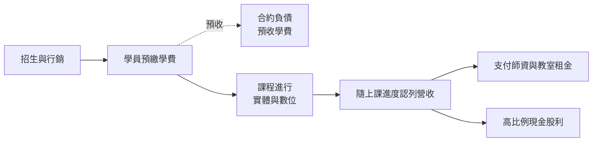
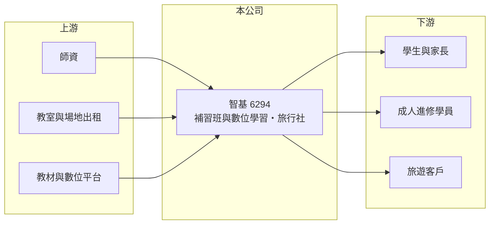

# 6294 智基

> 上櫃｜[[產業索引-文化創意業|文化創意業]]｜上市（櫃）日期 2004/01/13

# 第一章：企業模式與商業藍圖

> [!info] 撰寫說明
> 精簡版，由 Claude 依公開資料整理，架構比照 [[2330台積電]] 的四章研究，資料截至 2026-10-08。來源：nStock 公司頁、Goodinfo 年度經營績效頁、櫃買中心開放資料（2026 年第二季綜合損益與資產負債、基本資料、每月營收、本益比殖利率）。公開資料有限，補習班品牌、課程別營收比重與旅行社業務規模未查得，產業描述為整理性內容。#待校對

智基科技開發（股票代號：6294，以下簡稱智基）是少數掛牌的補教業者。本章說明它以實體補習班與數位學習為主的商業模式，以及補教業「先收學費、後提供課程」的現金流特性。

## 一、核心定位：以補習教育為主、兼營旅行社

依櫃買中心與 nStock 資料，智基成立於 1996 年，2004 年 1 月上櫃，董事長為邱仕榮，實收資本額約 2.60 億元，產業分類為文化創意業。nStock 描述的主要業務是「[[短期補習班]]實體及數位學習服務，以及旅行社業務」。

補教業的商業模式是：租用教室、聘請師資，向學員收取課程費用。由於學員多半一次繳清整期學費，公司會先收到現金，再隨上課進度認列營收。這讓補教業者通常不需要借款就能營運，而且只要招生穩定，現金流就相當充沛。

## 二、事業板塊

公司未在本次查得的資料中揭露業務別比重（未查得），依業務性質說明：

* **實體補習班：** 傳統的面授課程，依補習及進修教育法立案。實體班需要教室租金與師資成本，但能提供面對面輔導，學員黏著度高。
* **[[數位學習]]：** 線上課程與錄影課程。數位課程可以一次製作、多次銷售，邊際成本低，是補教業提高毛利率的方向。
* **旅行社業務：** 與補教本業性質不同，旅行社通常毛利率較低、受景氣與疫情影響較大。

## 三、資本轉化邏輯

依櫃買中心資料，2026 年第二季底智基總資產約 12.89 億元、負債約 7.32 億元，其中流動負債約 5.77 億元，可能多為[[預收學費]]等營運性負債（推估）；非流動負債約 1.55 億元，可能包含教室租約形成的租賃負債（推估）。權益約 5.57 億元。

## 四、企業長期藍圖

台灣少子化讓升學補習的學生數長期減少，補教業者的成長方向多半是轉向成人進修、證照與語言課程，以及擴大數位學習的比重。智基的營收在 2019 至 2025 年大致維持在 8.6 億至 10.6 億元之間，規模相當穩定，但 2024 年起獲利率明顯下降。公司能否以數位學習維持獲利率，是長期觀察重點。

# 第二章：護城河深度與競爭優勢

在長期價值投資中，「護城河」指企業抵禦競爭、維持超額利潤的保護機制。本章分析補教業者的競爭優勢與限制。

## 一、智基護城河的核心組成要素

* **1. 品牌與口碑：** 補教業的招生高度依賴品牌與學員口碑，經營二十年以上的業者在家長與學員心中有一定的信任基礎，新進者需要長時間累積。
* **2. 預收學費的資金優勢：** 學員先付費、後上課，讓公司不需要外部資金就能擴點與投資數位課程，這是補教業特有的財務優勢。
* **3. 課程內容累積：** 多年累積的教材與數位課程可以重複使用，數位化程度越高，邊際成本越低。

但補教業的門檻不高，名師流動與線上平台的興起，都會削弱傳統補教業者的優勢。

## 二、主要競爭對手格局

| 對手 | 定位 | 對智基的威脅 |
|---|---|---|
| 地區型與連鎖補習班 | 各類升學、語言與證照補習 | 在地招生競爭激烈 |
| 線上學習平台 | Hahow、YOTTA 等線上課程平台 | 以低價與彈性搶成人進修市場 |
| 名師個人品牌 | 名師透過社群與線上平台自行開課 | 吸走師資與學員 |
| 免費學習資源 | YouTube 與生成式 AI 學習工具 | 降低學員付費意願 |

## 三、優勢轉化：哪些守得住、哪些守不住

* **守得住：** 既有品牌與預收學費帶來的現金流。
* **守不住：** 獲利率。依 Goodinfo 資料，營業利益率從 2019 至 2023 年的 28% 至 35%，降到 2024 年的 5.11% 與 2025 年的 9.75%，毛利率也從約 45% 至 52% 降到 30% 至 35%。原因可能與旅行社等低毛利業務比重上升或成本增加有關（推估，原因未查得）。
* **觀察重點：** 毛利率能否回到 40% 以上、數位學習的營收比重，以及招生人數的變化。

# 第三章：財務體質與盈利規模

資料日期：2026-10-08，表格是撰寫當時的快照；最新月營收、毛利率、累計 EPS 由自動排程寫在本筆記的屬性欄位（月營收、毛利率、累計EPS 等）。#待校對

財務報表是檢驗護城河是否真實存在的最終標準。智基過去是高 ROE、高配息的現金型公司，但 2024 年獲利率出現結構性下滑。

## 一、多年度經營績效

| 年度 | 營收（新台幣） | [[毛利率]] | [[營業利益率]] | EPS（元） | [[ROE]] |
|---|---|---|---|---|---|
| 2019 | 8.64 億 | 48.2% | 30.0% | 8.91 | 37.2% |
| 2020 | 9.39 億 | 51.9% | 35.0% | 11.32 | 43.2% |
| 2021 | 9.45 億 | 51.2% | 35.2% | 11.21 | 40.3% |
| 2022 | 9.82 億 | 46.8% | 30.6% | 9.97 | 33.9% |
| 2023 | 9.58 億 | 44.8% | 28.3% | 9.46 | 31.8% |
| 2024 | 10.6 億 | 30.1% | 5.11% | 1.79 | 6.66% |
| 2025 | 9.73 億 | 34.5% | 9.75% | 2.78 | 12.4% |
| 2026 上半年 | 4.71 億 | 40.2% | 16.9% | 2.13 | 不適用（半年） |

資料來源：2019 至 2025 年為 Goodinfo 年度經營績效，2026 上半年為櫃買中心開放資料。

* **2024 年的斷層：** 營收仍成長到約 10.6 億元，但 EPS 從 9.46 元降到 1.79 元，代表成本結構出現明顯變化。
* **2026 年回升：** 上半年毛利率回到約 40%、營業利益率約 16.9%，獲利有所改善。
* **長期指標：** 2021 至 2025 年平均 ROE 約 25%（推算），但前後兩段落差很大；2020 至 2025 年營收年複合成長率約 0.7%（推算），營收規模多年持平。

## 二、股利與現金流

智基長期以高比例現金股利回饋股東。依櫃買中心本益比殖利率資料，最近一次現金股利為每股 3.0 元，高於 2025 年 EPS 2.78 元，配發率約 108%（推算）。依 nStock 資料，2024 年度配發現金股利 3.2 元與股票股利 0.6 元，現金配發率約 189%，動用了以前年度的盈餘；近五年平均現金股利約 6.5 元。Goodinfo 統計歷年平均現金股利約 2.84 元。補教業資本支出低，又有預收學費，[[自由現金流]]長期應為正（推估，現金流量表未查得）。

## 三、[[ROIC]] 與 [[WACC]]

**ROIC 推算：** 2025 年營業利益約 0.95 億元（9.73 億元 × 9.75%），稅後約 0.76 億元；投入資本以 2026 年第二季底權益約 5.57 億元，加上假設有息負債與租賃負債約 2 億元（推估），合計約 7.57 億元，ROIC 約 10%（推算）。若以 2021 至 2025 年平均營業利益約 2.11 億元計算，平均 ROIC 約 22%（推算）。

**WACC 推算：** 假設台灣 10 年期公債殖利率 1.75%、市場風險溢酬 6%，補教業需求相對穩定，β 取 0.8（假設），權益成本約 6.55%；負債成本稅後約 2.0%，以權益約 74%、負債約 26% 計算，WACC 約 5.4%（推算）。

**結論：** 2023 年以前智基的 ROIC 遠高於 WACC，是高度創造價值的現金型公司；2024 年後利差明顯縮小，但仍高於資金成本。高配息若持續超過盈餘，淨值會逐漸下降，ROE 看起來會偏高，評估時應同時看獲利的絕對金額。

# 第四章：總體風險與地緣政治

任何企業都無法脫離宏觀環境獨立存在。本章分析智基長期必須面對的人口結構、產業與營運風險。

## 一、人口結構

台灣出生數持續下降，升學補習的目標人口逐年減少，是補教業最根本的長期風險。業者需要把客群延伸到成人進修、證照與語言學習，才能抵銷學生人數的減少。

## 二、產業與科技變化

* **線上化與 AI：** 線上課程平台與生成式 AI 學習工具降低學習成本，可能讓學員減少對實體補習的需求。數位學習對智基而言既是機會也是威脅。
* **名師流動：** 補教業的核心資產是師資，名師離職或自行創業會帶走學員。

## 三、營運與其他風險

* **旅行社業務：** 旅行業受景氣、疫情與國際情勢影響，獲利波動大，可能拖累整體毛利率。
* **預收學費管理：** 補教業若經營不善，預收學費可能引發退費糾紛，主管機關對學費收取與退費的規範也可能趨嚴。
* **高配息的可持續性：** 配發率超過 100% 不能長期持續，未來股利將回到與獲利相稱的水準。

# 專有名詞解析

## 應用

- **[[數位學習]]**：以線上課程、影音與互動軟體提供的教學內容與服務。

## 金融

- **[[預收學費]]**：學生先繳學費、課程後續提供，會計上列為合約負債。
- **[[自由現金流]]**：營業活動現金流減去資本支出，代表企業可自由用於配息、還債或併購的現金。
- **[[ROIC]]**：投入資本報酬率，稅後營業利益除以股東權益與有息負債的合計，衡量本業對所有資金提供者的報酬。
- **[[WACC]]**：加權平均資金成本，依股東權益與負債的比重加權計算的資金成本，ROIC 高於它才代表創造價值。

## 產業

- **[[短期補習班]]**：依補習及進修教育法立案、提供升學或考試輔導的教學機構。

# 核心供應鏈

## 1. 上游
- 師資、教室與場地、教材與線上學習平台技術

## 2. 本公司
- 智基：短期補習班實體與數位學習服務、旅行社業務

## 3. 下游
- 學生與家長、成人進修學員、旅遊客戶

## 4. 同業
- 連鎖補習班、線上課程平台

## 最新新聞
<!-- news:start -->
<!-- news:end -->

## 相關連結
- [公開資訊觀測站](https://mopsov.twse.com.tw/mops/web/t05st03?step=1&firstin=1&co_id=6294)
- [Goodinfo](https://goodinfo.tw/tw/StockDetail.asp?STOCK_ID=6294)
- [Yahoo 股市](https://tw.stock.yahoo.com/quote/6294)
- [鉅亨網新聞](https://www.cnyes.com/twstock/6294/news)
