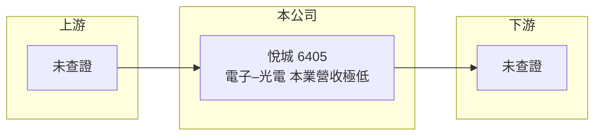

# 6405 悅城

> 上市｜[[產業索引-光電業|光電業]]｜上市（櫃）日期 2013/11/28

# 第一章：企業模式與商業藍圖

> [!info] 撰寫說明
> 精簡版，由 Claude 依公開資料整理，架構比照 [[2330台積電]]，資料截至 2026-10-07。來源：nstock 個股頁、winvest 營收快訊。公開資料有限，本次未查到主要產品、營收比重與年度財報數字。#待校對

悅城目前本業營收幾乎為零，本章只能就可查到的資訊說明現況。

- **核心業務：** 公司產業分類為電子–光電，具體主要產品本次未查證。
- **營收結構：** 2026 年 6 月單月營收僅 6,000 元、8 月 1.1 萬元，年減 91.85%，本業營運規模極小。
- **營運據點：** 本次未查證。
- **長期方向：** 公司未來業務方向本次未查得，需以公司公告為準。

# 第二章：護城河深度與競爭優勢

在本業營收幾近停擺的情況下，悅城沒有可觀察的產品護城河。

- **競爭優勢：** 本次資料未顯示明確競爭優勢。
- **主要對手：** 因主要產品未查證，對手無法判定。
- **觀察重點：** 公司於 2026-10-01 發布澄清媒體報導的 [[重大訊息]]，內容本次未取得，需查閱原文了解公司動向。

# 第三章：財務體質與盈利規模

資料日期：2026-10-07，以下數字是撰寫當時的快照；最新月營收、毛利率、累計 EPS 由自動排程寫在本筆記的屬性欄位（月營收、毛利率、累計EPS 等）。#待校對

悅城的財務數字本次僅查到月營收與股價。

- **營收規模：** 2026 年 6 月營收 6,000 元，8 月營收 1.1 萬元，年減 91.85%。
- **獲利：** EPS、[[毛利率]] 本次未查得；在營收極低下，損益推估主要受費用與 [[業外收益]] 影響。
- **財務特色：** 2026-10-02 收盤價 42.5 元，當日下跌 5.76%，成交 3,935 張，股價波動與本業規模明顯脫鉤。

# 第四章：總體風險與地緣政治

悅城的主要風險在於本業停滯與資訊不透明。

- **產業週期：** 因主要產品不明，產業週期影響無法判斷。
- **營運風險：** 營收極低代表本業無法支撐費用，虧損可能持續侵蝕淨值（推估）。
- **其他風險：** 股價受消息面影響大，媒體報導與公司澄清可能造成劇烈波動。

# 專有名詞解析

## 金融

- **[[重大訊息]]**：上市櫃公司依規定在公開資訊觀測站即時揭露、可能影響股價的訊息，包括澄清媒體報導。
- **[[毛利率]]**：毛利除以營收，反映產品售價扣除直接生產成本後的獲利空間。
- **[[業外收益]]**：本業以外的收入，例如投資收益、處分資產利益與匯兌收益，通常不具持續性。

# 核心供應鏈

- 上游：本次未查證
- 下游／客戶：本次未查證
- 同業：本次未查證

## 最新新聞
<!-- news:start（自動產生，請勿手動編輯此範圍） -->
- 2026-10-08 📰 媒體 18:21｜營收速報 - 悅城(6405)9月營收15萬元年增率高達176.36％｜[鉅亨網](https://news.cnyes.com/news/id/6625187)

完整紀錄：[[6405悅城 新聞]]
<!-- news:end -->

## 相關連結
- [公開資訊觀測站](https://mopsov.twse.com.tw/mops/web/t05st03?step=1&firstin=1&co_id=6405)
- [Goodinfo](https://goodinfo.tw/tw/StockDetail.asp?STOCK_ID=6405)
- [Yahoo 股市](https://tw.stock.yahoo.com/quote/6405)
- [鉅亨網新聞](https://www.cnyes.com/twstock/6405/news)
