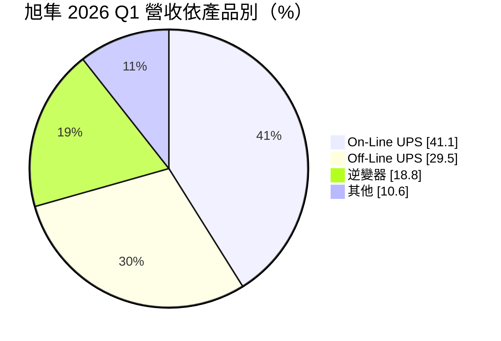
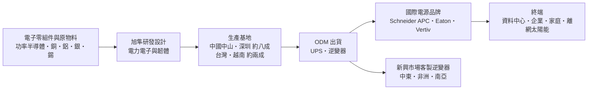
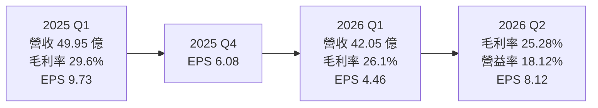
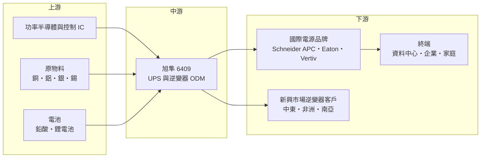

# 6409 旭隼

> 上市｜[[產業索引-其他電子業|其他電子業]]｜上市（櫃）日期 2014/03/31

# 第一章：企業模式與商業藍圖

> [!info] 撰寫說明
> 本文由 Claude 依公開資料整理，架構比照 [[2330台積電]] 的四章研究，資料截至 2026-10-07。財務數字來源：富果研究（旭隼 2025 年 6 月與 2026 年 6 月法說會摘要）、方格子 vocus（2026 年 6 月法說會整理）、理財周刊（2026 年 9 月營收與股價分析）、優分析（2025 年第一季營收與產品展望）、財報狗（各季 EPS）、鉅亨網（2026 年除息報導）、nstock 公司資料；產業描述為整理性內容，尚未逐條比對原始文件。#待校對

在評估單一個股的長期投資價值時，首要步驟是拆解企業的底層獲利邏輯。本章針對旭隼科技（股票代號：6409，以下簡稱旭隼）的商業模式進行定性分析，說明一家替國際電源品牌代工[[UPS]]與逆變器的公司，如何維持接近 30% 的毛利率與高配息，以及它在 AI 資料中心電力需求中的新機會。

## 一、核心定位：全球 UPS 與逆變器的隱形代工冠軍

旭隼成立於 2008 年 5 月，2014 年 3 月上市，資本額約 8.83 億元，股本小、獲利高，是典型的高價股。旭隼專注兩類電源產品：

* **不斷電系統（UPS）：** 停電時以電池即時供電，保護電腦、伺服器與網通設備不中斷。
* **[[逆變器]]（Inverter）：** 把太陽能板或電池的直流電轉換成家用交流電，用於離網與家用太陽能、儲能系統。

旭隼的商業模式以 [[ODM]] 為主，替國際電源品牌設計與製造產品，客戶遍及 100 多個國家、超過 500 個品牌，主要合作夥伴包括 Schneider（APC）、Eaton、Vertiv（原 Emerson 網路能源）等全球 UPS 大廠。旭隼本身不經營終端零售品牌，而是作為品牌背後的設計製造夥伴。

## 二、終端應用／產品板塊：線上式 UPS 為最大宗

2026 年第一季的產品營收結構如下：

* **[[On-Line UPS]]（線上式）：** 電力始終經由 UPS 轉換供應，切換時間為零，適合伺服器、資料中心與醫療設備，單價與毛利較高。2025 年第一季占 38.3%，2026 年第一季升到 41.1%。
* **[[Off-Line UPS]]（離線式）：** 平時由市電直接供電，停電才切換到電池，成本低，主要用於個人電腦與小型辦公室。
* **逆變器：** 以新興市場的離網與家用太陽能為主，旭隼強調高度客製化。2025 年第一季占 25.7%，2026 年第一季因中東地緣衝突造成荷莫茲海峽封鎖、當地銷售停滯，年減 38.3%，占比降到 18.8%。
* **區域分布：** 依 2025 年第一季資料，亞洲占 53.8%、美洲 24.8%、歐洲 18.9%、非洲與其他 2.5%。

## 三、資本轉化邏輯（營運模式）：高毛利的電源 ODM

* **高於一般 ODM 的毛利率：** 旭隼的[[毛利率]]長期接近 30%（2025 年第一季 29.6%），[[營業利益率]]約 20%，遠高於一般電子代工。原因在於電源產品的設計門檻較高，小量多樣的客製化又讓價格競爭不像消費性電子那麼激烈。
* **原物料敏感：** 銀、錫、銅、鋁價格上漲時，2026 年第一季毛利率被壓縮約 2 至 3 個百分點，降到 26.1%。
* **產地分配：** 約八成產能在中國中山與深圳，台灣與越南約兩成主要供應美國市場；公司曾評估在阿聯設廠，以因應美國對等關稅。

## 四、企業長期藍圖：AI 資料中心電源

* **高功率 UPS 委外：** 公司觀察到 AI 資料中心的高功率 UPS 出現委外趨勢，國際品牌把更多高功率產品交給 ODM 代工，對旭隼是新的成長來源。
* **[[HVDC]] 電源：** 次世代高壓直流電源的多款原型機已完成測試，鎖定 AI 資料中心電力架構轉型。
* **新興市場逆變器：** 維持在電網不穩定地區的離網與儲能逆變器優勢，待中東情勢恢復後重新放量。

# 第二章：護城河深度與競爭優勢

在長期價值投資中，「護城河」指企業抵禦競爭、維持超額利潤的保護機制。本章分析旭隼的護城河構成、主要競爭對手，以及這些優勢在電源產業競爭中能守住多少。

## 一、旭隼護城河的核心組成要素

旭隼的護城河屬於「中等護城河」，主要來自：

* **1. 電力電子設計能力：** UPS 與逆變器需要處理高電壓、高電流與電池管理，安全認證要求嚴格。旭隼累積大量電源設計經驗，能快速為不同客戶、不同市場開發客製化產品。
* **2. 國際品牌的長期 ODM 關係：** Schneider、Eaton、Vertiv 等品牌的 UPS 產品線需要長期穩定的設計製造夥伴，產品通過各國安規認證後，更換 ODM 的成本與風險都很高。
* **3. 小量多樣的成本控制：** 客戶遍及 500 多個品牌、產品規格繁多，旭隼能在小量多樣的訂單中維持接近 30% 的毛利率，代表生產管理與供應鏈調度的效率。

## 二、全球主要競爭對手格局

| 對手 | 定位 | 對旭隼的威脅 |
|---|---|---|
| [[2308台達電]] | 全球電源大廠，自有 UPS 品牌與資料中心電源方案 | 在高功率 UPS 與資料中心電源直接競爭，規模遠大於旭隼 |
| 中國 UPS 與逆變器廠 | 成本低、政府支持 | 在新興市場逆變器以低價競爭 |
| 國際品牌自製產能 | Schneider、Eaton、Vertiv 也有自有工廠 | 品牌可能把部分產品收回自製 |
| [[2317鴻海]]、[[2312金寶]] 等電子代工 | nstock 列為同業 | 有能力切入電源產品代工，但非專業電源廠 |

## 三、優勢轉化：哪些市場守得住、哪些守不住

* **守得住：** 國際品牌的中小功率 UPS ODM。On-Line UPS 占比持續上升，2025 年第一季營收年增 21.5%，顯示核心業務穩健。
* **守不住或受外部衝擊：** 新興市場逆變器。中東地緣衝突使當地銷售停滯，2026 年第一季逆變器營收年減 38.3%，說明這塊業務對單一區域的政治風險很敏感。
* **觀察重點：** 高功率 UPS 委外訂單的實際放量時間、HVDC 電源能否進入 AI 資料中心供應鏈，以及原物料價格回落後毛利率能否回到 29% 以上。

# 第三章：財務體質與盈利規模

資料日期：2026-10-07。數字取自富果研究、vocus、財報狗、理財周刊與 nstock 整理的財報資料，表格是撰寫當時的快照；最新月營收、毛利率、累計 EPS 由自動排程寫在本筆記的屬性欄位（月營收、毛利率、累計EPS 等）。#待校對

財務報表是檢驗護城河是否真實存在的最終標準。本章用三率、ROE、現金流與資本報酬，檢視旭隼高毛利、高配息模式的穩定度。

## 一、獲利能力的基石：三率

| 項目 | 2025 Q1 | 2025 Q3 | 2025 Q4 | 2026 Q1 | 2026 Q2 |
|---|---|---|---|---|---|
| 營收（新台幣） | 49.95 億 | 未查得 | 約 46.4 億（推算） | 42.05 億 | 約 55.5 億（推算） |
| [[毛利率]] | 29.6% | 未查得 | 約 29.0%（推算） | 26.1% | 25.28% |
| [[營業利益率]] | 約 21.3%（推算） | 未查得 | 約 20.8%（推算） | 18.1% | 18.12% |
| EPS（元） | 9.73 | 7.32 | 6.08 | 4.46 | 8.12 |

2025 年第四季數字以 2026 年第一季的季變動推算；2026 年第二季營收以前 8 月累計 135.52 億元減 7、8 月營收再減第一季推算。2025 年全年 EPS 以四季加總約 40.2 元（第二季以 2026 年第二季年減 52.54% 回推約 17.1 元），屬推算值。

* **營收：** 2026 年前 8 月累計 135.52 億元、年減 4.14%；7 月 20.14 億元、年增 25.81%，8 月 17.79 億元、年減 3.16%，復甦力道不穩。
* **[[毛利率]]：** 由 2025 年第一季的 29.6% 降到 2026 年第二季的 25.28%，主因是原物料上漲與產品組合變化。
* **[[營業利益率]]：** 維持在 18% 上下，費用控制穩定。
* **業外與匯率：** 2026 年第一季營業利益 7.61 億元，但稅後淨利只有 3.92 億元，差距大，推估與匯兌損失等業外項目有關（推估）；第二季淨利率回升到 12.82%，EPS 季增 82%。

## 二、[[ROE]]：資本效率

旭隼股本只有約 8.83 億元，屬於輕資產的 ODM，以近 30% 的毛利率與約 20% 的營業利益率，在正常年度 ROE 可達數十個百分點（推估，具體數值未查得）。高 ROE 加上高配息，是旭隼長期被視為高價績優股的主因。

## 三、資本支出與[[自由現金流]]

* **股利：** 2025 年度配發現金股利 36.77 元，2026 年 7 月 23 日除息，以除息前股價 1,020 元計算殖利率約 3.6%；以推算的 2025 年 EPS 約 40.2 元計，配息率約九成。前一年度（2024 年度）配發 43 元。
* **[[CapEx]]：** ODM 組裝與測試的設備投資不大，旭隼的資本支出相對營收很低（具體金額未查得），讓多數獲利能以現金股利發放。
* **自由現金流：** 高配息率顯示自由現金流充沛，但若未來需要在越南、阿聯或其他地區新建產能，資本支出可能上升（推估）。

## 四、[[ROIC]] 與 [[WACC]]：價值創造利差

輕資產、高毛利的模式使旭隼的 ROIC 長期明顯高於資金成本（推估，具體數值未查得）。2026 年的挑戰是毛利率由近 30% 降到約 25%、EPS 由 2025 年第一季的 9.73 元降到 2026 年第一季的 4.46 元，利差縮小。若原物料價格回穩、中東市場恢復，加上 AI 資料中心高功率 UPS 委外訂單放量，利差有機會重新擴大。

# 第四章：總體風險與地緣政治

任何企業都無法脫離宏觀環境獨立存在。本章分析旭隼未來必須面對的地緣政治、產業週期、營運與技術風險。

## 一、地緣政治風險

* **中東衝突：** 2026 年中東地緣衝突導致荷莫茲海峽封鎖，旭隼的中東逆變器銷售停滯，是第一季營收年減 15.8% 的主因之一。新興市場是旭隼逆變器的主要市場，區域政治風險直接反映在營收上。
* **美國關稅：** 約八成產能在中國，美國對中國與台灣產品課徵關稅，公司已評估阿聯設廠並以台灣、越南產能供應美國市場。
* **中國產能集中：** 中山與深圳是主要生產基地，美中摩擦或中國政策變化會影響供應鏈穩定。

## 二、產業週期與市場結構

* **IT 資本支出週期：** UPS 需求與企業 IT 設備、資料中心投資連動，景氣放緩時企業延後採購。
* **太陽能與儲能週期：** 逆變器需求受太陽能板價格、補貼政策與新興市場電網狀況影響，波動較大。
* **[[長鞭效應]]：** 品牌客戶的庫存調整會放大 ODM 的訂單波動，2026 年月營收在年增 25% 與年減 3% 之間擺盪。

## 三、營運環境的隱性風險

* **原物料價格：** 銀、錫、銅、鋁上漲使 2026 年第一季毛利率被壓縮 2 至 3 個百分點，旭隼對原物料價格的轉嫁能力有限。
* **缺料：** 公司在 2026 年 6 月法說會以總經與供應鏈缺料為由，未提供全年營收與毛利率指引，顯示供應鏈仍不穩定。
* **匯率：** 營收以美元計價，新台幣升值時匯損會侵蝕淨利。
* **股價波動：** 2026 年股價由高點約 2,385 元下跌超過六成，反映市場對成長放緩的重新評價。

## 四、科技或法規演進

* **資料中心電力架構：** AI 資料中心可能從傳統交流 UPS 轉向 HVDC 與機櫃級[[BBU]]（電池備援模組），若旭隼無法跟上新架構，高功率市場的機會可能落到其他電源廠。
* **電池技術：** UPS 與儲能由鉛酸電池轉向[[鋰電池]]，系統設計與安全認證要求提高。
* **能效與安規法規：** 各國對電源產品的能效、電網併聯與安全規範持續更新，旭隼需要持續投入認證，但這也提高新進者的門檻。

# 專有名詞解析

## 金融

- **[[毛利率]]**：毛利除以營收，代表產品扣除直接成本後的獲利空間。
- **[[營業利益率]]**：營業利益除以營收，反映本業扣除研發、管銷費用後的獲利能力。
- **[[ROE]]**：股東權益報酬率，稅後淨利除以股東權益，衡量公司用股東的錢賺錢的效率。
- **[[自由現金流]]**：營業活動現金流減去資本支出，代表企業可自由用於配息、還債或併購的現金。
- **[[長鞭效應]]**：終端需求的小幅變動，沿供應鏈往上游傳遞時被逐級放大，造成上游庫存與訂單劇烈波動。

## 產業

- **[[UPS]]**：不斷電系統，市電中斷時以電池即時供電，保護電腦、伺服器與網通設備不斷電。
- **[[On-Line UPS]]**：線上式不斷電系統，電力始終經由 UPS 轉換後供應，停電時零切換時間，用於伺服器與資料中心。
- **[[Off-Line UPS]]**：離線式不斷電系統，平時由市電直接供電，停電才切換到電池，成本較低，用於個人電腦。
- **[[逆變器]]**：把直流電轉換成交流電的設備，用於太陽能發電與儲能系統。
- **[[ODM]]**：原廠委託設計製造，代工廠負責產品設計與生產，再以客戶品牌出貨。
- **[[HVDC]]**：高壓直流供電，資料中心以高壓直流取代交流配電，減少轉換損耗，是 AI 資料中心電力架構的新方向。
- **[[BBU]]**：電池備援模組，裝在伺服器機櫃內的備用電池，可在斷電時短時間供電。
- **[[鋰電池]]**：以鋰離子在正負極間移動儲存電能的電池，能量密度高於鉛酸電池，逐漸取代 UPS 用鉛酸電池。

# 核心供應鏈

## 1. 上游：零組件與原物料
- 功率半導體（MOSFET、IGBT）與控制 IC 供應商（個別名稱未查得）
- 銅、鋁、銀、錫等金屬原料
- UPS 與儲能電池

## 2. 中游：旭隼本身與同業
- 電源 ODM：旭隼
- 電源同業：[[2308台達電]]

## 3. 下游：主要客戶
- 國際 UPS 品牌：Schneider Electric（APC）、Eaton、Vertiv
- 新興市場的逆變器與太陽能系統品牌（超過 500 個品牌）

## 最新新聞
<!-- news:start -->
<!-- news:end -->

## 相關連結
- [公開資訊觀測站](https://mopsov.twse.com.tw/mops/web/t05st03?step=1&firstin=1&co_id=6409)
- [Goodinfo](https://goodinfo.tw/tw/StockDetail.asp?STOCK_ID=6409)
- [Yahoo 股市](https://tw.stock.yahoo.com/quote/6409)
- [鉅亨網新聞](https://www.cnyes.com/twstock/6409/news)
