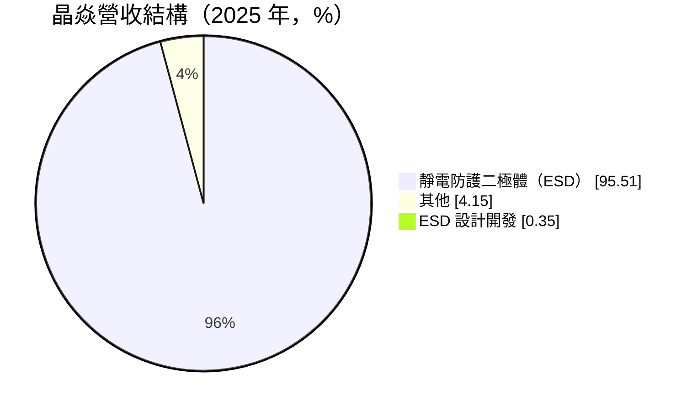
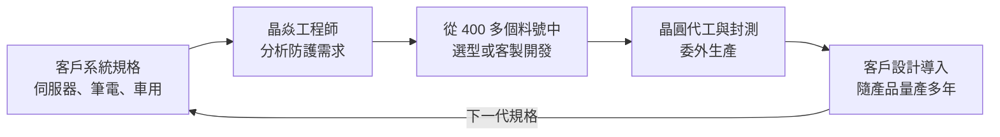
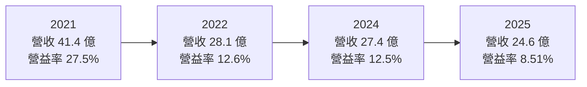
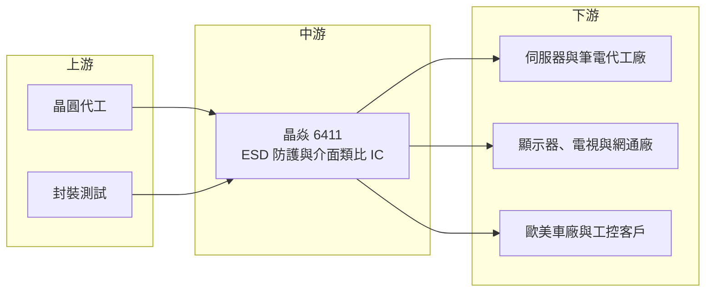

# 6411 晶焱

> 上櫃｜[[產業索引-半導體業|半導體業]]｜上市（櫃）日期 2014/03/11

# 第一章：企業模式與商業藍圖

> [!info] 撰寫說明
> 本文由 Claude 依公開資料整理，架構比照 [[2330台積電]] 的四章研究，資料截至 2026-10-08。財務數字來源：Goodinfo 台灣股市資訊網年度經營績效、MoneyDJ 理財網（富邦電子下單 DJ 版）公司基本資料與股利表、富果研究 2026 年 5 月法說會整理（引用 OMDIA 2023 年報告）；產業描述為整理性內容，尚未逐條比對原始文件。#待校對

在評估單一個股的長期投資價值時，首要步驟是拆解企業的底層獲利邏輯。本章針對晶焱科技（股票代號：6411，以下簡稱晶焱）的商業模式進行定性分析，說明一家專做靜電防護元件的 IC 設計公司，如何在一個看似不起眼的零件市場做到全球前三，以及它如何從電腦應用延伸到車用與工業。

## 一、核心定位：專注 ESD 靜電防護的 IC 設計公司

晶焱成立於 2006 年，2014 年掛牌，是一家 [[Fabless]] 型態的 IC 設計公司，專注於 [[ESD]]（靜電放電）與 EOS（電性過應力）防護元件。MoneyDJ 揭露的 2025 年營收比重中，靜電防護二極體占 95.51%、ESD 設計開發服務占 0.35%、其他占 4.15%，晶焱可以說是一家幾乎純粹的 ESD 公司。

ESD 防護元件的功能很單純：當人體或外部環境帶來的靜電、突波進入電子產品時，ESD 元件會在極短時間內導通，把多餘的電流導到地線，保護後方昂貴的處理器、記憶體與介面晶片。每一個 USB、HDMI、網路埠、按鍵與天線旁邊，幾乎都需要 ESD 元件。單顆價格很低，但用量非常大，而且隨著晶片製程愈來愈先進、對靜電愈來愈敏感，防護的要求也愈來愈高。

依富果整理的 2026 年 5 月法說內容，晶焱引用 OMDIA 2023 年的報告，在 2022 年以營收計算排名全球純 ESD 防護元件第三，長期目標是成為第一。晶焱的產品強調高突波承受能力、低箝位電壓與超低電容，並具有不會發生[[閂鎖效應]]的特性。

## 二、終端應用板塊：以運算為主，延伸到車用與工業

法說資料指出，運算類應用（伺服器、筆電、電視、顯示器）占營收超過八成，其他應用的比重未揭露。晶焱鎖定的應用涵蓋 3C 產品、運算、工控、醫療電子、網通、車用、[[低軌衛星]]通訊與顯示面板。

* **ESD／EOS 防護元件：** 主要營收來源，料號超過 400 個，每年依客戶系統規格更新。高速介面（如 [[USB4]]、HDMI、PCIe）需要超低電容的 ESD 元件，以免影響訊號品質，這是技術門檻最高、也最有價值的產品。
* **介面與類比 IC：** 已量產的產品包括 [[CAN Bus]] 收發器、RS485／RS232 收發器與 EMI 濾波器，主要用於工業與車用。
* **開發中產品：** 數位隔離器、量測電流用的[[霍爾感測器]]，以及驅動 [[MOSFET]]、[[SiC]]、[[IGBT]] 等功率電晶體的閘極驅動器。法說資料對霍爾感測器的時程說法不一，推估約在 2027 年前後送樣或量產。

在區域方面，法說資料顯示非亞洲市場占營收比重由 2025 年的 5% 提高到 2026 年第一季的 7%。歐美知名車廠已將晶焱列入合格供應商名單（[[AVL]]），法說預期車用訂單主要在 2026 年底以後的一到兩年貢獻營收。

## 三、資本轉化邏輯：小晶片、大量料號、深度設計導入

晶焱的商業模式核心在於「把防護元件做成客製化的系統解決方案」。不同的電路板設計、介面速度與使用環境，需要不同規格的 ESD 元件；晶焱的工程師會協助客戶分析系統的靜電防護需求，推薦或開發合適的料號。

ESD 元件在客戶的物料清單中占成本比例極低，但一旦失效可能讓整台產品故障，因此客戶在選型後很少為了微小的價差更換。法說資料提到，晶焱的規格與國內多家主要伺服器廠的設計高度連結，客戶組合自疫情以來變化不大。這種「低成本占比、高失效代價」的特性，是 ESD 元件能維持四成上下毛利率的原因。

晶焱高度重視研發。法說資料顯示，公司約 146 名員工中約一半是研發人員，2026 年第一季研發費用占營業費用約六成；截至 2026 年 4 月已取得 242 項專利，另有 55 項申請中。公司也維持扁平化的組織結構。

## 四、企業長期藍圖：滲透每一種電子產品

法說資料列出晶焱的長期目標：滲透每一種電子產品、每一種應用與全球市場；與供應商共同管理品質、成本與產能；為客戶提供解決方案與穩定供貨；建立可持續經營的公司。

具體路徑有三條。第一，從運算應用往車用、工業與醫療擴展，這些市場的驗證期長、產品壽命長，一旦打入可以穩定供貨多年。第二，從亞洲客戶往歐美客戶擴展，法說提到 onsemi、Nexperia 的客戶正在轉向晶焱，這在歐美市場比中國市場更明顯。第三，從單一 ESD 元件往介面、隔離與驅動等類比 IC 延伸，提高每個客戶的產品貢獻。這三條路都需要長時間累積，但方向清楚，與晶焱既有的技術與客戶基礎一致。

# 第二章：護城河深度與競爭優勢

護城河決定了企業能否把今天的獲利延續到十年後。本章分析晶焱在全球 ESD 防護元件市場的競爭優勢，以及它面對國際大廠時的處境。

## 一、護城河的核心組成要素

* **設計導入的黏著度：** ESD 元件一旦寫入客戶的電路設計，通常會隨產品量產數年，客戶為了省下極小的成本而更換供應商，需要重新驗證整個系統的靜電防護，風險遠大於好處。
* **超低電容與高速介面的技術能力：** 高速介面的 ESD 元件需要在不影響訊號完整性的前提下提供足夠防護，技術門檻高。晶焱在這類產品上的專利與經驗，是它與一般分離式元件廠的主要差異。
* **料號廣度：** 超過 400 個料號，能滿足同一客戶不同機種的各種需求，客戶可以把 ESD 選型集中在晶焱一家。
* **與台灣伺服器與 PC 供應鏈的緊密關係：** 台灣是全球伺服器與筆電的設計與製造中心，晶焱與這些客戶的地理與工程距離很近，能快速支援新產品開發。

## 二、全球主要競爭對手格局

| 對手 | 定位 | 對晶焱的影響 |
|---|---|---|
| Nexperia（安世半導體） | 全球分離式元件與 ESD 大廠，為中資控股的荷蘭公司 | 規模與產品線大；法說提到其客戶正在轉向晶焱 |
| onsemi（安森美） | 美國功率與類比半導體大廠，ESD 產品線完整 | 在車用與工業市場有長期客戶基礎；法說提到其客戶也在轉單 |
| Semtech、Littelfuse 等國際保護元件廠 | 以 [[TVS]] 與電路保護元件為主力 | 在高階通訊與車用保護元件市場與晶焱競爭 |
| 中國 ESD 與分離式元件廠 | 受國產化政策支持，價格低 | 在中國市場以本土化優勢搶單，法說提到中國市場轉單效果較不明顯 |

## 三、優勢轉化：哪些市場守得住、哪些守不住

* **守得住：** 台灣伺服器、筆電與顯示器供應鏈的高速介面 ESD 元件。這些客戶需要快速的工程支援，晶焱的技術與地緣優勢明顯。
* **守不住：** 中國市場的一般型 ESD 元件。中國本土化政策與低價競爭，使晶焱在中國市場難以擴大占有率；低階通用料號的價格競爭也會持續。
* **觀察重點：** 非亞洲市場比重能否由 7% 持續提高、車用 AVL 能否轉為量產營收、介面與功率驅動類比 IC 能否成為第二條營收曲線，以及毛利率能否在上游成本上漲下維持在四成上下。

# 第三章：財務體質與盈利規模

資料日期：2026-10-08。數字取自 Goodinfo 年度經營績效與 MoneyDJ 股利表，表格是撰寫當時的快照；最新月營收、毛利率、累計 EPS 由自動排程寫在本筆記的屬性欄位（月營收、毛利率、累計EPS 等）。#待校對

財務報表是檢驗護城河是否真實存在的最終標準。本章用六年的三率、ROE 與資本報酬，檢視晶焱在電子產品循環中的獲利品質。

## 一、獲利能力的基石：三率

| 年度 | 營收（新台幣） | [[毛利率]] | [[營業利益率]] | EPS（元） | [[ROE]] |
|---|---|---|---|---|---|
| 2020 | 31.9 億 | 37.4% | 19.0% | 6.46 | 16.2% |
| 2021 | 41.4 億 | 47.3% | 27.5% | 10.32 | 23.4% |
| 2022 | 28.1 億 | 39.8% | 12.6% | 4.97 | 10.2% |
| 2023 | 26.4 億 | 45.4% | 14.4% | 4.20 | 8.36% |
| 2024 | 27.4 億 | 42.5% | 12.5% | 4.53 | 8.15% |
| 2025 | 24.6 億 | 39.0% | 8.51% | 3.18 | 5.18% |

晶焱的六年數字顯示，2021 年是電子產品缺貨潮帶來的高峰，營收 41.4 億元、毛利率 47.3%、營業利益率 27.5%、EPS 10.32 元。2022 年起 PC 與消費性電子進入庫存調整，營收降到 28.1 億元，之後三年一直停留在 24 億至 28 億元之間。毛利率大致維持在 39% 至 45%，顯示 ESD 元件的定價能力相對穩定；營業利益率則由 2021 年的 27.5% 降到 2025 年的 8.51%，主因是營收縮小而研發費用持續投入。

2020 至 2025 年營收年複合成長率約 -5.1%（推算）。拉長來看，2021 年的高峰不應視為常態，晶焱在正常年度的營收推估約在 25 億至 32 億元之間。2025 年毛利率下滑，法說資料歸因於上游晶圓、封裝與測試成本全面上漲；2026 年第一季毛利率約 34%，公司把改善毛利率列為優先目標。

## 二、[[ROE]]：資本效率

2021 至 2025 年晶焱的平均 ROE 約 11.1%（推算），高點是 2021 年的 23.4%，2025 年降到 5.18%。晶焱的資產中有大量現金與金融資產，法說資料顯示 2026 年第一季底總資產約 66.2 億元、股東權益約 49.5 億元，其中現金與流動金融資產約 30.4 億元，占股東權益六成以上（推算）。大量的閒置資金拉低了 ROE，也讓晶焱的淨利受到金融資產公允價值變動的影響，例如 2026 年第一季的業外收入就因此減少約三分之二。

## 三、資本支出、[[自由現金流]]與股利

* **[[CapEx]]：** 晶焱是 Fabless 模式，生產委外，資本支出很低，主要投入是研發人力與測試設備。
* **自由現金流：** 年度現金流數字未查得。以晶焱每年都有營業利益、資本支出低推估，自由現金流長期應為正值，這也是它能累積大量現金的原因。
* **股利：** 依 MoneyDJ 股利表，2019 至 2025 年度現金股利分別為 4.80、5.03、7.16、3.27、2.46、3.18、2.22 元。2022 至 2025 年度的配發率約在 58% 至 70% 之間（推算），股利金額隨獲利變動，但每年都有配發，屬於穩定配息的類型。

## 四、[[ROIC]] 與 [[WACC]]：價值創造利差

**ROIC 推算：** 2025 年營業利益約 2.09 億元（24.6 億元 × 8.51%），以稅率 20% 計算，稅後營業利益約 1.67 億元。股東權益約 50.4 億元（每股淨值 50.82 元 × 約 0.992 億股），晶焱幾乎沒有有息負債（推估），以股東權益作為投入資本，ROIC 約 3.3%（推算）。若扣除約 30 億元的現金與流動金融資產，只看營運所需的資本約 20 億元，ROIC 約 8.3%（推算）。用同樣方法回推 2021 年，稅後營業利益約 9.1 億元，股東權益約 40.9 億元，ROIC 約 22%（推算）。

**WACC 推算：** 假設台灣 10 年期公債殖利率 1.75%、市場風險溢酬 6%，β 取 MoneyDJ 揭露的 0.87，股東權益成本約 7.0%。晶焱幾乎沒有有息負債，WACC 約等於股東權益成本，約 7.0%（推算）。

**結論：** 2020 至 2021 年晶焱的 ROIC 明顯高於 WACC；2022 至 2024 年若扣除閒置現金，營運資本的報酬率大致仍高於資金成本；2025 年以全部股東權益計算的 ROIC 已低於 WACC，只有扣除現金後才略高於資金成本。這代表晶焱的本業仍具備創造價值的能力，但帳上大量現金拉低了整體資本效率。營收能否重回成長、以及閒置資金的運用方式，是影響長期報酬的兩大因素。

# 第四章：總體風險與地緣政治

任何企業都無法脫離宏觀環境獨立存在。本章分析晶焱未來必須面對的地緣政治、產業週期、營運與技術風險。

## 一、地緣政治風險

* **中國本土化政策：** 法說資料指出，中國市場因本土化政策，競爭對手轉單給晶焱的效果較不明顯。中國品牌與代工廠若優先採用本土 ESD 元件，晶焱在中國的成長空間有限。
* **歐美市場的機會：** 地緣政治使部分歐美客戶希望分散供應來源，這對晶焱是機會。Nexperia 等中資相關企業若受到政策限制，歐美客戶可能加速轉向其他供應商。
* **台灣供應鏈集中：** 晶焱的晶圓代工與封測主要在台灣，面臨與其他台灣 IC 設計公司相同的兩岸風險。

## 二、產業週期與市場結構風險

* **PC 與伺服器循環：** 運算類應用占營收超過八成，PC 與伺服器的出貨循環直接決定晶焱的營收。2022 年營收減少約三成二，就是 PC 庫存調整的結果。
* **[[長鞭效應]]：** ESD 元件位於供應鏈上游，終端需求的小幅變動會在客戶去化庫存時被放大。
* **價格競爭：** 一般型 ESD 元件的技術門檻較低，中國廠商的低價競爭會壓低這類產品的價格。

## 三、營運環境的隱性風險

* **上游成本上漲：** 法說資料提到晶圓、封裝與測試成本全面上漲，晶焱的毛利率由 2024 年的 42.5% 降到 2025 年的 39%。若無法把成本轉嫁給客戶，毛利率會持續受壓。
* **產能分配：** 法說預期 2026 年下半年產能吃緊，若代工與封測產能無法滿足客戶需求，可能影響出貨。小型 IC 設計公司在產能分配上的優先順序通常不如大客戶。
* **業外收入波動：** 帳上金融資產的公允價值變動，會讓淨利與 EPS 出現與本業無關的波動。

## 四、科技演進風險

晶片製程持續微縮，先進製程晶片對靜電更加敏感，對 ESD 防護的需求只會增加，這是晶焱的長期順風。但高速介面持續提速，例如 USB4 與更高速的 PCIe，對 ESD 元件的電容要求愈來愈嚴格，晶焱必須持續投入研發才能跟上。另一方面，部分晶片廠可能把更多 ESD 防護整合進晶片內部，減少外部 ESD 元件的需求。晶焱往車用、工業與功率驅動等類比 IC 延伸，也是為了降低對單一產品的依賴。

# 專有名詞解析

## 半導體

- **[[Fabless]]**：無晶圓廠的 IC 設計公司，只負責設計晶片，製造外包給晶圓代工與封測廠。
- **[[ESD]]**：靜電放電，人體或環境累積的靜電瞬間釋放，可能損壞電子元件，因此電子產品的介面都需要防護元件。
- **[[TVS]]**：暫態電壓抑制二極體，在電壓突波出現時迅速導通、把多餘電流導走，以保護後端電路。
- **[[閂鎖效應]]**：晶片中寄生結構被觸發後持續導通大電流的現象，可能造成元件永久損壞。
- **[[霍爾感測器]]**：利用霍爾效應量測磁場的感測器，可用於量測電流、位置與轉速。
- **[[MOSFET]]**：金屬氧化物半導體場效電晶體，最常見的功率開關元件，用於電源轉換與馬達驅動。
- **[[SiC]]**：碳化矽，耐高壓、耐高溫的化合物半導體材料，用於電動車與太陽能逆變器的功率元件。
- **[[IGBT]]**：絕緣閘雙極電晶體，用於高電壓、大電流的功率轉換，例如電動車與工業馬達。

## 應用

- **[[CAN Bus]]**：車用控制器區域網路，汽車內各電子控制單元互相通訊的標準匯流排。
- **[[低軌衛星]]**：在距地表數百至兩千公里軌道運行的通訊衛星，延遲低，用於全球寬頻網路。
- **[[USB4]]**：新世代 USB 規格，傳輸速度可達 40Gbps 以上，並整合影像與充電功能。

## 金融

- **[[長鞭效應]]**：終端需求的小幅變動，沿供應鏈往上游傳遞時被逐級放大，造成上游庫存與訂單劇烈波動。
- **[[ROIC]]**：投入資本報酬率，稅後營業利益除以股東權益加有息負債，衡量本業運用全部資本的效率。
- **[[WACC]]**：加權平均資金成本，股東與債權人要求報酬率的加權平均，ROIC 高於 WACC 才代表創造價值。

## 產業

- **[[AVL]]**：合格供應商名單，客戶經過審核後允許採購的供應商清單，進入名單是量產供貨的前提。

# 核心供應鏈

## 1. 上游：晶圓代工與封測
- 晶圓代工與封裝測試廠（晶焱未公開合作對象，未查得；法說提到上游晶圓、封裝與測試成本全面上漲）

## 2. 中游：晶焱本身與同業
- ESD／EOS 防護元件、CAN Bus 與 RS485 收發器、EMI 濾波器：[[6411晶焱]]
- 國際同業：Nexperia、onsemi、Semtech、Littelfuse

## 3. 下游：主要應用與客戶
- 伺服器與筆電：國內多家主要伺服器廠（法說未具名），如 [[2382廣達]]、[[3231緯創]]、[[2317鴻海]] 等台灣伺服器代工廠為此類客戶的代表（推估，未經公司證實）
- 顯示器、電視、網通與工控設備業者
- 歐美車廠（已列入 AVL，名稱未揭露）

## 最新新聞
<!-- news:start -->
<!-- news:end -->

## 相關連結
- [公開資訊觀測站](https://mopsov.twse.com.tw/mops/web/t05st03?step=1&firstin=1&co_id=6411)
- [Goodinfo](https://goodinfo.tw/tw/StockDetail.asp?STOCK_ID=6411)
- [Yahoo 股市](https://tw.stock.yahoo.com/quote/6411)
- [鉅亨網新聞](https://www.cnyes.com/twstock/6411/news)
