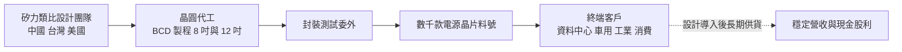
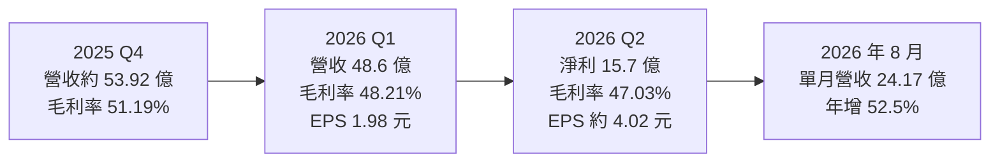
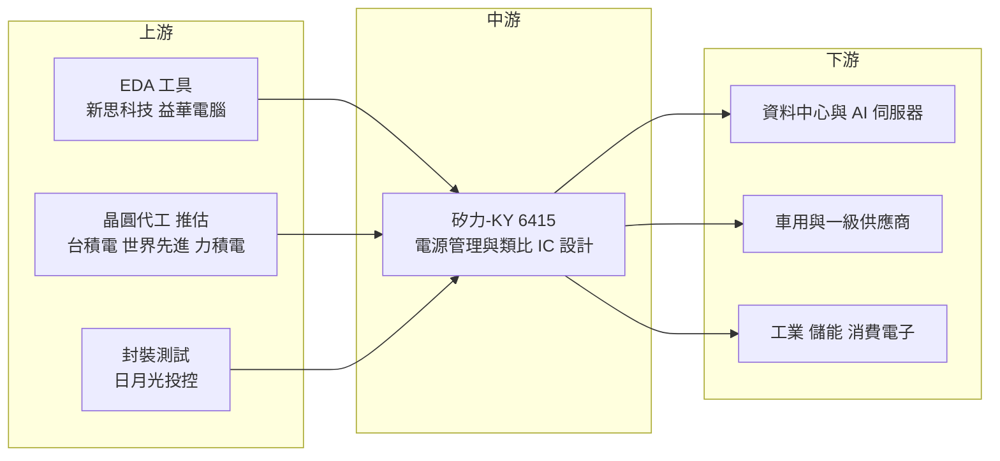

# 6415 矽力-KY

> 上市｜[[產業索引-半導體業|半導體業]]｜上市（櫃）日期 2013/12/12

# 第一章：企業模式與商業藍圖

> [!info] 撰寫說明
> 本文由 Claude 依公開資料整理，架構比照 [[2330台積電]] 的四章研究，資料截至 2026-10-07。財務數字來源：矽力-KY 2026 年第一季與第二季財報報導（聯合新聞網、經濟日報）、Money 錢 2025 年度整理、nStock 公司資料與月營收；產業描述為整理性內容，尚未逐條比對原始文件。#待校對

在評估單一個股的長期投資價值時，首要步驟是拆解企業的底層獲利邏輯。本章針對矽力杰（股票代號：6415，台股簡稱矽力-KY，以下簡稱矽力）的商業模式進行定性分析，說明這家在台灣掛牌、營運重心在中國的類比 IC 公司，如何從消費電子電源晶片走向資料中心與車用。

## 一、核心定位：亞洲規模最大的類比電源管理 IC 設計公司之一

矽力設立於 2008 年 2 月，註冊地為英屬開曼群島，2013 年 12 月在台灣證交所上市。創辦團隊來自美國類比 IC 大廠，研發與營運重心在中國杭州等地，董事長為陳偉。資本額約 9.74 億元。

矽力屬於 [[Fabless]] 模式，專做類比與混合訊號 IC，核心是[[電源管理 IC]]，包括 [[DC-DC 轉換器]]、充電 IC、LED 驅動、電池管理、功率級與[[多相電源]]控制器等。電源管理晶片是所有電子產品都需要的「供電心臟」，負責把電池或電網的電壓轉換成晶片能用的穩定電壓。這個定位有兩個商業意義：

* **產品生命週期長：** 類比晶片不追逐最新製程，一顆產品可以賣上許多年，庫存跌價風險相對數位晶片小。
* **料號廣度就是競爭力：** 矽力擁有數千款產品料號，能為客戶提供一站式電源方案，產品線越廣，越容易在同一客戶擴大份額。

## 二、終端應用板塊：從消費電子走向資料中心與車用

本次未查得精確的應用別營收比重，因此不畫比重圖，以下依公司法說與媒體描述整理：

* **資料中心與 AI 伺服器：** 伺服器、AI 伺服器、企業交換機、光模組的電源管理。2026 年第二季報導指出，資料中心是下半年最主要的成長推力。
* **車用：** [[ADAS]]、電池管理系統（[[BMS]]）、車燈、電動輔助轉向、車載充電器與 DC-DC、車載資訊娛樂、區域控制等。公司表示新晶片推出與市占提升，車用比重持續上升。
* **工業與儲能：** 工業控制、智慧電表、儲能系統。
* **消費電子與資通訊：** 筆電、智慧手機、家電等。2026 年下半年資通訊類受記憶體漲價影響轉弱，消費電子則因新品推出回升。

## 三、資本轉化邏輯：輕資產設計、委外製造

* **委外製造：** 矽力不擁有晶圓廠，晶圓委外給晶圓代工廠生產。依產業報導，包括台灣與中國的 8 吋、12 吋 [[BCD]] 製程產能，具體夥伴與比重本次未查得。
* **研發據點：** 研發中心分布在中國、台灣、美國等地。
* **成本結構：** 毛利率接近五成，但研發費用占營收比重高，營業利益率約一成出頭，代表獲利對營收規模相當敏感。

## 四、企業長期藍圖：維持 20% 至 30% 長期成長軌跡

矽力管理層長期設定營收年增 20% 至 30% 的目標。董事長陳偉在 2026 年第一季財報後表示，對全年抱持謹慎樂觀，預期下半年優於上半年，並認為價格環境已改善，「應當不會像往年一樣面臨價格下修壓力」，甚至可能出現漲價。策略重點是：

* 擴大資料中心與 AI 伺服器電源（多相控制器、功率級）的市占。
* 增加車用設計導入，提高車用占比。
* 在工業、儲能等穩定成長市場累積客戶。

# 第二章：護城河深度與競爭優勢

在長期價值投資中，「護城河」指企業抵禦競爭、維持超額利潤的保護機制。本章分析矽力的護城河構成、國內外主要競爭對手，以及這些優勢在國際大廠與中國本土廠夾擊下能守住多少。

## 一、矽力護城河的核心組成要素

矽力的護城河屬於「窄到中等」，由四個要素組成：

* **1. 類比設計人才與產品線廣度：** 一顆電源晶片的效率、雜訊、熱表現需要多年經驗累積，數千款料號讓矽力能提供一站式方案。
* **2. 中國客戶的就近服務：** 中國是全球最大的電子製造與電動車市場，矽力在中國的研發與業務團隊能快速回應本地客戶，並受惠於中國客戶「國產替代」的採購偏好。
* **3. 車用與工業的長期驗證：** 車用與工業電源晶片驗證期長，一旦導入可持續供貨多年。
* **4. 規模經濟：** 在亞洲類比 IC 設計公司中規模居前，能分攤研發費用並取得較好的晶圓代工產能條件。

## 二、全球主要競爭對手格局

| 對手 | 定位 | 對矽力的威脅 |
|---|---|---|
| 德州儀器、亞德諾、英飛凌、恩智浦、意法半導體 | 國際類比 [[IDM]]，擁有自有晶圓廠 | 車用與工業市場地位穩固，產品線完整 |
| Monolithic Power Systems（MPS） | 美國電源管理 IC，AI 伺服器多相電源領先 | 資料中心市場的主要對手 |
| 聖邦微、南芯、傑華特 | 中國本土類比 IC 公司 | 在消費電子與部分工業市場以低價競爭 |
| [[6719力智]]、[[3588通嘉]]、[[6138茂達]] | 台灣電源管理 IC 設計同業 | 在筆電與消費性電源晶片直接競爭 |

## 三、優勢轉化：哪些市場守得住、哪些守不住

* **守得住：** 在中國工業、儲能、車用市場，矽力相較國際 IDM 有價格與服務優勢，相較中國本土小廠則有產品線廣度與品質優勢。
* **守不住：** AI 伺服器高階多相電源目前由 MPS、英飛凌、德州儀器等主導，矽力要打入北美雲端客戶的核心電源仍需時間；消費電子市場則持續面臨中國本土廠價格戰。
* **價格環境轉變：** 陳偉指出 IDM 廠與中國競爭對手調整策略，有助於穩定市場價格，這是 2026 年[[毛利率]]能維持在 47% 至 48% 的原因之一。
* **觀察重點：** 資料中心營收能否持續放大、車用占比提升速度、毛利率能否站穩 48% 以上，以及中國市場競爭態勢。

# 第三章：財務體質與盈利規模

資料日期：2026-10-07。數字取自財報報導與財經媒體整理（聯合新聞網、經濟日報、Money 錢、nStock），表格是撰寫當時的快照；最新月營收、毛利率、累計 EPS 由自動排程寫在本筆記的屬性欄位（月營收、毛利率、累計EPS 等）。#待校對

財務報表是檢驗護城河是否真實存在的最終標準。本章用三率、ROE、現金流與資本報酬，檢視矽力在類比景氣回升中的獲利品質。

## 一、獲利能力的基石：三率

| 項目 | 2025 全年 | 2025 Q4 | 2026 Q1 | 2026 Q2 |
|---|---|---|---|---|
| 營收（新台幣） | 約 188 億（由 2026 年預估回推） | 約 53.92 億 | 48.6 億 | 約 60 億（由月營收推算） |
| [[毛利率]] | 未查得 | 51.19% | 48.21% | 47.03% |
| [[營業利益率]] | 未查得 | 未查得 | 未查得 | 12.4% |
| 稅後淨利 | 未查得 | 未查得 | 7.68 億 | 15.7 億 |
| EPS（元） | 6.40 | 約 2.09 | 1.98 | 約 4.02 至 4.05 |

* **營收：** 2026 年第一季營收 48.6 億元，季減 9.8%、年增 18.7%，淨利年增 114%。1 至 8 月累計營收 156.29 億元，8 月單月 24.17 億元、年增 52.5%。
* **毛利率：** 從 2025 年第四季的 51.19% 回落到 47% 至 48%，仍維持在接近五成的類比 IC 水準。
* **獲利品質：** 2026 年第二季淨利 15.7 億元，年增約 149%、季增約 105%，EPS 各來源分別報導為 4.02 元與 4.05 元。營業利益率 12.4%，[[淨利率]]卻達約 26%，代表第二季有相當比重的業外收益，評估本業時應以營業利益為準。
* **年度：** 2025 年 EPS 6.40 元，高於 2024 年的 5.95 元。媒體整理的 2026 年全年預估為營收 241.4 億元（年增 28.3%）、EPS 11.4 元，屬市場預估而非公司財測。

## 二、[[ROE]]：資本效率

矽力屬輕資產 IC 設計公司，但研發費用占營收比重高，使本業 ROE 偏低。ROE 精確值本次未查得；以 2025 年 EPS 6.40 元推估，ROE 約在個位數高段到 10% 左右（推估）。2026 年若獲利如市場預估成長，ROE 會明顯回升。依 nStock 資料，矽力近五年平均現金股利約 5.88 元，平均填息率 100%；2025 年度股利金額本次未查得。

## 三、資本支出與自由現金流

* **[[CapEx]]：** IC 設計公司的資本支出主要為研發設備、測試設備與辦公據點，規模相對營收不大，具體金額本次未查得。
* **[[自由現金流]]：** 類比 IC 產品生命週期長、庫存可長期銷售，營業現金流通常穩定；但景氣反轉時庫存調整期也較長，現金流會因存貨增加而受壓。

## 四、[[ROIC]] 與 [[WACC]]：價值創造利差

輕資產模式下，投入資本以營運資金（存貨、應收帳款）與研發據點為主，ROIC 主要由營業利益率決定。目前營業利益率約一成出頭，推估 ROIC 與資金成本之間的利差不大（具體數值未查得）。若營收如管理層目標成長 20% 至 30%，研發費用攤提效果會讓營業利益率擴張，利差可望擴大；反之，價格戰重啟時利差會迅速收窄。

# 第四章：總體風險與地緣政治

任何企業都無法脫離宏觀環境獨立存在。本章分析矽力未來必須面對的地緣政治、類比週期、營運與技術風險。

## 一、地緣政治風險

* **台灣掛牌、中國營運：** 矽力的主要研發與營運在中國，同時在台灣上市，處在兩岸政策交會點。兩岸關係變化、台灣對陸資企業的監管、中國對外資與 KY 公司的態度，都可能影響公司營運與股價評價。
* **美中科技戰：** 美國出口管制若擴及類比晶片或 [[EDA]] 工具，可能影響矽力的研發與晶圓代工取得。另一方面，中國的國產替代政策對矽力有利。
* **關稅：** 美國對中國製電子產品的關稅，會透過終端客戶出貨間接影響需求。

## 二、產業週期與市場結構風險

* **類比 IC 週期：** 類比與電源管理 IC 受庫存週期影響明顯，2023 年至 2024 年經歷一輪去庫存，終端需求轉弱時會因[[長鞭效應]]放大成上游砍單。
* **中國市場依賴：** 營收高度依賴中國客戶，中國消費電子、電動車與工業需求的變化直接影響矽力。
* **價格競爭：** 中國本土類比 IC 廠數量多，價格戰是長期壓力。

## 三、營運環境的隱性風險

* **獲利品質：** 2026 年第二季淨利率明顯高於營業利益率，業外收益的持續性需要觀察。
* **晶圓代工產能：** 若[[成熟製程]]晶圓代工持續漲價或產能吃緊，會壓縮毛利率或影響出貨。
* **人才流動：** 中國類比 IC 產業人才搶奪激烈，核心設計人員流失會影響產品開發。

## 四、科技演進風險

AI 伺服器電源架構正往更高功率密度、48V 甚至高壓直流供電發展，對多相控制器與功率級的效率要求越來越高。氮化鎵（[[GaN]]）與碳化矽（[[SiC]]）功率元件的普及，也可能改變電源方案設計。矽力需要持續投入新架構與新材料的研發，才能在資料中心與車用市場與國際大廠競爭。

# 專有名詞解析

## 半導體

- **[[電源管理 IC]]**：負責轉換、分配與監控電壓電流的晶片，讓電池或電網電力轉成各晶片可用的穩定電壓。
- **[[DC-DC 轉換器]]**：把一種直流電壓轉換成另一種直流電壓的電路，是電子產品最常用的電源晶片。
- **[[多相電源]]**：把大電流分給多組並聯的轉換電路輪流供電，可降低發熱與漣波，是 CPU、GPU 與 AI 伺服器的供電架構。
- **[[BCD]]**：Bipolar-CMOS-DMOS 製程，把類比、數位與高功率元件整合在同一晶片，主要用於電源管理 IC。
- **[[Fabless]]**：只做晶片設計、把製造委外給晶圓代工廠的 IC 設計公司模式。
- **[[IDM]]**：整合元件製造商，從設計、製造到封測都自己做的半導體公司，例如德州儀器、英飛凌。
- **[[EDA]]**：電子設計自動化軟體，晶片設計必備的工具，由新思科技、益華電腦等寡占。
- **[[成熟製程]]**：一般指 28 奈米及更大線寬的製程，技術成熟、設備多已折舊，主要用於電源、驅動、車用與物聯網晶片。
- **[[GaN]]**：氮化鎵，寬能隙半導體材料，開關速度快、體積小，用於快充與資料中心電源。
- **[[SiC]]**：碳化矽，耐高壓高溫的寬能隙半導體材料，主要用於電動車逆變器與充電設備。

## 應用

- **[[BMS]]**：電池管理系統，監控電池組每顆電芯的電壓、溫度與充放電狀態，確保安全與壽命。
- **[[ADAS]]**：先進駕駛輔助系統，透過攝影機、雷達等感測器協助車道維持、自動煞車等功能。

## 金融

- **[[淨利率]]**：稅後淨利占營收的比例，會受匯兌損益、業外收益等非本業項目影響。
- **[[自由現金流]]**：營業活動現金流減去資本支出，代表企業可自由用於配息、還債或併購的現金。
- **[[長鞭效應]]**：終端需求的小幅變動，沿供應鏈往上游傳遞時被逐級放大，造成上游庫存與訂單劇烈波動。

# 核心供應鏈

## 1. 上游：晶圓代工與封測
- 晶圓代工（推估，依產業報導整理）：[[2330台積電]]、[[5347世界先進]]、[[6770力積電]]
- 封裝測試：[[3711日月光投控]]
- EDA 工具：[[SNPS新思科技]]、[[CDNS益華電腦]]

## 2. 中游：矽力本身
- 電源管理與類比 IC 設計

## 3. 下游：應用市場
- 資料中心與 AI 伺服器：伺服器、交換機與光模組廠（未具名）
- 車用：中國與國際車廠及一級供應商（未具名）
- 消費電子與資通訊：筆電、手機與家電品牌（未具名）

## 4. 同業與競爭者
- 國外：德州儀器、亞德諾、Monolithic Power Systems、英飛凌
- 國內：[[6719力智]]、[[3588通嘉]]、[[6138茂達]]

## 最新新聞
<!-- news:start -->
<!-- news:end -->

## 相關連結
- [公開資訊觀測站](https://mopsov.twse.com.tw/mops/web/t05st03?step=1&firstin=1&co_id=6415)
- [Goodinfo](https://goodinfo.tw/tw/StockDetail.asp?STOCK_ID=6415)
- [Yahoo 股市](https://tw.stock.yahoo.com/quote/6415)
- [鉅亨網新聞](https://www.cnyes.com/twstock/6415/news)
