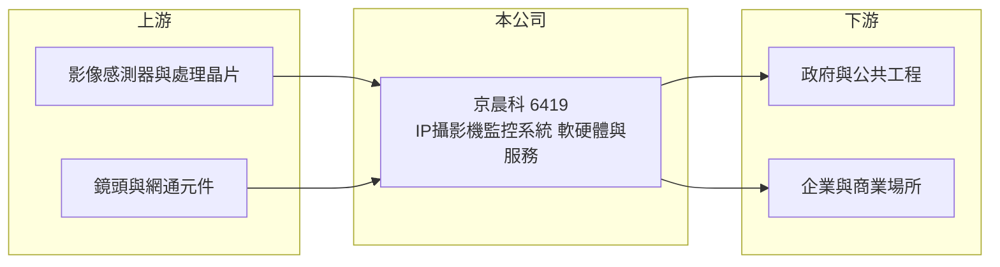

# 6419 京晨科

> 上櫃｜[[產業索引-光電業|光電業]]｜上市（櫃）日期 2014/12/29

# 第一章：企業模式與商業藍圖

> [!info] 撰寫說明
> 精簡版，由 Claude 依公開資料整理，架構比照 [[2330台積電]]，資料截至 2026-10-07。來源：nstock 公司資料頁、winvest 營收快訊。公開資料有限，營收比重與營收暴增原因未查得。#待校對

京晨科是網路攝影機監控系統業者，2026 年營收與獲利大幅跳升，本章說明其業務。

- **核心業務：** 公司經營網路攝影機（[[IP攝影機]]）監視系統及相關軟硬體的開發與買賣，並提供勞務服務。
- **營收結構：** 本次未查到產品或服務別營收比重；推估包含攝影機、[[NVR]] 等硬體銷售與系統建置服務。
- **營運據點：** 公司登記地址在新北市中和區，其他據點本次未查證。
- **長期方向：** 2026 年營收較前一年大增三倍以上，新增營收的來源本次未查證，是判斷公司方向的關鍵。

# 第二章：護城河深度與競爭優勢

監控系統硬體已高度競爭，京晨科的優勢推估在系統整合與專案服務。

- **競爭優勢：** 結合軟硬體與勞務服務，可承接整套監控系統專案（推估）。
- **主要對手：** 3454晶睿、[[3356奇偶]] 等台灣監控廠，以及海康威視、大華等中國大廠。
- **觀察重點：** 營收暴增是否來自可持續的業務，以及上半年高額 [[業外收益]] 的性質。

# 第三章：財務體質與盈利規模

資料日期：2026-10-07，以下數字是撰寫當時的快照；最新月營收、毛利率、累計 EPS 由自動排程寫在本筆記的屬性欄位（月營收、毛利率、累計EPS 等）。#待校對

京晨科 2026 年營收倍增，EPS 大幅超越前一年，但獲利主要來自業外。

- **營收規模：** 2025 年全年營收 4.98 億元；2026 年 1 至 8 月累計 10.08 億元；8 月單月 1.69 億元，年增 365.7%，為十年同期新高。
- **獲利：** 2025 年 EPS 9.58 元；2026 年第二季 EPS 14.88 元，nstock 標示累計 EPS 19.43 元，第二季 [[毛利率]] 23.19%，[[營業利益率]] 7.48%。
- **財務特色：** 第二季淨利率 47.21%，遠高於營業利益率，代表獲利大部分來自業外，評估本業時應扣除。

# 第四章：總體風險與地緣政治

京晨科的風險在於獲利來源的持續性與監控產業競爭。

- **產業週期：** 監控設備需求跟隨公共工程與企業資本支出，專案型收入起伏大。
- **營運風險：** 營收短期暴增可能集中在少數專案或客戶，業外收益也不會每年重複，未來 EPS 可能大幅回落（推估）。
- **其他風險：** 中國監控大廠低價競爭，以及各國對中國監控設備的資安法規可能帶來的轉單機會或供應鏈調整。

# 專有名詞解析

## 應用

- **[[IP攝影機]]**：透過網路傳送影像的數位監控攝影機，可遠端觀看並整合影像分析功能。
- **[[NVR]]**：網路影像錄影機，用來集中錄製與管理多支 IP 攝影機的影像。

## 金融

- **[[業外收益]]**：本業以外的收入，例如投資收益、處分資產利益與匯兌收益，通常不具持續性。

# 核心供應鏈

- 上游：影像處理晶片如 [[3034聯詠]]、影像感測器與鏡頭供應商（推估）
- 下游／客戶：政府、公共工程、企業與商業場所（推估）
- 同業：3454晶睿、[[3356奇偶]]、海康威視、大華

## 最新新聞
<!-- news:start -->
<!-- news:end -->

## 相關連結
- [公開資訊觀測站](https://mopsov.twse.com.tw/mops/web/t05st03?step=1&firstin=1&co_id=6419)
- [Goodinfo](https://goodinfo.tw/tw/StockDetail.asp?STOCK_ID=6419)
- [Yahoo 股市](https://tw.stock.yahoo.com/quote/6419)
- [鉅亨網新聞](https://www.cnyes.com/twstock/6419/news)
