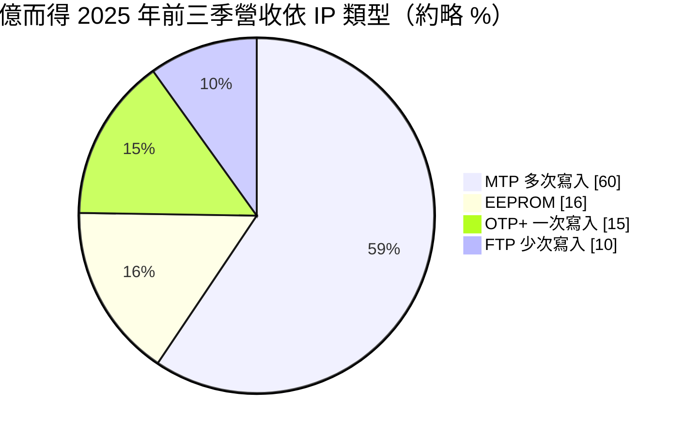
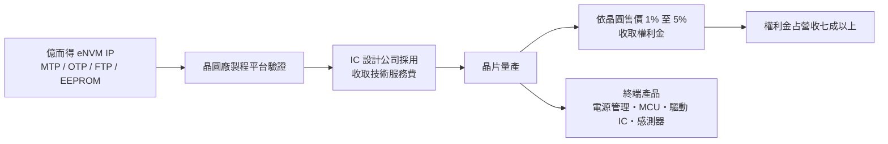
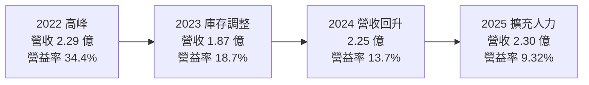
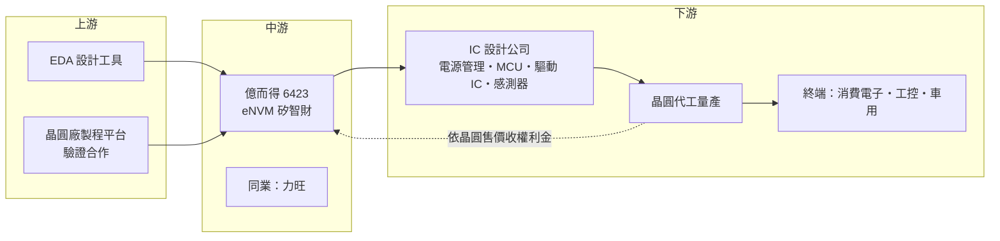

# 6423 億而得

> 上櫃｜[[產業索引-半導體業|半導體業]]｜上市（櫃）日期 2026/01/22

# 第一章：企業模式與商業藍圖

> [!info] 撰寫說明
> 本文由 Claude 依公開資料整理，架構比照 [[2330台積電]] 的四章研究，資料截至 2026-10-08。財務數字來源：Goodinfo 年度經營績效與股利政策頁、MoneyDJ 資產負債表與現金流量表、Yahoo 股市公司基本資料、經濟日報、工商時報、科技新報的掛牌前業績發表會報導；產業描述為整理性內容，尚未逐條比對原始文件。#待校對

在評估一家公司的長期價值時，第一步是弄清楚它靠什麼賺錢。本章針對億而得微電子（股票代號：6423，以下簡稱億而得）的商業模式進行定性分析，說明一家不生產任何晶片的小型公司，如何靠授權記憶體設計，從全球晶圓廠的每一片晶圓抽取權利金。

## 一、核心定位：專做嵌入式非揮發性記憶體的矽智財公司

億而得成立於 2001 年，總部位於新竹縣竹北，董事長與總經理皆由黃文謙擔任，2026 年 1 月掛牌交易。公司的業務是提供嵌入式非揮發性記憶體（[[eNVM]]）的矽智財（[[IP]]）授權與技術服務，也就是把「斷電後資料仍能保存的小型記憶體」設計成標準電路模組，授權給晶圓廠與 IC 設計公司，讓它們把這塊記憶體直接做進自家晶片。

這種記憶體在晶片中的角色很像「出廠設定檔」。電源管理晶片需要記住校正參數，微控制器需要存放程式與序號，面板驅動晶片需要儲存顯示調校數值。過去這些資料常要另外放一顆外掛記憶體，把記憶體嵌入同一顆晶片後，可以省下成本與電路板面積，這就是 eNVM IP 的存在價值。

億而得本身不從事晶片製造，屬於純 IP 公司。依掛牌前的業績發表會說明，公司在成熟製程累計已出貨超過 253 億顆晶片使用其 IP，客戶與合作晶圓廠分布在台灣、中國、韓國、美國、新加坡、日本、歐洲與東南亞。

## 二、產品板塊：MTP 為主力，OTP 與 FTP 為成長方向

依經濟日報引述的 2025 年前三季資料，億而得的營收依 IP 類型大致如下：

* **[[MTP]]（多次可程式記憶體）：** 營收占比接近六成，是億而得最主要的產品。公司以單一電晶體加電容的記憶單元設計，讓記憶體面積更小，適合需要反覆更新參數的電源管理與控制晶片。
* **EEPROM：** 可以逐位元組改寫的傳統型非揮發性記憶體，常用於需要頻繁寫入的小容量資料，占比約 16%。
* **[[OTP]]（一次可程式記憶體）：** 只能寫入一次，成本最低，常用於儲存序號、修補程式與校正值。公司把縮小面積、提高速度的 OTP 視為搶市占的重點，並為此增加研發人力。
* **FTP（少次可程式記憶體）：** 介於 OTP 與 MTP 之間，可寫入十次至百次。公司觀察到客戶需求正從「只寫一次」轉向「可寫十次或百次」，這讓 FTP 與 OTP 類產品的需求增加。

從終端應用看，億而得的 IP 主要用在[[電源管理IC]]、[[MCU]]、面板驅動 IC（包括電子紙與觸控顯示整合驅動 IC）與感測器，車用則仍在與晶圓廠合作開發的初期階段，量還很小。

## 三、資本轉化邏輯：一次授權、長期抽成

IP 公司的營收分成兩段。第一段是「技術服務費」或授權金，客戶在設計晶片、導入 IP 時支付，金額一次性。第二段是[[權利金]]，晶片量產後依晶圓售價的一定比例持續收取，億而得的費率約落在晶圓售價的 1% 至 5%。依公司揭露，2024 年權利金收入約 1.74 億元，占總營收 77.43%，權利金比重長年維持在七成以上。

這個模式有三個特點值得一般投資人理解：

* **毛利率接近百分之百：** IP 公司沒有原料與製造成本，Goodinfo 資料顯示億而得 2019 年至 2025 年的[[毛利率]]都在 98% 至 99.5% 之間。真正的成本是研發工程師的薪資，所以要看的是[[營業利益率]]，而不是毛利率。
* **權利金會累積：** 成熟製程晶片的生命週期常長達十年以上，一顆設計案量產後會持續出貨，過去導入的設計案越多，權利金基礎就越厚。這讓營收比一般 IC 設計公司穩定。
* **輕資產：** 公司不需要蓋廠或買設備，資本支出主要是辦公空間與研發工具。

## 四、企業長期藍圖：28 奈米、OTP 與高速化

依 2026 年初的掛牌說明，億而得的長期方向有三條：

* **往更先進的成熟節點延伸：** 公司開發了一種在 28 奈米及以上製程不需額外光罩、不增加製造成本的 MTP 技術，預計 2026 年完成驗證、2028 年起開放客戶採用。節點越先進，晶圓單價越高，按比例計算的權利金也越高。
* **搶占 OTP 市場：** OTP 是 eNVM 裡出貨量最大的類型，億而得以縮小面積、提高速度的設計切入，希望從既有供應商手中取得市占。
* **擴大應用：** 鎖定物聯網、智慧感測器，以及部分原本使用外掛 Flash 的大量型產品，用嵌入式方案取代外掛記憶體以降低客戶成本。

這些計畫都屬於「先投入研發、數年後才收權利金」的長週期布局，成果要到 2028 年以後才會明顯反映在營收上（推估）。

# 第二章：護城河深度與競爭優勢

護城河是企業抵禦競爭、長期維持超額利潤的機制。本章分析億而得的護城河從何而來、主要競爭對手是誰，以及在規模遠小於龍頭的情況下，它能守住哪些市場。

## 一、億而得護城河的核心組成要素

億而得的護城河屬於「窄而專」的類型，主要由三個要素構成：

* **1. 專利與製程平台驗證：** eNVM IP 不是畫好電路就能用，必須在每一家晶圓廠、每一個製程節點上完成驗證，確認資料保存年限與可靠度。驗證過程耗時且需要晶圓廠配合，一旦某個製程平台上已有億而得的 IP，後來者要替代就得重新投入同樣的時間。公司也以專利保護其單一電晶體記憶單元設計。
* **2. 客戶的轉換成本：** IC 設計公司把 IP 放進晶片後，整顆晶片的驗證都是以這塊記憶體為基礎完成的。量產後若要換掉 IP，等於重新設計一次晶片，因此客戶通常會沿用到產品生命週期結束，這也是公司所說「高續約率」的來源。
* **3. 面積與成本優勢：** 億而得強調其記憶單元面積小、所需光罩少、生產週期短。對電源管理與驅動 IC 這類對成本極度敏感的晶片來說，省下的晶片面積直接轉成客戶的毛利，是說服客戶採用的主要理由。

## 二、全球主要競爭對手格局

| 對手 | 定位 | 對億而得的影響 |
|---|---|---|
| [[3529力旺]] | 全球 eNVM IP 龍頭，OTP 已在台積電先進製程量產，製程平台數超過 600 個 | 規模與先進製程布局遠大於億而得，是最主要的比較對象 |
| 晶圓廠自有方案 | 部分晶圓廠在特定製程自行開發嵌入式記憶體 | 若晶圓廠內部方案夠好，外部 IP 的空間會被壓縮 |
| 中國本土 IP 公司 | 受惠中國晶片自主化政策 | 中國是億而得最大營收地區，本土替代會帶來價格壓力 |

力旺與億而得的差異在於市場定位。力旺把資源放在先進製程與安全 IP，跟著台積電走到 7 奈米、5 奈米以下；億而得則集中在成熟製程，以面積與成本取勝。兩者在成熟製程的 OTP 與 MTP 市場仍有直接競爭。

## 三、優勢轉化：哪些市場守得住、哪些守不住

* **守得住：** 已經量產、生命週期長的電源管理與 MCU 設計案。這些權利金會隨客戶出貨持續流入，不容易被競爭者搶走，是公司現金流的基本盤。
* **守不住：** 新設計案的價格。公司在 2026 年初的說明中提到，2024 年至 2025 年受到地緣政治、貿易摩擦、新台幣升值、價格競爭與客戶專案延後的影響，營收成長停滯。新案競標時，若對手降價，億而得的議價能力有限。
* **觀察重點：** 第一是 28 奈米 MTP 能否如期在 2028 年開放採用，讓公司打進單價較高的節點。第二是 OTP 能否從既有供應商手中取得市占。第三是中國營收占比偏高，中國客戶若轉向本土 IP，影響有多大。

# 第三章：財務體質與盈利規模

資料日期：2026-10-08。數字取自 Goodinfo 年度經營績效、MoneyDJ 財務報表與財經媒體整理，表格是撰寫當時的快照；最新月營收、毛利率、累計 EPS 由自動排程寫在本筆記的屬性欄位（月營收、毛利率、累計EPS 等）。#待校對

財務報表是檢驗護城河是否真實存在的最終標準。本章用多年度的三率、ROE、現金流與資本報酬，檢視億而得這類 IP 公司的獲利品質，以及它在 2023 年以後獲利下滑的原因。

## 一、獲利能力的基石：三率

| 年度 | 營收（億元） | [[毛利率]] | [[營業利益率]] | EPS（元） | [[ROE]] |
|---|---|---|---|---|---|
| 2019 | 1.33 | 99.0% | 18.6% | 0.74 | 8.42% |
| 2020 | 1.28 | 99.3% | 13.2% | 0.59 | 6.20% |
| 2021 | 1.68 | 99.2% | 25.8% | 1.44 | 13.7% |
| 2022 | 2.29 | 99.3% | 34.4% | 2.72 | 22.5% |
| 2023 | 1.87 | 99.2% | 18.7% | 1.19 | 9.68% |
| 2024 | 2.25 | 99.5% | 13.7% | 0.98 | 6.42% |
| 2025 | 2.30 | 98.3% | 9.32% | 0.58 | 3.35% |

資料來源：Goodinfo 合併報表年度經營績效。

* **毛利率不是重點：** 億而得的毛利率七年都在 98% 以上，代表營業成本幾乎可以忽略。看 IP 公司要看營業利益率，它反映「營收成長的速度」和「研發人力擴充的速度」誰比較快。
* **營業利益率的高度槓桿：** 2022 年營收 2.29 億元時，營業利益率達 34.4%；2025 年營收 2.30 億元幾乎一樣，營業利益率卻只剩 9.32%。差別在於公司這幾年持續增聘設計人力、擴充辦公室，費用先行增加，營收卻沒有同步成長。對小型 IP 公司來說，費用大多是固定的人事成本，營收只要成長一兩成，利潤率就會明顯回升，反之亦然。
* **長期成長：** 2019 年至 2025 年營收年複合成長率約 9.6%（推算），2021 年至 2025 年約 8.2%（推算），屬於穩定但不快速的成長。

## 二、[[ROE]]：資本效率

億而得近 5 年（2021 至 2025 年）的平均 ROE 約 11.1%（推算，以 Goodinfo 各年數字平均）。2022 年高峰時達 22.5%，2025 年降到 3.35%。由於公司沒有銀行負債壓力、毛利率又接近百分之百，ROE 的起落幾乎完全由營業利益率決定。只要權利金基礎恢復成長，ROE 回到兩位數並不需要額外投入資本，這是輕資產模式的優點。

## 三、資本支出與自由現金流

* **營業現金流：** 依 MoneyDJ 季度現金流量表加總，2025 年營業活動現金流入約 0.70 億元，低於 2024 年以前的獲利水準。
* **[[CapEx]]：** 2025 年購置不動產與設備約 2.56 億元，2026 年第一季再支出約 1.22 億元，金額相對公司規模偏大。對一家純 IP 公司而言，這類支出推估與購置辦公空間有關，用途本次未查得。這也使 2025 年的[[自由現金流]]約為負 1.86 億元（推算：0.70 億減 2.56 億），帳上現金由 2024 年底的 5.03 億元降到 2025 年底的 2.63 億元，同期出現約 0.93 億元的銀行借款。
* **股利政策：** 依 Goodinfo，2021 年至 2025 年度的現金股利分別為 1、2.5、1、0.99（另配股票股利約 0.2 元）、1 元。2024 與 2025 年度的現金股利約等於或高於當年 EPS，顯示公司傾向維持約 1 元的股利水準，而不是嚴格依獲利比例發放。

## 四、[[ROIC]] 與 [[WACC]]：價值創造利差

* **ROIC（推算）：** 2025 年營業利益約 0.214 億元（營收 2.30 億元 × 營業利益率 9.32%），稅後約 0.171 億元（稅率 20%）。投入資本約 5.64 億元（2025 年底股東權益 4.71 億元加上有息負債約 0.93 億元），ROIC 約 3.0%（推算）。若用 2022 年的高峰獲利估算，稅後營業利益約 0.63 億元，ROIC 推估在 15% 至 20% 之間。
* **WACC（推算）：** 無風險利率取 1.75%（台灣 10 年期公債約 1.5% 至 2%），市場風險溢酬 6%，β 取 IC 設計與 IP 同業常見值 1.1（未查得公司實際 β），股東權益成本約 8.35%。稅前負債成本假設 2.5%、稅率 20%，稅後約 2.0%。以帳面價值計算，權益約占 84%、負債約占 16%，WACC 約 7.3%（推算）。
* **解讀：** 2025 年的 ROIC 約 3%，低於約 7.3% 的資金成本，代表目前這個獲利水準並沒有替股東創造超額價值；但在 2021 至 2022 年營收成長期，ROIC 明顯高於 WACC。IP 公司的投入資本很小，ROIC 的高低幾乎完全取決於權利金能否成長並攤薄研發人事費用。28 奈米 MTP 與 OTP 新產品能否在 2028 年前後帶動權利金成長，是利差能否轉正的關鍵。

# 第四章：總體風險與地緣政治

任何企業都無法脫離宏觀環境獨立存在。本章分析億而得長期必須面對的地緣政治、產業週期、營運與技術風險。

## 一、地緣政治風險

* **中國營收占比最高：** 依公司揭露，2024 年中國（含香港）是億而得營收最大的地區，其次才是台灣、韓國、新加坡與美國。中國推動晶片自主化，若當地晶圓廠或 IC 設計公司被要求優先採用本土 IP，億而得在中國的新設計案可能減少。已量產的權利金短期影響有限，但長期基礎會被侵蝕。
* **貿易摩擦與出口管制：** 美中科技管制若擴及成熟製程或 IP 授權，台灣 IP 公司在兩邊同時做生意的空間會縮小。公司也坦言 2024 年至 2025 年的營收受到地緣政治與貿易摩擦影響。

## 二、產業週期與市場結構風險

* **跟著成熟製程的投片量走：** 權利金按晶圓售價抽成，因此億而得的營收直接受成熟製程晶圓的出貨量與價格影響。2023 年消費電子庫存調整時，營收由 2.29 億元降到 1.87 億元，就是這種連動的結果。
* **晶圓價格下滑的雙重打擊：** 中國成熟製程產能大量開出，若晶圓報價下跌，即使出貨片數不變，按比例計算的權利金也會減少。
* **匯率：** 權利金多以外幣計價，新台幣升值會使換算後的營收下降，公司在說明 2024 年至 2025 年成長停滯時也提到這一點。

## 三、營運環境的隱性風險

* **規模小、客戶集中：** 億而得年營收約 2 億多元，任何一個大客戶的專案延後，都會明顯影響年度成長。公司未公開前幾大客戶比重（未查得）。
* **人力與費用先行：** 公司正擴充設計人力與辦公空間，費用會先增加，若新產品晚於預期貢獻權利金，獲利率會持續被壓縮，2025 年營業利益率降到 9.32% 已反映這一點。
* **股利與現金的平衡：** 2025 年自由現金流為負、帳上現金下降，同時維持約 1 元的股利。未來若獲利未回升，股利水準與資本支出之間需要取捨。

## 四、科技演進風險

eNVM IP 的價值建立在「把記憶體做進同一顆晶片」比外掛記憶體便宜。若未來先進封裝讓多顆小晶片的整合成本大幅下降，部分應用可能改用外掛記憶體或其他新型記憶體技術（例如 MRAM、RRAM），既有 OTP、MTP 的需求可能被分流。另一方面，晶圓廠若在新節點自行提供內建方案，外部 IP 的空間也會縮小。億而得能否持續在新製程節點完成驗證，是技術面的長期觀察重點。

# 專有名詞解析

## 半導體

- **[[IP]]**：矽智財，指可重複授權的晶片電路設計模組，IC 設計公司付費取得後直接放進自家晶片，省下自行開發的時間。
- **[[eNVM]]**：嵌入式非揮發性記憶體，把斷電後仍能保存資料的記憶體做進同一顆晶片，常見於 MCU 與電源管理晶片。
- **[[OTP]]**：一次可程式記憶體，只能寫入一次、成本最低，常用來儲存晶片序號、校正參數與修補程式。
- **[[MTP]]**：多次可程式記憶體，可以反覆寫入上千次以上，適合需要更新參數或程式的晶片。
- **[[EEPROM]]**：電子抹除式可複寫唯讀記憶體，可以逐位元組改寫，常用於小容量、需頻繁更新的設定資料。
- **[[電源管理IC]]**：負責轉換、分配與監控電壓電流的晶片，幾乎所有電子產品都需要，是成熟製程的大宗產品。
- **[[MCU]]**：微控制器，把處理器、記憶體與輸入輸出介面整合在一顆晶片上，用於家電、工控與汽車的控制功能。
- **[[成熟製程]]**：一般指 28 奈米及更大線寬的製程，技術成熟、設備多已折舊，主要用於電源、驅動、車用與物聯網晶片。
- **[[DDI]]**：顯示驅動 IC，負責控制面板每個像素的電壓，需要高壓製程，也是 eNVM IP 的重要應用。

## 金融

- **[[權利金]]**：晶片量產後依出貨量或晶圓售價比例持續收取的授權費用，是 IP 公司最穩定的收入來源。
- **[[毛利率]]**：毛利除以營收，反映產品本身的獲利空間；IP 公司幾乎沒有製造成本，毛利率常接近百分之百。
- **[[自由現金流]]**：營業活動現金流減去資本支出，代表企業可自由用於配息、還債或併購的現金。

# 核心供應鏈

## 1. 上游：設計工具與晶圓廠平台
- 晶片設計軟體：[[SNPS新思科技]]、[[CDNS益華電腦]]
- 億而得的 IP 必須在各家晶圓廠的成熟製程平台完成驗證，公司表示與全球主要晶圓廠合作，但未公開合作名單（未查得）。成熟製程代工廠包括 [[2330台積電]]、[[2303聯電]]、[[5347世界先進]]、[[6770力積電]] 等。

## 2. 中游：億而得與同業
- 億而得：成熟製程 eNVM IP，主力為 MTP、OTP、FTP、EEPROM
- 同業：[[3529力旺]]（全球 eNVM IP 龍頭，兼具先進製程與安全 IP）

## 3. 下游：IP 採用者
- 電源管理 IC、MCU、面板驅動 IC 與感測器設計公司；客戶分布於中國、台灣、韓國、新加坡與美國，公司未公開客戶名稱（未查得）。

## 4. 下游：終端市場
- 消費電子、物聯網裝置、工業控制，以及開發中的車用電子

## 最新新聞
<!-- news:start -->
<!-- news:end -->

## 相關連結
- [公開資訊觀測站](https://mopsov.twse.com.tw/mops/web/t05st03?step=1&firstin=1&co_id=6423)
- [Goodinfo](https://goodinfo.tw/tw/StockDetail.asp?STOCK_ID=6423)
- [Yahoo 股市](https://tw.stock.yahoo.com/quote/6423)
- [鉅亨網新聞](https://www.cnyes.com/twstock/6423/news)
